# Sprawozdanie - PS422034

---

## 1. Sprawdzenie adresu IP maszyny

Po zalogowaniu do maszyny wirtualnej sprawdzono adres IP:
```bash
ip a
```

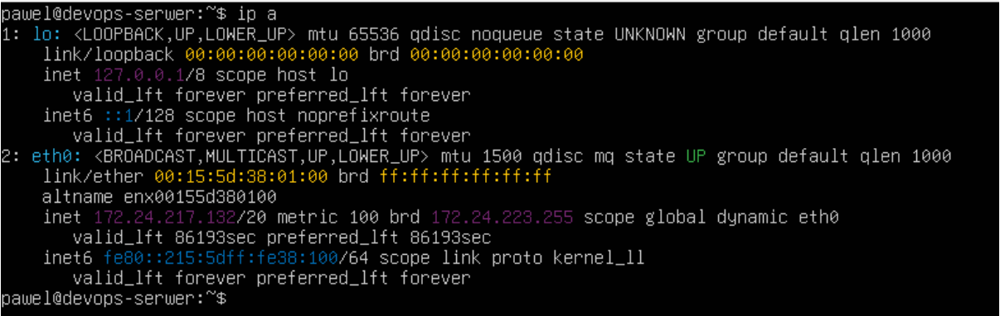

---

## 2. Logowanie SSH do maszyny wirtualnej

Z poziomu Windows PowerShell zalogowano się do maszyny wirtualnej przez SSH:
```bash
ssh pawel@172.24.217.132
```

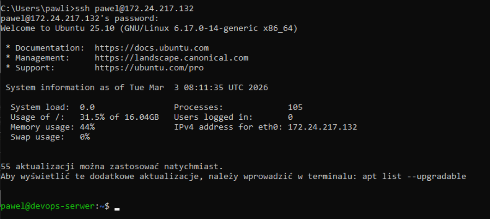

---

## 3. Instalacja Git

Zainstalowano Git oraz narzędzia na maszynie wirtualnej:
```bash
sudo apt update && sudo apt install git curl wget -y
```


---

## 4. Generowanie klucza SSH

Wygenerowano klucz SSH typu ed25519:
```bash
ssh-keygen -t ed25519 -C "pawli444@gmail.com"
```

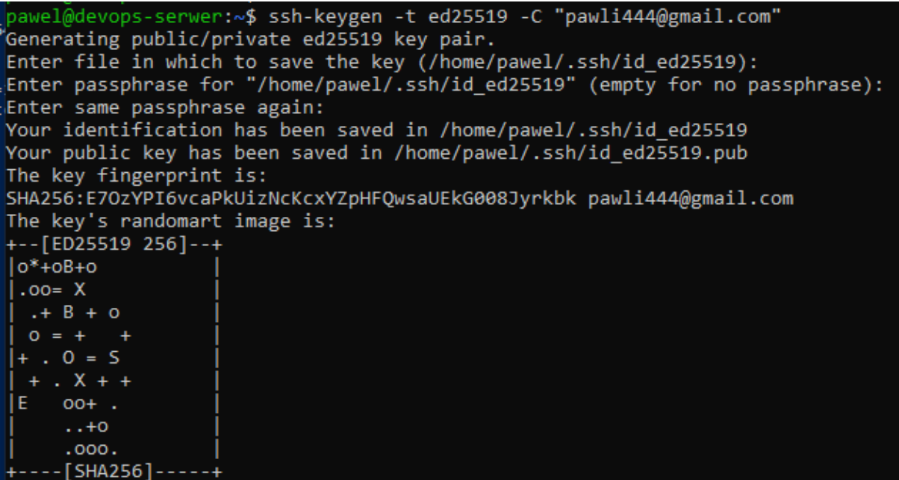

---

## 5. Konfiguracja klucza SSH w GitHub

Wyświetlono klucz publiczny i dodano go do GitHub:
```bash
cat ~/.ssh/id_ed25519.pub
```

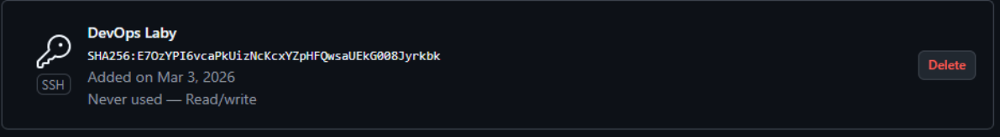

---

## 6. Testowanie połączenia SSH z GitHub
```bash
ssh -T git@github.com
```

Wynik: `Hi pawli444! You've successfully authenticated...`

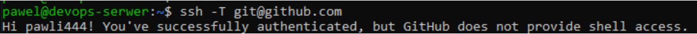

---

## 7. Klonowanie repozytorium przez SSH
```bash
git clone git@github.com:InzynieriaOprogramowaniaAGH/MDO2026_ITE.git
```

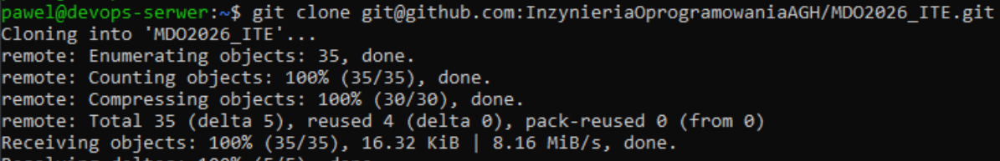

---

## 8. FileZilla – połączenie SFTP

Skonfigurowano połączenie w FileZilla Client:
- Host: `172.24.217.132`
- Użytkownik: `pawel`


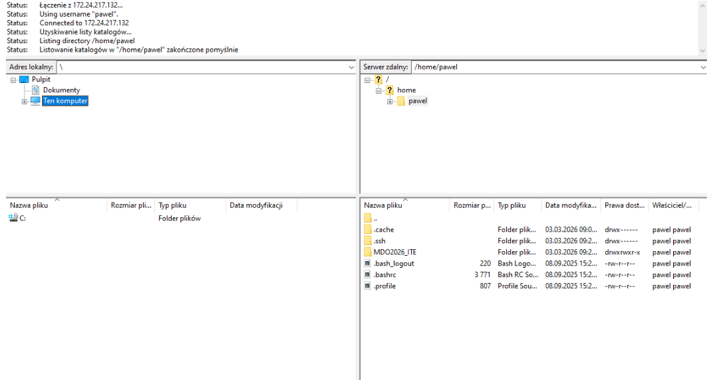

---

## 9. Wysyłanie pliku przez SCP

Z Windows PowerShell wysłano plik testowy na serwer:
```bash
scp C:\Users\pawli\Downloads\testowy_plik.txt pawel@172.24.217.132:/home/pawel/
```

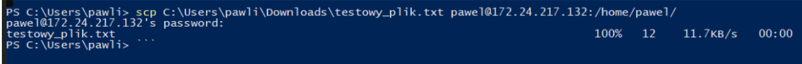

---

## 10. Visual Studio Code – Remote SSH

Zainstalowano wtyczkę Remote SSH, połączono się z maszyną i otwarto folder `/home/pawel/MDO2026_ITE`:

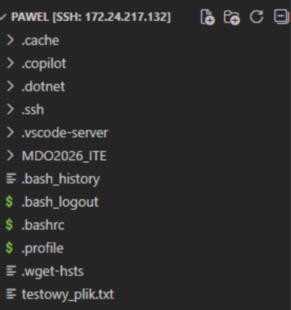

---


## 11. Tworzenie katalogu roboczego
```bash
mkdir -p GR5/PS422034
cd GR5/PS422034
```

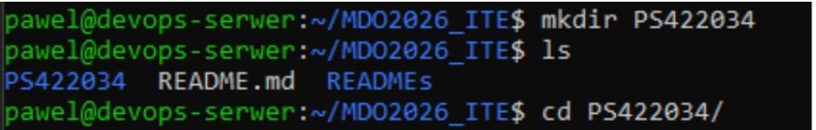

---

## 12. Git Hook

Napisano Git hooka weryfikującego że każdy commit message zaczyna się od `PS422034`:
```bash
cat > commit-msg-hook.sh << 'EOF'
#!/bin/bash
commit_msg=$(cat "$1")
initials="PS422034"
if ! echo "$commit_msg" | grep -qE "^$initials"; then
    echo "ERROR: Commit message musi zaczynac sie od PS422034"
    exit 1
fi
EOF
```

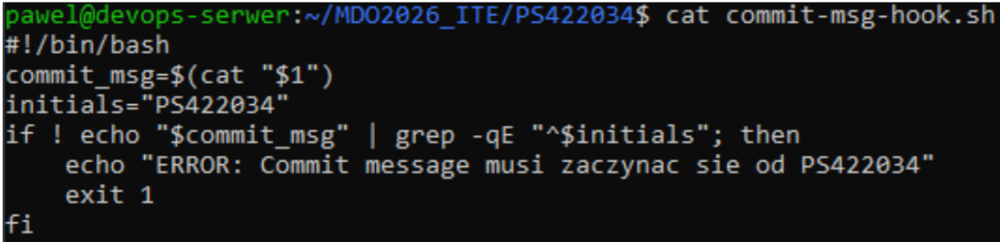

Skopiowano hook we właściwe miejsce i nadano uprawnienia:
```bash
cp commit-msg-hook.sh ~/MDO2026_ITE/.git/hooks/commit-msg
chmod +x ~/MDO2026_ITE/.git/hooks/commit-msg
```

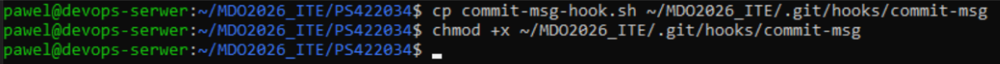

---

## 13. Tworzenie sprawozdania

W katalogu `GR5/PS422034` utworzono plik sprawozdania wraz ze screenami.

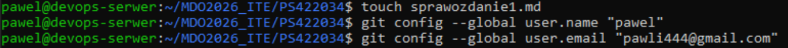
