# Sprawozdanie - PS422034
## Zajęcia 10: Wdrażanie na zarządzalne kontenery: Kubernetes (1)

---

## 1. Instalacja klastra Kubernetes

### Instalacja minikube

Minikube pobrano i zainstalowano z oficjalnego źródła:

```bash
curl -LO https://storage.googleapis.com/minikube/releases/latest/minikube-linux-amd64
sudo install minikube-linux-amd64 /usr/local/bin/minikube
minikube version
```

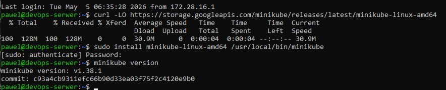

Zainstalowana wersja to `v1.38.1`. Instalacja odbywa się przez pobranie binarki i umieszczenie jej w `/usr/local/bin/` - standardowej ścieżce dla binariów systemowych. Plik jest weryfikowany sumą kontrolną SHA256 przez oficjalne repozytorium Google.

### Uruchomienie klastra

Klaster uruchomiono z użyciem sterownika Docker:

```bash
minikube start --driver=docker
```

Podczas uruchamiania minikube zgłosił ostrzeżenie o niewystarczającej pamięci (`2155MiB` to dokładnie tyle ile ma maszyna, bez marginesu dla systemu). Problem zmitygowano poprzez zaakceptowanie ostrzeżenia - klaster uruchomił się pomimo ograniczeń sprzętowych. W dokumentacji minikube zaleca się minimum 2GB RAM dedykowane dla klastra, co w środowisku laboratoryjnym jest graniczną wartością.

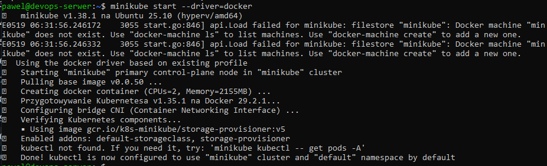

### Status klastra

```bash
minikube status
```

Wszystkie komponenty działają poprawnie:

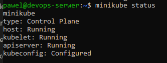

### Alias kubectl

Aby korzystać z `kubectl` w wariancie minikube, zdefiniowano alias:

```bash
alias minikubectl='minikube kubectl --'
```

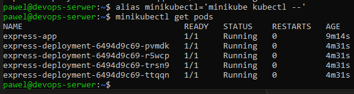

### Działające pody systemowe

```bash
minikube kubectl -- get pods -A
```

Wszystkie pody systemu Kubernetes działają ze statusem `Running`:

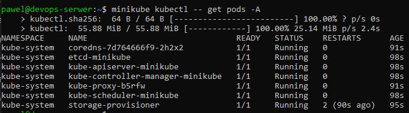

Działające komponenty:
- `coredns` - DNS wewnątrz klastra
- `etcd-minikube` - baza danych konfiguracji klastra
- `kube-apiserver-minikube` - API serwer Kubernetes
- `kube-controller-manager-minikube` - kontroler zarządzający stanem klastra
- `kube-proxy` - proxy sieciowe
- `kube-scheduler-minikube` - harmonogramowanie podów
- `storage-provisioner` - dynamiczne dostarczanie woluminów

### Dashboard

Dashboard uruchomiono poleceniem:

```bash
minikube dashboard --url &
```

Ponieważ dashboard nasłuchuje na `127.0.0.1` serwera Ubuntu, dostęp z przeglądarki na Windowsie uzyskano przez tunel SSH:

```bash
ssh -L 42083:127.0.0.1:42083 pawel@172.28.29.154
```

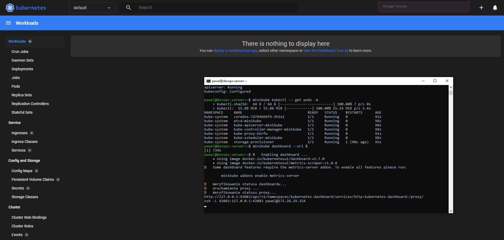

---

## 2. Analiza posiadanego kontenera

### Wybór aplikacji

Do wdrożenia na Kubernetes wybrano aplikację Express.js - ten sam framework który był artefaktem pipeline'u z zajęć 5-7. Aplikacja udostępnia serwer HTTP na porcie 3000, odpowiadając `OK` na żądania GET `/`. Jest to idealna aplikacja do wdrożenia w kontenerze, ponieważ wyprowadza interfejs funkcjonalny przez sieć i pracuje ciągle bez kończenia procesu.

Obraz bazowy: `node:latest` - zawiera środowisko uruchomieniowe Node.js niezbędne do uruchomienia Express.js.

---

## 3. Uruchamianie oprogramowania

### Uruchomienie poda

Aplikację uruchomiono na klastrze Kubernetes poleceniem:

```bash
minikube kubectl -- run express-app --image=node:latest --port=3000 \
  --labels app=express-app -- sh -c \
  "mkdir -p /app && cd /app && npm init -y && npm install express && \
  node -e \"const express=require('express'); const app=express(); \
  app.get('/',(req,res)=>res.send('OK')); app.listen(3000);\""
```

Pod został automatycznie stworzony przez Kubernetes i uruchomiony ze statusem `Running`:

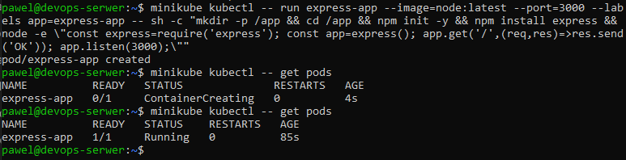

### Dashboard - widok poda

W Dashboardzie w sekcji **Pods** widoczny jest działający pod `express-app` oraz 4 pody z deploymentu, wszystkie ze statusem `Running`:

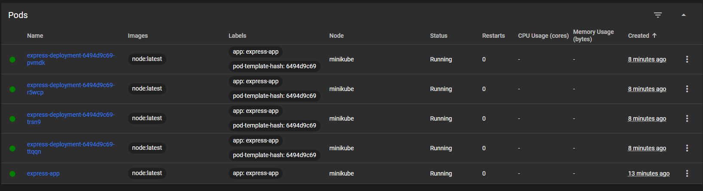

### Port-forward do poda

Aby dotrzeć do aplikacji z zewnątrz klastra, wyprowadzono port:

```bash
minikube kubectl -- port-forward pod/express-app 9090:3000 &
curl http://localhost:9090
```

Aplikacja odpowiedziała `OK`:

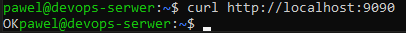

---

## 4. Przekucie wdrożenia manualnego w plik wdrożenia

### Plik deployment YAML

Wdrożenie zapisano jako plik `express-deployment.yml` z 4 replikami:

```yaml
apiVersion: apps/v1
kind: Deployment
metadata:
  name: express-deployment
  labels:
    app: express-app
spec:
  replicas: 4
  selector:
    matchLabels:
      app: express-app
  template:
    metadata:
      labels:
        app: express-app
    spec:
      containers:
      - name: express-app
        image: node:latest
        ports:
        - containerPort: 3000
        command: ["sh", "-c"]
        args: ["mkdir -p /app && cd /app && npm init -y && npm install express && node -e \"const express=require('express'); const app=express(); app.get('/',(req,res)=>res.send('OK')); app.listen(3000);\""]
```

### kubectl apply

```bash
minikube kubectl -- apply -f ~/express-deployment.yml
```

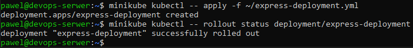

### Rollout status i 4 repliki

```bash
minikube kubectl -- rollout status deployment/express-deployment
minikube kubectl -- get pods
```

Deployment uruchomił 4 repliki poda, wszystkie ze statusem `Running`:

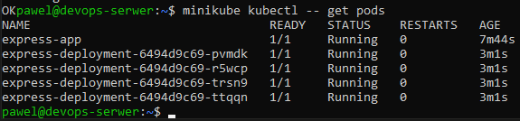

### Eksponowanie jako serwis

```bash
minikube kubectl -- expose deployment express-deployment --type=NodePort --port=3000
minikube kubectl -- port-forward service/express-deployment 9091:3000 &
curl http://localhost:9091
```

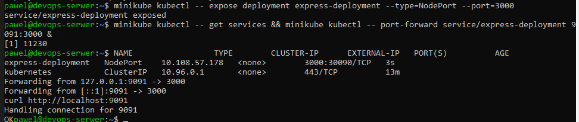

### Dashboard - widok deploymentu

W Dashboardzie w sekcji **Deployments** widoczny jest `express-deployment` z `4/4` działającymi podami:

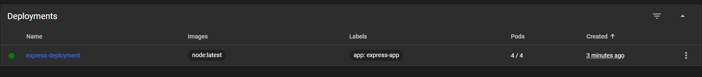

---

## 5. Koncepcje Kubernetes

W trakcie zajęć zapoznano się z następującymi koncepcjami:

**Pod** - najmniejsza jednostka wdrożeniowa w Kubernetes. Zawiera jeden lub więcej kontenerów współdzielących sieć i storage. W naszym przypadku każdy pod zawierał jeden kontener z aplikacją Express.js.

**Deployment** - obiekt zarządzający zestawem replik podów. Zapewnia że określona liczba replik zawsze działa. Zdefiniowany w pliku YAML, umożliwia deklaratywne zarządzanie wdrożeniami.

**Service** - abstrakcja sieciowa eksponująca deployment na zewnątrz klastra. Typ `NodePort` udostępnia serwis na porcie węzła klastra.

**Namespace** - wirtualna izolacja zasobów w klastrze. Domyślny namespace to `default`, komponenty systemowe działają w `kube-system`.

**ReplicaSet** - kontroler zapewniający że określona liczba replik poda jest zawsze uruchomiona. Tworzony automatycznie przez Deployment.

---

## 6. Wnioski

1. **Minikube** to wygodne narzędzie do lokalnego uruchamiania Kubernetes - instalacja sprowadza się do pobrania jednej binarki i uruchomienia `minikube start`.
2. **Ograniczenia sprzętowe** - minikube wymaga minimum 2GB RAM. Na maszynie z dokładnie 2GB działał, ale z ostrzeżeniem o braku marginesu dla systemu operacyjnego. W środowisku produkcyjnym zalecane jest więcej zasobów.
3. **Pod vs Deployment** - uruchomienie pojedynczego poda przez `kubectl run` jest szybkie, ale nie zapewnia odporności na awarie. Deployment z replikami gwarantuje że aplikacja zawsze działa.
4. **Port-forward** - prosty mechanizm dostępu do usług wewnątrz klastra bez eksponowania ich na zewnątrz. Przydatny do testowania i debugowania.
5. **Infrastruktura jako kod** - plik YAML deploymentu pozwala na wersjonowanie konfiguracji wdrożenia razem z kodem aplikacji.


---


## Historia
Terminal 1

```
  445  ip a
  446  curl -LO https://storage.googleapis.com/minikube/releases/latest/minikube-linux-amd64
  447  sudo install minikube-linux-amd64 /usr/local/bin/minikube
  448  minikube version
  449  minikube start --driver=docker
  450  df -h
  451  curl http://localhost:9090
  452  ls
  453  minikube kubectl -- apply -f ~/express-deployment.yml
  454  minikube kubectl -- rollout status deployment/express-deployment
  455  minikube kubectl -- expose deployment express-deployment --type=NodePort --port=3000
  456  minikube kubectl -- get services && minikube kubectl -- port-forward service/express-deployment 9091:3000 &
  457  curl http://localhost:9091
  458  minikube kubectl -- get pods
  459  alias minikubectl='minikube kubectl --'
  460  minikubectl get pods
  461  history
```

Terminal 2

```
  445  ip a
  446  curl -LO https://storage.googleapis.com/minikube/releases/latest/minikube-linux-amd64
  447  sudo install minikube-linux-amd64 /usr/local/bin/minikube
  448  minikube version
  449  minikube start --driver=docker
  450  df -h
  451  history
```


Terminal 3
```
  445  ip a
  446  curl -LO https://storage.googleapis.com/minikube/releases/latest/minikube-linux-amd64
  447  sudo install minikube-linux-amd64 /usr/local/bin/minikube
  448  minikube version
  449  minikube start --driver=docker
  450  df -h
  451  sudo pvresize /dev/sda
  452  sudo lvextend -l +100%FREE /dev/mapper/ubuntu--vg-ubuntu--lv
  453  sudo resize2fs /dev/mapper/ubuntu--vg-ubuntu--lv
  454  df -h
  455  minikube start --driver=docker
  456  minikube status
  457  minikube kubectl -- get pods -A
  458  minikube dashboard --url &
  459  ssh -L 42083:127.0.0.1:42083 pawel@172.28.29.154
  460  minikube kubectl -- run express-app --image=node:latest --port=3000 --labels app=express-app -- sh -c "mkdir -p /app && cd /app && npm init -y && npm install express && node -e \"const express=require('express'); const app=express(); app.get('/',(req,res)=>res.send('OK')); app.listen(3000);\""
  461  minikube kubectl -- get pods
  462  minikube kubectl -- port-forward pod/express-app 8080:3000 &
  463  minikube kubectl -- port-forward pod/express-app 9090:3000 &
  464  history

```


