# Zajęcia 11
# Wdrażanie na zarządzalne kontenery: Kubernetes (2)

---

## 1. Przygotowanie obrazów Docker

### Struktura aplikacji

Do wdrożenia na Kubernetes przygotowano aplikację Express.js eksponującą endpoint GET `/` na porcie 3000. Zbudowano trzy wersje obrazu Docker i opublikowano je na Docker Hub pod kontem `pawlistonks`.

Struktura plików:
```
express-app/
├── Dockerfile
├── package.json
└── index.js
```

`Dockerfile` bazuje na `node:20-alpine`, kopiuje zależności, instaluje je przez `npm install` i uruchamia aplikację przez `node index.js`. Dzięki temu obraz jest lekki i aplikacja startuje poprawnie jako proces pierwszoplanowy.

### Wersja v1

```bash
docker build -t pawlistonks/express-app:v1 .
docker run -d --name test-v1 -p 3000:3000 pawlistonks/express-app:v1
curl http://localhost:3000
```

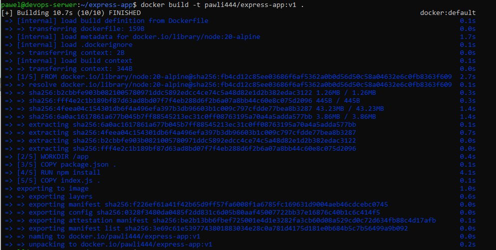

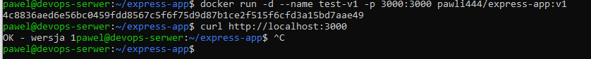

Aplikacja odpowiada `OK - wersja 1`.

### Wersja v2

Zmieniono treść odpowiedzi w `index.js` na `OK - wersja 2` i zbudowano nowy obraz:

```bash
docker build -t pawlistonks/express-app:v2 .
docker run -d --name test-v2 -p 3000:3000 pawlistonks/express-app:v2
curl http://localhost:3000
```

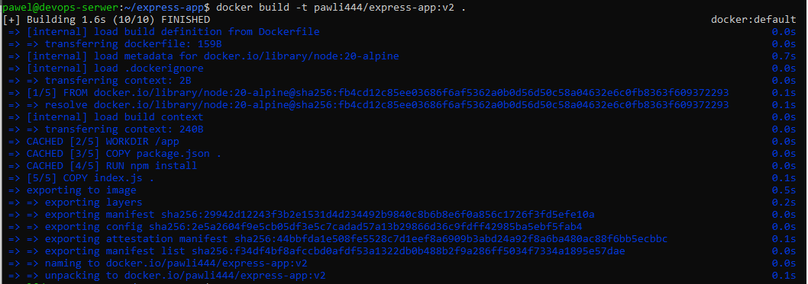

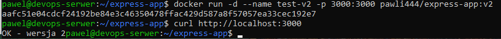

### Wersja broken

Przygotowano wersję wadliwą – aplikacja natychmiast kończy pracę z błędem:

```javascript
console.error("FATAL: config missing");
process.exit(1);
```

```bash
docker build -t pawlistonks/express-app:broken .
docker run --rm pawlistonks/express-app:broken
```

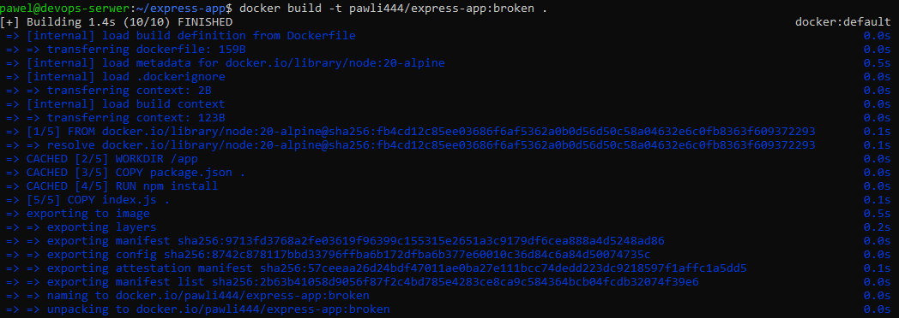

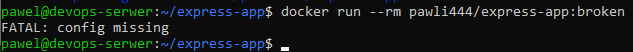

Kontener natychmiast wychodzi z komunikatem `FATAL: config missing`. Taki obraz posłuży do przetestowania zachowania Kubernetes podczas wdrożenia wadliwej wersji.

### Publikacja na Docker Hub

Wszystkie trzy obrazy wypchnięto na Docker Hub:

```bash
docker push pawlistonks/express-app:v1
docker push pawlistonks/express-app:v2
docker push pawlistonks/express-app:broken
```

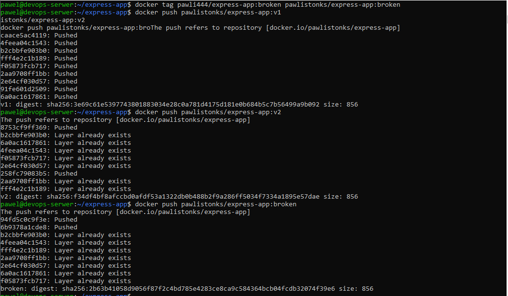

---

## 2. Zmiany w deploymencie

### Plik deployment YAML

Wdrożenie zdefiniowano jako plik `express-deployment.yml`:

```yaml
apiVersion: apps/v1
kind: Deployment
metadata:
  name: express-deployment
spec:
  replicas: 4
  selector:
    matchLabels:
      app: express-app
  template:
    metadata:
      labels:
        app: express-app
    spec:
      containers:
      - name: express-app
        image: pawlistonks/express-app:v1
        ports:
        - containerPort: 3000
```

### Wdrożenie początkowe (4 repliki, v1)

```bash
minikube kubectl -- apply -f ~/express-deployment.yml
minikube kubectl -- rollout status deployment/express-deployment
```

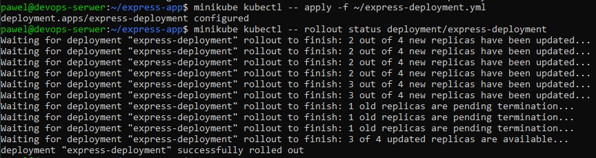

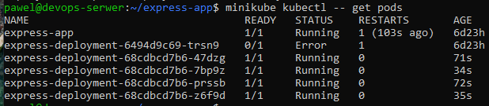

### Skalowanie do 8 replik

```bash
sed -i 's/replicas: 4/replicas: 8/' ~/express-deployment.yml
minikube kubectl -- apply -f ~/express-deployment.yml
minikube kubectl -- rollout status deployment/express-deployment
```

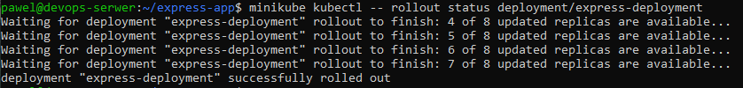

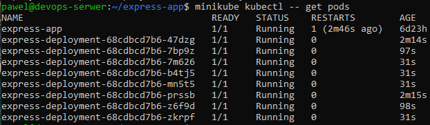

Kubernetes uruchomił 8 podów, dodając 4 nowe do istniejących.

### Skalowanie do 1 repliki

```bash
sed -i 's/replicas: 8/replicas: 1/' ~/express-deployment.yml
minikube kubectl -- apply -f ~/express-deployment.yml
minikube kubectl -- rollout status deployment/express-deployment
```

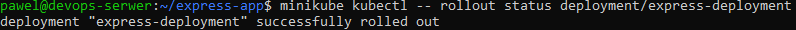

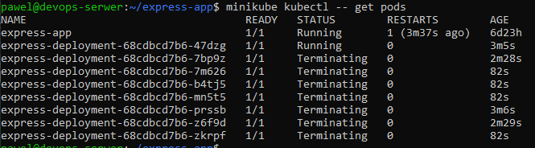

Widoczny proces `Terminating` – 7 podów zostało zatrzymanych, pozostał jeden.

### Skalowanie do 0 replik

```bash
sed -i 's/replicas: 1/replicas: 0/' ~/express-deployment.yml
minikube kubectl -- apply -f ~/express-deployment.yml
minikube kubectl -- get pods
```

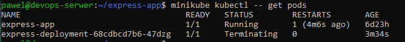

Deployment istnieje nadal, ale nie uruchamia żadnych podów. Przydatne do tymczasowego zatrzymania aplikacji bez usuwania konfiguracji wdrożenia.

### Przeskalowanie z powrotem do 4 replik

```bash
sed -i 's/replicas: 0/replicas: 4/' ~/express-deployment.yml
minikube kubectl -- apply -f ~/express-deployment.yml
minikube kubectl -- rollout status deployment/express-deployment
```

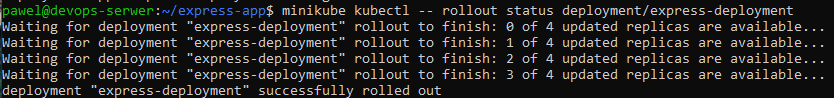

### Aktualizacja do v2

```bash
sed -i 's/image: pawlistonks\/express-app:v1/image: pawlistonks\/express-app:v2/' ~/express-deployment.yml
minikube kubectl -- apply -f ~/express-deployment.yml
minikube kubectl -- rollout status deployment/express-deployment
```

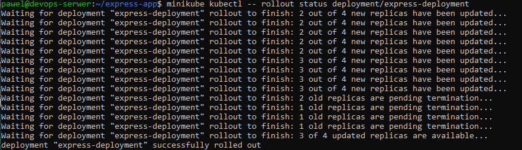

Kubernetes przeprowadził rolling update – podmieniał pody stopniowo, zachowując dostępność usługi.

### Weryfikacja działania v2

```bash
minikube kubectl -- port-forward deployment/express-deployment 9092:3000 &
curl http://localhost:9092
```

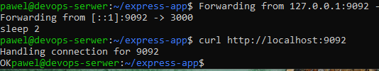

### Zastosowanie wadliwego obrazu

```bash
sed -i 's/image: pawlistonks\/express-app:v2/image: pawlistonks\/express-app:broken/' ~/express-deployment.yml
minikube kubectl -- apply -f ~/express-deployment.yml
minikube kubectl -- get pods
```

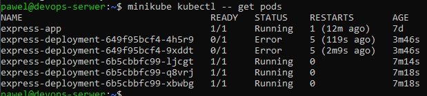

Kubernetes wykrył że nowe pody crashują (`Error`, 5 restartów) i zatrzymał rollout. Stare pody z v2 pozostały działające – klaster nie zniszczył działającego wdrożenia. Jest to kluczowa funkcja Kubernetes zapewniająca wysoką dostępność.

### Rollback przez rollout undo

```bash
minikube kubectl -- rollout undo deployment/express-deployment
minikube kubectl -- rollout status deployment/express-deployment
```

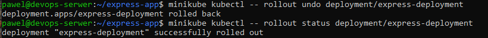

Kubernetes przywrócił poprzednią wersję wdrożenia.

---

## 3. Historia wdrożeń

```bash
minikube kubectl -- rollout history deployment/express-deployment
```

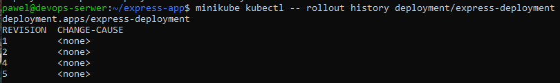

Historia zawiera 4 rewizje odpowiadające kolejnym zmianom. Dodano adnotację do bieżącej rewizji:

```bash
minikube kubectl -- annotate deployment/express-deployment kubernetes.io/change-cause="powrot do v2 po broken"
minikube kubectl -- rollout history deployment/express-deployment
```

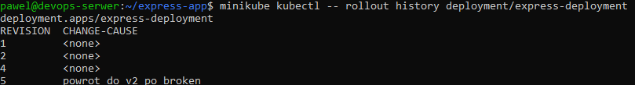

Korelacja rewizji z wykonywanymi czynnościami:
- **Rewizja 1** – wdrożenie v1 z 4 replikami
- **Rewizja 2** – aktualizacja obrazu do v2
- **Rewizja 4** – wdrożenie broken (zatrzymane przez Kubernetes)
- **Rewizja 5** – rollback do v2 (`rollout undo`)

---

## 4. Skrypt weryfikujący wdrożenie

Napisano skrypt `check-deployment.sh` weryfikujący czy wdrożenie zakończyło się w ciągu 60 sekund:

```bash
#!/bin/bash
DEPLOYMENT="express-deployment"
TIMEOUT=60

echo "Sprawdzam wdrożenie: $DEPLOYMENT (timeout: ${TIMEOUT}s)"

if minikube kubectl -- rollout status deployment/$DEPLOYMENT --timeout=${TIMEOUT}s; then
    echo "SUCCESS: Wdrożenie zakończone w czasie!"
    exit 0
else
    echo "FAILED: Wdrożenie nie zdążyło w ${TIMEOUT}s!"
    exit 1
fi
```

```bash
chmod +x ~/check-deployment.sh
~/check-deployment.sh
```

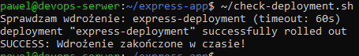

Skrypt zwraca kod wyjścia `0` przy sukcesie i `1` przy przekroczeniu limitu czasu, co umożliwia integrację z systemami CI/CD.

---

## 5. Strategie wdrożenia

### Recreate

Strategia `Recreate` zatrzymuje wszystkie istniejące pody przed uruchomieniem nowych. Powoduje to chwilową niedostępność usługi, ale gwarantuje że nigdy nie działają jednocześnie dwie wersje aplikacji.

```yaml
strategy:
  type: Recreate
```

```bash
minikube kubectl -- apply -f ~/deployment-recreate.yml
minikube kubectl -- set image deployment/express-recreate express-app=pawlistonks/express-app:v2
minikube kubectl -- get pods -w
```

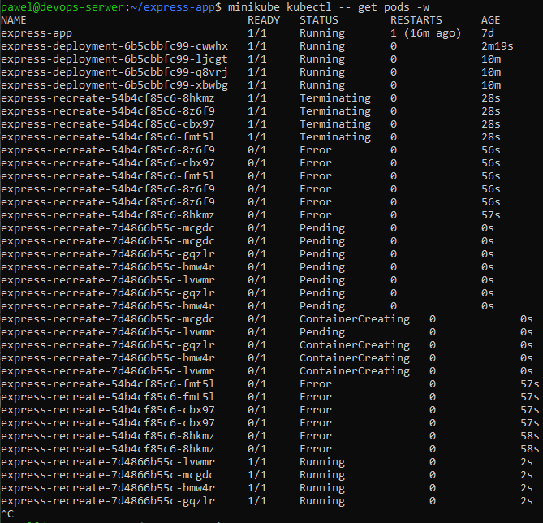

Widoczny charakterystyczny wzorzec: wszystkie stare pody `Terminating` jednocześnie → nowe pody `Pending` → `ContainerCreating` → `Running`.

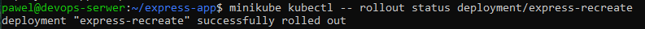

### Rolling Update

Strategia `RollingUpdate` podmienia pody stopniowo. Parametry `maxUnavailable: 2` i `maxSurge: 25%` oznaczają że podczas aktualizacji mogą być niedostępne maksymalnie 2 pody jednocześnie, a klaster może tymczasowo uruchomić o 25% więcej podów niż docelowa liczba replik.

```yaml
strategy:
  type: RollingUpdate
  rollingUpdate:
    maxUnavailable: 2
    maxSurge: 25%
```

```bash
minikube kubectl -- apply -f ~/deployment-rolling.yml
minikube kubectl -- set image deployment/express-rolling express-app=pawlistonks/express-app:v2
minikube kubectl -- get pods -w
```

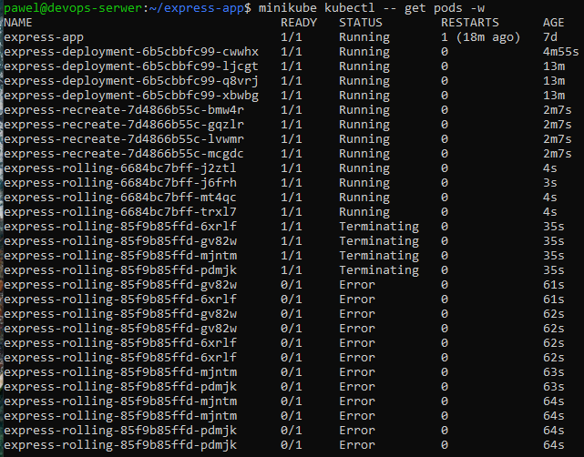

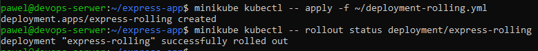

W odróżnieniu od `Recreate`, nowe pody uruchamiane są zanim stare zostaną zatrzymane – usługa pozostaje dostępna przez cały czas aktualizacji.

### Canary Deployment

Strategia Canary polega na kierowaniu części ruchu do nowej wersji aplikacji przy zachowaniu większości ruchu na starej wersji. Pozwala to przetestować nową wersję na małej grupie użytkowników przed pełnym wdrożeniem.

Zrealizowano przez dwa osobne deploymenty z oddzielnymi serwisami:

```yaml
# deployment-canary.yml
spec:
  replicas: 1
  selector:
    matchLabels:
      app: express-canary
      track: canary
  template:
    metadata:
      labels:
        app: express-canary
        track: canary
```

```bash
minikube kubectl -- apply -f ~/deployment-canary.yml
minikube kubectl -- apply -f ~/service-canary.yml
minikube kubectl -- get pods -l track=canary
```

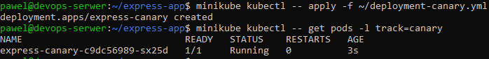

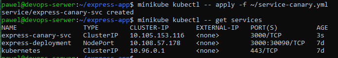

```bash
minikube kubectl -- port-forward service/express-canary-svc 9093:3000 &
curl http://localhost:9093
```

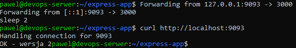

Serwis canary odpowiada `OK - wersja 2`, podczas gdy główny deployment nadal obsługuje v2 po rollbacku.

---

## 6. Serwisy

Dla wszystkich deploymentów z wieloma replikami utworzono serwisy zapewniające stabilny punkt dostępu:

```bash
minikube kubectl -- expose deployment express-deployment --name=express-deployment-svc --type=NodePort --port=3000
minikube kubectl -- expose deployment express-rolling --name=express-rolling-svc --type=NodePort --port=3000
```

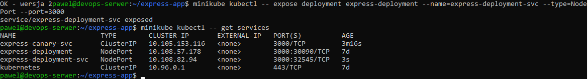

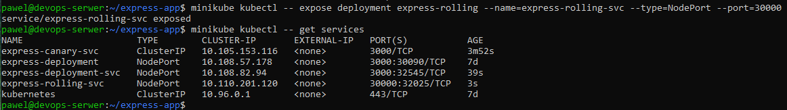

---

## 7. Wnioski

**Skalowanie** jest w Kubernetes operacją deklaratywną – wystarczy zmienić `replicas` w pliku YAML i zastosować go przez `kubectl apply`. Kubernetes sam zadba o uruchomienie lub zatrzymanie odpowiedniej liczby podów.

**Ochrona przed wadliwymi wdrożeniami** – Kubernetes wykrywa crashujące pody i zatrzymuje rollout, zachowując działające pody ze starej wersji. Rollback przez `rollout undo` przywraca poprzednią wersję w kilka sekund.

**Strategie wdrożenia** różnią się kompromisem między dostępnością a spójnością:
- `Recreate` – prosta, powoduje downtime, nigdy nie działają dwie wersje jednocześnie


## Historia

```

  456  mkdir ~/express-app && cd ~/express-app
  457  docker build -t pawli444/express-app:v1 .
  458  docker run -d --name test-v1 -p 3000:3000 pawli444/express-app:v1
  459  curl http://localhost:3000
  460  docker stop test-v1 && docker rm test-v1
  461  ls
  462  docker build -t pawli444/express-app:v2 .
  463  docker run -d --name test-v2 -p 3000:3000 pawli444/express-app:v2
  464  curl http://localhost:3000
  465  docker stop test-v2 && docker rm test-v2
  466  ls
  467  docker build -t pawli444/express-app:broken .
  468  docker run --rm pawli444/express-app:broken
  469  docker login
  470  docker push pawli444/express-app:v1
  471  docker push pawli444/express-app:v2
  472  docker push pawli444/express-app:broken
  473  docker info | grep Username
  474  docker tag pawli444/express-app:v1 pawlistonks/express-app:v1
  475  docker tag pawli444/express-app:v2 pawlistonks/express-app:v2
  476  docker tag pawli444/express-app:broken pawlistonks/express-app:broken
  477  docker push pawlistonks/express-app:v1
  478  docker push pawlistonks/express-app:v2
  479  docker push pawlistonks/express-app:broken
  480  ls
  481  minikube kubectl -- apply -f ~/express-deployment.yml
  482  minikube start --driver=docker
  483  minikube kubectl -- apply -f ~/express-deployment.yml
  484  minikube kubectl -- rollout status deployment/express-deployment
  485  minikube kubectl -- get pods
  486  sed -i 's/replicas: 4/replicas: 8/' ~/express-deployment.yml
  487  minikube kubectl -- apply -f ~/express-deployment.yml
  488  minikube kubectl -- rollout status deployment/express-deployment
  489  minikube kubectl -- get pods
  490  sed -i 's/replicas: 8/replicas: 1/' ~/express-deployment.yml
  491  minikube kubectl -- apply -f ~/express-deployment.yml
  492  minikube kubectl -- rollout status deployment/express-deployment
  493  minikube kubectl -- get pods
  494  sed -i 's/replicas: 1/replicas: 0/' ~/express-deployment.yml
  495  minikube kubectl -- apply -f ~/express-deployment.yml
  496  minikube kubectl -- get pods
  497  sed -i 's/replicas: 0/replicas: 4/' ~/express-deployment.yml
  498  minikube kubectl -- apply -f ~/express-deployment.yml
  499  minikube kubectl -- rollout status deployment/express-deployment
  500  sed -i 's/image: pawlistonks\/express-app:v1/image: pawlistonks\/express-app:v2/' ~/express-deployment.yml
  501  minikube kubectl -- apply -f ~/express-deployment.yml
  502  minikube kubectl -- rollout status deployment/express-deployment
  503  minikube kubectl -- port-forward deployment/express-deployment 9090:3000 &
  504  minikube kubectl -- port-forward deployment/express-deployment 9090:3000
  505  minikube kubectl -- port-forward deployment/express-deployment 9090:3000 &
  506  curl http://localhost:9090minikube kubectl -- port-forward deployment/express-deployment 9090:3000
  507  pkill -f "port-forward"
  508  minikube kubectl -- port-forward deployment/express-deployment 9092:3000 &
  509  sleep 2
  510  curl http://localhost:9092
  511  pkill -f "port-forward"
  512  sed -i 's/image: pawlistonks\/express-app:v2/image: pawlistonks\/express-app:broken/' ~/express-deployment.yml
  513  minikube kubectl -- apply -f ~/express-deployment.yml
  514  minikube kubectl -- rollout status deployment/express-deployment
  515  minikube kubectl -- rollout undo deployment/express-deployment
  516  minikube kubectl -- rollout status deployment/express-deployment
  517  minikube kubectl -- rollout history deployment/express-deployment
  518  minikube kubectl -- annotate deployment/express-deployment kubernetes.io/change-cause="powrot do v2 po broken"
  519  minikube kubectl -- rollout history deployment/express-deployment
  520  ls
  521  chmod +x ~/check-deployment.sh
  522  ~/check-deployment.sh
  523  ls
  524  minikube kubectl -- apply -f ~/deployment-recreate.yml
  525  minikube kubectl -- rollout status deployment/express-recreate
  526  minikube kubectl -- set image deployment/express-recreate express-app=pawlistonks/express-app:v2
  527  minikube kubectl -- get pods -w
  528  ls
  529  minikube kubectl -- apply -f ~/deployment-rolling.yml
  530  minikube kubectl -- rollout status deployment/express-rolling
  531  minikube kubectl -- set image deployment/express-rolling express-app=pawlistonks/express-app:v2
  532  minikube kubectl -- get pods -w
  533  ls
  534  minikube kubectl -- apply -f ~/deployment-canary.yml
  535  minikube kubectl -- get pods -l track=canary
  536  ls
  537  minikube kubectl -- apply -f ~/service-canary.yml
  538  minikube kubectl -- get services
  539  minikube kubectl -- port-forward service/express-canary-svc 9093:3000 &
  540  sleep 2
  541  curl http://localhost:9093
  542  minikube kubectl -- expose deployment express-deployment --name=express-deployment-svc --type=NodePort --port=3000
  543  minikube kubectl -- get services
  544  minikube kubectl -- expose deployment express-rolling --name=express-rolling-svc --type=NodePort --port=30000
  545  minikube kubectl -- get services

```
- `RollingUpdate` – brak downtime, przez chwilę działają dwie wersje jednocześnie
- `Canary` – pozwala testować nową wersję na części ruchu przed pełnym wdrożeniem

**Infrastruktura jako kod** – wszystkie wdrożenia zapisane jako pliki YAML umożliwiają wersjonowanie konfiguracji razem z kodem aplikacji i powtarzalne wdrożenia.
