# Zajęcia 12
# Wdrażanie na zarządzalne kontenery w chmurze (Azure)

---


## Cel ćwiczenia

Celem ćwiczenia było wdrożenie własnej aplikacji kontenerowej z Docker Hub na platformę Microsoft Azure przy użyciu usługi Azure Container Instances (ACI), zweryfikowanie poprawności działania usługi, pobranie logów oraz usunięcie wszystkich utworzonych zasobów po zakończeniu pracy.

---

## 1. Logowanie do Azure Cloud Shell

Po uruchomieniu Azure Cloud Shell zalogowano się do platformy Azure przy użyciu konta studenckiego Microsoft Azure for Students.

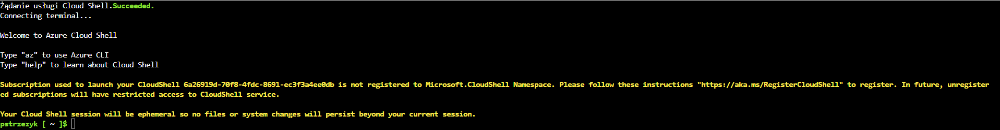

---

## 2. Wybór subskrypcji

Zweryfikowano aktywną subskrypcję Azure for Students wykorzystywaną podczas ćwiczenia.

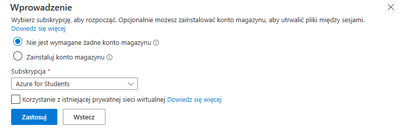

---

## 3. Utworzenie grupy zasobów

Początkowo podjęto próbę wykorzystania regionów `westeurope` oraz `northeurope`, jednak polityka przypisana do subskrypcji ograniczała możliwość wdrażania zasobów wyłącznie do wybranych regionów.

Po analizie polityki Azure utworzono grupę zasobów w regionie `francecentral`.

Polecenie:

```bash
az group create \
  --name rg-ps-express \
  --location francecentral
```

Potwierdzenie utworzenia grupy zasobów:

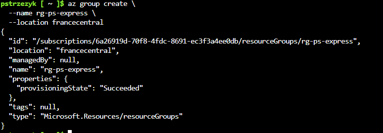

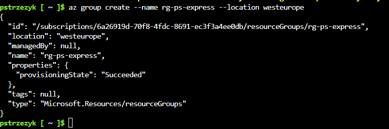

---

## 4. Wdrożenie kontenera z Docker Hub

Do wdrożenia wykorzystano obraz znajdujący się w Docker Hub:

```text
pawlistonks/express-app:v2
```

Polecenie wdrożenia:

```bash
az container create \
  --resource-group rg-ps-express \
  --name aci-ps-express \
  --image pawlistonks/express-app:v2 \
  --ports 3000 \
  --dns-name-label ps-express-aci-12345 \
  --location francecentral \
  --os-type Linux \
  --cpu 1 \
  --memory 1.5
```

Potwierdzenie utworzenia kontenera:

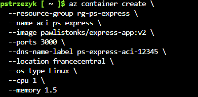

---

## 5. Weryfikacja działania kontenera

Sprawdzono stan wdrożonego kontenera.

Polecenie:

```bash
az container show \
  --resource-group rg-ps-express \
  --name aci-ps-express \
  --query instanceView.state
```

Wynik:

```text
Running
```

Potwierdzenie działania:

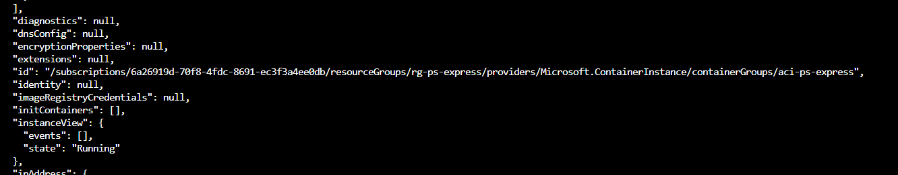

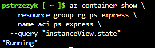

---

## 6. Pobranie logów aplikacji

Pobrano logi uruchomionej aplikacji.

Polecenie:

```bash
az container logs \
  --resource-group rg-ps-express \
  --name aci-ps-express
```

W logach widoczna była informacja:

```text
Listening on 3000
```

co potwierdza poprawne uruchomienie aplikacji Express.

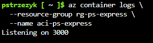

---

## 7. Dostęp do usługi HTTP

Podczas wdrożenia Azure przydzielił publiczny adres DNS:

```text
ps-express-aci-12345.francecentral.azurecontainer.io
```

Aplikacja była dostępna pod adresem:

```text
http://ps-express-aci-12345.francecentral.azurecontainer.io:3000
```

Działanie aplikacji zostało zweryfikowane w przeglądarce internetowej.

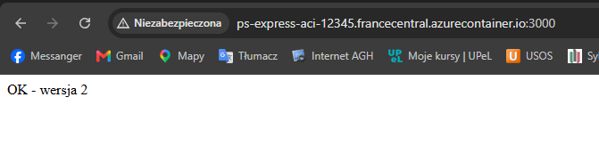

---

## 8. Usunięcie kontenera

Po zakończeniu testów usunięto wdrożony kontener.

Polecenie:

```bash
az container delete \
  --resource-group rg-ps-express \
  --name aci-ps-express \
  --yes
```

Potwierdzenie usunięcia:

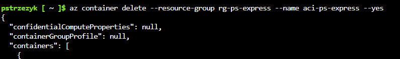

---

## 9. Usunięcie grupy zasobów

Po usunięciu kontenera usunięto również grupę zasobów, aby nie pozostawiać aktywnych zasobów generujących koszty.

Polecenie:

```bash
az group delete \
  --name rg-ps-express \
  --yes \
  --no-wait
```

Weryfikacja wykazała, że grupa zasobów nie istnieje.

Potwierdzenie:

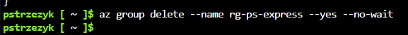

---

## Wnioski

W ramach ćwiczenia pomyślnie wdrożono własny kontener Docker na platformie Microsoft Azure przy użyciu usługi Azure Container Instances. Zweryfikowano poprawne uruchomienie aplikacji, pobrano logi działania oraz sprawdzono dostępność usługi HTTP z poziomu przeglądarki internetowej. Po zakończeniu pracy wszystkie utworzone zasoby zostały poprawnie usunięte, co pozwoliło uniknąć niepotrzebnego wykorzystania zasobów i kosztów.
