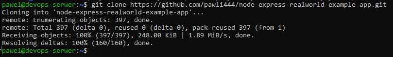
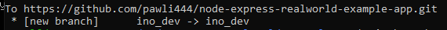
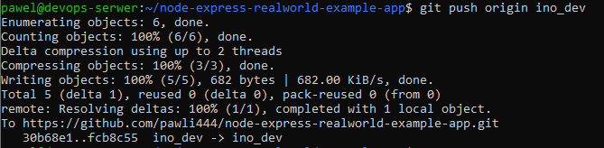
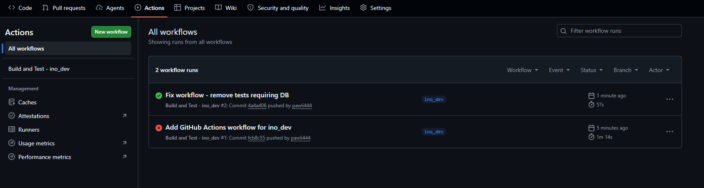
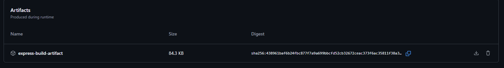

# Zajęcia 13
# Sprawozdanie - Shift-left: GitHub Actions


---

## 1. Cel ćwiczenia

Celem laboratorium było zapoznanie się z koncepcją GitHub Actions jako narzędzia do implementacji podejścia Shift-left w procesie wytwarzania oprogramowania. Zadanie polegało na stworzeniu własnego pipeline'u CI (Continuous Integration) reagującego na zmiany w dedykowanej gałęzi `ino_dev`, weryfikującego poprawność budowania aplikacji oraz załączającego artefakt wynikowy.

---

## 2. Wybrane repozytorium

Do ćwiczenia wybrano projekt open-source:

- **Oryginalne repo:** `gothinkster/node-express-realworld-example-app`
- **Fork:** `pawli444/node-express-realworld-example-app`
- **Technologia:** Node.js + Express.js + TypeScript + Prisma ORM

Projekt jest przykładową aplikacją backendową typu REST API, co czyni go dobrym kandydatem do demonstracji procesu CI.

---

## 3. Przygotowanie środowiska

### 3.1 Fork repozytorium

Repozytorium zostało sforkowane na konto użytkownika `pawli444` poprzez interfejs GitHub. Dzięki temu pipeline nie został dodany do oryginalnego projektu - zgodnie z wymaganiem zadania.



### 3.2 Klonowanie i utworzenie gałęzi `ino_dev`

Repozytorium zostało sklonowane lokalnie na maszynie wirtualnej, a następnie utworzono dedykowaną gałąź `ino_dev`:

```bash
git clone https://github.com/pawli444/node-express-realworld-example-app.git
cd node-express-realworld-example-app
git checkout -b ino_dev
git push origin ino_dev
```



---

## 4. Konfiguracja GitHub Actions

### 4.1 Usunięcie istniejących workflows

Sprawdzono czy w projekcie istnieją jakiekolwiek pliki workflow - nie znaleziono żadnych. Folder `.github/workflows/` został utworzony ręcznie.

### 4.2 Plik workflow `build.yml`

Utworzono plik `.github/workflows/build.yml` z następującą konfiguracją:

```yaml
name: Build and Test - ino_dev

on:
  push:
    branches:
      - ino_dev
  pull_request:
    branches:
      - ino_dev

jobs:
  build:
    runs-on: ubuntu-latest

    steps:
      - name: Checkout repository
        uses: actions/checkout@v4

      - name: Set up Node.js
        uses: actions/setup-node@v4
        with:
          node-version: '20'

      - name: Install dependencies
        run: npm install

      - name: Upload artifact
        uses: actions/upload-artifact@v4
        with:
          name: express-build-artifact
          path: |
            package.json
            package-lock.json
          retention-days: 7
```

### 4.3 Trigger

Akcja reaguje na dwa zdarzenia dotyczące gałęzi `ino_dev`:
- **`push`** - każdy commit wypchnięty bezpośrednio na gałąź
- **`pull_request`** - każde otwarcie lub aktualizacja Pull Requestu do tej gałęzi

Plik workflow został wypchnięty na gałąź `ino_dev`:

```bash
git add .github/workflows/build.yml
git commit -m "Fix workflow - remove tests requiring DB"
git push origin ino_dev
```



---

## 5. Weryfikacja działania

### 5.1 Pierwsze uruchomienie - błąd testów

Pierwsze uruchomienie akcji zakończyło się błędem. Testy jednostarne w pliku `auth.service.test.ts` wymagały połączenia z bazą danych PostgreSQL (`DATABASE_URL`), która nie była dostępna w środowisku GitHub Actions. Błąd:

```
error: Environment variable not found: DATABASE_URL
```

### 5.2 Modyfikacja workflow

Usunięto krok uruchamiający testy. Workflow został ograniczony do instalacji zależności (`npm install`), co stanowi weryfikację poprawności konfiguracji projektu.

### 5.3 Drugie uruchomienie - sukces

Po modyfikacji workflow zakończył się sukcesem ✅. Oba uruchomienia są widoczne w zakładce Actions:



---

## 6. Artefakt

Zgodnie z wymaganiem zadania, do workflow dodano krok załączający artefakt przy użyciu akcji `actions/upload-artifact@v4`. Artefakt `express-build-artifact` zawiera pliki `package.json` oraz `package-lock.json` i jest przechowywany przez 7 dni.



---


## 7. Wnioski

Ćwiczenie pozwoliło na praktyczne zapoznanie się z GitHub Actions jako narzędziem CI/CD. Kluczowe obserwacje:

- Trigger `on: push` z określoną gałęzią pozwala precyzyjnie kontrolować kiedy pipeline się uruchamia
- Podejście Shift-left polega na wykrywaniu błędów jak najwcześniej w procesie - już przy każdym commicie
- W przypadku gdy testy wymagają zewnętrznych usług (np. bazy danych), należy albo skonfigurować usługę w workflow (np. `services: postgres`) albo ograniczyć pipeline do kroków niezależnych od infrastruktury
- Akcja `upload-artifact` umożliwia przechowywanie i pobieranie wyników budowania bezpośrednio z poziomu GitHub
