# Sprawozdanie - PS422034
## Docker

---

## 1. Instalacja Dockera
Zainstalowano Dockera z oficjalnego repozytorium Docker.

    sudo apt install ca-certificates curl
    sudo install -m 0755 -d /etc/apt/keyrings
    sudo curl -fsSL https://download.docker.com/linux/ubuntu/gpg -o /etc/apt/keyrings/docker.asc
    sudo chmod a+r /etc/apt/keyrings/docker.asc
    sudo apt update
    sudo apt install docker-ce docker-ce-cli containerd.io docker-buildx-plugin docker-compose-plugin

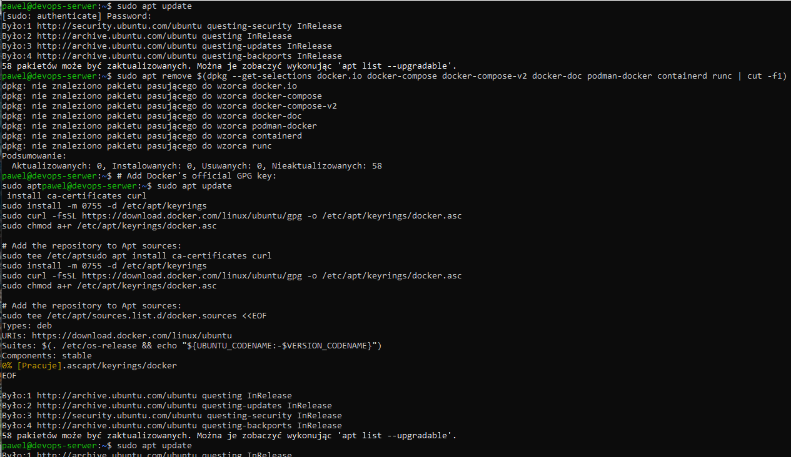

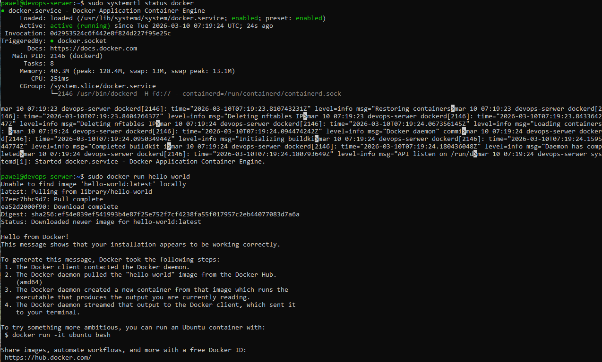

---

## 2. Rejestracja w Docker Hub
Zarejestrowano konto na https://hub.docker.com.

---

## 3. Uruchomienie obrazow, rozmiary i kody wyjscia
Uruchomiono wszystkie wymagane obrazy.

    sudo docker run hello-world
    sudo docker run busybox
    sudo docker run ubuntu echo "hello from ubuntu"
    sudo docker run mariadb --version
    sudo docker run mcr.microsoft.com/dotnet/runtime --version
    sudo docker run mcr.microsoft.com/dotnet/aspnet --version
    sudo docker run mcr.microsoft.com/dotnet/sdk dotnet --version
    sudo docker images
    sudo docker ps -a

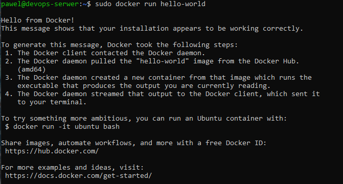
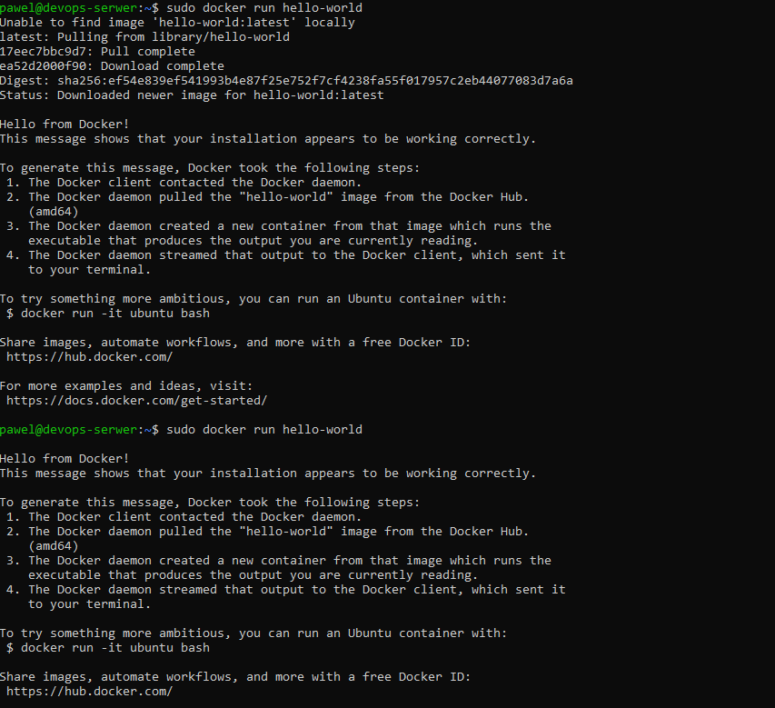
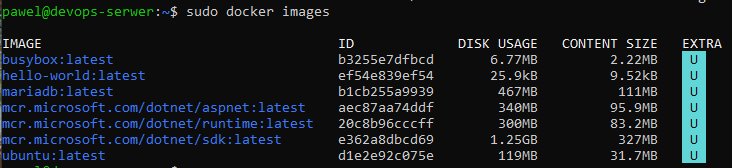
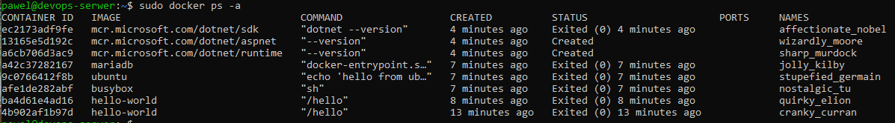

---

## 4. Busybox - tryb interaktywny
Podlaczono interaktywnie, sprawdzono wersje.

    sudo docker run -it busybox sh
    busybox | head -1

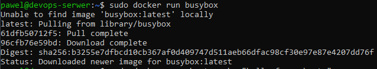

---

## 5. System w kontenerze - ubuntu
Sprawdzono PID1, zaktualizowano pakiety, pokazano procesy dockera na hoscie.

    sudo docker run -it ubuntu bash
    ps aux
    apt update && apt upgrade -y
    exit
    ps aux | grep docker

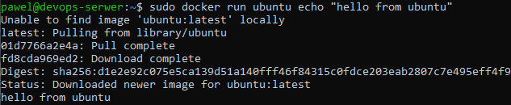
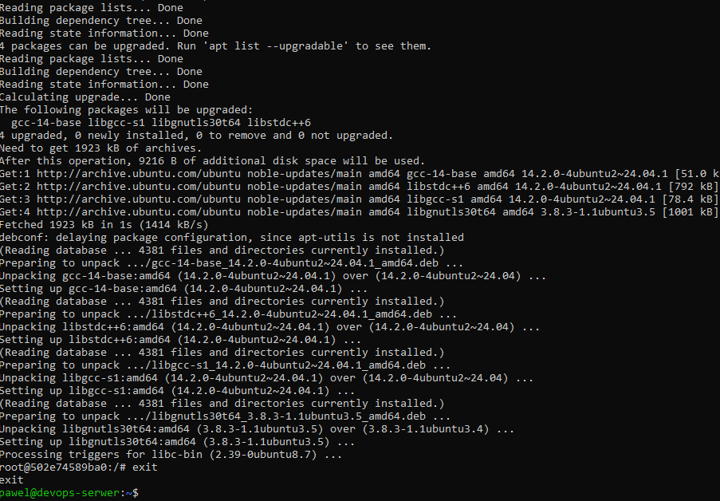
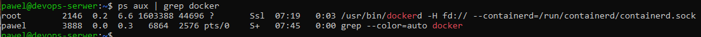

---

## 6. Wlasny Dockerfile
Stworzono, zbudowano i uruchomiono obraz z repozytorium.

    FROM ubuntu:24.04

    RUN apt-get update && apt-get install -y --no-install-recommends \
        git \
        ca-certificates \
        && rm -rf /var/lib/apt/lists/*

    RUN git clone https://github.com/InzynieriaOprogramowaniaAGH/MDO2026_ITE.git /repo

    WORKDIR /repo

    sudo docker build -t mdo-repo .
    sudo docker run -it mdo-repo bash
    ls /repo

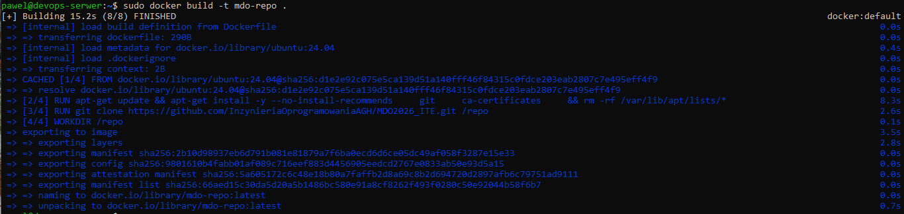
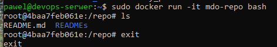

---

## 7. Czyszczenie kontenerow
Wyswietlono i usunieto zakonczone kontenery.

    sudo docker ps -a
    sudo docker container prune

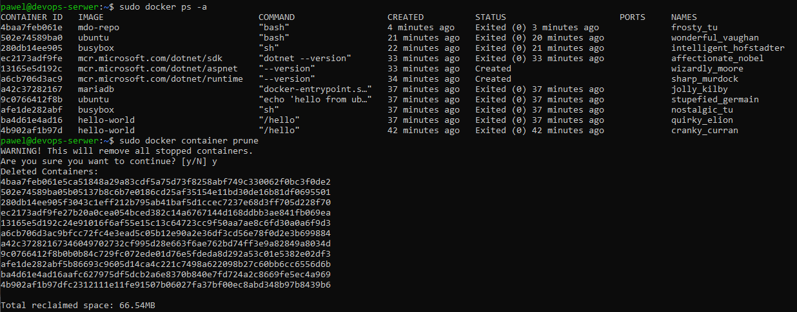

---

## 8. Czyszczenie obrazow
Usunieto wszystkie obrazy z lokalnego magazynu.

    sudo docker image prune -a

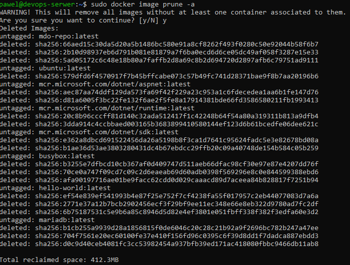

---

## 9. Dodanie Dockerfile do repozytorium
Skopiowano Dockerfile na galaz PS422034.

