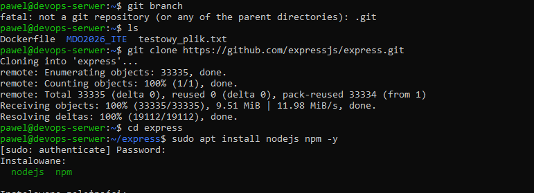
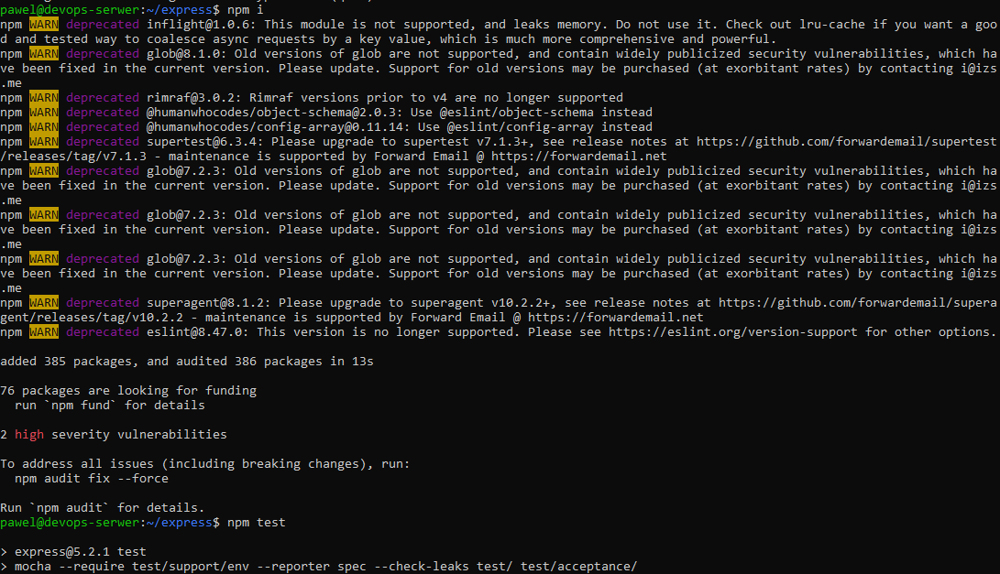
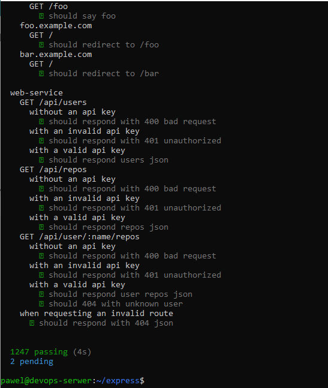
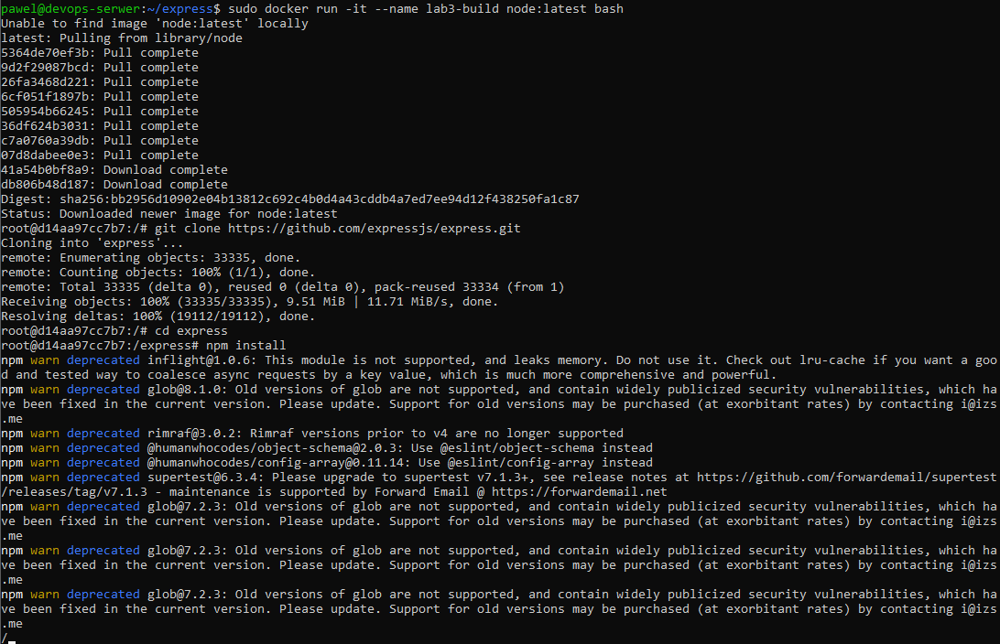
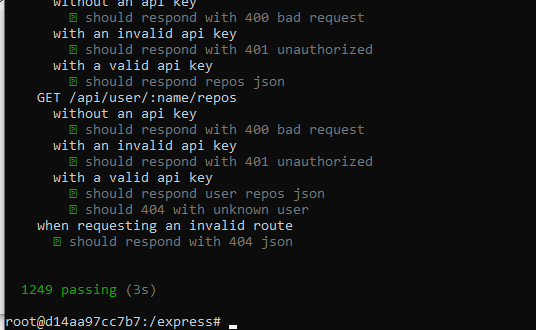
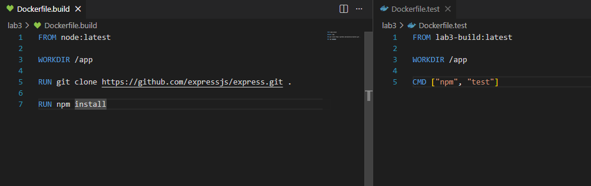
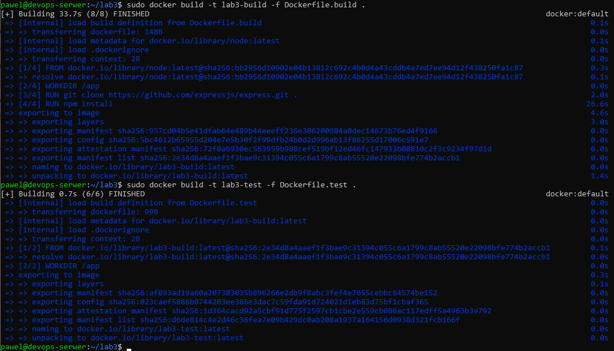
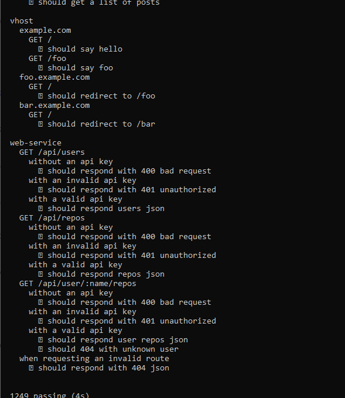
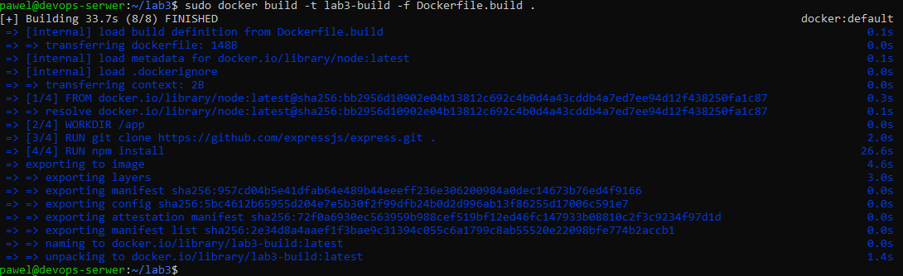
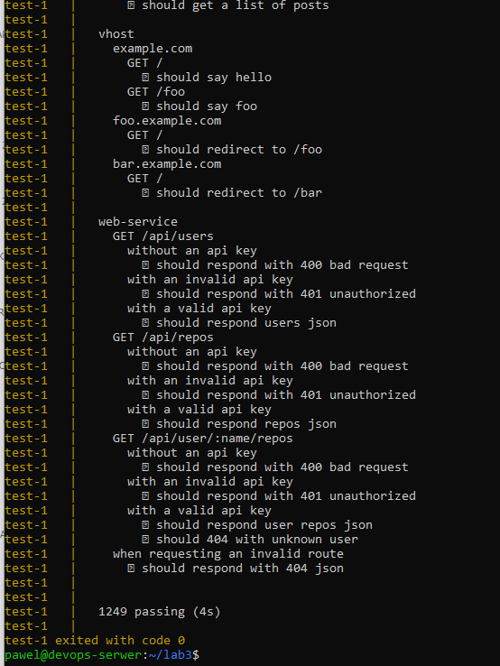

# Sprawozdanie - PS422034
## Dockerfiles, kontener jako definicja etapu

---

## 1. Sklonowanie repozytorium i instalacja Node.js

Wybrano repozytorium **expressjs/express** jako projekt spełniający wymagania laboratorium (otwarta licencja, testy jednostkowe, system budowania npm).

Sklonowano repozytorium i zainstalowano Node.js oraz npm:
```bash
git clone https://github.com/expressjs/express.git
cd express
sudo apt install nodejs npm -y
```



---

## 2. Build i testy na maszynie wirtualnej

Zainstalowano zależności projektu i uruchomiono testy:
```bash
npm i
npm test
```




---

## 3. Uruchomienie kontenera interaktywnie

Wybrano obraz `node:latest` jako wystarczający kontener dla aplikacji Node.js. Uruchomiono kontener interaktywnie:
```bash
sudo docker run -it --name lab3-build node:latest bash
```

Wewnątrz kontenera sklonowano repozytorium, zainstalowano zależności i uruchomiono testy:
```bash
git clone https://github.com/expressjs/express.git
cd express
npm install
npm test
```




---

## 4. Stworzenie dwóch plików Dockerfile

Utworzono dwa pliki Dockerfile w katalogu `~/lab3`:
```bash
mkdir ~/lab3
cd ~/lab3
touch Dockerfile.build
touch Dockerfile.test
```



**Dockerfile.build** - przeprowadza wszystkie kroki aż do builda:
```dockerfile
FROM node:latest

WORKDIR /app

RUN git clone https://github.com/expressjs/express.git .

RUN npm install
```

**Dockerfile.test** - bazuje na pierwszym obrazie i wykonuje testy:
```dockerfile
FROM lab3-build:latest

WORKDIR /app

CMD ["npm", "test"]
```

---

## 5. Budowanie obrazów

Zbudowano oba obrazy:
```bash
sudo docker build -t lab3-build -f Dockerfile.build .
sudo docker build -t lab3-test -f Dockerfile.test .
```



---

## 6. Uruchomienie testów w kontenerze

Uruchomiono kontener testowy:
```bash
sudo docker run --name lab3-test-container lab3-test
```



Testy przeszły pomyślnie - **1249 passing**.

---

## 7. Weryfikacja działania kontenerów

Różnica między obrazem a kontenerem: **obraz** to niemutowalny szablon, a **kontener** to działająca instancja obrazu.

W kontenerze `lab3-build` pracuje proces klonowania repozytorium i instalacji zależności (`npm install`). Kontener wykonuje te kroki i kończy pracę. W kontenerze `lab3-test` uruchamiany jest `npm test` - testy kończą działanie kontenera po wykonaniu. Żaden z kontenerów nie jest długo działającym serwisem.



---

## 8. Docker Compose

Zamiast ręcznie wdrażać kontenery, ujęto je w kompozycję `docker-compose.yml`:
```yaml
version: '3'

services:
  build:
    build:
      context: .
      dockerfile: Dockerfile.build
    image: lab3-build

  test:
    build:
      context: .
      dockerfile: Dockerfile.test
    image: lab3-test
    depends_on:
      - build
```

Uruchomienie kompozycji:
```bash
sudo docker compose up
```

Testy przeszły pomyślnie - **1249 passing**.



---

## 9. Dyskusja - przygotowanie do wdrożenia

**Czy Express nadaje się do wdrażania i publikowania jako kontener?**

Express jako framework webowy nadaje się do uruchamiania jako kontener produkcyjny, ale tylko gdy jest częścią konkretnej aplikacji. Sam framework bez aplikacji nie ma sensu produkcyjnego - kontener służy tutaj wyłącznie do builda i testów. Sposób interakcji przez kontener sprawdza się dobrze dla serwisów HTTP, ale wymaga odpowiedniej konfiguracji portów i zmiennych środowiskowych.

**Czy trzeba oczyszczać kontener z pozostałości po buildzie?**

Tak - kontener buildowy zawiera `devDependencies` które nie są potrzebne w produkcji i znacznie zwiększają rozmiar obrazu. Obraz produkcyjny powinien zawierać tylko `dependencies`.

**Czy dedykowany deploy-and-publish byłby oddzielną ścieżką?**

Tak - najlepszą praktyką jest oddzielna ścieżka deploy. Trzeci Dockerfile bazujący na lżejszym obrazie `node:alpine` kopiujący tylko potrzebne pliki z obrazu buildowego:
```dockerfile
FROM node:alpine

WORKDIR /app

COPY --from=lab3-build /app/package*.json ./
COPY --from=lab3-build /app/lib ./lib

RUN npm install --omit=dev
```

**Czy zbudowany program należałoby dystrybuować jako pakiet?**

Express jest już dystrybuowany jako pakiet **npm**.

**Jak zapewnić taki format? Trzeci kontener?**

Tak - trzeci kontener byłby dedykowanym etapem publikacji. Przykład z użyciem multi-stage build w jednym Dockerfile:
```dockerfile
# build
FROM node:latest AS builder
WORKDIR /app
RUN git clone https://github.com/expressjs/express.git .
RUN npm install

# testy
FROM builder AS tester
RUN npm test

# produkcja
FROM node:alpine AS production
WORKDIR /app
COPY --from=builder /app/package*.json ./
COPY --from=builder /app/lib ./lib
RUN npm install --omit=dev
```

Takie podejście z **multi-stage build** jest najczystsze - jeden plik Dockerfile, mniejszy finalny obraz, brak pozostałości po buildzie.
