# Sprawozdanie 4 - Dodatkowa terminologia w konteneryzacji, instancja Jenkins - PS422034  


---

## 1. Zachowywanie stanu między kontenerami

### Przygotowanie woluminów

Przed uruchomieniem kontenerów utworzono dwa woluminy Docker:
```bash
docker volume create input-volume
docker volume create output-volume
docker volume ls
```

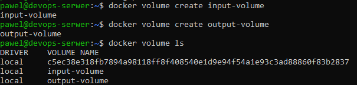

Wolumin `input-volume` służy jako wejście (kod źródłowy), a `output-volume` jako wyjście (artefakty po buildzie).

### Metoda 1 - Klonowanie repozytorium na hoście (bez Gita w kontenerze)

Kontener bazowy (`lab3-build`) zawiera wszystkie zależności potrzebne do zbudowania projektu (Node.js, npm), ale **nie zawiera Gita** - zgodnie z wymaganiami.

Repozytorium zostało sklonowane bezpośrednio do katalogu woluminu na hoście:
```bash
sudo git clone https://github.com/expressjs/express.git /var/lib/docker/volumes/input-volume/_data
```

**Dlaczego ta metoda?**  
Katalog `/var/lib/docker/volumes/<nazwa>/_data` to fizyczna lokalizacja danych woluminu na hoście. Klonując tam repozytorium z poziomu hosta, możemy udostępnić kod kontenerowi bez potrzeby instalowania Gita wewnątrz kontenera. Jest to najprostsze podejście - nie wymaga dodatkowych kontenerów pomocniczych ani bind mountów.

Następnie uruchomiono kontener z podłączonymi woluminami i wykonano build:
```bash
docker run -it \
  --name builder \
  --mount type=volume,src=input-volume,dst=/input \
  --mount type=volume,src=output-volume,dst=/output \
  lab3-build:latest bash
```

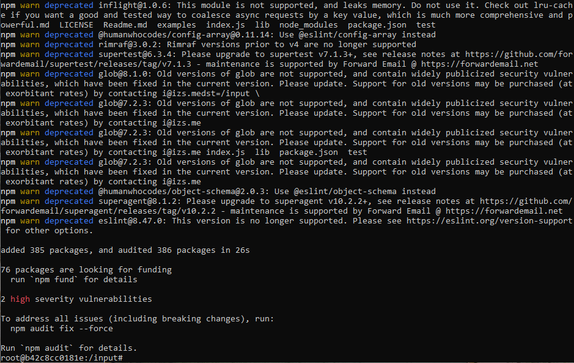

Po zatrzymaniu kontenera dane pozostały dostępne na woluminie wyjściowym:
```bash
sudo ls /var/lib/docker/volumes/output-volume/_data
```

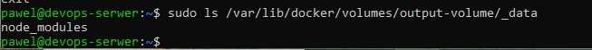

### Metoda 2 - Klonowanie wewnątrz kontenera (z Gitem w kontenerze)
```bash
docker run -it \
  --name builder2 \
  --mount type=volume,src=input-volume,dst=/input \
  --mount type=volume,src=output-volume,dst=/output \
  lab3-build:latest bash
```

Wewnątrz kontenera:
```bash
apt install git -y
git clone https://github.com/expressjs/express.git /input
cd /input
npm install
cp -r node_modules /output/
```

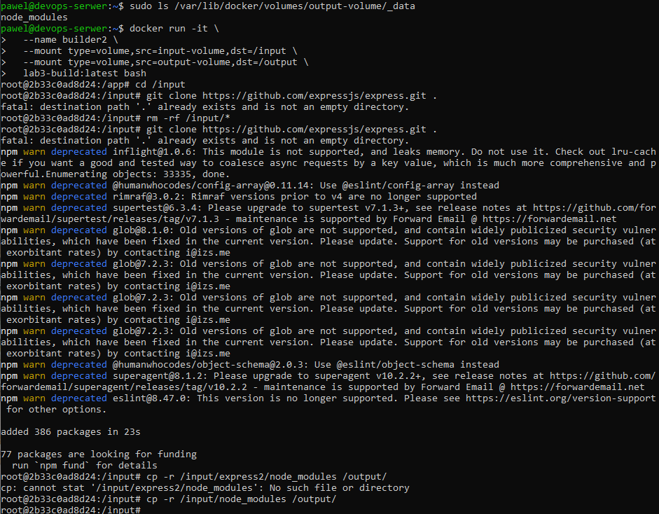

### Dyskusja: Użycie docker build i RUN --mount

Możliwe jest wykonanie powyższych kroków za pomocą `Dockerfile` i dyrektywy `RUN --mount`. Przykład:
```dockerfile
FROM lab3-build:latest
RUN --mount=type=cache,target=/root/.npm \
    git clone https://github.com/expressjs/express.git /app && \
    cd /app && npm install
```

Dyrektywa `RUN --mount` pozwala na montowanie woluminów, cache'ów lub sekretów podczas budowania obrazu - bez zapisywania ich w warstwach obrazu. Jest to szczególnie przydatne do cache'owania zależności bez zwiększania rozmiaru końcowego obrazu.

---

## 2. Eksponowanie portu i łączność między kontenerami

### Uruchomienie serwera iperf3
```bash
docker run -it --name iperf-server networkstatic/iperf3 -s
```

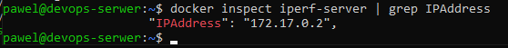

### Połączenie kontener–kontener (domyślna sieć)

Znaleziono adres IP serwera:
```bash
docker inspect iperf-server | grep IPAddress
# 172.17.0.2
```

Uruchomiono klienta:
```bash
docker run -it --rm networkstatic/iperf3 -c 172.17.0.2
```


Przepustowość: ~57–62 Gbits/sec - bardzo wysoka, bo komunikacja odbywa się wewnątrz tego samego hosta przez wirtualny interfejs Docker.

### Dedykowana sieć mostkowa z rozwiązywaniem nazw

Utworzono własną sieć mostkową:
```bash
docker network create iperf-net
```

Uruchomiono serwer z eksponowanym portem w nowej sieci:
```bash
docker run -it --name iperf-server --network iperf-net -p 5201:5201 networkstatic/iperf3 -s
```

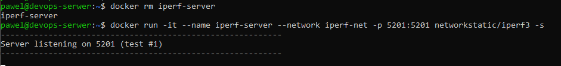

Klient połączył się po nazwie kontenera:
```bash
docker run -it --rm --network iperf-net networkstatic/iperf3 -c iperf-server
```

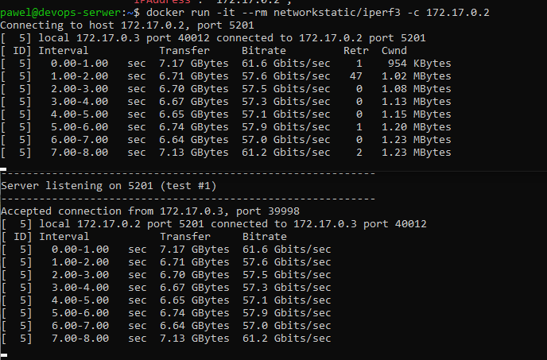

Użycie własnej sieci mostkowej umożliwia rozwiązywanie nazw DNS - kontenery mogą się komunikować po nazwach zamiast adresów IP.

### Połączenie z hosta
```bash
iperf3 -c 127.0.0.1 -p 5201
```

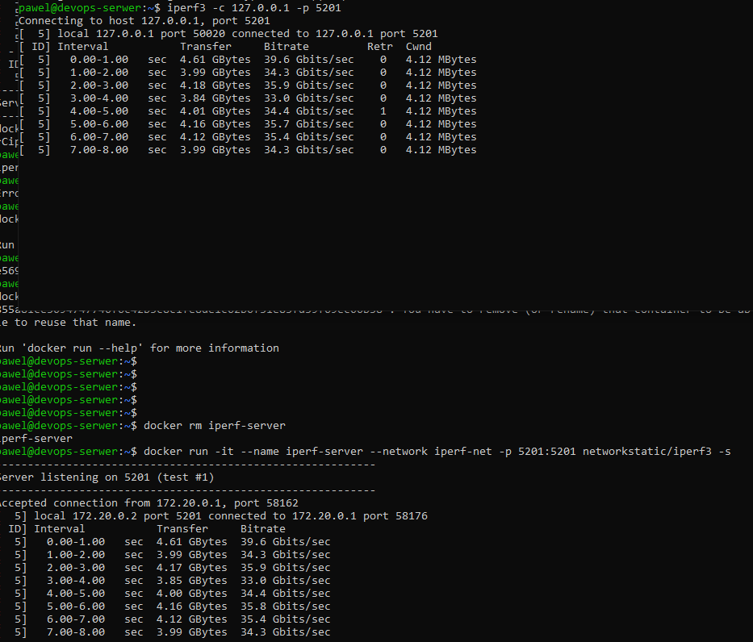

Przepustowość: ~35 Gbits/sec.

### Połączenie spoza hosta (Windows)
```
iperf3.exe -c 172.19.142.81 -p 5201
```

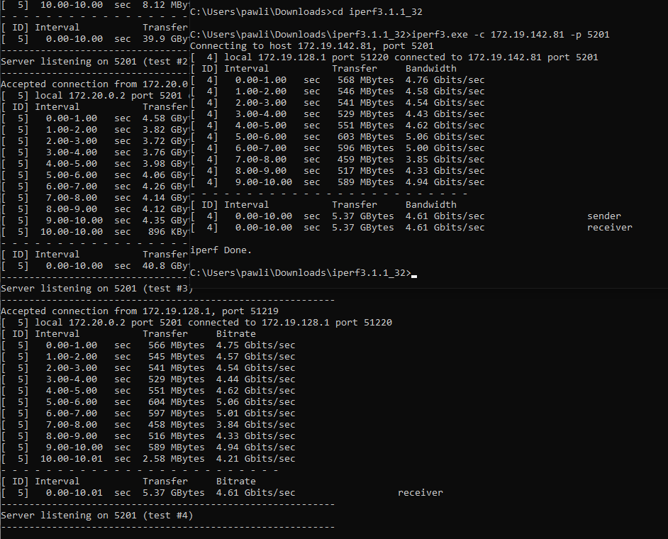

Przepustowość: ~4.61 Gbits/sec - niższa, bo ruch przechodzi przez fizyczną sieć.

### Podsumowanie przepustowości

| Scenariusz | Przepustowość |
|---|---|
| Kontener → Kontener | ~57–62 Gbits/sec |
| Host → Kontener | ~35 Gbits/sec |
| Spoza hosta → Kontener | ~4.61 Gbits/sec |

---

## 3. Usługi - SSHD w kontenerze

### Konfiguracja i uruchomienie SSHD
```bash
docker run -d --name sshd-container -p 2222:22 ubuntu bash -c "
apt update && apt install -y openssh-server &&
mkdir /run/sshd &&
echo 'root:password123' | chpasswd &&
sed -i 's/#PermitRootLogin prohibit-password/PermitRootLogin yes/' /etc/ssh/sshd_config &&
/usr/sbin/sshd -D"
```

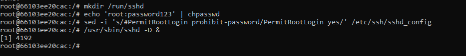

### Połączenie z kontenerem
```bash
ssh root@127.0.0.1 -p 2222
```

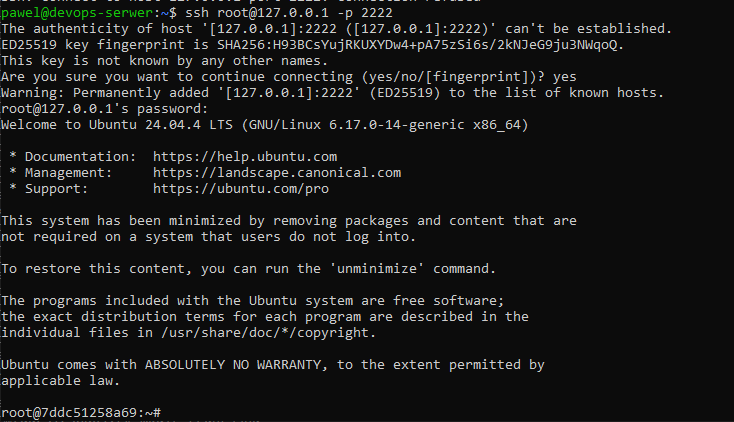

### Zalety i wady komunikacji SSH z kontenerem

**Zalety:**
- Możliwość interaktywnej pracy bez `docker exec`
- Znane narzędzia (SCP, SFTP) do przesyłania plików
- Dostęp zdalny z zewnętrznych maszyn bez dostępu do hosta Docker
- Przydatne gdy bezpośredni dostęp do hosta jest ograniczony

**Wady:**
- Kontener musi zawierać demona SSH - zwiększa rozmiar obrazu i powierzchnię ataku
- Niezgodne z filozofią kontenerów (bezstanowe, jednocelowe)
- `docker exec` jest bezpieczniejszą i prostszą alternatywą
- W klastrze (Kubernetes) SSH do pojedynczego poda jest antypatternem
- Skomplikowane zarządzanie kluczami SSH

**Przypadki użycia:**
- Kontenery symulujące maszyny wirtualne
- Kontenery bastion/jump host

---

## 4. Uruchomienie serwera Jenkins z DIND

### Instalacja

Utworzono sieć Jenkins:
```bash
docker network create jenkins
```

Uruchomiono Docker-in-Docker (DIND):
```bash
docker run --name jenkins-docker --rm --detach \
  --privileged --network jenkins --network-alias docker \
  --env DOCKER_TLS_CERTDIR=/certs \
  --volume jenkins-docker-certs:/certs/client \
  --volume jenkins-data:/var/jenkins_home \
  --publish 2376:2376 \
  docker:dind --storage-driver overlay2
```

Uruchomiono kontener Jenkins:
```bash
docker run --name jenkins-blueocean --restart=on-failure --detach \
  --network jenkins --env DOCKER_HOST=tcp://docker:2376 \
  --env DOCKER_CERT_PATH=/certs/client --env DOCKER_TLS_VERIFY=1 \
  --volume jenkins-data:/var/jenkins_home \
  --volume jenkins-docker-certs:/certs/client:ro \
  --publish 8080:8080 --publish 50000:50000 \
  jenkins/jenkins:lts
```

### Działające kontenery
```bash
docker ps
```

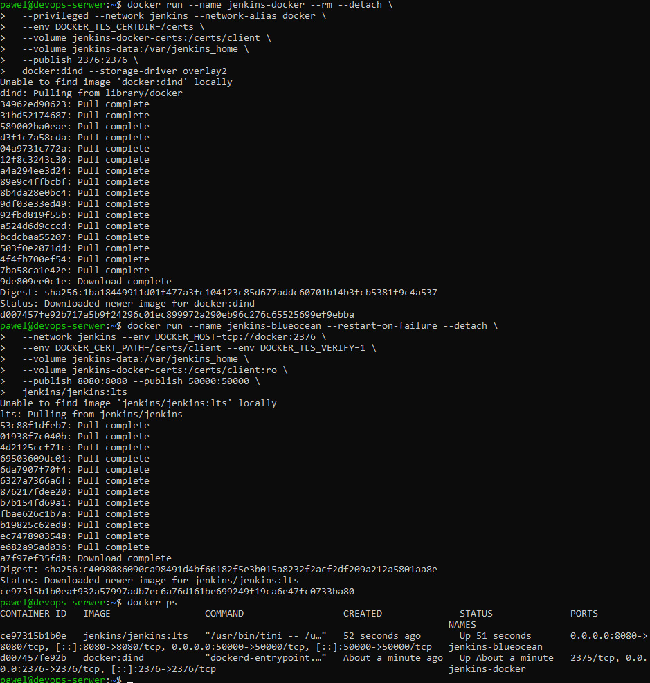

### Inicjalizacja

Pobrano hasło administratora:
```bash
docker exec jenkins-blueocean cat /var/jenkins_home/secrets/initialAdminPassword
```


### Ekran konfiguracji i dashboard

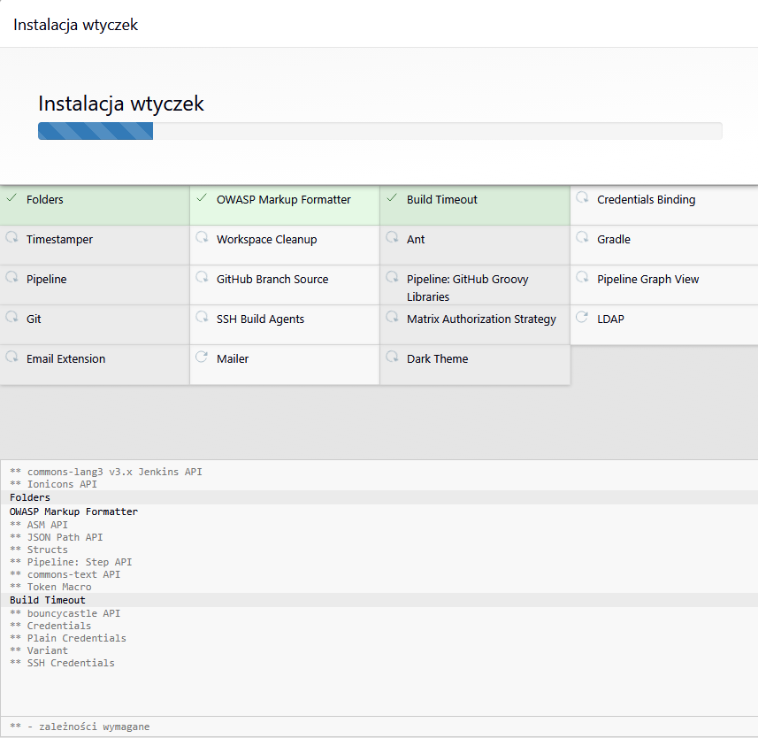

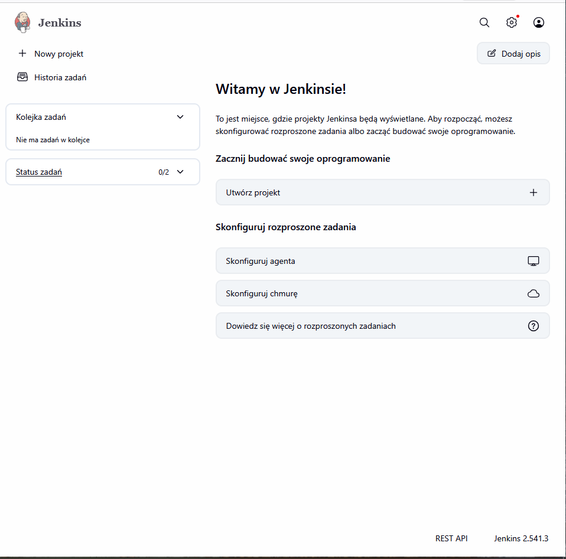

Jenkins 2.541.3 działa poprawnie na porcie 8080.

---

## Podsumowanie

W ramach zajęć zrealizowano:
- Przygotowanie woluminów wejściowego i wyjściowego, zademonstrowanie dwóch metod klonowania repozytorium
- Zbadanie łączności między kontenerami przy użyciu iperf3 na sieci domyślnej i dedykowanej
- Pomiar przepustowości z trzech poziomów: kontener–kontener, host–kontener, spoza hosta
- Uruchomienie usługi SSHD w kontenerze Ubuntu i omówienie zalet/wad tego podejścia
- Instalację i inicjalizację skonteneryzowanej instancji Jenkins z pomocnikiem DIND
