# Sprawozdanie 5 - Pipeline, Jenkins, izolacja etapów

---

## 1. Przygotowanie - Instancja Jenkins

### Weryfikacja kontenerów budujących i testujących

Przed przystąpieniem do zajęć zweryfikowano działanie obrazów z poprzednich zajęć:

```bash
docker images | grep lab3
```

Obrazy `lab3-build:latest` oraz `lab3-test:latest` były dostępne i gotowe do użycia.

### Budowanie obrazu BlueOcean

Zgodnie z instrukcją z https://www.jenkins.io/doc/book/installing/docker/ przygotowano własny obraz Jenkinsa z zainstalowaną wtyczką BlueOcean oraz Docker CLI.

**Czym różni się obraz BlueOcean od standardowego Jenkinsa?**  
Obraz `jenkins/jenkins:lts` to bazowy obraz Jenkinsa bez dodatkowych wtyczek i bez Docker CLI. Obraz BlueOcean rozszerza go o:
- wtyczkę **BlueOcean** - nowoczesny interfejs graficzny do wizualizacji pipeline'ów
- wtyczkę **docker-workflow** - umożliwia używanie Dockera w pipeline'ach
- **Docker CLI** - pozwala na wykonywanie komend docker wewnątrz Jenkinsa

Stworzono `Dockerfile.jenkins`:

```dockerfile
FROM jenkins/jenkins:2.541.3-jdk21
USER root
RUN apt-get update && apt-get install -y lsb-release ca-certificates curl && \
    install -m 0755 -d /etc/apt/keyrings && \
    curl -fsSL https://download.docker.com/linux/debian/gpg -o /etc/apt/keyrings/docker.asc && \
    chmod a+r /etc/apt/keyrings/docker.asc && \
    echo "deb [arch=$(dpkg --print-architecture) signed-by=/etc/apt/keyrings/docker.asc] \
    https://download.docker.com/linux/debian $(. /etc/os-release && echo "$VERSION_CODENAME") stable" \
    | tee /etc/apt/sources.list.d/docker.list > /dev/null && \
    apt-get update && apt-get install -y docker-ce-cli && \
    apt-get clean && rm -rf /var/lib/apt/lists/*
USER jenkins
RUN jenkins-plugin-cli --plugins "blueocean docker-workflow json-path-api"
```

Zbudowano obraz:

```bash
docker build -t myjenkins-blueocean:2.541.3-1 -f ~/Dockerfile.jenkins ~/
```

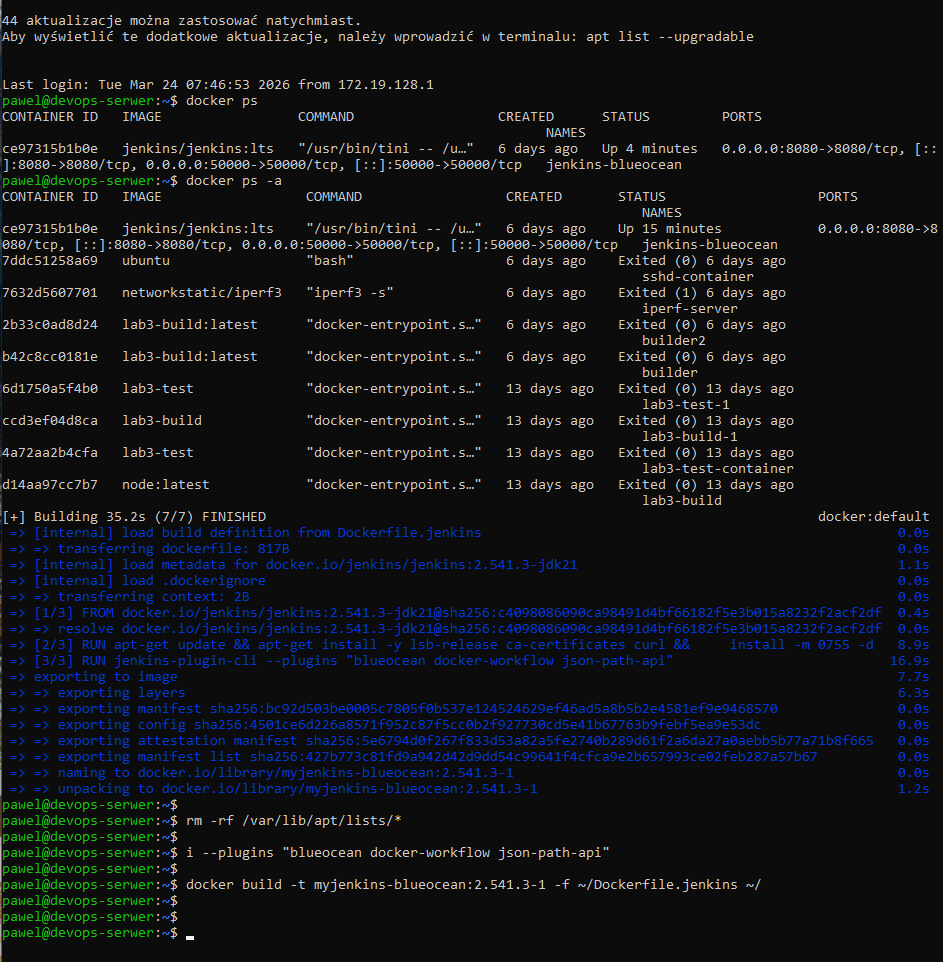

### Uruchomienie DIND i Jenkins BlueOcean

Uruchomiono Docker-in-Docker (DIND):

```bash
docker run --name jenkins-docker --rm --detach \
  --privileged --network jenkins --network-alias docker \
  --env DOCKER_TLS_CERTDIR=/certs \
  --volume jenkins-docker-certs:/certs/client \
  --volume jenkins-data:/var/jenkins_home \
  --publish 2376:2376 \
  docker:dind --storage-driver overlay2
```

Uruchomiono Jenkins BlueOcean:

```bash
docker run --name jenkins-blueocean --restart=on-failure --detach \
  --network jenkins --env DOCKER_HOST=tcp://docker:2376 \
  --env DOCKER_CERT_PATH=/certs/client --env DOCKER_TLS_VERIFY=1 \
  --publish 8080:8080 --publish 50000:50000 \
  --volume jenkins-data:/var/jenkins_home \
  --volume jenkins-docker-certs:/certs/client:ro \
  myjenkins-blueocean:2.541.3-1
```

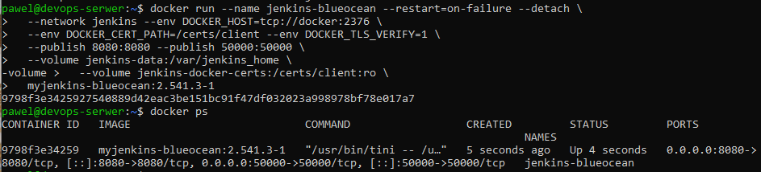

### Logowanie i konfiguracja

Ponieważ serwer Jenkins działa na wewnętrznym adresie IP, dostęp uzyskano przez tunel SSH z maszyny lokalnej (Windows):

Problem rozwiązano przy pomocy narzędzia AI (Claude)

```bash
ssh -L 8080:localhost:8080 pawel@172.19.136.131
```

Następnie otworzono `http://localhost:8080` w przeglądarce.

Plik `initialAdminPassword` nie istniał - Jenkins był już wcześniej skonfigurowany z poprzednich zajęć. Aby odzyskać dostęp, wyłączono tymczasowo security:

```bash
docker exec jenkins-blueocean bash -c "sed -i 's/<useSecurity>true/<useSecurity>false/' /var/jenkins_home/config.xml"
docker restart jenkins-blueocean
```

Po restarcie Jenkins był dostępny bez logowania. Skonfigurowano nowe hasło w panelu administracyjnym.

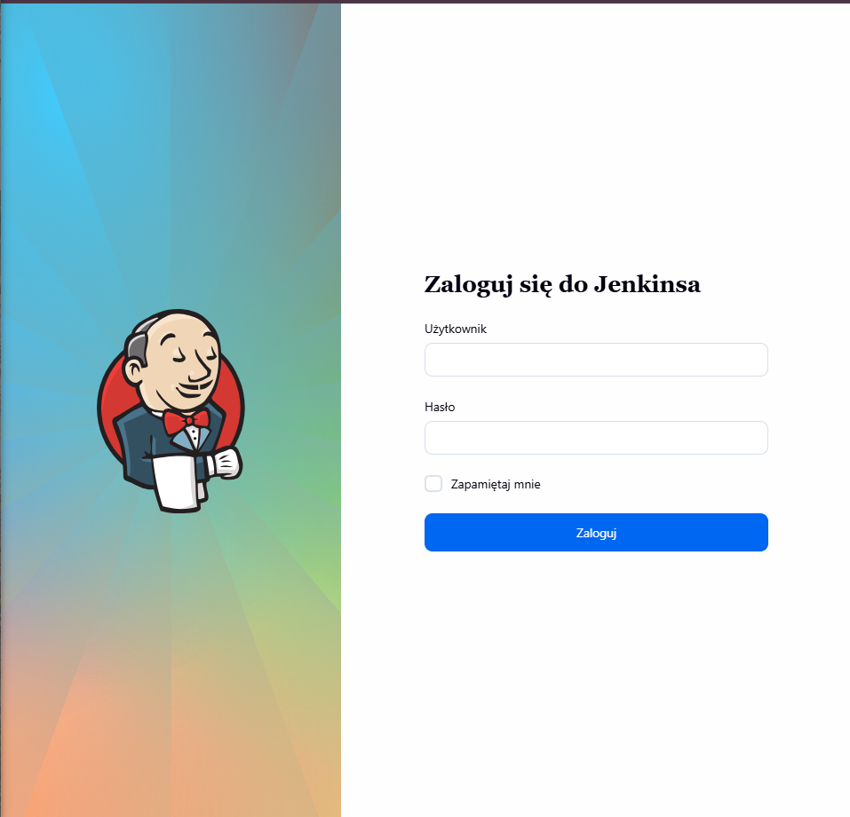

### Archiwizacja logów

Logi Jenkinsa zostały zapisane do pliku na serwerze:

```bash
docker logs jenkins-blueocean > ~/jenkins.log
cat ~/jenkins.log | tail -20
```

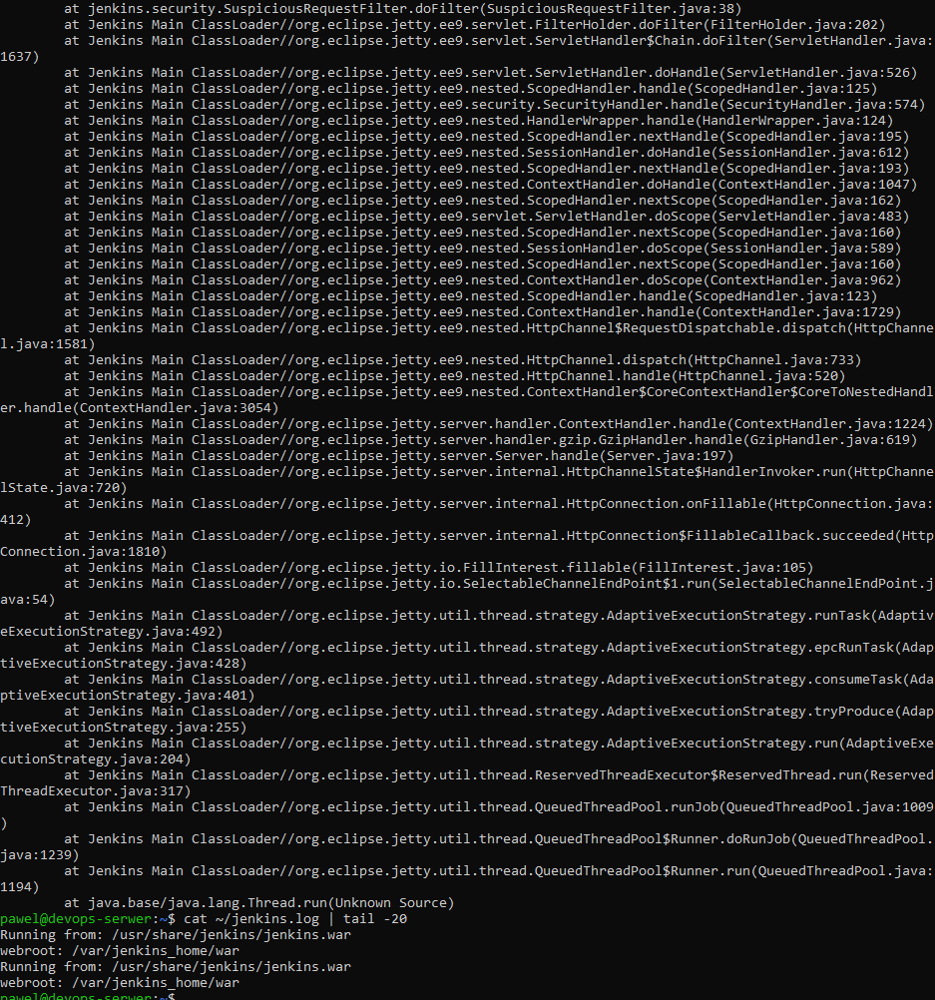

---

## 2. Zadanie wstępne: uruchomienie

### Projekt wyświetlający `uname`

Utworzono projekt typu **Ogólny projekt** o nazwie `uname-project`. W kroku budowania dodano **Uruchom powłokę** z poleceniem:

```bash
uname -a
```

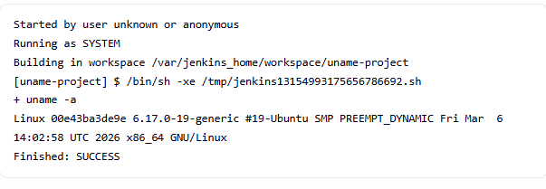

Projekt zakończył się sukcesem, wyświetlając informacje o systemie Linux.

### Projekt zwracający błąd gdy godzina nieparzysta

Utworzono projekt `odd-hour-project` z krokiem:

```bash
hour=$(date +%H)
if [ $((hour % 2)) -ne 0 ]; then
  exit 1
fi
```

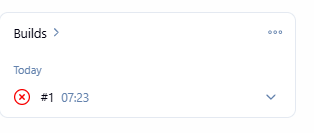

Projekt zwrócił błąd ponieważ build wykonano o godzinie 07 (nieparzystej) - jest to **oczekiwane zachowanie**.

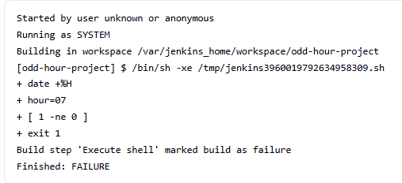

### Projekt pobierający obraz ubuntu przez docker pull

Utworzono projekt `docker-pull-project` z krokiem:

```bash
docker pull ubuntu
```

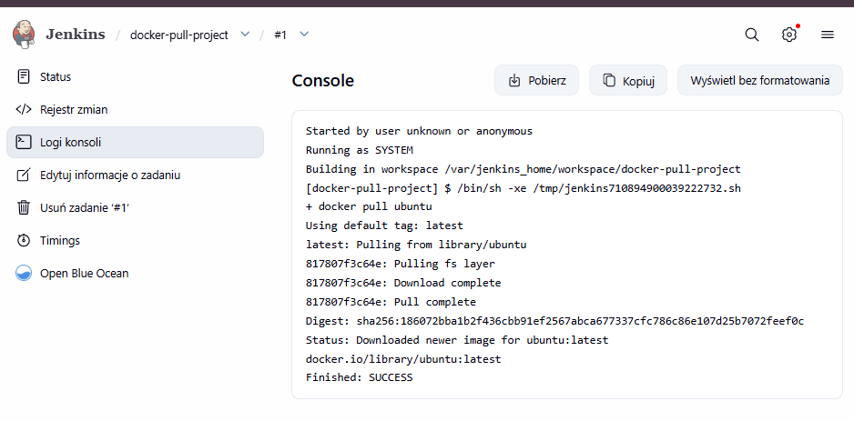

Obraz ubuntu:latest został pobrany pomyślnie (`Finished: SUCCESS`).

---

## 3. Zadanie wstępne: obiekt typu pipeline

### Tworzenie pipeline'u

Utworzono nowy obiekt typu **Pipeline** o nazwie `pipeline-project`. Treść pipeline'u wpisano bezpośrednio do obiektu (nie z SCM).

### Etap 1 - Rozpoznanie ścieżek Dockerfile

Najpierw uruchomiono pipeline wykrywający ścieżki Dockerfile w repozytorium:

```groovy
pipeline {
    agent any
    stages {
        stage('Clone') {
            steps {
                git url: 'https://github.com/InzynieriaOprogramowaniaAGH/MDO2026_ITE.git',
                    branch: 'PS422034'
            }
        }
        stage('List') {
            steps {
                sh 'find . -name "Dockerfile*"'
            }
        }
    }
}
```

Znaleziono pliki:
- `./PS422034/Sprawozdanie3/lab3/Dockerfile.build`
- `./PS422034/Sprawozdanie3/lab3/Dockerfile.test`

### Etap 2 - Pipeline z Clone i Build

Zaktualizowano pipeline o etapy klonowania repozytorium i budowania obrazu:

```groovy
pipeline {
    agent any
    stages {
        stage('Clone') {
            steps {
                git url: 'https://github.com/InzynieriaOprogramowaniaAGH/MDO2026_ITE.git',
                    branch: 'PS422034'
            }
        }
        stage('Build') {
            steps {
                sh 'docker build -t lab3-build -f PS422034/Sprawozdanie3/lab3/Dockerfile.build .'
            }
        }
        stage('Test') {
            steps {
                sh 'docker build -t lab3-test -f PS422034/Sprawozdanie3/lab3/Dockerfile.test .'
            }
        }
    }
}
```

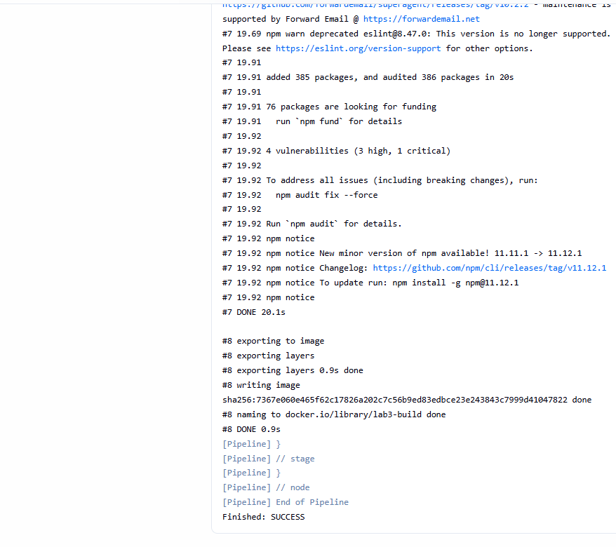

Pipeline zakończył się sukcesem - sklonowano repozytorium przedmiotowe na gałęzi `PS422034` i zbudowano `Dockerfile.build`.

### Drugie uruchomienie pipeline'u

Pipeline uruchomiono drugi raz. Tym razem Docker użył cache dla warstw obrazu, co znacznie przyspieszyło build.

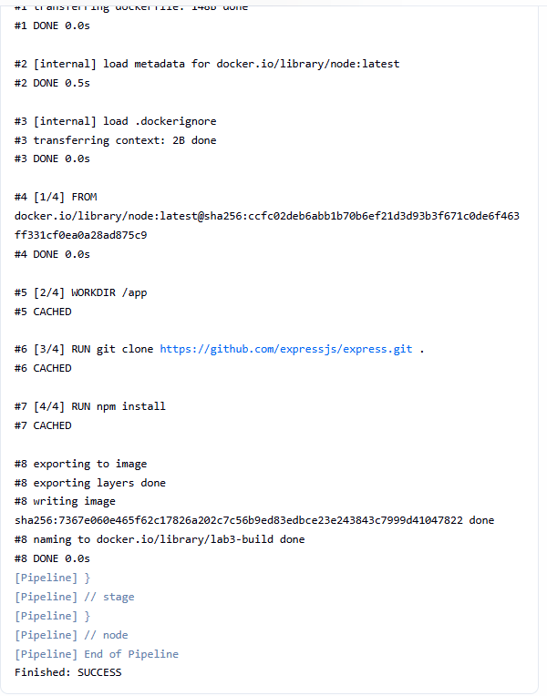

Wynik `pipeline-2-status`:

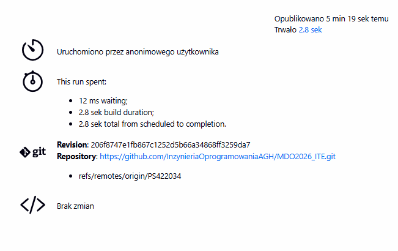

Widok Pipeline Overview:

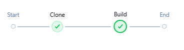

---

## Napotkane problemy

Podczas uruchamiania Jenkinsa napotkano problemy z dostępem do interfejsu webowego. Jenkins działał poprawnie na serwerze (potwierdzone przez `curl http://localhost:8080`), jednak strona była niedostępna z zewnątrz. Problem wynikał z faktu, że serwer działa na wewnętrznym adresie IP, niedostępnym spoza sieci bez tunelu SSH.

Problem rozwiązano przy pomocy narzędzia AI (Claude), które zasugerowało użycie tunelu SSH:

```bash
ssh -L 8080:localhost:8080 pawel@172.19.136.131
```

Dodatkowo napotkano problem z zapomnianym hasłem administratora - plik `initialAdminPassword` nie istniał. Rozwiązano to przez tymczasowe wyłączenie security:

```bash
docker exec jenkins-blueocean bash -c "sed -i 's/<useSecurity>true/<useSecurity>false/' /var/jenkins_home/config.xml"
docker restart jenkins-blueocean
```

Po restarcie skonfigurowano nowe hasło w panelu administracyjnym.

---

## Historia poleceń

Numeracja jest od 150, ponieważ wyżej nadpisała się historia z poprzednich labów.

```bash
  150  ip a
  151  docker ps
  152  docker ps -a
  153  docker images | grep lab3
  154  docker stop jenkins-blueocean
  155  docker rm jenkins-blueocean
  156  cat > ~/Dockerfile.jenkins << 'EOF'
FROM jenkins/jenkins:2.541.3-jdk21
USER root
RUN apt-get update && apt-get install -y lsb-release ca-certificates curl && \
    install -m 0755 -d /etc/apt/keyrings && \
    curl -fsSL https://download.docker.com/linux/debian/gpg -o /etc/apt/keyrings/docker.asc && \
    chmod a+r /etc/apt/keyrings/docker.asc && \
    echo "deb [arch=$(dpkg --print-architecture) signed-by=/etc/apt/keyrings/docker.asc] \
    https://download.docker.com/linux/debian $(. /etc/os-release && echo "$VERSION_CODENAME") stable" \
    | tee /etc/apt/sources.list.d/docker.list > /dev/null && \
    apt-get update && apt-get install -y docker-ce-cli && \
    apt-get clean && rm -rf /var/lib/apt/lists/*
USER jenkins
RUN jenkins-plugin-cli --plugins "blueocean docker-workflow json-path-api"
EOF
  157  docker build -t myjenkins-blueocean:2.541.3-1 -f ~/Dockerfile.jenkins ~/
  158  docker stop jenkins-blueocean
  159  docker run --name jenkins-blueocean --restart=on-failure --detach --network jenkins --env DOCKER_HOST=tcp://docker:2376 --env DOCKER_CERT_PATH=/certs/client --env DOCKER_TLS_VERIFY=1 --publish 8080:8080 --publish 50000:50000 --volume jenkins-data:/var/jenkins_home --volume jenkins-docker-certs:/certs/client:ro myjenkins-blueocean:2.541.3-1
  160  docker ps
  161  docker exec jenkins-blueocean cat /var/jenkins_home/secrets/initialAdminPassword
  162  docker logs jenkins-blueocean
  163  docker exec jenkins-blueocean cat /var/jenkins_home/secrets/initialAdminPassword
  164  docker ps -a | grep jenkins-docker
  165  docker run --name jenkins-docker --rm --detach --privileged --network jenkins --network-alias docker --env DOCKER_TLS_CERTDIR=/certs --volume jenkins-docker-certs:/certs/client --volume jenkins-data:/var/jenkins_home --publish 2376:2376 docker:dind --storage-driver overlay2
  166  docker ps -a | grep jenkins-docker
  167  docker ps
  168  history
  169  docker stop jenkins-blueocean
  170  docker rm jenkins-blueocean
  171  docker stop jenkins-docker
  172  docker run --name jenkins-docker --rm --detach --privileged --network jenkins --network-alias docker --env DOCKER_TLS_CERTDIR=/certs --volume jenkins-docker-certs:/certs/client --volume jenkins-data:/var/jenkins_home --publish 2376:2376 docker:dind --storage-driver overlay2
  173  sleep 10
  174  docker run --name jenkins-blueocean --restart=on-failure --detach --network jenkins --env DOCKER_HOST=tcp://docker:2376 --env DOCKER_CERT_PATH=/certs/client --env DOCKER_TLS_VERIFY=1 --publish 8080:8080 --publish 50000:50000 --volume jenkins-data:/var/jenkins_home --volume jenkins-docker-certs:/certs/client:ro myjenkins-blueocean:2.541.3-1
  175  docker ps
  176  docker logs jenkins-blueocean --tail 20
  177  docker ps
  178  docker logs jenkins-blueocean --tail 5
  179  docker ps
  180  curl http://localhost:8080
  181  netstat -tlnp | grep 8080
  182  sudo ufw status
  183  sudo ufw allow 8080
  184  ssh -L 8080:localhost:8080 pawel@172.19.142.81
  185  history
  186  docker ps
  187  docker stop jenkins-blueocean jenkins-docker
  188  docker rm jenkins-blueocean
  189  docker run --name jenkins-docker --rm --detach --privileged --network jenkins --network-alias docker --env DOCKER_TLS_CERTDIR=/certs --volume jenkins-docker-certs:/certs/client --volume jenkins-data:/var/jenkins_home --publish 2376:2376 docker:dind --storage-driver overlay2
  190  docker run --name jenkins-blueocean --restart=on-failure --detach --network jenkins --env DOCKER_HOST=tcp://docker:2376 --env DOCKER_CERT_PATH=/certs/client --env DOCKER_TLS_VERIFY=1 --publish 8080:8080 --publish 50000:50000 --volume jenkins-data:/var/jenkins_home --volume jenkins-docker-certs:/certs/client:ro myjenkins-blueocean:2.541.3-1
  191  docker ps
  192  docker exec -it jenkins-blueocean bash -c "cat /var/jenkins_home/secrets/initialAdminPassword"
  193  docker exec -it jenkins-blueocean bash
  194  docker exec jenkins-blueocean cat /var/jenkins_home/secrets/initialAdminPassword
  195  docker exec jenkins-blueocean cat /var/jenkins_home/users/admin/config.xml
  196  docker exec jenkins-blueocean ls /var/jenkins_home/users/
  197  docker exec jenkins-blueocean cat /var/jenkins_home/users/pawel_5f0511f54983084a323097f5312032422e24824685b667d6601bafdc09d14a46/config.xml
  198  docker exec -it jenkins-blueocean bash
  199  docker exec jenkins-blueocean cat /var/jenkins_home/secrets/initialAdminPassword
  200  docker exec jenkins-blueocean bash -c "echo 'jenkins.model.Jenkins.instance.securityRealm.createAccount(\"admin\", \"admin123\")' | java -jar /var/jenkins_home/war/WEB-INF/lib/cli-*.jar -s http://localhost:8080/ groovy ="
  201  docker exec jenkins-blueocean bash -c "sed -i 's/<useSecurity>true/<useSecurity>false/' /var/jenkins_home/config.xml"
  202  docker restart jenkins-blueocean
  203  docker ps
  204  docker logs jenkins-blueocean > ~/jenkins.log
  205  cat ~/jenkins.log | tail -20
  206  history
```

---

## Podsumowanie

W ramach zajęć zrealizowano:

1. Zbudowanie własnego obrazu Jenkinsa z wtyczką BlueOcean i Docker CLI zgodnie z oficjalną dokumentacją
2. Uruchomienie skonteneryzowanej instancji Jenkinsa z pomocnikiem DIND
3. Skonfigurowanie dostępu przez tunel SSH
4. Archiwizację logów Jenkinsa
5. Trzy projekty wstępne: `uname`, błąd przy nieparzystej godzinie, `docker pull ubuntu`
6. Pipeline sklonowujący repozytorium przedmiotowe i budujący Dockerfile z osobistej gałęzi
7. Drugie uruchomienie pipeline'u potwierdzające powtarzalność procesu
