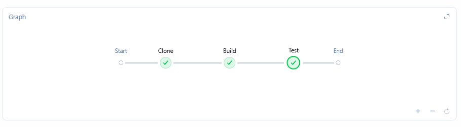
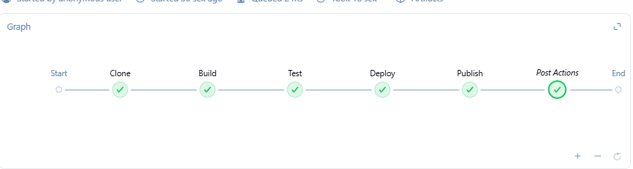
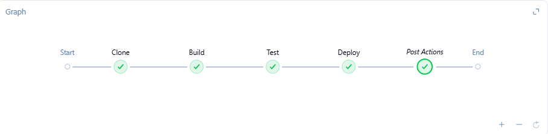
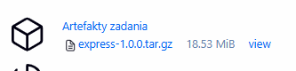

 
# Sprawozdanie 6 - Pipeline: lista kontrolna

---

## Ścieżka krytyczna

| Krok | Status |
|------|--------|
| commit| ✅ |
| clone | ✅ |
| build | ✅ |
| test | ✅ |
| deploy | ✅ |
| publish | ✅ |

---

## Pełna lista kontrolna

### Aplikacja została wybrana
Wybrano framework **Express.js** - popularna biblioteka Node.js do tworzenia aplikacji webowych.
Repozytorium: https://github.com/expressjs/express

### Licencja potwierdza możliwość swobodnego obrotu kodem
Express.js jest objęty licencją **MIT**, która pozwala na swobodne używanie, modyfikowanie i dystrybucję kodu, również na potrzeby zadań akademickich.

### Wybrany program buduje się
Program buduje się poprawnie przy użyciu `npm install`. Zweryfikowano w poprzednich zajęciach.

### Przechodzą dołączone do niego testy
Testy uruchamiane przez `npm test` przechodzą - **1249 testów** zakończonych sukcesem w czasie ~3s.



### Zdecydowano czy jest potrzebny fork własnej kopii repozytorium
Nie wykonano forka - korzystamy bezpośrednio z oficjalnego repozytorium `expressjs/express`. Fork byłby potrzebny gdybyśmy chcieli modyfikować kod źródłowy lub umieścić Jenkinsfile w samym repozytorium projektu. Na potrzeby tego zadania Jenkinsfile umieszczono w repozytorium przedmiotowym.

### Stworzono diagram UML zawierający planowany pomysł na proces CI/CD

#### Diagram aktywności (collect → build → test → deploy → publish)

```
[Start]
   |
   v
[Clone repozytorium]
   |
   v
[Build - docker build lab3-build]
   |
   v
[Test - docker build lab3-test + docker run]
   |         |
   |    [FAIL] --> [Koniec z błędem]
   |
   v
[Deploy - docker run express-deploy]
   |
   v
[Smoke test - curl localhost:3000]
   |
   v
[Publish - tar.gz jako artefakt Jenkins]
   |
   v
[Koniec SUCCESS]
```

#### Wymagania wstępne środowiska
- Docker zainstalowany na hoście
- Jenkins z DIND (Docker-in-Docker)
- Sieć `jenkins` w Dockerze
- Woluminy `jenkins-data` i `jenkins-docker-certs`
- Node.js (dostarczany przez obraz `node:latest`)

#### Diagram wdrożeniowy

```
[Host serwer]
    |
    |-- [jenkins-docker (DIND)] <-- sieć jenkins --> [jenkins-blueocean]
    |         |                                              |
    |    docker daemon                              Jenkins UI :8080
    |         |
    |    [lab3-build] --> [lab3-test] --> [express-deploy]
    |                                          |
    |                                    aplikacja :3000
    |
    |-- [jenkins-data (volume)] -- /var/jenkins_home
    |-- [jenkins-docker-certs (volume)] -- /certs/client
```

### Wybrano kontener bazowy
Wybrano obraz `node:latest` jako kontener bazowy - zawiera Node.js i npm, które są jedynymi zależnościami potrzebnymi do zbudowania i uruchomienia Express.js. Nie ma potrzeby tworzenia osobnego kontenera z zależnościami, ponieważ obraz `node` zawiera już wszystko co potrzebne.

### Build wykonany wewnątrz kontenera
Build wykonano w kontenerze `lab3-build` opartym na obrazie `node:latest`. Kontener klonuje repozytorium Express i instaluje zależności przez `npm install`.

```dockerfile
FROM node:latest
WORKDIR /app
RUN git clone https://github.com/expressjs/express.git .
RUN npm install
```

### Testy wykonane wewnątrz kontenera (kolejnego)
Testy uruchamiane są w osobnym kontenerze `lab3-test`, który bazuje na `lab3-build`:

```dockerfile
FROM lab3-build:latest
RUN npm test
```

### Kontener testowy oparty o kontener build ✅
Jak widać w Dockerfile.test - `FROM lab3-build:latest` - kontener testowy dziedziczy po buildowym.

### Logi z procesu odkładane jako numerowany artefakt
Jenkins automatycznie numeruje każde uruchomienie pipeline'u (#1, #2, #3...) i przechowuje logi każdego buildu. Dodatkowo artefakt `express-1.0.0.tar.gz` jest dołączany do każdego przejścia pipeline'u.



### Zdefiniowano kontener typu deploy
Kontener `express-deploy` uruchamia aplikację Express.js na porcie 3000:

```bash
docker run -d --name express-deploy -p 3000:3000 lab3-build node /app/index.js
```

### Uzasadnienie czy kontener buildowy nadaje się do roli deploy
Kontener buildowy `lab3-build` **nadaje się** do wdrożenia w tym przypadku, ponieważ Express.js jest frameworkiem - nie ma osobnego kroku kompilacji, a `node_modules` są już zainstalowane. Jednak w środowisku produkcyjnym warto byłoby stworzyć osobny, lżejszy obraz oparty na `node:slim` bez narzędzi deweloperskich i testowych, co zmniejszyłoby rozmiar obrazu.

Różnica między `node` a `node-slim`:
- `node` - pełny obraz z narzędziami deweloperskimi (~1.1GB)
- `node-slim` - minimalny obraz tylko z runtime (~250MB), bez npm, git itp.

### Wersjonowany kontener deploy wdrażany na instancję Dockera
Pipeline wdraża kontener na lokalną instancję Dockera (DIND). Wersjonowanie odbywa się przez numer buildu Jenkinsa oraz nazwę artefaktu `express-1.0.0.tar.gz`.



### Smoke test
Po uruchomieniu kontenera deploy wykonywany jest smoke test przez `curl`:

```bash
docker exec express-deploy curl -s http://localhost:3000 || true
```

Weryfikuje to że aplikacja odpowiada na żądania HTTP.

### Zdefiniowano artefakt do publikacji
Artefaktem jest archiwum **tar.gz** zawierające zbudowaną aplikację Express z `node_modules`.

**Uzasadnienie wyboru tar.gz:**
- Express.js to aplikacja Node.js - naturalnym formatem dystrybucji jest archiwum z kodem i zależnościami
- Nie ma sensu tworzyć pakietu DEB/RPM dla aplikacji Node.js
- Obraz Docker byłby alternatywą, ale tar.gz jest prostszy i bardziej przenośny
- Plik JAR/NuGet nie ma zastosowania dla Node.js

### Proces wersjonowania artefaktu
Artefakt wersjonowany jest przez nazwę pliku: `express-1.0.0.tar.gz`. W przyszłości można użyć semantic versioning połączonego z numerem buildu Jenkinsa: `express-1.0.${BUILD_NUMBER}.tar.gz`.

### Dostępność artefaktu w Jenkinsie
Artefakt jest dołączany do każdego przejścia pipeline'u przez `archiveArtifacts`:

```groovy
archiveArtifacts artifacts: 'artifact/express-1.0.0.tar.gz', onlyIfSuccessful: true
```



### Sposób identyfikacji pochodzenia artefaktu
Artefakt można zidentyfikować przez:
- Numer buildu Jenkinsa (widoczny w URL i nazwie)
- Hash commita Git (widoczny w logach pipeline'u)
- Datę i czas buildu

### Pliki Dockerfile i Jenkinsfile

**Dockerfile.build:**
```dockerfile
FROM node:latest
WORKDIR /app
RUN git clone https://github.com/expressjs/express.git .
RUN npm install
```

**Dockerfile.test:**
```dockerfile
FROM lab3-build:latest
RUN npm test
```

**Jenkinsfile:**
```groovy
pipeline {
    agent any
    stages {
        stage('Clone') {
            steps {
                git url: 'https://github.com/InzynieriaOprogramowaniaAGH/MDO2026_ITE.git',
                    branch: 'PS422034'
            }
        }
        stage('Build') {
            steps {
                sh 'docker build -t lab3-build -f PS422034/Sprawozdanie3/lab3/Dockerfile.build .'
            }
        }
        stage('Test') {
            steps {
                sh 'docker build -t lab3-test -f PS422034/Sprawozdanie3/lab3/Dockerfile.test .'
                sh 'docker run --rm lab3-test'
            }
        }
        stage('Deploy') {
            steps {
                sh 'docker rm -f express-deploy || true'
                sh 'docker run -d --name express-deploy -p 3000:3000 lab3-build node /app/index.js'
                sh 'sleep 5'
                sh 'docker exec express-deploy curl -s http://localhost:3000 || true'
            }
        }
        stage('Publish') {
            steps {
                sh 'mkdir -p artifact'
                sh 'docker run --rm -v $(pwd)/artifact:/artifact lab3-build tar -czf /artifact/express-1.0.0.tar.gz -C /app .'
                archiveArtifacts artifacts: 'artifact/express-1.0.0.tar.gz', onlyIfSuccessful: true
            }
        }
    }
    post {
        always {
            sh 'docker rm -f express-deploy || true'
        }
    }
}
```

### Weryfikacja rozbieżności między zaplanowanym UML a efektem
Zaplanowany proces CI/CD pokrywa się z otrzymanym efektem. Pipeline realizuje wszystkie zaplanowane kroki: Clone → Build → Test → Deploy → Publish. Jedyną różnicą jest brak osobnego kontenera runtime (node-slim) dla deploy - użyto kontenera buildowego, co jest uzasadnione dla Express.js.

---
## Historia poleceń
Zrealizowano czyszczenie środowiska Docker z powodu braku wolnego miejsca na serwerze.
```bash
  221  docker ps
  222  docker ps | grep jenkins-docker
  223  docker run --name jenkins-docker --rm --detach   --privileged --network jenkins --network-alias docker   --env DOCKER_TLS_CERTDIR=/certs   --volume jenkins-docker-certs:/certs/client   --volume jenkins-data:/var/jenkins_home   --publish 2376:2376   docker:dind --storage-driver overlay2
  224  docker ps | grep jenkins-docker
  225  docker system prune -a -f
  226  docker volume prune -f
  227  df -h
  228  history
```


---

## Podsumowanie

Zrealizowano kompletny pipeline CI/CD dla aplikacji Express.js obejmujący wszystkie kroki ścieżki krytycznej. Pipeline automatycznie klonuje repozytorium, buduje obraz, uruchamia testy, wdraża aplikację i publikuje artefakt tar.gz dostępny do pobrania z Jenkinsa.
