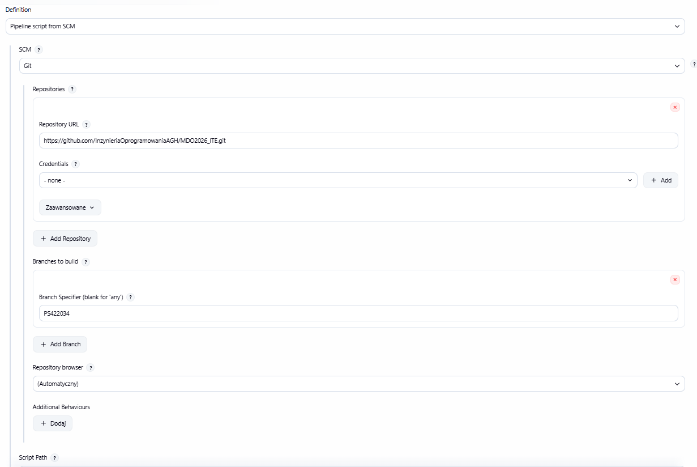
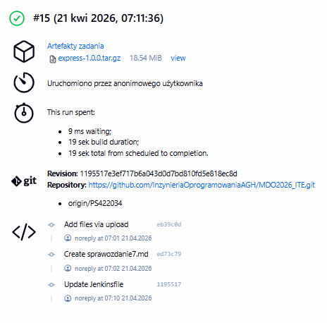
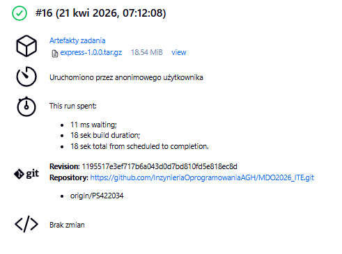
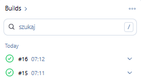
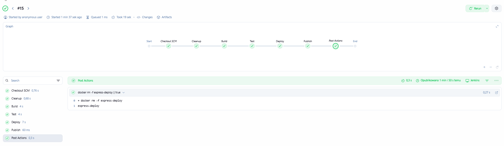
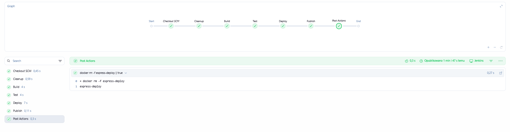

# Sprawozdanie 7 - Jenkinsfile: lista kontrolna

---

## Kroki Jenkinsfile

###  Przepis dostarczany z SCM

Jenkinsfile został umieszczony w repozytorium przedmiotowym pod ścieżką `PS422034/Sprawozdanie7/Jenkinsfile`. Obiekt pipeline w Jenkinsie skonfigurowano jako **Pipeline script from SCM**:

- SCM: Git
- Repository URL: `https://github.com/InzynieriaOprogramowaniaAGH/MDO2026_ITE.git`
- Branch: `PS422034`
- Script Path: `PS422034/Sprawozdanie7/Jenkinsfile`

Dzięki temu Jenkins przy każdym uruchomieniu sam pobiera Jenkinsfile z repozytorium - krok `clone` realizowany jest niejawnie przez mechanizm SCM (widoczny jako `Checkout SCM` w widoku pipeline).



---

###  Posprzątaliśmy - pewność że pracujemy na najnowszym kodzie

Na początku każdego uruchomienia pipeline wykonuje etap `Cleanup`, który usuwa poprzednie kontenery i obrazy Docker:

```groovy
stage('Cleanup') {
    steps {
        sh 'docker rm -f express-deploy || true'
        sh 'docker rmi -f lab3-build lab3-test express-deploy-img || true'
    }
}
```

Usunięcie obrazów przed każdym buildem wymusza pełny rebuild - eliminuje ryzyko pracy na starym cache. Potwierdzeniem skuteczności jest fakt, że pipeline przeszedł pomyślnie dwa razy z rzędu (#15 i #16).

---

###  Etap Build dysponuje repozytorium i plikami Dockerfile

Po `Checkout SCM` workspace zawiera całe repozytorium wraz z plikami Dockerfile pod ścieżką `PS422034/Sprawozdanie3/lab3/`. Etap Build ma do nich pełny dostęp.

---

###  Etap Build tworzy obraz buildowy (BLDR) i przygotowuje artefakt

Obraz `lab3-build` pełni rolę obrazu buildowego (BLDR). W tym samym etapie tworzony jest artefakt `express-1.0.0.tar.gz`:

```groovy
stage('Build') {
    steps {
        sh 'docker build -t lab3-build -f PS422034/Sprawozdanie3/lab3/Dockerfile.build .'
        sh 'mkdir -p artifact'
        sh 'docker run --rm -v $(pwd)/artifact:/artifact lab3-build tar -czf /artifact/express-1.0.0.tar.gz -C /app .'
    }
}
```

**Dockerfile.build:**

```dockerfile
FROM node:latest
WORKDIR /app
RUN git clone https://github.com/expressjs/express.git .
RUN npm install
```

Artefakt `express-1.0.0.tar.gz` zawiera zbudowaną aplikację Express wraz z `node_modules` i stanowi przenośną formę dystrybucji - możliwą do uruchomienia na dowolnej maszynie z Node.js.

---

###  Etap Test przeprowadza testy

Testy uruchamiane są w osobnym kontenerze `lab3-test`, który dziedziczy po `lab3-build`:

```groovy
stage('Test') {
    steps {
        sh 'docker build -t lab3-test -f PS422034/Sprawozdanie3/lab3/Dockerfile.test .'
        sh 'docker run --rm lab3-test'
    }
}
```

**Dockerfile.test:**

```dockerfile
FROM lab3-build:latest
RUN npm test
```

Jeśli którykolwiek test nie przejdzie, `npm test` zwraca kod błędu → pipeline zatrzymuje się i raportuje niepowodzenie. Express.js posiada 1249 testów, wszystkie przechodzą.

---

###  Etap Deploy przygotowuje obraz z entrypointem i przeprowadza wdrożenie

Etap Deploy buduje dedykowany obraz `express-deploy-img` z wbudowanym entrypointem - nie używamy surowego obrazu buildowego z entrypointem podanym ręcznie w `docker run`. Następnie uruchamia kontener i wykonuje smoke test:

```groovy
stage('Deploy') {
    steps {
        sh '''cat > Dockerfile.deploy << DFEOF
FROM lab3-build:latest
EXPOSE 3000
CMD ["node", "/app/index.js"]
DFEOF'''
        sh 'docker build -t express-deploy-img -f Dockerfile.deploy .'
        sh 'docker rm -f express-deploy || true'
        sh 'docker run -d --name express-deploy -p 3000:3000 express-deploy-img'
        sh 'sleep 5'
        sh 'docker exec express-deploy curl -s http://localhost:3000 || true'
    }
}
```

Kontener `express-deploy` pełni rolę środowiska sandboxowego - weryfikuje że aplikacja startuje i odpowiada na żądania HTTP. Po zakończeniu pipeline kontenera sprząta blok `post { always }`.

---

###  Etap Publish dodaje artefakt do historii builda

```groovy
stage('Publish') {
    steps {
        archiveArtifacts artifacts: 'artifact/express-1.0.0.tar.gz', onlyIfSuccessful: true
    }
}
```

Artefakt `express-1.0.0.tar.gz` dołączany jest do każdego udanego przejścia pipeline i dostępny do pobrania z poziomu Jenkinsa.




---

###  Pipeline działa więcej niż jeden raz

Pipeline uruchomiono dwukrotnie - buildy #15 i #16 zakończyły się sukcesem. Etap Cleanup usuwa stare obrazy przed każdym buildem, co zapewnia powtarzalność bez polegania na cache.



---

## Kompletny Jenkinsfile

```groovy
pipeline {
    agent any
    stages {
        stage('Cleanup') {
            steps {
                sh 'docker rm -f express-deploy || true'
                sh 'docker rmi -f lab3-build lab3-test express-deploy-img || true'
            }
        }
        stage('Build') {
            steps {
                sh 'docker build -t lab3-build -f PS422034/Sprawozdanie3/lab3/Dockerfile.build .'
                sh 'mkdir -p artifact'
                sh 'docker run --rm -v $(pwd)/artifact:/artifact lab3-build tar -czf /artifact/express-1.0.0.tar.gz -C /app .'
            }
        }
        stage('Test') {
            steps {
                sh 'docker build -t lab3-test -f PS422034/Sprawozdanie3/lab3/Dockerfile.test .'
                sh 'docker run --rm lab3-test'
            }
        }
        stage('Deploy') {
            steps {
                sh '''cat > Dockerfile.deploy << DFEOF
FROM lab3-build:latest
EXPOSE 3000
CMD ["node", "/app/index.js"]
DFEOF'''
                sh 'docker build -t express-deploy-img -f Dockerfile.deploy .'
                sh 'docker rm -f express-deploy || true'
                sh 'docker run -d --name express-deploy -p 3000:3000 express-deploy-img'
                sh 'sleep 5'
                sh 'docker exec express-deploy curl -s http://localhost:3000 || true'
            }
        }
        stage('Publish') {
            steps {
                archiveArtifacts artifacts: 'artifact/express-1.0.0.tar.gz', onlyIfSuccessful: true
            }
        }
    }
    post {
        always {
            sh 'docker rm -f express-deploy || true'
        }
    }
}
```

---

## Definition of Done

### Czy artefakt może zadziałać na maszynie docelowej?

Artefakt `express-1.0.0.tar.gz` zawiera kod źródłowy Express wraz z zainstalowanymi zależnościami (`node_modules`). Aby uruchomić aplikację na maszynie docelowej wystarczy:

```bash
tar -xzf express-1.0.0.tar.gz -C /app
node /app/index.js
```

Warunkiem jest posiadanie Node.js w odpowiedniej wersji na maszynie docelowej.

### Czy obraz może być pobrany z Rejestru?

W obecnej konfiguracji obraz `express-deploy-img` dostępny jest lokalnie w DIND. Nie jest pushowany do zewnętrznego rejestru - artefakt tar.gz pełni rolę przenośnej formy dystrybucji dostępnej bezpośrednio z Jenkinsa. W środowisku produkcyjnym kolejnym krokiem byłoby opublikowanie obrazu do Docker Hub lub prywatnego rejestru.




---

## Podsumowanie

Zrealizowano kompletny pipeline CI/CD z Jenkinsfile przechowywanym w repozytorium SCM. Pipeline pokrywa całą ścieżkę krytyczną: Cleanup → Build  → Test → Deploy → Publish. Powtarzalność potwierdzona przez buildy #15 i #16.
