# Sprawozdanie - PS422034
## Zajęcia 08: Automatyzacja i zdalne wykonywanie poleceń za pomocą Ansible

---

## 1. Instalacja zarządcy Ansible

### Druga maszyna wirtualna

Utworzono drugą maszynę wirtualną z systemem Ubuntu 25.10 (taki sam system jak maszyna główna) z minimalnym zestawem oprogramowania. Podczas instalacji:
- nadano hostname `ansible-target` poleceniem `hostnamectl set-hostname ansible-target`
- utworzono użytkownika `ansible`
- zainstalowano `openssh-server` oraz `tar`

Wykonano migawkę maszyny przed dalszą konfiguracją.

### Instalacja Ansible na głównej maszynie

Na maszynie głównej (`devops-serwer`) zainstalowano Ansible z repozytorium dystrybucji:

```bash
sudo apt update
sudo apt install -y ansible
ansible --version
```

### Wymiana kluczy SSH

Wygenerowano klucz SSH i skopiowano go do użytkownika `ansible` na maszynie docelowej:

```bash
ssh-keygen -t ed25519 -C "ansible"
ssh-copy-id ansible@ansible-target
```

Zweryfikowano logowanie bez hasła:

```bash
ssh ansible@ansible-target
```

---

## 2. Inwentaryzacja

### Nazwy DNS i /etc/hosts

Aby umożliwić wywoływanie maszyn po nazwach zamiast adresów IP, dodano wpis do `/etc/hosts` na maszynie głównej:

```bash
echo "172.28.25.228 ansible-target" | sudo tee -a /etc/hosts
```

Dzięki temu możliwe jest połączenie `ssh ansible@ansible-target` bez podawania adresu IP.

### Plik inwentaryzacji

Stworzono plik `inventory.ini` z sekcjami `Orchestrators` (maszyna główna) oraz `Endpoints` (maszyna docelowa):

```ini
[Orchestrators]
localhost ansible_connection=local

[Endpoints]
ansible-target ansible_user=ansible
```

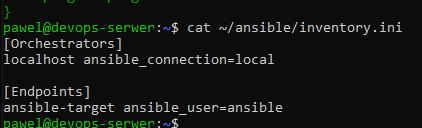

### Weryfikacja łączności - ping do wszystkich maszyn

```bash
ansible all -i ~/ansible/inventory.ini -m ping
```

Obie maszyny odpowiedziały `pong`, potwierdzając poprawną konfigurację:

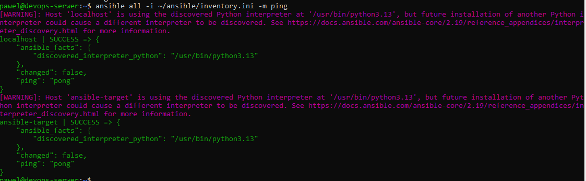

---

## 3. Zdalne wywoływanie procedur

### Playbook

Zdefiniowano plik `playbook.yml` realizujący następujące zadania:
- ping do wszystkich maszyn
- kopiowanie pliku `inventory.ini` na maszynę `Endpoints`
- aktualizacja pakietów systemowych (`apt upgrade`)
- restart usług `sshd` i `rngd`

```yaml
---
- name: Ping wszystkich
  hosts: all
  tasks:
    - name: Ping
      ansible.builtin.ping:

- name: Kopiuj inventory na Endpoints
  hosts: Endpoints
  tasks:
    - name: Kopiuj plik inventory
      ansible.builtin.copy:
        src: /home/pawel/ansible/inventory.ini
        dest: /home/ansible/inventory.ini
        owner: ansible
        mode: '0644'

- name: Aktualizuj pakiety na Endpoints
  hosts: Endpoints
  become: true
  tasks:
    - name: apt update + upgrade
      ansible.builtin.apt:
        update_cache: yes
        upgrade: dist

- name: Restart usług
  hosts: Endpoints
  become: true
  tasks:
    - name: Restart sshd
      ansible.builtin.service:
        name: ssh
        state: restarted

    - name: Restart rngd (ignoruj błąd jeśli brak)
      ansible.builtin.service:
        name: rngd
        state: restarted
      ignore_errors: true
```

Aby umożliwić użytkownikowi `ansible` wykonywanie poleceń z `sudo` bez hasła, dodano odpowiedni wpis w `sudoers` na maszynie `ansible-target`:

```bash
echo "ansible ALL=(ALL) NOPASSWD: ALL" | sudo tee /etc/sudoers.d/ansible
```

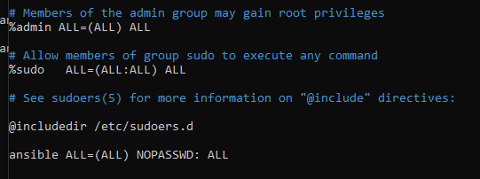

### Pierwsze uruchomienie playbooka

```bash
ansible-playbook -i ~/ansible/inventory.ini ~/ansible/playbook.yml
```

Przy pierwszym uruchomieniu zadanie kopiowania inventory oraz aktualizacji pakietów pokazało `changed`, potwierdzając wykonanie zmian. Usługa `rngd` nie istnieje na tej maszynie - błąd był świadomie ignorowany (`ignore_errors: true`).

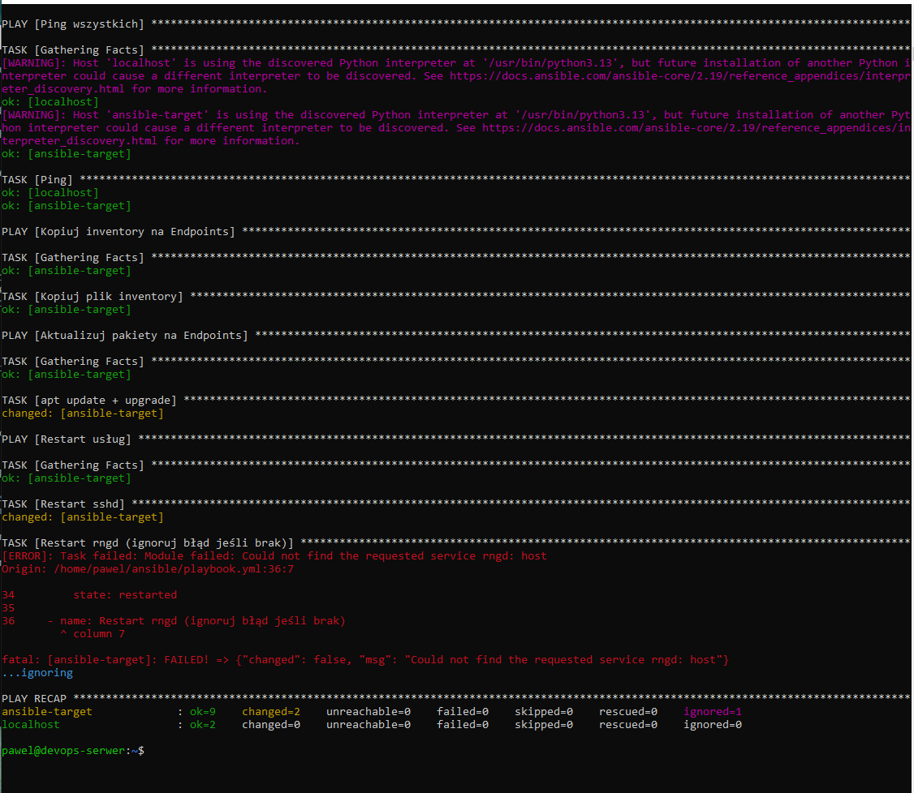

### Drugie uruchomienie - idempotentność

Po ponownym uruchomieniu tego samego playbooka zadanie `Kopiuj plik inventory` zwróciło `ok` zamiast `changed`, co demonstruje kluczową właściwość Ansible - **idempotentność**: wielokrotne wykonanie tego samego playbooka daje ten sam efekt końcowy bez zbędnych zmian.

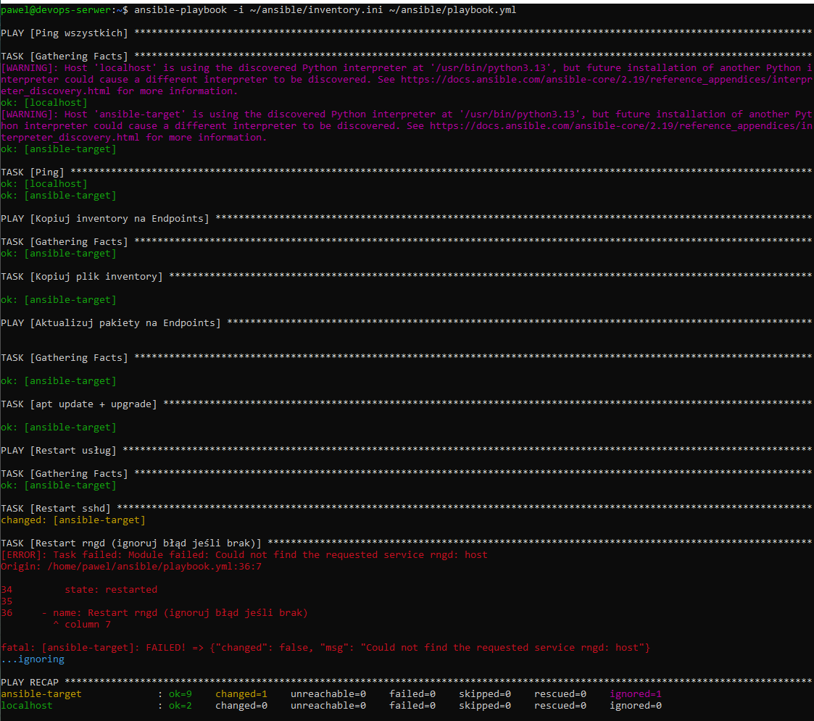

### Operacje przy wyłączonym SSH

Zatrzymano serwer SSH na maszynie `ansible-target`:

```bash
sudo systemctl stop ssh
```

Uruchomiono playbook - Ansible wykonał zadania korzystając z istniejącego połączenia, a następnie zrestartował usługę `sshd` (`changed`), przywracając dostęp SSH.

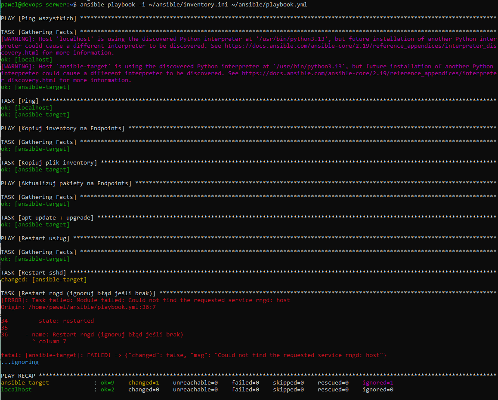

---

## 4. Zarządzanie artefaktem

Artefaktem z pipeline'u (zajęcia 5-7) było archiwum `express-1.0.0.tar.gz` zawierające framework Express.js wraz z zależnościami (`node_modules`). Artefakt skopiowano z Jenkinsa na maszynę główną:

```bash
docker cp jenkins-blueocean:/var/jenkins_home/jobs/pipeline-project/builds/16/archive/artifact/express-1.0.0.tar.gz ~/ansible/
```

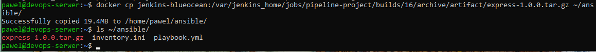

### Playbook wdrożeniowy

Zdefiniowano plik `deploy.yml` realizujący:
1. **Sanity check** - weryfikację czy Docker jest dostępny, instalację jeśli brak
2. **Wdrożenie** - wysłanie artefaktu, zbudowanie obrazu Docker, uruchomienie kontenera
3. **Smoke test** - weryfikację że aplikacja odpowiada na porcie 3000
4. **Czyszczenie** - zatrzymanie i usunięcie kontenera oraz obrazu

```yaml
---
- name: Sanity check i instalacja Dockera
  hosts: Endpoints
  become: true
  tasks:
    - name: Sprawdź czy Docker działa
      ansible.builtin.command: docker info
      register: docker_check
      ignore_errors: true

    - name: Zainstaluj Docker jeśli brak
      ansible.builtin.apt:
        name: docker.io
        state: present
        update_cache: yes
      when: docker_check.rc != 0

    - name: Uruchom Docker
      ansible.builtin.service:
        name: docker
        state: started
        enabled: true

- name: Wyślij artefakt i uruchom aplikację
  hosts: Endpoints
  become: true
  tasks:
    - name: Utwórz katalog aplikacji
      ansible.builtin.file:
        path: /opt/express-app
        state: directory
        mode: '0755'

    - name: Wyślij artefakt tar.gz
      ansible.builtin.copy:
        src: /home/pawel/ansible/express-1.0.0.tar.gz
        dest: /opt/express-app/express-1.0.0.tar.gz

    - name: Stwórz Dockerfile
      ansible.builtin.copy:
        dest: /opt/express-app/Dockerfile
        content: |
          FROM node:latest
          WORKDIR /app
          COPY express-1.0.0.tar.gz /app/
          RUN tar -xzf express-1.0.0.tar.gz -C /app
          RUN echo "const express = require('/app'); const app = express(); app.get('/', (req,res) => res.send('OK')); app.listen(3000);" > /app/server.js
          EXPOSE 3000
          CMD ["node", "/app/server.js"]

    - name: Usuń stary obraz żeby przebudować
      ansible.builtin.shell: docker rmi -f express-runtime || true

    - name: Zbuduj obraz Docker
      ansible.builtin.shell: docker build -t express-runtime /opt/express-app/

    - name: Zatrzymaj stary kontener jeśli istnieje
      ansible.builtin.shell: docker rm -f express-app || true

    - name: Uruchom kontener
      ansible.builtin.shell: docker run -d --name express-app -p 3000:3000 express-runtime

    - name: Smoke test
      ansible.builtin.shell: sleep 5 && docker exec express-app curl -s http://localhost:3000
      register: smoke
      ignore_errors: true

    - name: Wynik smoke testu
      ansible.builtin.debug:
        var: smoke.stdout

- name: Oczyść środowisko
  hosts: Endpoints
  become: true
  tasks:
    - name: Zatrzymaj i usuń kontener
      ansible.builtin.shell: docker rm -f express-app || true

    - name: Usuń obraz
      ansible.builtin.shell: docker rmi -f express-runtime || true
```

Wynik działania playbooka - smoke test zwrócił `"smoke.stdout": "OK"`, potwierdzając poprawne uruchomienie aplikacji:

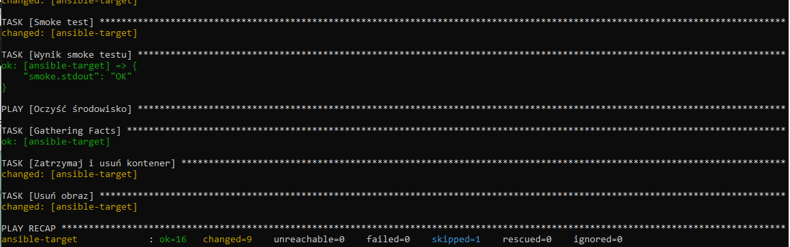

---

## 5. Rola Ansible

### Szkieletowanie roli

Strukturę roli wygenerowano za pomocą `ansible-galaxy`:

```bash
cd ~/ansible
ansible-galaxy role init express_deploy
```

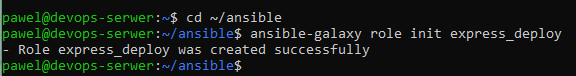

Polecenie automatycznie utworzyło strukturę katalogów:
```
roles/express_deploy/
├── defaults/
├── files/
├── handlers/
├── meta/
├── tasks/
├── templates/
├── tests/
└── vars/
```

### Wypełnienie meta/main.yml

```yaml
galaxy_info:
  author: PS422034
  description: Deploy Express.js app from tar.gz artifact
  license: MIT
  min_ansible_version: "2.9"
  platforms:
    - name: Ubuntu
      versions:
        - jammy
        - noble
dependencies: []
```

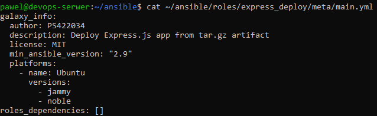

### tasks/main.yml

Do pliku `tasks/main.yml` przeniesiono wszystkie kroki z `deploy.yml`: sanity check Dockera, instalację jeśli brak, wysłanie artefaktu, budowanie obrazu, uruchomienie kontenera, smoke test oraz czyszczenie środowiska.

### Uruchomienie roli przez site.yml

```yaml
---
- name: Deploy Express App via rola
  hosts: Endpoints
  roles:
    - express_deploy
```

```bash
ansible-playbook -i ~/ansible/inventory.ini ~/ansible/site.yml
```

Rola wykonała się poprawnie - smoke test zwrócił `"smoke.stdout": "OK"`, środowisko zostało posprzątane po zakończeniu:

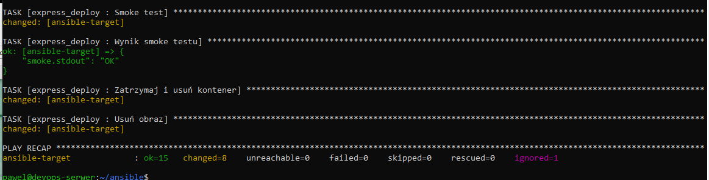

---

## Struktura plików w repozytorium

```
PS422034/Sprawozdanie8/
├── inventory.ini
├── playbook.yml
├── deploy.yml
├── site.yml
└── roles/
    └── express_deploy/
        ├── meta/
        │   └── main.yml
        └── tasks/
            └── main.yml
```

---

## Wnioski

Realizacja zajęć pozwoliła na praktyczne zapoznanie się z narzędziem Ansible jako systemem automatyzacji zarządzania konfiguracją:

1. **Idempotentność** - kluczowa cecha Ansible: wielokrotne uruchomienie tego samego playbooka daje identyczny efekt końcowy, co widać po porównaniu pierwszego i drugiego uruchomienia (`changed` vs `ok`).
2. **Agentless** - Ansible nie wymaga instalacji agenta na maszynach docelowych, komunikuje się wyłącznie przez SSH.
3. **Sanity check** - zastosowanie `ignore_errors: true` przy weryfikacji Dockera pozwala na warunkową instalację bez przerywania playbooka.
4. **Role** - mechanizm ról pozwala na wielokrotne użycie i dystrybucję zestawów tasków, co znacznie ułatwia utrzymanie i skalowanie infrastruktury jako kodu.
5. **Automatyzacja wdrożenia artefaktu** - cały proces: wysłanie artefaktu, instalacja zależności, uruchomienie kontenera i smoke test odbywa się w pełni automatycznie jednym poleceniem `ansible-playbook`.


---


## Historia


```bash
  394  ansible all -i inventory.ini -m ping
  395  ssh-keygen -R ansible-target
  396  ssh-keygen -R 172.28.25.228
  397  ssh ansible@ansible-target
  398  cd ..
  399  sudo sed -i '/ansible-target/d' /etc/hosts
  400  ssh-keygen -R ansible-target
  401  ssh-keygen -R 172.28.25.228
  402  ssh-copy-id ansible@ansible-target
  403  ssh ansible@ansible-target
  404  echo "172.28.25.228 ansible-target" | sudo tee -a /etc/hosts
  405  cat /etc/hosts | grep ansible
  406  ssh-copy-id ansible@ansible-target
  407  ssh ansible@ansible-target
  408  ansible all -i ~/ansible/inventory.ini -m ping
  409  cat ~/ansible/inventory.ini
  410  ansible-playbook -i ~/ansible/inventory.ini ~/ansible/playbook.yml
  411  cat > ~/ansible/playbook.yml << 'EOF'
---
- name: Ping wszystkich
  hosts: all
  tasks:
    - name: Ping
      ansible.builtin.ping:

- name: Kopiuj inventory na Endpoints
  hosts: Endpoints
  tasks:
    - name: Kopiuj plik inventory
      ansible.builtin.copy:
        src: /home/pawel/ansible/inventory.ini
        dest: /home/ansible/inventory.ini
        owner: ansible
        mode: '0644'

- name: Aktualizuj pakiety na Endpoints
  hosts: Endpoints
  become: true
  tasks:
    - name: apt update + upgrade
      ansible.builtin.apt:
        update_cache: yes
        upgrade: dist

- name: Restart usług
  hosts: Endpoints
  become: true
  tasks:
    - name: Restart sshd
      ansible.builtin.service:
        name: ssh
        state: restarted

    - name: Restart rngd (ignoruj błąd jeśli brak)
      ansible.builtin.service:
        name: rngd
        state: restarted
      ignore_errors: true
EOF

  412  ansible-playbook -i ~/ansible/inventory.ini ~/ansible/playbook.yml
  413  ssh ansible@ansible-target
  414  ansible-playbook -i ~/ansible/inventory.ini ~/ansible/playbook.yml
  415  ssh ansible@ansible-target
  416  ansible-playbook -i ~/ansible/inventory.ini ~/ansible/playbook.yml
  417  ssh ansible@ansible-target
  418  ansible-playbook -i ~/ansible/inventory.ini ~/ansible/playbook.yml
  419  ssh ansible@ansible-target
  420  ls
  421  cd express/
  422  ls
  423  docker exec jenkins-blueocean ls /var/jenkins_home/jobs/
  424  cd
  425  docker exec jenkins-blueocean ls /var/jenkins_home/jobs/pipeline-project/builds/lastSuccessfulBuild/archive/artifact/
  426  docker exec jenkins-blueocean ls /var/jenkins_home/jobs/
  427  docker exec jenkins-blueocean ls /var/jenkins_home/jobs/pipeline-project/builds/
  428  docker exec jenkins-blueocean ls /var/jenkins_home/jobs/pipeline-project/builds/lastSuccessfulBuild/archive/artifact/
  429  docker exec jenkins-blueocean ls /var/jenkins_home/jobs/pipeline-project/workspace/artifact/
  430  docker exec jenkins-blueocean find /var/jenkins_home/jobs/pipeline-project -name "express-1.0.0.tar.gz" 2>/dev/null
  431  docker cp jenkins-blueocean:/var/jenkins_home/jobs/pipeline-project/builds/16/archive/artifact/express-1.0.0.tar.gz ~/ansible/
  432  ls ~/ansible/
  433  cat > ~/ansible/deploy.yml
  451  cat > ~/ansible/roles/express_deploy/tasks/main.yml

  453  cat ~/ansible/roles/express_deploy/meta/main.yml
  454  ansible-playbook -i ~/ansible/inventory.ini ~/ansible/site.yml
  455  cat > ~/ansible/roles/express_deploy/tasks/main.yml

  456  cat > ~/ansible/site.yml 


  459  ansible-playbook -i ~/ansible/inventory.ini ~/ansible/site.yml
  460  find ~/ansible/roles/express_deploy -type f
  461  cd ..
  462  cd MDO2026_ITE/
  463  CD PS422034/
  464  cd PS422034/
  465  git pull
  466  ls
  467  mkdir Sprawozdanie8
  468  cp -r ~/ansible/roles ~/MDO2026_ITE/PS422034/Sprawozdanie8/
  469  cp ~/ansible/inventory.ini ~/MDO2026_ITE/PS422034/Sprawozdanie8/
  470  cp ~/ansible/playbook.yml ~/MDO2026_ITE/PS422034/Sprawozdanie8/
  471  cp ~/ansible/deploy.yml ~/MDO2026_ITE/PS422034/Sprawozdanie8/
  472  cp ~/ansible/site.yml ~/MDO2026_ITE/PS422034/Sprawozdanie8/
  473  cd Sprawozdanie8
  474  ls
  475  cd roles
  476  ls
  477  cd ..
  478  git add .
  479  git commit -m "sktruktura Sprawozdanie 8"
  480  git commit -m "PS422034 struktura Sprawozdanie 8"
  481  git push origin PS422034
  482  git pull origin PS422034 --rebase
  483  git push origin PS422034
  484  gir branch
  485  git branch
  486  cd ..
  487  git branch
  488  git push origin PS422034
  489  cd..
  490  shitory
  491  history
