# Sprawozdanie - PS422034
## Zajęcia 09: Pliki odpowiedzi dla wdrożeń nienadzorowanych

---

## 1. Cel zadania

Celem zajęć było przygotowanie pliku odpowiedzi (Kickstart) umożliwiającego w pełni automatyczną instalację systemu Fedora, który po uruchomieniu automatycznie hostuje aplikację Express.js w kontenerze Docker.

---

## 2. Pierwsza instalacja Fedory

Zainstalowano system **Fedora 42 Server** na maszynie wirtualnej Hyper-V.

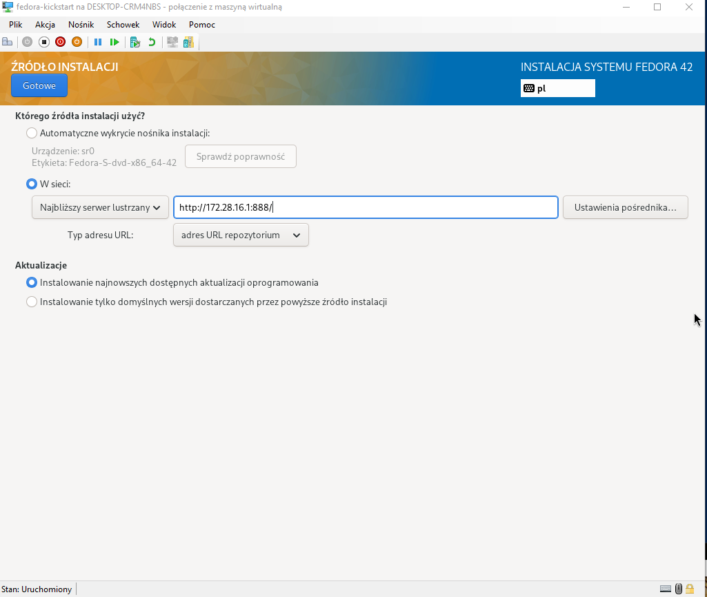

Po instalacji skonfigurowano dostęp przez GUI i zalogowano się jako root:

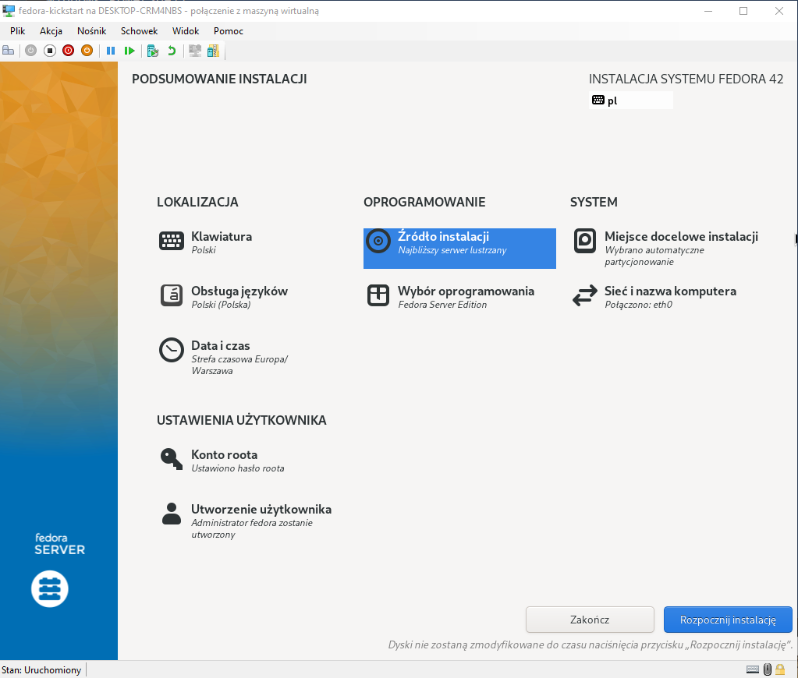

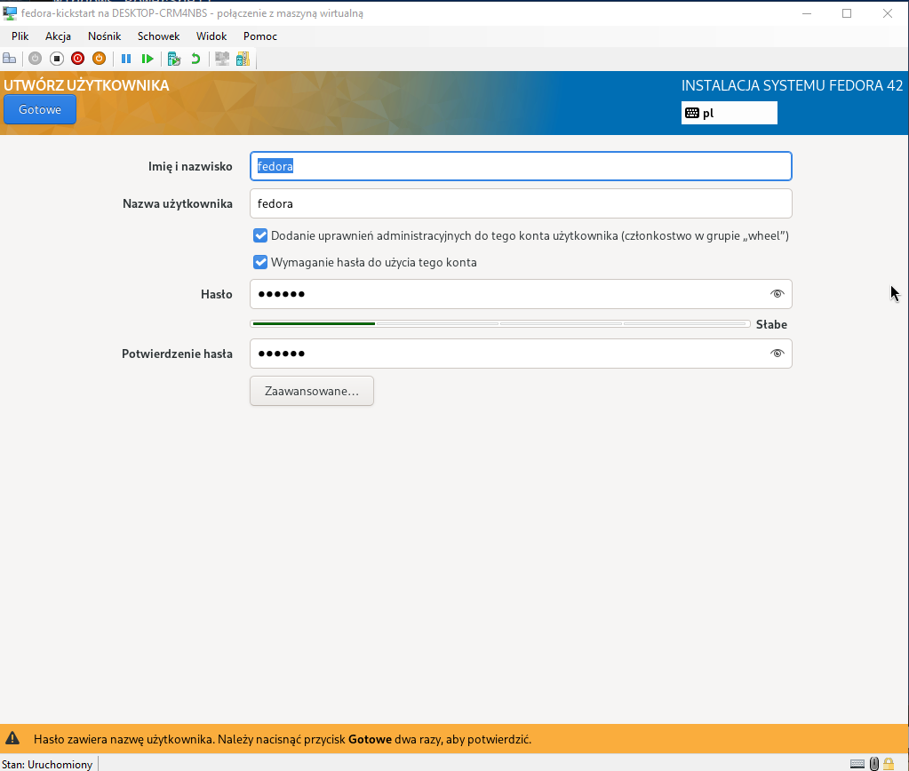

System zainstalował się poprawnie:

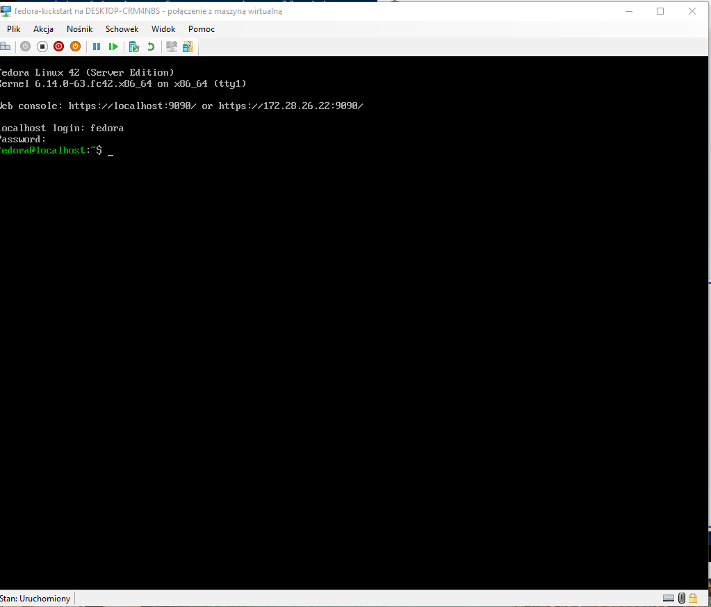

---

## 3. Plik anaconda-ks.cfg

Po instalacji instalator Anaconda wygenerował plik `/root/anaconda-ks.cfg` zawierający zapis wszystkich wyborów dokonanych podczas instalacji. Plik ten stanowi punkt wyjścia do przygotowania własnego pliku odpowiedzi.

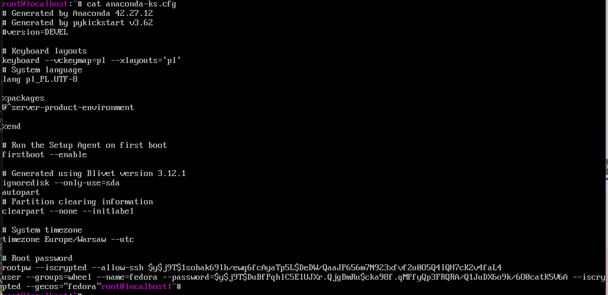

Zawartość oryginalnego pliku:

```
# Generated by Anaconda 42.27.12
# Generated by pykickstart v3.62
#version=DEVEL

keyboard --vckeymap=pl --xlayouts='pl'
lang pl_PL.UTF-8

%packages
@^server-product-environment
%end

firstboot --enable
ignoredisk --only-use=sda
autopart
clearpart --none --initlabel
timezone Europe/Warsaw --utc
rootpw --iscrypted ...
user --groups=wheel --name=fedora ...
```

---

## 4. Modyfikacja pliku odpowiedzi

Na podstawie wygenerowanego pliku przygotowano zmodyfikowany plik `ks-modified.cfg` z następującymi zmianami:

- dodano repozytoria sieciowe Fedory 42
- zmieniono `clearpart --none` na `clearpart --all --initlabel` (zawsze formatuje dysk)
- ustawiono hostname `fedora-ps422034` zamiast domyślnego `localhost`
- dodano pakiety `docker`, `curl`, `wget`
- dodano sekcję `%post` instalującą i konfigurującą Docker oraz serwis systemd uruchamiający aplikację
- dodano `reboot` na końcu instalacji
- dodano `exec > /dev/tty3 2>&1` w sekcji `%post` aby logi były widoczne na ekranie (zakres rozszerzony)

```
# Instalacja nienadzorowana Fedora 42 - PS422034
text
reboot

url --mirrorlist=http://mirrors.fedoraproject.org/mirrorlist?repo=fedora-42&arch=x86_64
repo --name=updates --mirrorlist=http://mirrors.fedoraproject.org/mirrorlist?repo=updates-released-f42&arch=x86_64

lang pl_PL.UTF-8
keyboard --vckeymap=pl --xlayouts=pl
timezone Europe/Warsaw --utc

network --bootproto=dhcp --device=eth0 --onboot=yes
network --hostname=fedora-ps422034

rootpw --plaintext rootpass123
user --name=student --password=student123 --plaintext --groups=wheel

clearpart --all --initlabel
autopart

%packages
@^minimal-environment
docker
curl
wget
%end

%post --log=/root/ks-post.log
exec > /dev/tty3 2>&1
echo "=== Wlaczanie Docker ==="
systemctl enable docker

cat > /usr/local/bin/start-express.sh << 'SCRIPT'
#!/bin/bash
docker rm -f express-app || true
docker run -d --name express-app --restart=always -p 3000:3000 node:latest \
  sh -c "mkdir -p /app && cd /app && npm init -y && npm install express && \
  node -e \"const express=require('express'); const app=express(); \
  app.get('/',(req,res)=>res.send('OK')); app.listen(3000);\""
SCRIPT

chmod +x /usr/local/bin/start-express.sh

cat > /etc/systemd/system/express-app.service << 'SERVICE'
[Unit]
Description=Express App
After=docker.service network-online.target
Requires=docker.service

[Service]
ExecStart=/usr/local/bin/start-express.sh
Restart=on-failure
RemainAfterExit=yes

[Install]
WantedBy=multi-user.target
SERVICE

systemctl enable express-app.service
echo "=== Post-instalacja zakonczona ==="
%end
```

Sekcja `%post` zawiera dyrektywę `exec > /dev/tty3 2>&1`, dzięki której wszystkie komunikaty z etapu post-instalacji są przekierowywane na terminal TTY3 i widoczne na ekranie podczas instalacji.

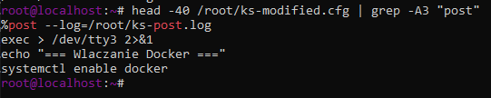

---

## 5. Udostępnienie pliku odpowiedzi przez HTTP

Plik `ks-modified.cfg` udostępniono przez prosty serwer HTTP uruchomiony na pierwszej Fedorze:

```bash
firewall-cmd --add-port=8888/tcp --permanent
firewall-cmd --reload
cd /root
python3 -m http.server 8888 &
```

Plik był dostępny pod adresem `http://172.28.26.22:8888/ks-modified.cfg`. Poprawność dostępu zweryfikowano z poziomu Windowsa poleceniem `Invoke-WebRequest`.

---

## 6. Instalacja nienadzorowana - wskazanie pliku odpowiedzi w GRUBie

Utworzono nową maszynę wirtualną `fedora-kickstart2` w Hyper-V i uruchomiono ją z tego samego ISO Fedory 42. Podczas bootowania wciśnięto `e` w menu GRUB, aby edytować parametry uruchomienia. Na końcu linii `linuxefi` dopisano parametr wskazujący plik odpowiedzi:

```
inst.ks=http://172.28.26.22:8888/ks-modified.cfg
```

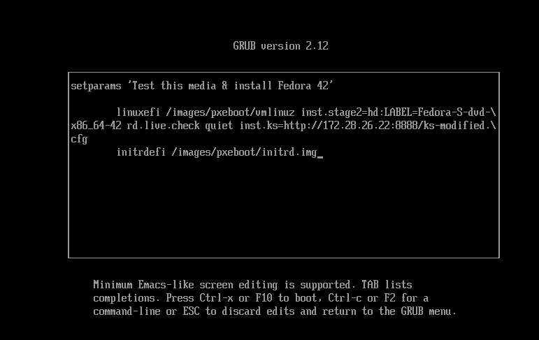

Po zatwierdzeniu przez `Ctrl+X` instalator automatycznie pobrał plik odpowiedzi i rozpoczął instalację nienadzorowaną bez żadnej interakcji użytkownika.

---

## 7. Przebieg instalacji nienadzorowanej

Instalacja przebiegła w pełni automatycznie - Anaconda pobrała pakiety z repozytoriów sieciowych i zainstalowała system zgodnie z plikiem odpowiedzi.

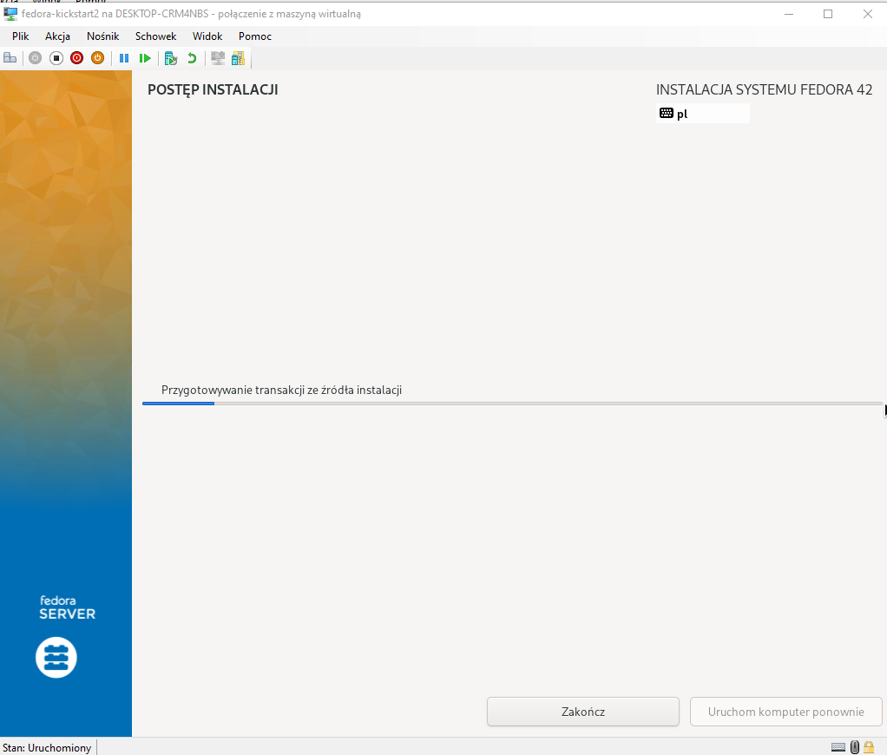

Po zakończeniu system automatycznie uruchomił się ponownie (dyrektywa `reboot` w pliku odpowiedzi). Hostname został ustawiony na `fedora-ps422034` zgodnie z plikiem kickstart - nie `localhost`:

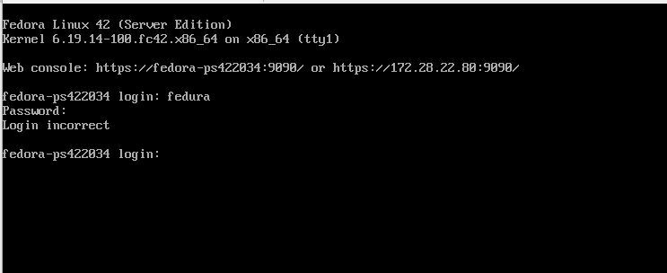

---

## 8. Weryfikacja po instalacji

### Docker

Po zalogowaniu jako root sprawdzono status Dockera:

```bash
systemctl status docker
```

Docker był automatycznie włączony (`enabled`) i uruchomiony (`active (running)`) - zgodnie z konfiguracją z sekcji `%post`.

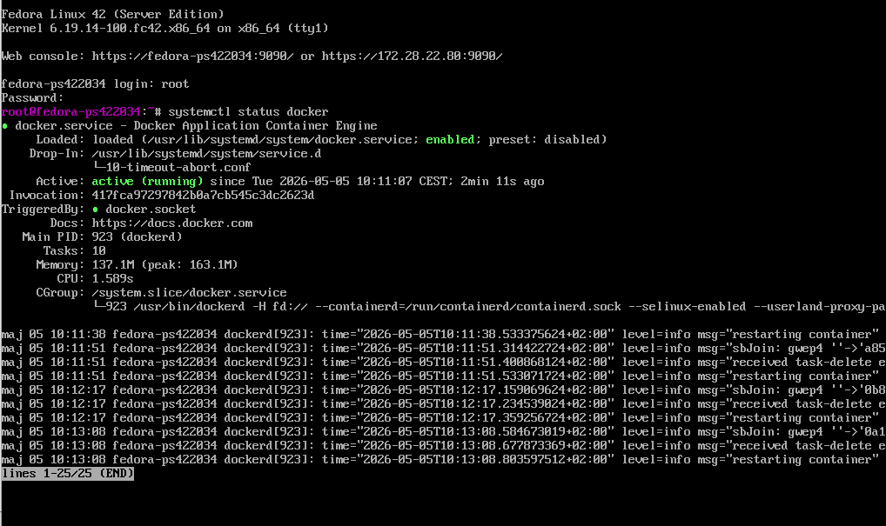

### Serwis express-app

Serwis `express-app.service` zdefiniowany w sekcji `%post` uruchomił się automatycznie po starcie systemu i pobrał obraz `node:latest` z Docker Hub.

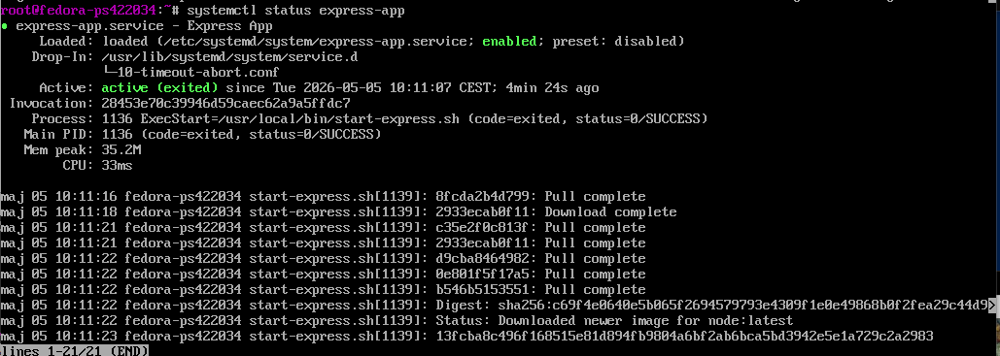

### Kontener

```bash
docker ps
```

Kontener `express-app` działał poprawnie ze statusem `Up`:

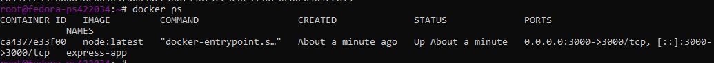

### Smoke test

```bash
curl http://localhost:3000
```

Aplikacja odpowiedziała `OK`, potwierdzając poprawne działanie:

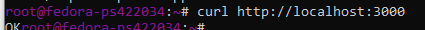

---

## 9. Zakres rozszerzony

### Logi %post na ekranie

W pliku odpowiedzi dodano dyrektywę `exec > /dev/tty3 2>&1` na początku sekcji `%post`, dzięki czemu wszystkie komunikaty z etapu post-instalacji były widoczne na terminalu TTY3 podczas instalacji.


### Wskazanie pliku odpowiedzi w sieci

Plik odpowiedzi był hostowany na serwerze HTTP i wskazany instalatorowi przez parametr `inst.ks=http://...` w GRUBie - nośnik instalacyjny wskazuje na plik odpowiedzi w sieci.


### Automatyzacja Hyper-V przez cmdlety PowerShell

Maszynę wirtualną `fedora-kickstart2` utworzono i zarządzano nią przy użyciu cmdletów Hyper-V w PowerShell. Weryfikacja:

```powershell
Get-VM -Name "fedora-kickstart2" | Select-Object Name, State, MemoryAssigned, ProcessorCount
```

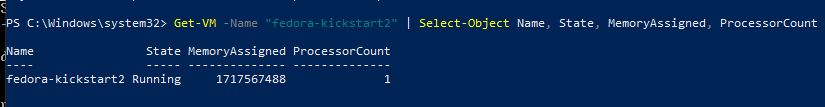

### Dowód działania systemu z aplikacją

Na zainstalowanym systemie wykonano weryfikację:

```bash
hostname
docker ps
curl http://localhost:3000
```

Wyniki potwierdzają że:
- hostname to `fedora-ps422034` (nie `localhost`)
- kontener `express-app` działa
- aplikacja odpowiada `OK` na porcie 3000

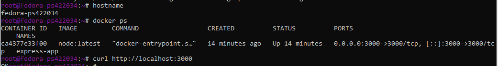

---

## 10. Wnioski

1. **Plik Kickstart** pozwala na w pełni automatyczną instalację systemu bez jakiejkolwiek interakcji użytkownika - wystarczy wskazać plik odpowiedzi parametrem `inst.ks=` w GRUBie.
2. **Sekcja `%post`** umożliwia wykonanie dowolnych poleceń po instalacji - w tym konfigurację Dockera i serwisów systemd. Ważne ograniczenie: `docker run` nie zadziała na etapie `%post` bo daemon nie jest uruchomiony, natomiast `systemctl enable` działa poprawnie.
3. **`clearpart --all`** gwarantuje że instalacja zawsze formatuje cały dysk, niezależnie od poprzedniej zawartości.
4. **Serwis systemd** (`express-app.service`) z `After=docker.service` zapewnia że aplikacja uruchomi się automatycznie po każdym starcie systemu, dopiero gdy Docker będzie gotowy.
5. Podejście z hostowaniem pliku odpowiedzi przez HTTP jest elastyczne - umożliwia aktualizację pliku bez modyfikacji nośnika instalacyjnego.
