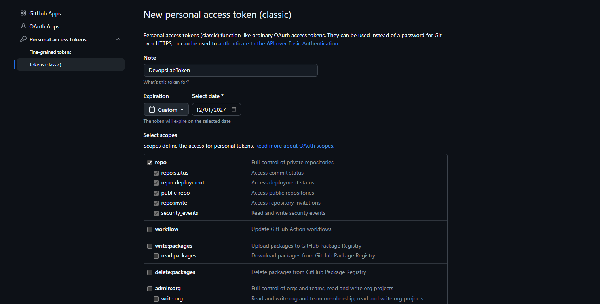
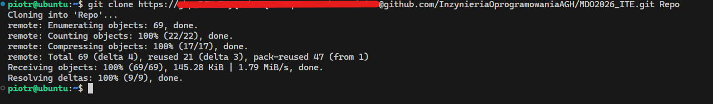
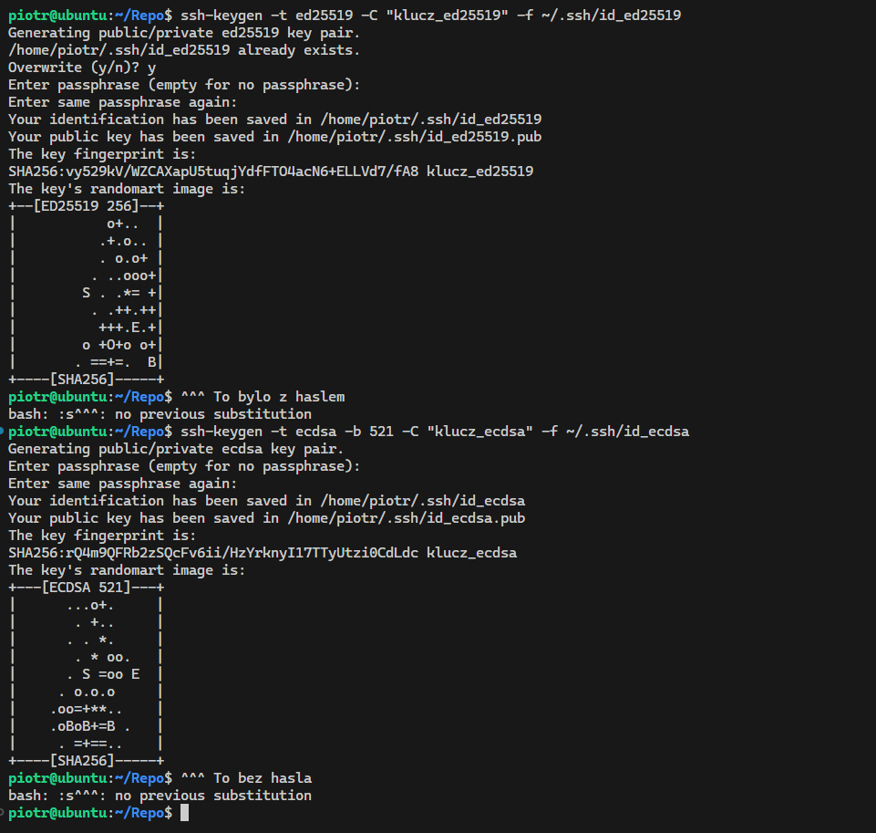
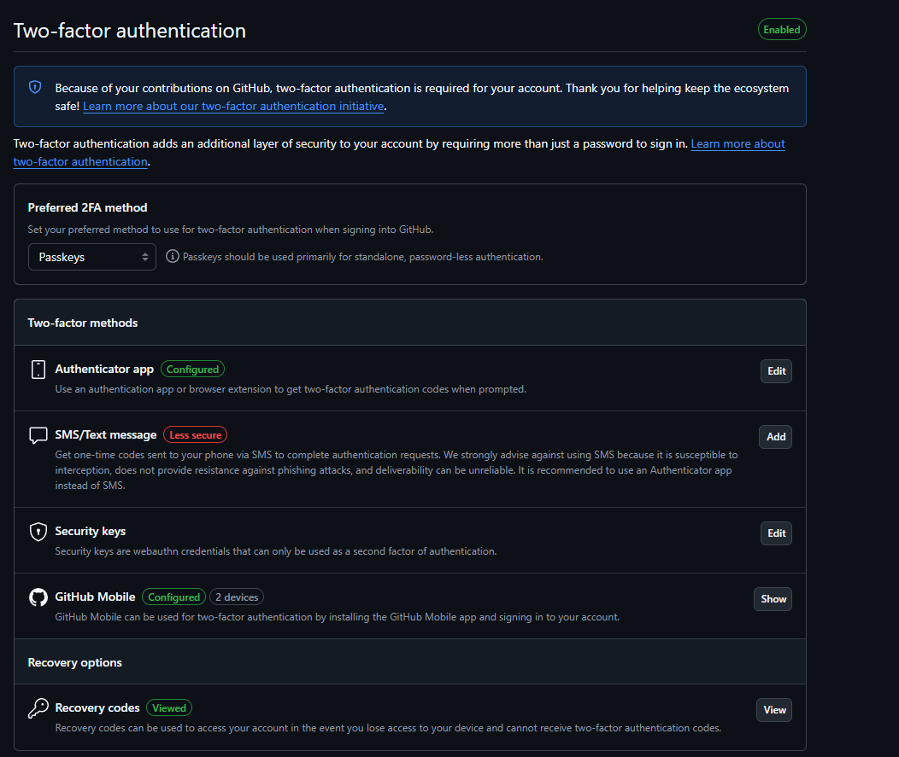
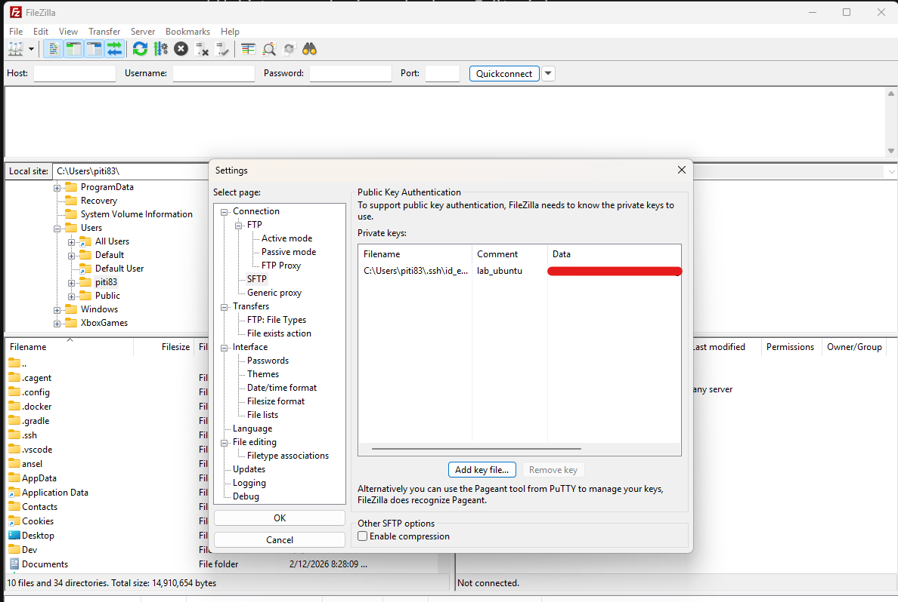
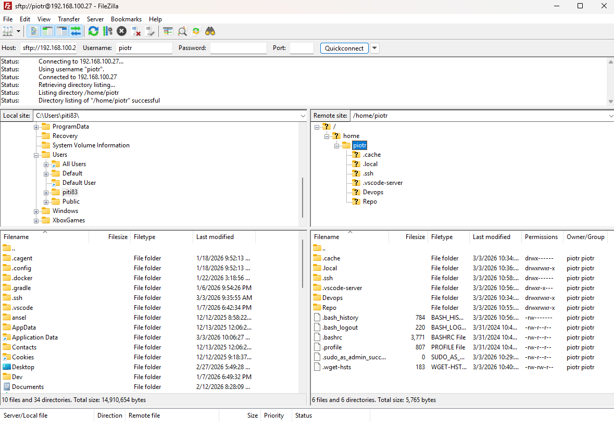
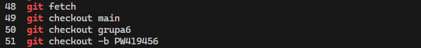
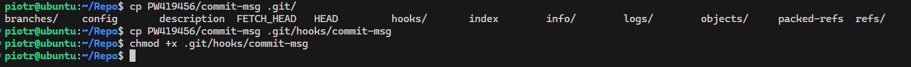
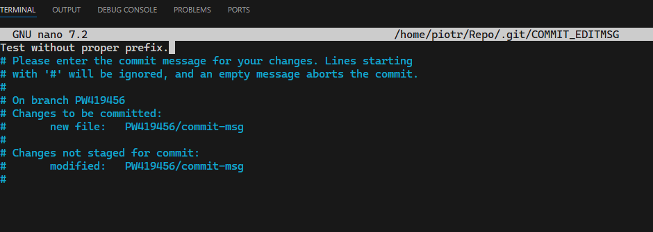
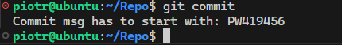

# Sprawozdanie - lab 1

**Piotr Walczak**
**419456**

## 1. Git

- Zainstalowano `git` oraz `openssh-client`. 
- Sklonowano repozytorium z użyciem wygenerowanego PAT'a:




## 2. SSH

- Utworzono dwa klucze ssh.
    - ed25519 (z hasłem)
    - ecdsa (bez hasła)



- Dwuetapowe uwierzytelnianie miałem już włączone:



## 3. Narzędzia

- Skonfigurowano połączenie z serwerem przez roszerzenie ssh w vscode. Dzięki użycia klucza ssh i dodania go do `known_hosts` na serwerze mogę teraz otwierać połączenie z serwerem bez podawania hasła.
- Przesyłanie plików skonfigurowano za pomocą programu *Filezilla*. Dodanie klucza ssh do `sftp` umożliwia łączenie bez hasła.




## 4. Gałąź

- Utworzono nowy branch o nazwie "PW419456" od brancha "grupa6"



- Utworzono hook'a sprawdzającego początek commit message'a ([hook](commit-msg))

``` bash
#!/usr/bin/env bash

COMMIT_MSG_FILE=$1

if ! head -n 1 "$COMMIT_MSG_FILE" | grep -q "^PW419456"; then
  echo "Commit msg has to start with: PW419456"
  exit 1
fi
```

- Skopiowano hook'a do `.git/hooks`



- Po próbie utworzenia "niepoprawnego" commit message'a zwracany jest błąd:



