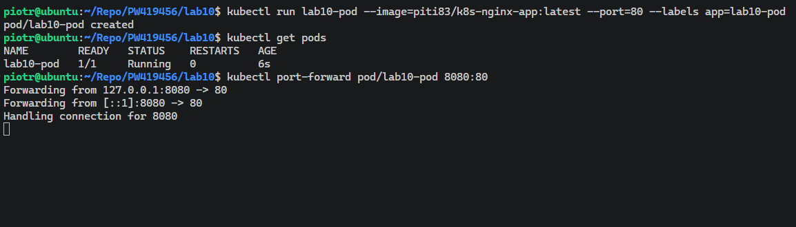
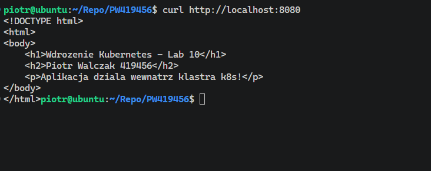

# Sprawozdanie - Laboratorium 10

**Piotr Walczak 419456**

## 1. Instalacja klastra Kubernetes (Minikube)

W pierwszym etapie przeprowadzono instalację środowiska `minikube` w systemie Ubuntu. Pobrano binarkę za pomocą narzędzia `curl` i zainstalowano je w katalogu `/usr/local/bin`. Skonfigurowano alias systemowy, dzięki czemu polecenie `kubectl` jest obsługiwane bezpośrednio przez wbudowany w Minikube mechanizm.

Klaster uruchomiono z wykorzystaniem sterownika `docker`, przydzielając zasoby na poziomie 2048 MB RAM oraz 2 rdzeni CPU. Poprawność działania zweryfikowano poleceniem `kubectl get nodes`, a następnie uruchomiono interfejs graficzny poleceniem `minikube dashboard`.

## 2. Analiza i przygotowanie kontenera własnej aplikacji (Nginx)

Przygotowano dedykowaną stronę `index.html`, która stanowi treść serwowanej aplikacji. Wykorzystano oficjalny obraz `nginx:alpine` jako bazę, w której osadzono plik konfiguracyjny za pomocą pliku `Dockerfile`.

Zbudowano obraz o tagu `piti83/k8s-nginx-app:latest`, a następnie wypchnięto go do publicznego repozytorium Docker Hub. Przed wdrożeniem do klastra, wykonano lokalny test: uruchomiono kontener w trybie odizolowanym i za pomocą polecenia `curl` potwierdzono poprawność serwowania treści HTML.

## 3. Uruchamianie oprogramowania (Jednopodowe wdrożenie manualne)

Wdrożenie w klastrze rozpoczęto od manualnego uruchomienia Poda poleceniem `kubectl run lab10-pod`, wskazując przygotowany obraz oraz port 80. 

Po potwierdzeniu statusu `Running` (polecenie `kubectl get pods`), zestawiono tunel sieciowy między maszyną gospodarza a Podem przy użyciu `kubectl port-forward`. Poprawność działania usługi wewnątrz klastra zweryfikowano za pomocą `curl`, uzyskując dostęp do strony serwowanej przez Nginxa.

## 4. Wdrożenie deklaratywne (Deployment) i Serwis (Service)

Ostatni etap obejmował konfigurację deklaratywną. Stworzono plik `deployment.yaml`, w którym zdefiniowano obiekt typu *Deployment* z liczbą replik równą 4. 

Wdrożenie zaaplikowano poleceniem `kubectl apply -f deployment.yaml`. Po zakończeniu automatycznego procesu *rolloutu*, zweryfikowano uruchomienie czterech instancji kontenera. Następnie utworzono obiekt *Service* typu `ClusterIP`, który wyeksponowano na port 80. Ostateczną weryfikację dostępu do wielopodowej aplikacji przeprowadzono poprzez zestawienie tunelu `port-forward` do serwisu i wykonanie zapytań testowych.

