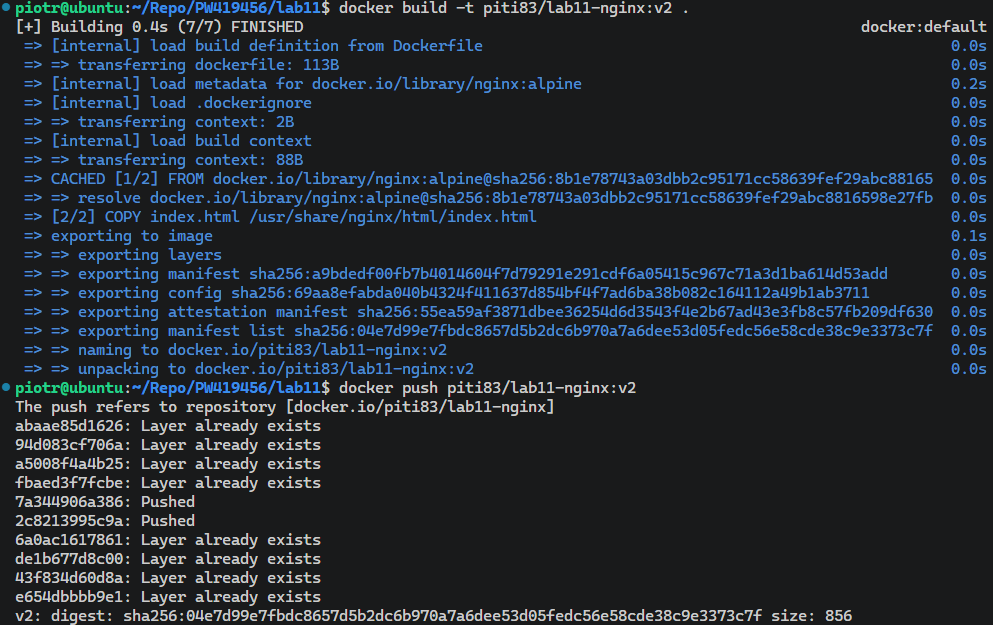
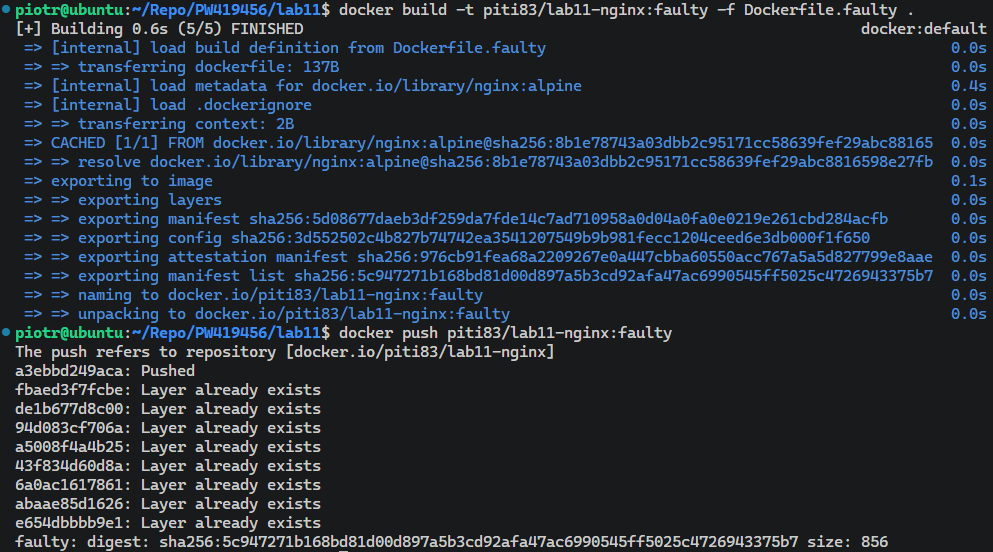
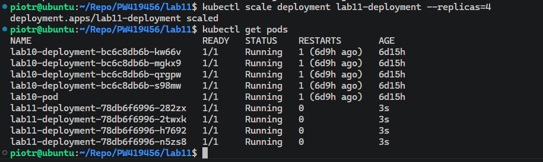

# Sprawozdanie - Laboratorium 11

**Piotr Walczak 419456**

---

## 1. Przygotowanie nowych obrazów (Wersjonowanie)

W pierwszej kolejności, w czystym środowisku roboczym, przygotowano pliki `Dockerfile` dla nowej aplikacji opartej na serwerze Nginx. Zmodyfikowano plik `index.html` tak, aby identyfikował kolejne wersje i zbudowano trzy obrazy kontenerów, po czym wypchnięto je do repozytorium Docker Hub:
* Wersja podstawowa (`v1`).
* Wersja zaktualizowana (`v2`).
* Wersja celowo uszkodzona (`faulty`), wykorzystująca dedykowany `Dockerfile.faulty` wywołujący polecenie `exit 1` podczas startu kontenera.

---

## 2. Zmiany w deploymencie i skalowanie replik

Na podstawie manifestu `deployment.yaml` wdrożono aplikację w wersji `v1` z początkową liczbą 4 replik. Następnie, korzystając z polecenia `kubectl scale`, zbadano mechanizmy zarządzania żądaną liczbą instancji przez Kubernetes. 

Wykonano następujące operacje skalowania w locie, za każdym razem weryfikując natychmiastową reakcję klastra (dodawanie nowych podów lub terminację istniejących):
* Zwiększenie liczby replik do 8.
* Drastyczne zmniejszenie liczby replik do 1.
* Zmniejszenie liczby replik do 0 (co poskutkowało usunięciem wszystkich uruchomionych podów).
* Powrót do stabilnego stanu 4 replik.

---

## 3. Aktualizacje obrazu, awarie i wycofywanie zmian (Rollback)

W kolejnym kroku przetestowano zmianę obrazu w działającym wdrożeniu poleceniem `kubectl set image`. Najpierw pomyślnie zaktualizowano system do wersji `v2`. 

Następnie zainicjowano aktualizację używając obrazu uszkodzonego (`faulty`). Kubernetes wykrył awarię nowych instancji (statusy `Error`) i automatycznie wstrzymał proces aktualizacji, pozostawiając przy życiu stare, działające pody w celu utrzymania dostępności usługi.

Aby odzyskać pełną stabilność, przeanalizowano historię wdrożeń poleceniem `kubectl rollout history` i wykonano bezpieczne wycofanie zmian do poprzednio działającej rewizji za pomocą instrukcji `kubectl rollout undo`. Pody z błędami zostały usunięte, a system wrócił do poprawnego działania.

---

## 4. Skrypt kontroli wdrożenia

Zgodnie z wymaganiami zadania, zaimplementowano skrypt w powłoce Bash (`check_rollout.sh`), który automatycznie weryfikuje sukces wdrożenia z 60-sekundowym limitem czasowym, opierając się na wbudowanej fladze `--timeout` komendy `kubectl rollout status`.

Działanie skryptu przetestowano aplikując ponownie wadliwy obraz (`faulty`). Skrypt poprawnie zidentyfikował brak postępów i po upływie zadanego czasu zakończył działanie z błędem, wyświetlając stosowny komunikat. Po teście przywrócono środowisko do stanu działania (`undo`).

---

## 5. Strategie wdrożenia

W ramach środowiska Kubernetes zdefiniowano i zaobserwowano różne strategie wdrażania zmian, uprzednio eksponując wdrożenie za pomocą usługi (`Service`) typu `ClusterIP`.

### 5.1 Strategia Recreate
Stworzono manifest `recreate.yaml` wymuszający typ strategii `Recreate`. Zaobserwowano, że podczas zmiany wersji aplikacji z `v1` na `v2`, Kubernetes w pierwszej kolejności zamyka wszystkie istniejące pody jednocześnie (powodując chwilową niedostępność aplikacji), a dopiero po ich terminacji uruchamia zestaw instancji w nowej wersji.

### 5.2 Strategia Canary Deployment
Przetestowano wzorzec "Kanarkowy", tworząc dwa oddzielne wdrożenia (`main` dla wersji v1 z 3 replikami oraz `test` dla wersji v2 z 1 repliką) podpięte pod ten sam wspólny obiekt `Service` poprzez selektor etykiet. 

Podział ruchu zweryfikowano uruchamiając tymczasowy kontener z narzędziem `curl` z wnętrza klastra, wysyłający serię krótkich zapytań do serwisu. Otrzymano statystycznie wymieszane odpowiedzi udowadniając, że ruch rozkłada się proporcjonalnie na nową i starą wersję bez przerywania dostępu.

