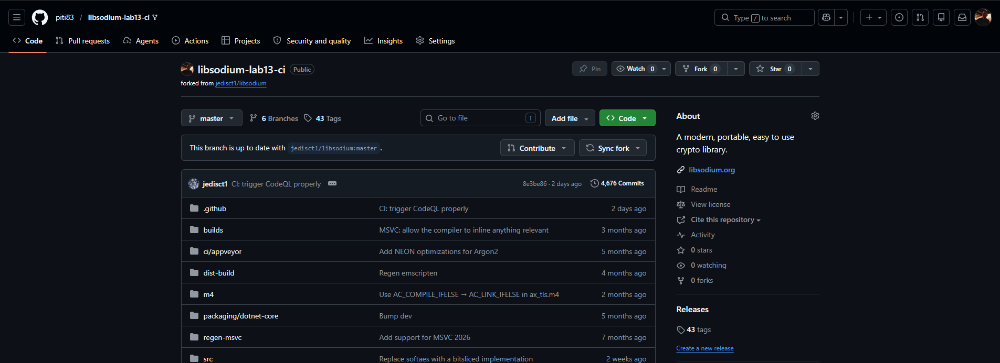
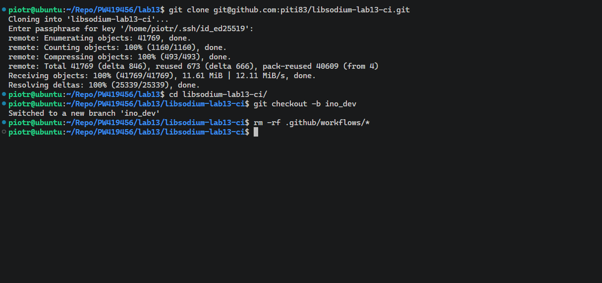
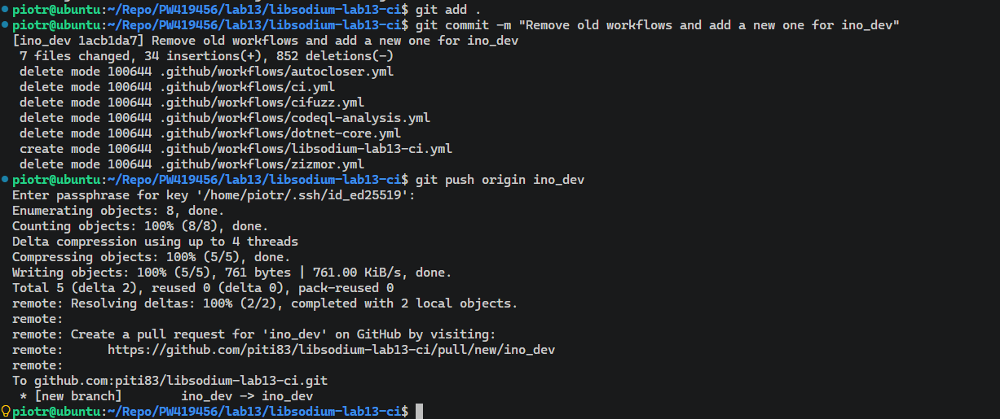
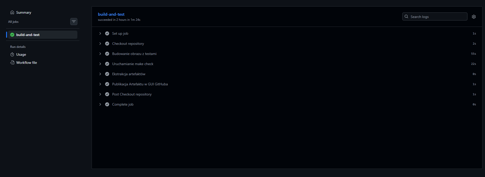
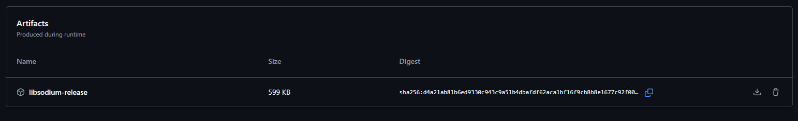

# Sprawozdanie - Laboratorium 13

**Piotr Walczak 419456**

## 1. Wybór i sforkowanie repozytorium

W ramach zapoznania się z platformą GitHub Actions, sforkowano projekt open-source. Ponownie wykorzystano bibliotekę kryptograficzną **libsodium** (znaną z laboratoriów z Jenkinsem), aby zademonstrować proces migracji i adaptacji istniejącego potoku wieloetapowego do nowoczesnego rozwiązania CI wbudowanego w platformę hostingową kodu.

## 2. Przygotowanie gałęzi i czyszczenie środowiska

Sklonowano własną kopię repozytorium na maszynę lokalną i utworzono dedykowaną gałąź rozwojową `ino_dev`. Zgodnie z wytycznymi, całkowicie wyczyszczono projekt z dotychczasowych potoków CI/CD przygotowanych przez oryginalnych twórców biblioteki (poprzez usunięcie zawartości katalogu `.github/workflows/`). Pozwoliło to na wdrożenie autorskiej logiki bez konfliktów.

## 3. Implementacja potoku opartego o Dockera i rozwiązanie problemów

Utworzono własny plik workflow (`.github/workflows/libsodium-docker-ci.yml`) oraz dostosowano `Dockerfile.ci`. 
Główne cechy potoku:
- **Trigger**: Skonfigurowano akcję tak, aby reagowała wyłącznie na zdarzenie `push` do gałęzi `ino_dev`.
- **Budowanie**: Zdecydowano się zachować architekturę wieloetapowego budowania w Dockerze (z użyciem docelowych środowisk `builder` oraz `tester`). Zapewnia to niezawodność i identyczne zachowanie jak w przypadku uruchamiania lokalnego.
- **Troubleshooting**: Napotkano celową blokadę kompilacji gałęzi *master* wprowadzoną przez twórców `libsodium`. Problem rozwiązano poprzez sparametryzowanie skryptu wyzwalającego (`./autogen.sh -s`), co wymusiło ciche wygenerowanie konfiguracji.

Gotowe skrypty zatwierdzono za pomocą `git commit` i wypchnięto na zdalne repozytorium.

## 4. Weryfikacja i artefakty

Wykonanie `git push` pomyślnie i automatycznie wyzwoliło zdalny pipeline na serwerach GitHuba.

Weryfikacja w zakładce **Actions** potwierdziła, że wszystkie zdefiniowane w pliku YAML kroki (w tym kompilacja w kontenerze, uruchomienie zautomatyzowanych testów `make check` i powołanie kontenera asystującego do ekstrakcji plików) zakończyły się sukcesem.

Potok został zakończony wykonaniem akcji `actions/upload-artifact@v4`. Gotowe, skompilowane biblioteki dynamiczne zostały opublikowane w GUI GitHuba.

