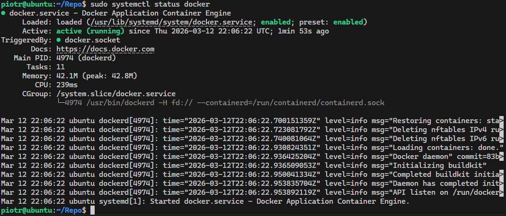
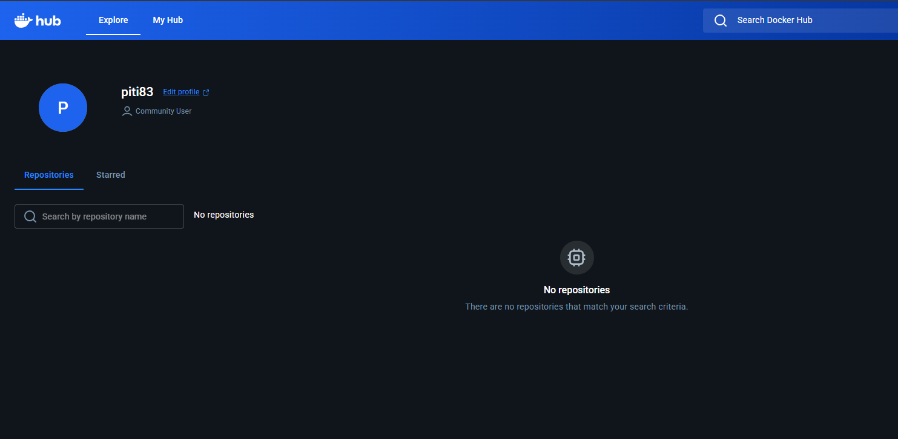
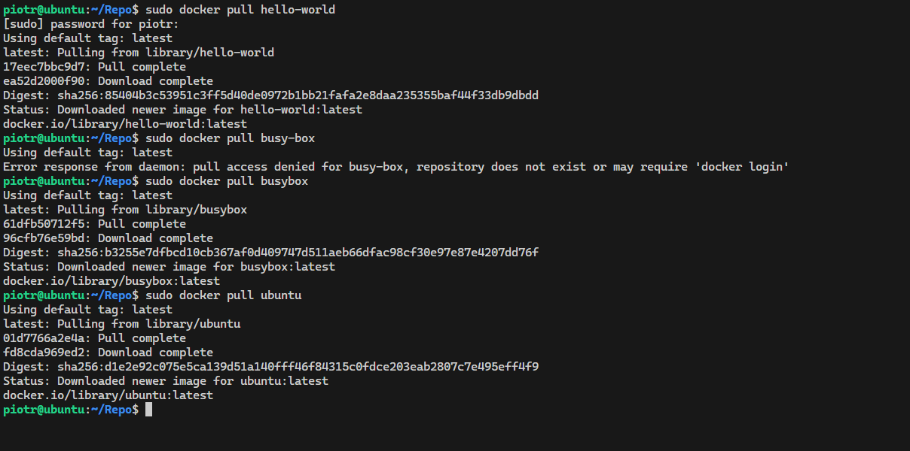
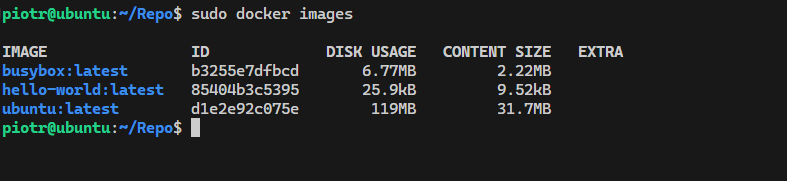
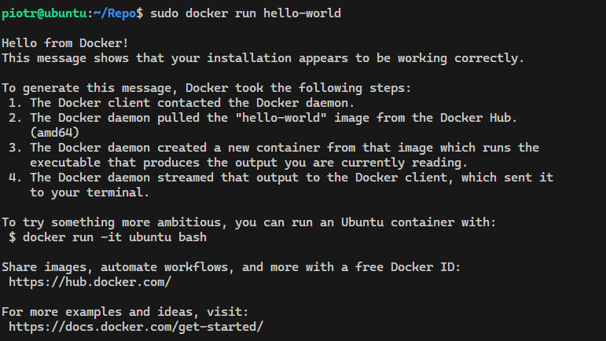
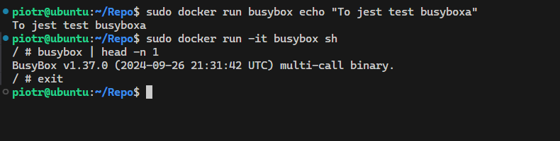
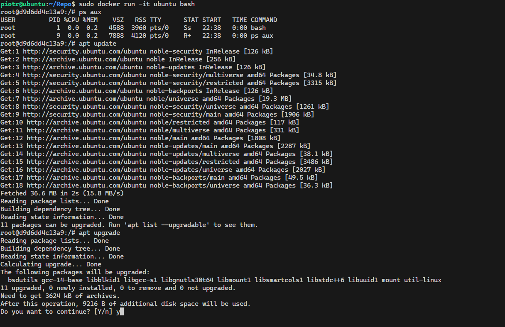
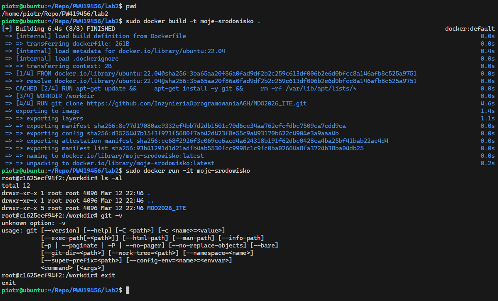
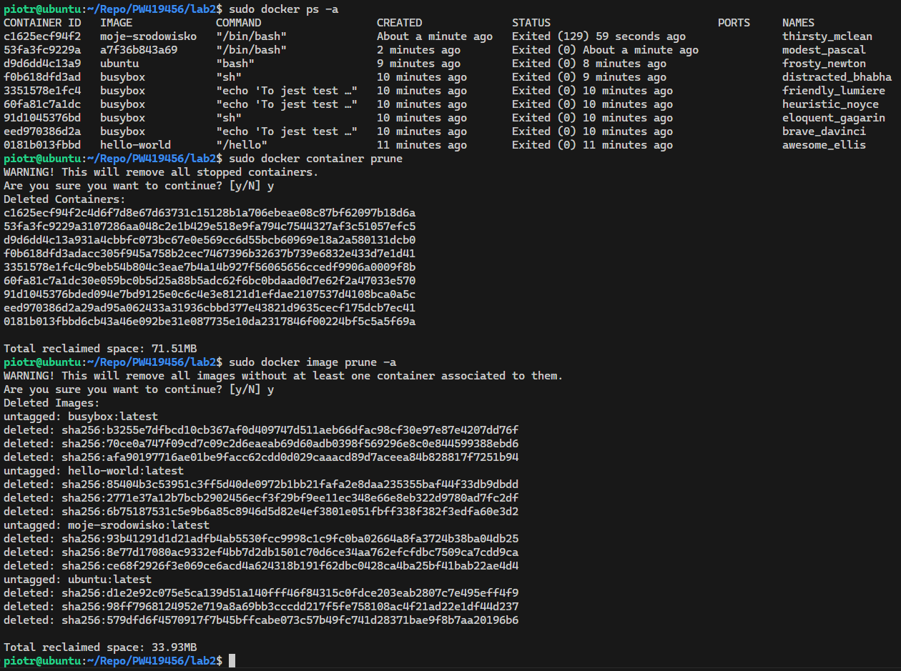

# Sprawozdanie - lab 2

**Piotr Walczak**
**419456**

## 1. Instalacja Dockera

- Zainstalowano Dockera zgodnie z zaleceniami z [instrukcji](https://docs.docker.com/engine/install/ubuntu/)


## 2. Rejestracja w Docker Hub

- Utworzono konto na platformie [Docker Hub](https://hub.docker.com/)



## 3. Pierwsze obrazy

- Sklonowano obrazy `hello-world`, `busybox`, `ubuntu`



- Sprawdzono romiary sklonowanych obrazów



- Uruchomiono obrazy



## 4. Kontener `busybox`

- Uruchomiono kontener w trybie interaktywnym i sprawdzono numer wersji



## 5. System w kontenerze (`ubuntu`)

- Sprawdzono proces o `PID` równym 1
- Zaktualizowano pakiety 



## 6. Pierwszy `Dockerfile`

- Utworzono [`Dockerfile`](./Dockerfile)

```Dockerfile
FROM ubuntu:22.04

RUN apt-get update && \
    apt-get install -y git && \
    rm -rf /var/lib/apt/lists/*

WORKDIR /workdir

RUN git clone https://github.com/InzynieriaOprogramowaniaAGH/MDO2026_ITE.git 

CMD ["/bin/bash"]
```

- Zbudowano i uruchomiono obraz
- Sprawdzono czy instalacja gita i sklonowanie repozytorium przebiegło pomyślnie



## 7. Czyszczenie obrazów

- Wypisano wszystkie obrazy i je usunięto


