# Sprawozdanie - lab 3

**Piotr Walczak**
**419456**

## 1. Wybór oprogramowania

- Wybrano bibliotekę [libsodium](https://github.com/jedisct1/libsodium.git)
- Pobrano repozytorium

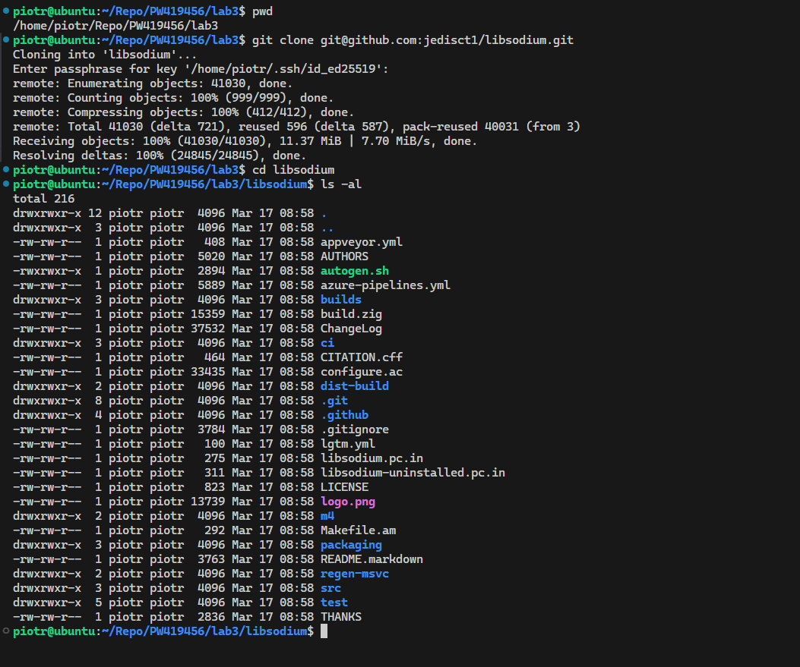

- Zmieniono branch na `stable` (`master` utrudnia buildowanie)
- Zbudowano bibliotekę

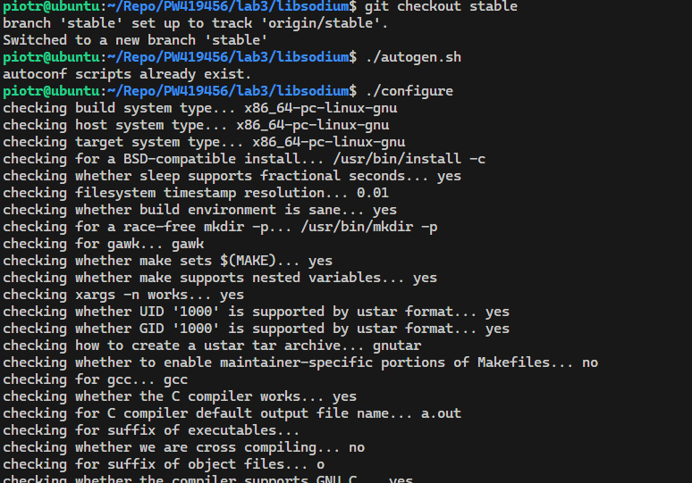
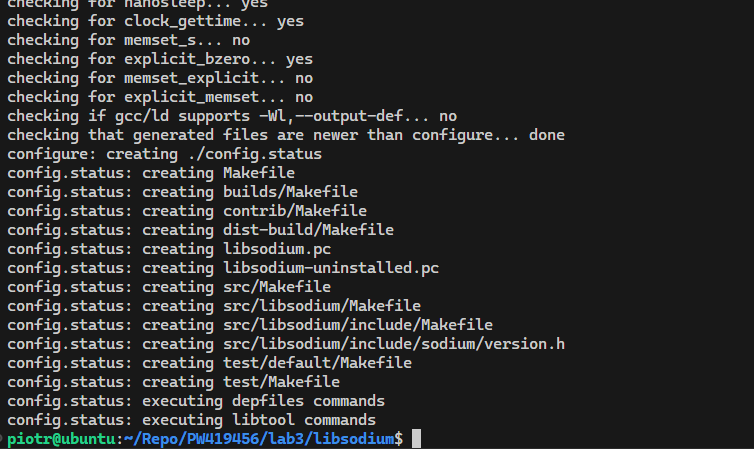

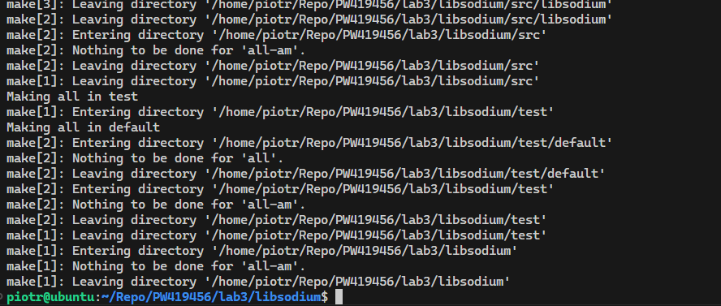

- Uruchomiono testy

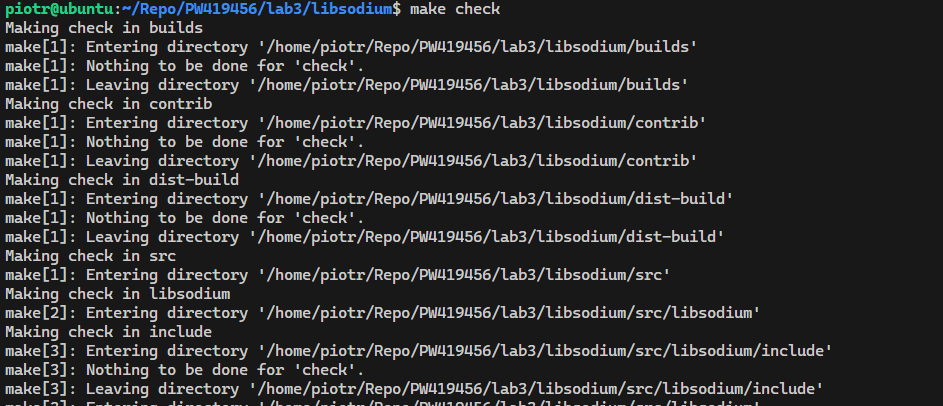
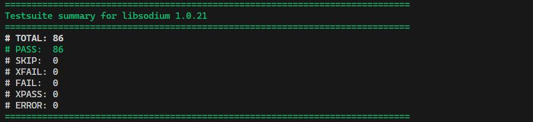

## 2. Build w kontenerze

- Uruchomiono kontener `ubuntu:22.04` w trybie interaktywnym

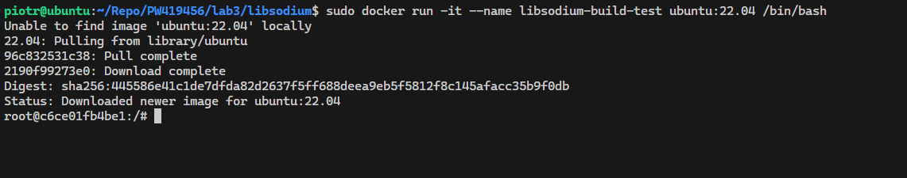

- Powtórzono wszystkie kroki z poprzedniej sekcji

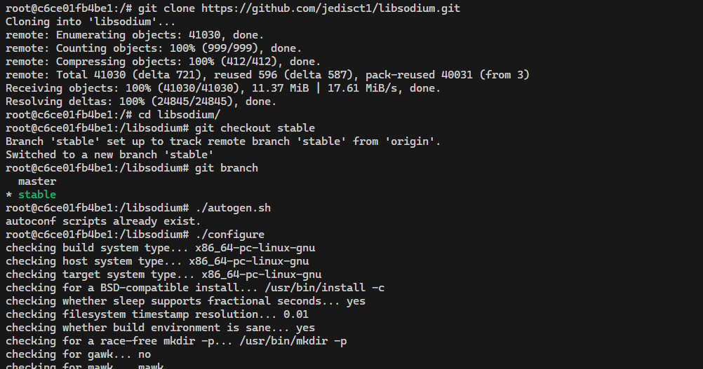
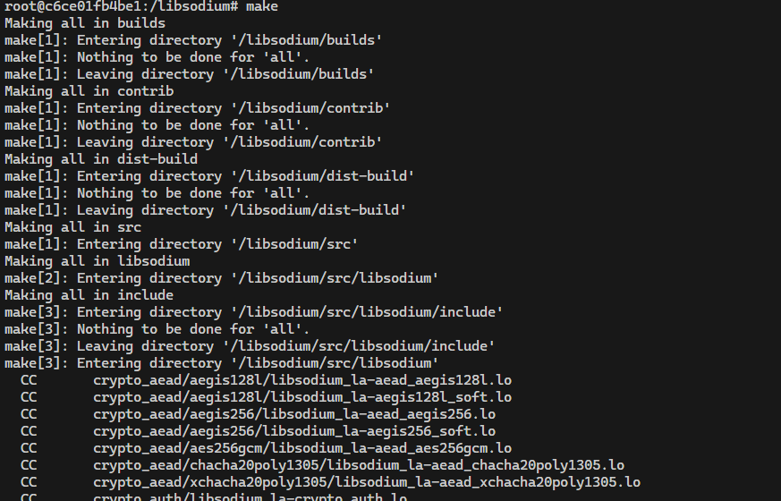
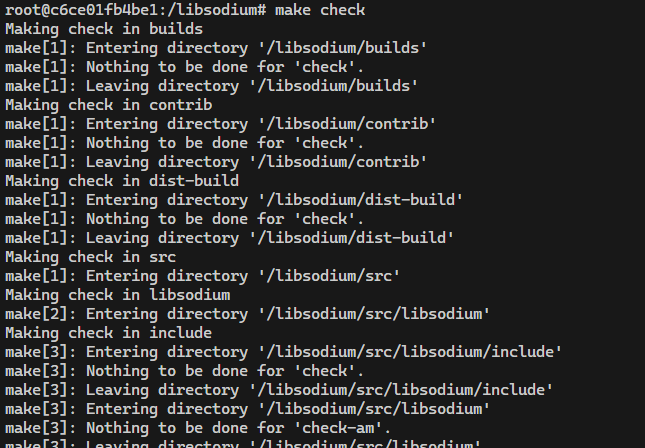
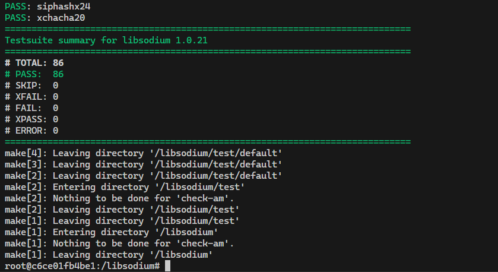

- Utworzono [`Dockerfile.build`](./Dockerfile.build) oraz [`Dockerfile.test`](./Dockerfile.test)
- Zbudowano kontenery za pomocą utworzonych Dockerfile'ów

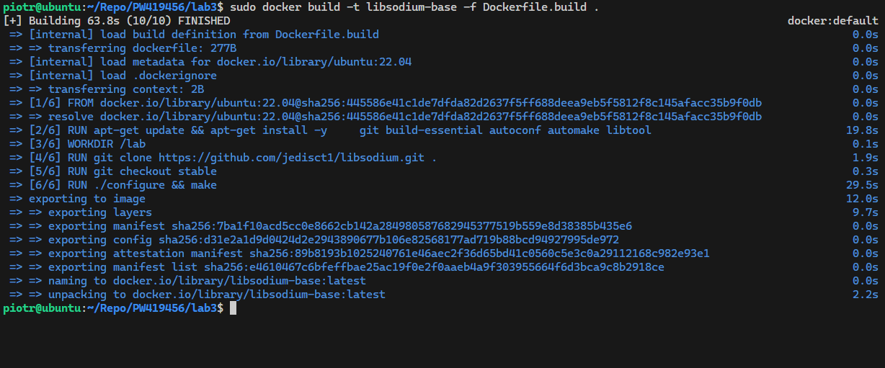
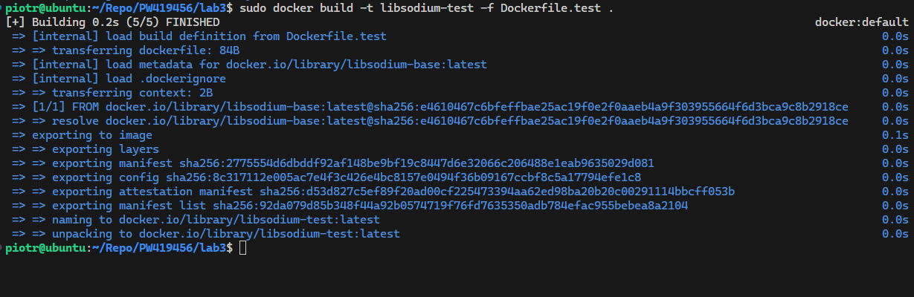

- Uruchomiono kontenery

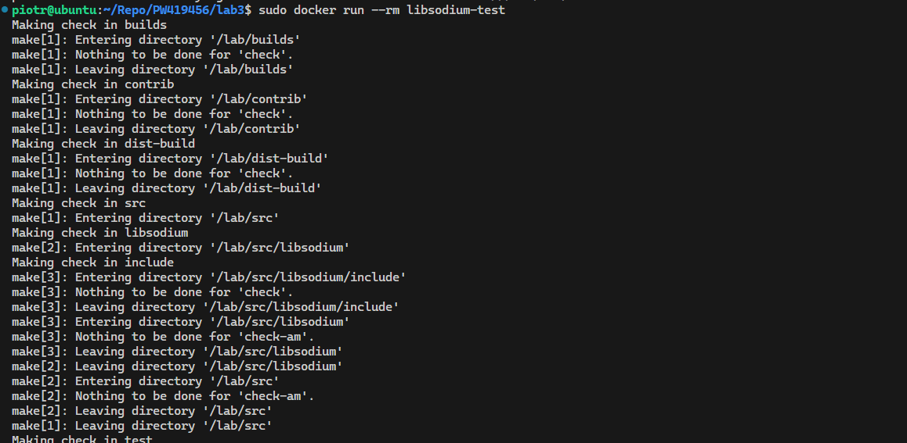

## 3. Docker compose

- Utworzono plik [`docker-compose.yml`](./docker-compose.yml), automatyzujący poprzednie kroki

## 4. Dyskusje

- **Czy program nadaje się do wdrażania i publikowania jako kontener, czy taki sposób interakcji nadaje się tylko do builda?**

> Nie bezpośrednio. Libsodium to biblioteka systemowa, a nie samodzielna usługa (jak baza danych czy serwer WWW). Kontener idealnie nadaje się do etapu builda (zapewnia powtarzalne środowisko kompilacji) oraz testów. Publikowanie kontenera z samą biblioteką jest niepraktyczne. Bibliotekę wdraża się jako element składowy obrazu innej aplikacji lub jako pakiet systemowy.

- **W jaki sposób miałoby zachodzić przygotowanie finalnego artefaktu?**

    - **Czy czyścić pozostałości po buildzie?**

    > Tak. Dockerfile.build zawiera kompilatory, kod źródłowy i pliki obiektowe. To zajmuje dużo niepotrzebnego miejsca. Finałowy artefakt (biblioteka) jest niewielki i lekki. Należałoby tak przygotować deployment aby w końcowym obrazie zostały tylko gotowe pliki binarne, bez gcc, make czy git.

    - **Dedykowany deploy-and-publish**

    > W przypadku bibliotek takich jak libsodium, najlepszą ścieżką jest stworzenie pakietu systemowego. Dla Ubuntu/Debiana byłby to plik `.DEB`. Programiści chcą wpisać `apt install libsodium-dev`, a nie kopiować pliki z kontenera. Dodatkowy (trzeci) kontener mógłby pobrać zbudowane pliki z pierwszego kontenera i stworzyć paczkę `.deb`.
