# Sprawozdanie - lab 4

**Piotr Walczak**
**419456**

## 1. Zachowywanie stanu między kontenerami

- Utworzono woluminy wejściowy i wyjściowy (`input-vol`, `output-vol`).
    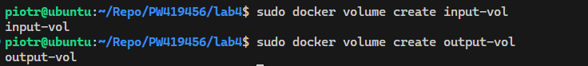
- Przygotowano plik `Dockerfile.base` i zbudowano kontener bazowy posiadający niezbędne pakiety, ale bez `git'a`.

    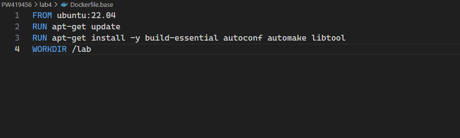
    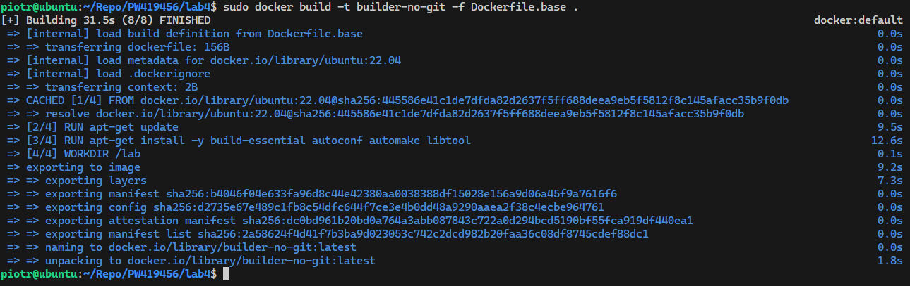

- Sklonowano repozytorium na wolumin wejściowy z wykorzystaniem obrazu `alpine/git`. 

    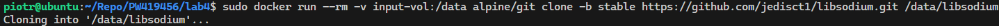

- Uruchomiono tryb interaktywny kontenera budującego (`builder-no-git`) z podpiętymi oboma woluminami. 
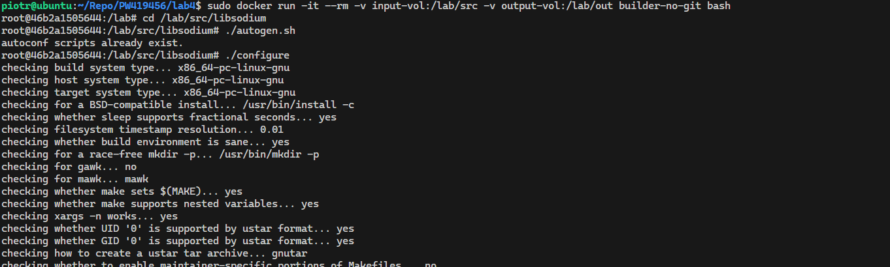
- Wygenerowano skrypty konfiguracyjne, przeprowadzono kompilację (build) kodu.
- Skopiowano zbudowane pliki na wolumin wyjściowy.
    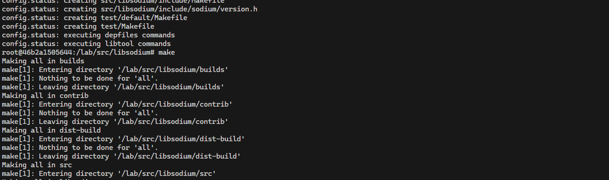
    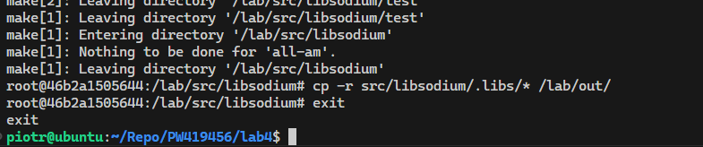

- Ponowiono powyższą operację z wykorzystaniem obrazu bazowego posiadającego wbudowanego Gita (`libsodium-base`). Utworzono w tym celu oddzielne woluminy i sklonowano kod bezpośrednio wewnątrz uruchomionego kontenera.

    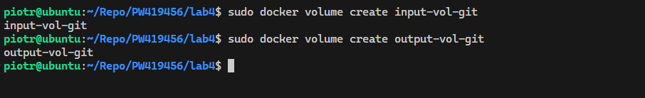
    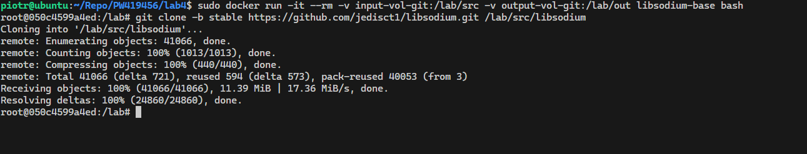
    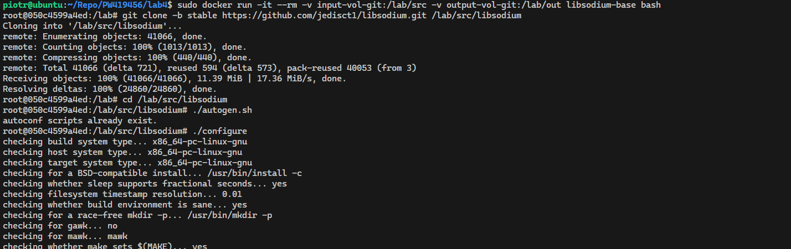
    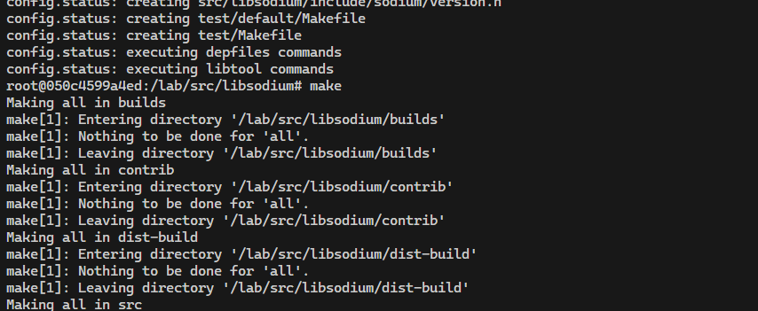
    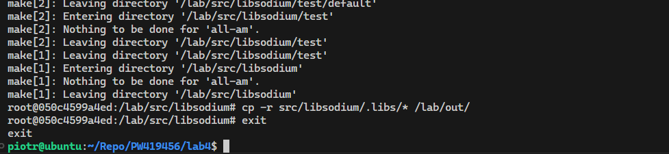
    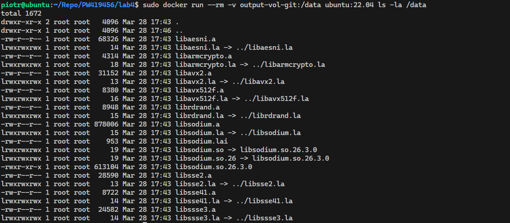

> **Dyskusja dotycząca `RUN --mount`:**
> Standardowe podejście z kopiowaniem kodu źródłowego (przez instrukcje `COPY` lub `git clone` w pliku `Dockerfile`) zapisuje zbędny kod w warstwach obrazu końcowego, niepotrzebnie zwiększając jego rozmiar. Wykorzystanie instrukcji `RUN --mount=type=bind` pozwala na tymczasowe zamontowanie katalogu (np. z kodem źródłowym z hosta) wyłącznie na czas wykonania polecenia budującego (np. `make`). Po zakończeniu instrukcji, źródła nie są zapisywane w końcowym obrazie. Dodatkowo wykorzystanie `RUN --mount=type=cache` do buforowania pakietów zależności pozwala drastycznie skrócić czas kolejnych kompilacji.

## 2. Eksponowanie portu i łączność między kontenerami

- Uruchomiono serwer aplikacji `iperf3` w wirtualnej sieci domyślnej. Znaleziono jego przydzielony adres IP za pomocą narzędzia `docker inspect`.
- Nawiązano połączenie z drugim kontenerem na podstawie adresu IP i zmierzono ruch.

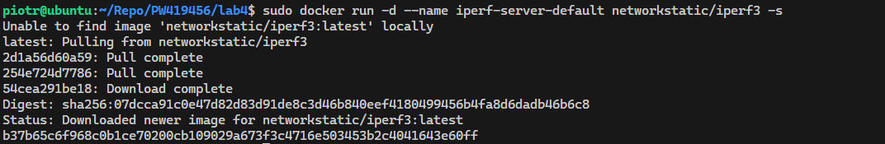
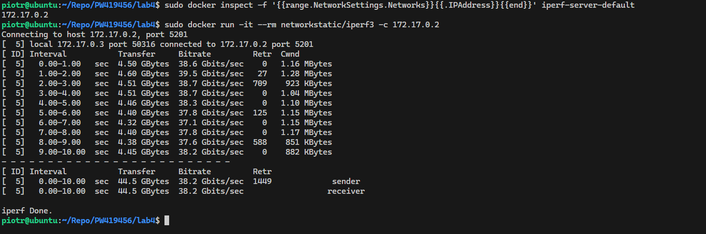

- Utworzono własną, dedykowaną sieć mostkową `lab-net`.
- Uruchomiono nową instancję serwera i wyeksponowano jej port (5201) na hosta. Zbadano łączność z poziomu drugiego kontenera, nawiązując połączenie poprzez DNS kontenerów, a nie po IP.

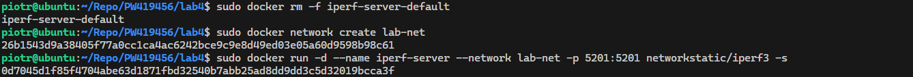
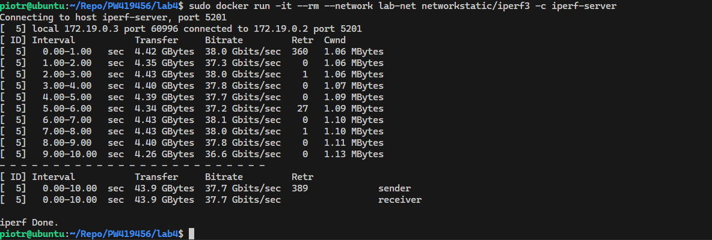

- Nawiązano połączenie spoza kontenera, wykonując pomiar bezpośrednio z maszyny hosta na interfejsie lokalnym `localhost`.

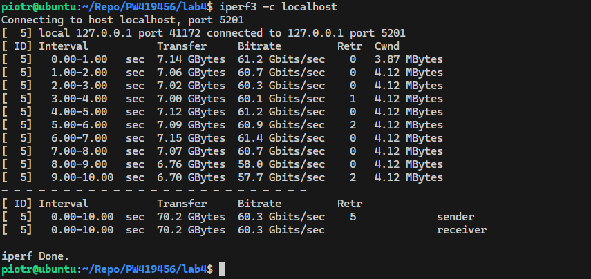

## 3. Usługi w rozumieniu systemu, kontenera i klastra

- Uruchomiono kontener i ręcznie zainstalowano oraz skonfigurowano wewnątrz niego usługę logowania SSH `openssh-server`.

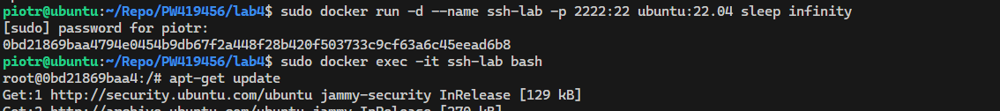
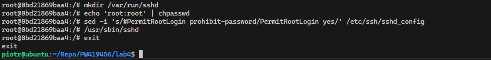

- Pomyślnie zestawiono połączenie poświadczając dostęp na dedykowanym, wyeksponowanym porcie z poziomu maszyny hosta.

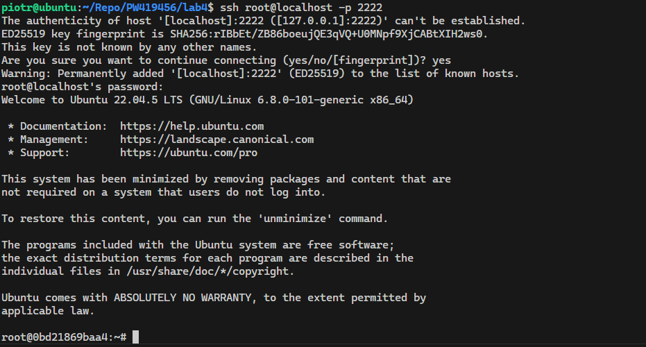

> **Zalety i wady (SSHD w kontenerze):**

> Wady (antywzorzec): Koncepcja kontenerów opiera się na zasadzie "jedna usługa - jeden kontener". Proces init w kontenerze powinien monitorować proces główny aplikacji. Uruchomienie demona SSH jako procesu działającego w tle łamie tę zasadę, poszerza powierzchnię ataku i komplikuje zarządzanie cyklem życia aplikacji. Standardowo do eksploracji używa się polecenia `docker exec`.

> Zalety (przypadki użycia): Środowisko SSH sprawdzi się, gdy istnieje potrzeba użycia kontenera w roli węzła skokowego lub przy integracji z bardzo starym oprogramowaniem do automatyzacji infrastruktury, które domyślnie łączy się z zasobami wyłącznie poprzez protokół SSH.

## 4. Przygotowanie do uruchomienia serwera Jenkins

- Przygotowano plik [`docker-compose.yml`](./jenkins-lab/docker-compose.yml) konfigurujący dwa niezależne połączone serwisy. 
- Przeprowadzono instalację klastra Jenkins współpracującego ze środowiskiem DinD (Docker in Docker).

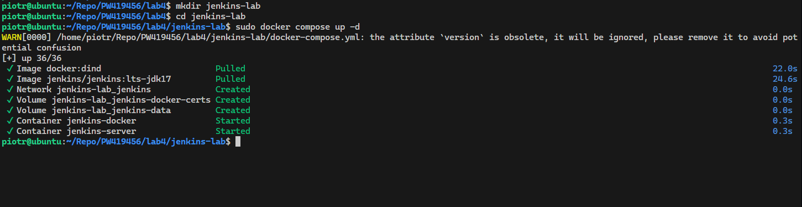

- Poleceniem `docker ps` wykazano działające kontenery (`jenkins-server` oraz `jenkins-docker`).

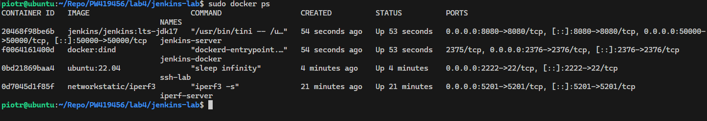

- Za pomocą polecenia `docker exec` wyodrębniono wygenerowane, domyślne hasło inicjalizacyjne użytkownika `admin`.

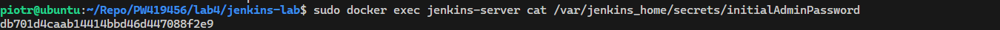

- Zainicjalizowano serwer z poziomu panelu graficznego w przeglądarce, finalizując instalację Jenkinsa.

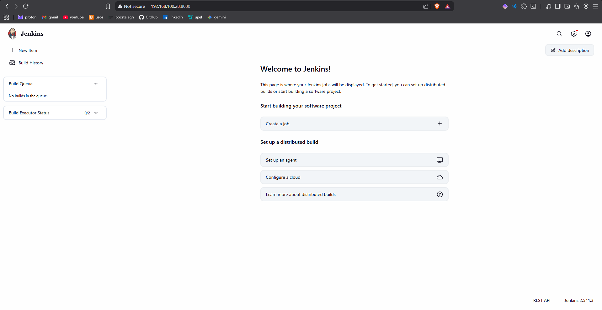