# Sprawozdanie - lab 5

**Piotr Walczak**
**419456**

## 1. Przygotowanie

- Utworzono własny plik `Dockerfile.jenkins` bazujący na oficjalnym obrazie Jenkinsa oraz plik `docker-compose.yml` spinający to środowisko z kontenerem zagnieżdżonym Dockera (DinD). 
- Uruchomiono klaster poleceniem `docker compose up -d --build`.
- Wyciągnięto hasło początkowe administratora, zalogowano się do panelu i skonfigurowano Jenkinsa.

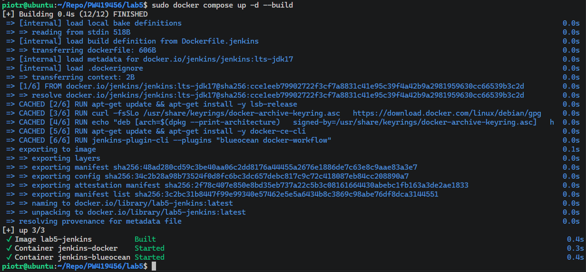
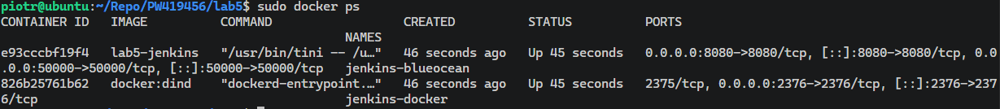
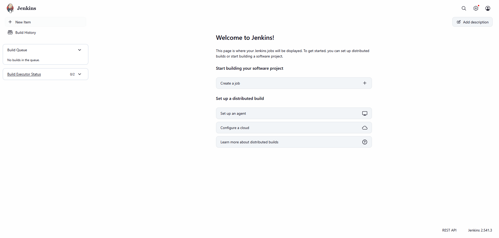

> **Czym się różni przygotowany obraz od standardowego obrazu Jenkinsa?**
> Standardowy obraz `jenkins/jenkins` posiada jedynie klasyczny interfejs graficzny. W przygotowanym obrazie doinstalowano ręcznie wtyczkę **Blue Ocean** (nowoczesny, wizualny interfejs ułatwiający tworzenie i śledzenie etapów CI/CD) oraz klienta `docker-ce-cli`. Dzięki temu Jenkins potrafi wysyłać polecenia do zagnieżdżonego demona Dockera działającego w równoległym kontenerze (DinD).

> **Archiwizacja i zabezpieczenie logów:**
> Bezpieczeństwo danych (logów budowania, historii zadań, konfiguracji) zrealizowano za pomocą woluminów platformy Docker. W pliku `docker-compose.yml` zmapowano nazwany wolumin `jenkins-data` do ścieżki `/var/jenkins_home` wewnątrz kontenera. Dzięki temu po ewentualnym usunięciu lub awarii kontenera, Jenkins po ponownym uruchomieniu odzyska pełen stan środowiska.

## 2. Zadanie wstępne: uruchomienie

Przygotowano trzy projekty typu *Freestyle project* konfigurujące proste komendy powłoki.

- **Projekt 1: Wyświetlanie `uname`**
  Utworzono projekt wykonujący polecenie `uname -a`. Po uruchomieniu w logach konsoli zaobserwowano poprawne wypisanie informacji o jądrze systemu linux, na którym działa kontener Jenkinsa.

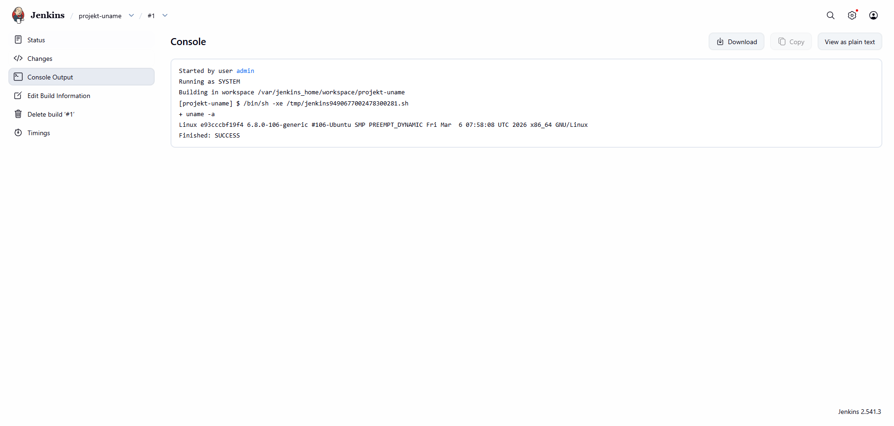

- **Projekt 2: Błąd przy nieparzystej godzinie**
  Napisano skrypt bashowy pobierający aktualną godzinę i sprawdzający resztę z dzielenia przez 2.

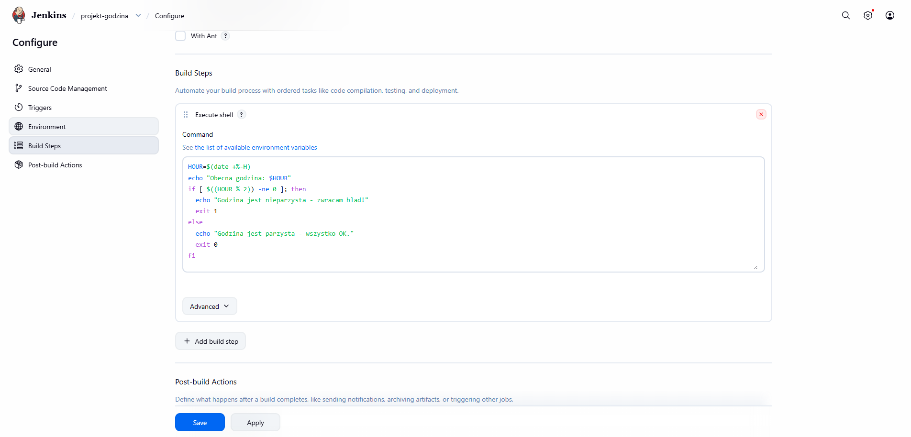
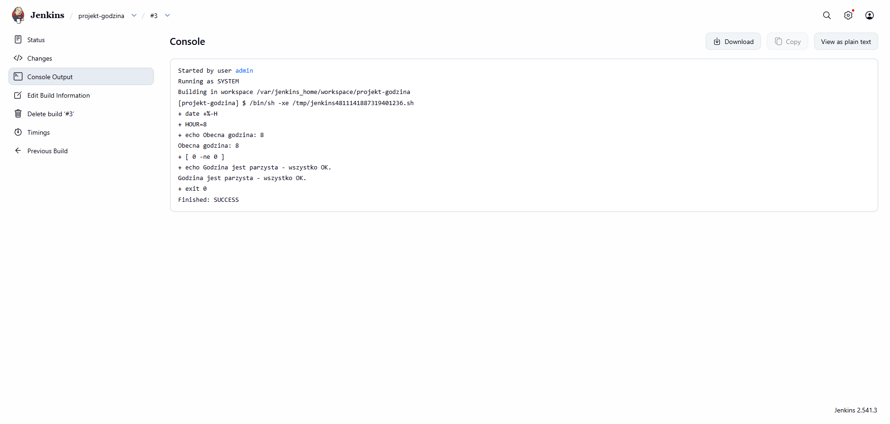

- **Projekt 3: Pobranie kontenera `ubuntu`**
  Utworzono projekt wykonujący komendę `docker pull ubuntu`. 

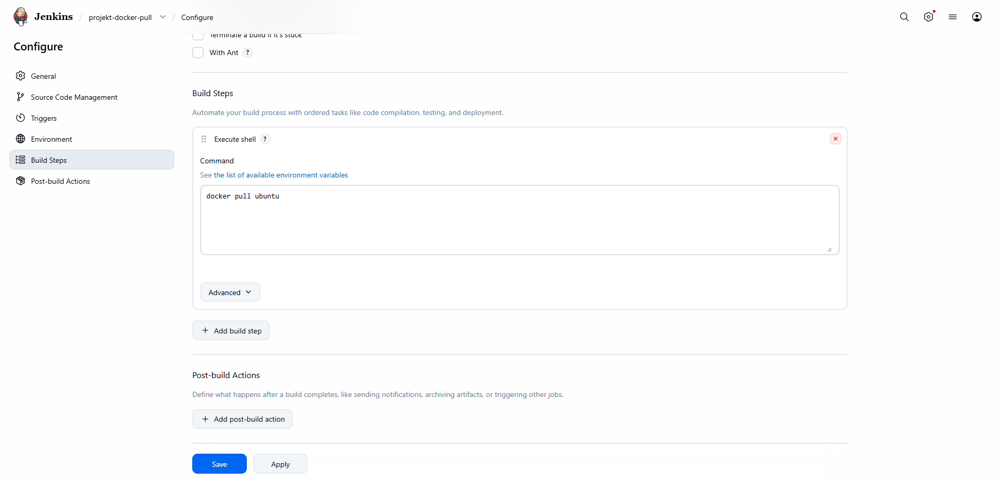
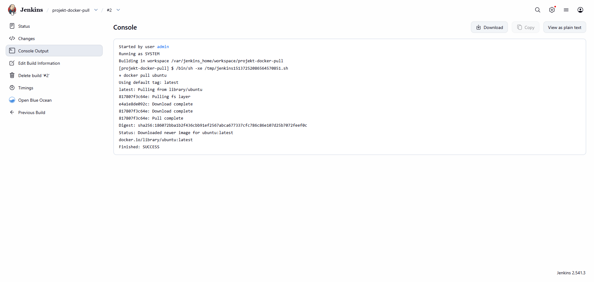

- Podsumowanie statusu zadań w głównym panelu Jenkinsa:

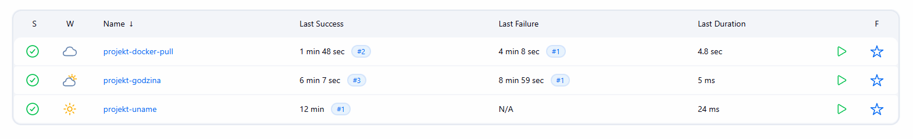

## 3. Zadanie wstępne: obiekt typu pipeline

- Utworzono nowy obiekt typu **Pipeline**. Wprowadzono deklaratywny skrypt bezpośrednio do definicji zadania.
- W skrypcie wykorzystano kroki izolujące etapy: `Checkout` (klonowanie repozytorium i przejście na gałąź `PW419456`) oraz `Build Docker Image` (budowanie obrazu bazowego z wykorzystaniem `Dockerfile.build` z katalogu `PW419456/lab3`).

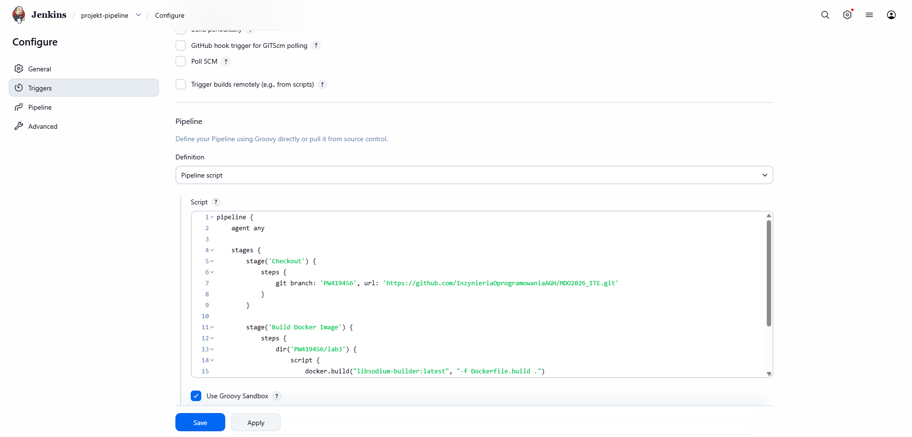

- Uruchomiono Pipeline. Pomyślnie zaciągnięto kod z repozytorium zdalnego i skompilowano obraz kontenera.

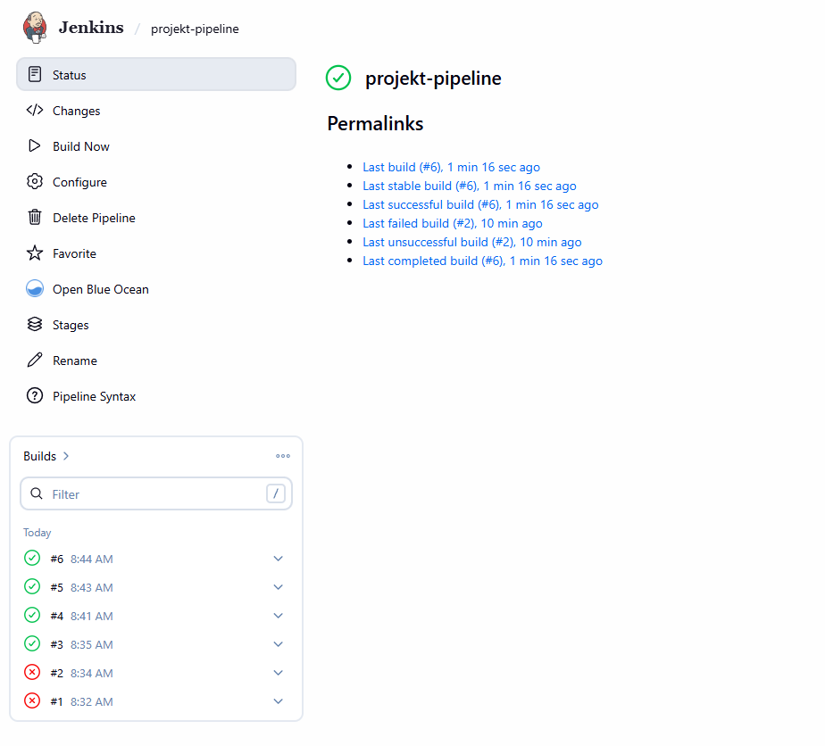

- **Drugie uruchomienie (widok Blue Ocean / Stage view):** Zgodnie z poleceniem, uruchomiono skonfigurowany pipeline po raz drugi. 

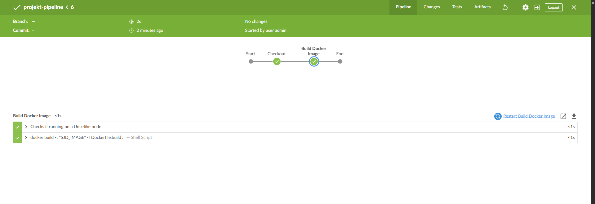