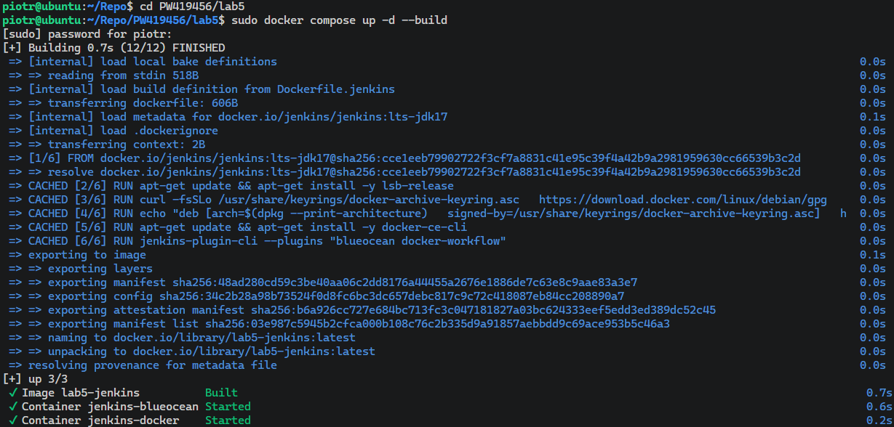
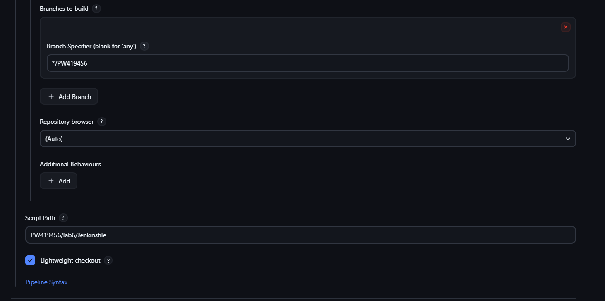
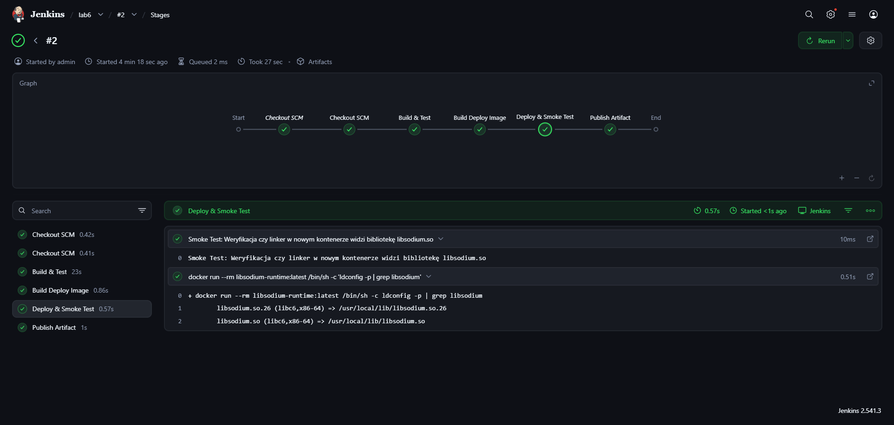
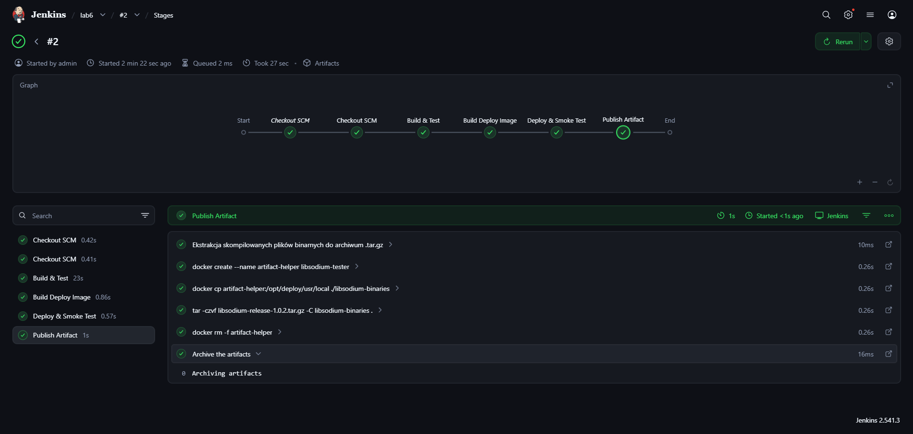

# Sprawozdanie - Laboratorium 6: Pipeline CI/CD dla Libsodium
**Piotr Walczak 419456**

## 1. Wybór oprogramowania i przygotowanie repozytorium
Do realizacji zadania wybrano bibliotekę kryptograficzną `libsodium` (otwarta licencja ISC umożliwiająca swobodny obrót kodem). Prace prowadzono na dedykowanej gałęzi `PW419456`. W katalogu `PW419456/lab6/` umieszczono dwa kluczowe pliki:
* [Dockerfile.ci](./Dockerfile.ci) – wieloetapowa definicja obrazów.
* [Jenkinsfile](./Jenkinsfile) – definicja potoku CI/CD (Pipeline).

## 2. Uruchomienie klastra Jenkinsa
Przed rozpoczęciem konfiguracji potoku, uruchomiono przygotowany na poprzednich zajęciach klaster Jenkinsa współpracujący z demonem Dockera. 
W tym celu, w katalogu `PW419456/lab5/`, wywołano polecenie `sudo docker compose up -d --build`.

## 3. Konfiguracja zadania w Jenkinsie (Ścieżka krytyczna)
Zalogowano się do panelu Jenkinsa i utworzono nowe zadanie typu **Pipeline**. W ustawieniach zadania zdefiniowano połączenie z repozytorium:
* **Definition:** Pipeline script from SCM
* **SCM:** Git
* **Repository URL:** Adres repozytorium
* **Branch Specifier:** `*/PW419456`
* **Script Path:** `PW419456/lab6/Jenkinsfile`

## 4. Budowanie i Testy (Multi-stage Build)
Po ręcznym wyzwoleniu zadania , Jenkins pobrał kod źródłowy i rozpoczął realizację etapów zdefiniowanych w `Jenkinsfile`:
1. **Build (Kontener budujący):** Zbudowano obraz `builder` na bazie `ubuntu:22.04`. Obraz ten zawiera pełen zestaw narzędzi (`build-essential`, `git`) i to w nim odbyła się właściwa kompilacja biblioteki komendą `make`.
2. **Testy (Kontener testowy):** Uruchomiono testy `make check` w dedykowanym kontenerze `tester`, który zgodnie z wymaganiami oparto bezpośrednio o obraz buildera.

*Uzasadnienie konteneryzacji:* Obraz budujący zajmuje bardzo dużo miejsca i stwarza potencjalne luki w bezpieczeństwie. Z tego powodu do ostatecznego wdrożenia utworzono osobny, lekki obraz `deploy`, kopiując do niego wyłącznie skompilowane pliki `.so`. 

## 5. Wdrożenie i Smoke Test
Zbudowany, minimalistyczny kontener `deploy` (zawierający jedynie gotowe biblioteki systemowe) został tymczasowo wdrożony jako instancja na serwerze Dockera. Następnie wykonano **Smoke Test**.
Polegał on na zweryfikowaniu komendą `ldconfig -p | grep libsodium`, czy linker w nowym, produkcyjnym środowisku poprawnie widzi i ładuje bibliotekę.

## 6. Publikacja artefaktów i identyfikowalność
Po pomyślnym przejściu testów wdrożeniowych, przystąpiono do publikacji artefaktów:
* **Logi z testów:** Zapisano jako artefakt `make-check.log`.
* **Archiwum `.tar.gz`:** Z gotowego obrazu wyciągnięto pliki binarne i spakowano je do archiwum udostępnionego do pobrania w Jenkinsie. Pozwala to na łatwą dystrybucję biblioteki na środowiskach nieobsługujących konteneryzacji.
* **Wersjonowanie:** Zastosowano konwencję nazewniczą opartą o numer buildu Jenkinsa (np. `1.0.5`), co pozwala na precyzyjne odśledzenie historii paczki. W widoku głównym zadania widać powiązanie konkretnego przebiegu z hashem commita z Git'a.

