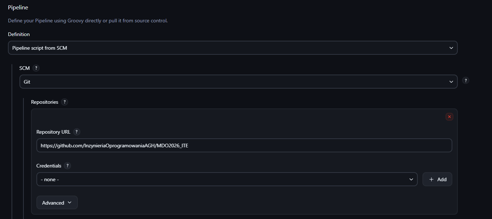
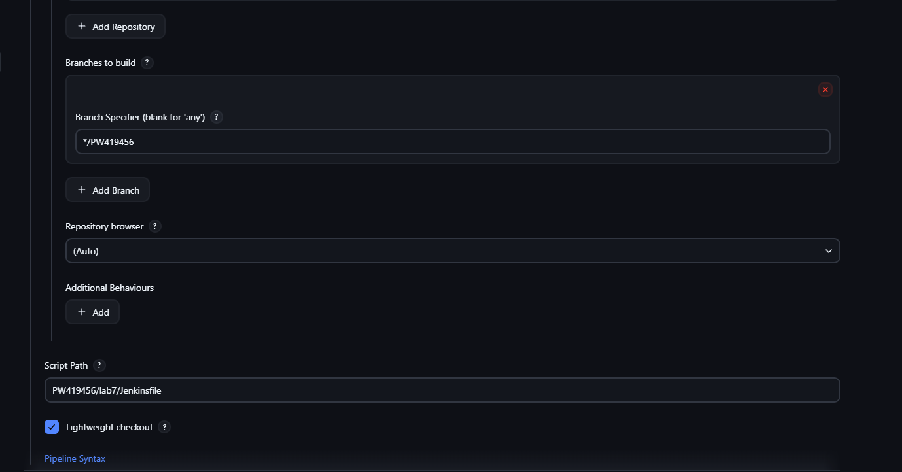
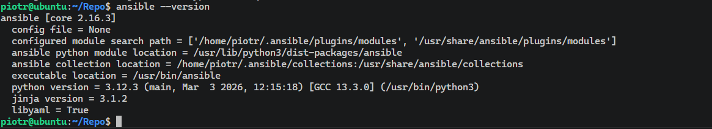

# Sprawozdanie - lab 7

**Piotr Walczak**
**419456**

## 1. Jenkinsfile: SCM, lista kontrolna i Docker Hub

- Zmodyfikowano konfigurację zadania Pipeline w Jenkinsie, zmieniając źródło definicji potoku na repozytorium Git (opcja `Pipeline script from SCM`).
- Wskazano docelową gałąź `*/PW419456` oraz ścieżkę skryptu `PW419456/lab7/Jenkinsfile`.

- Zaktualizowano plik potoku. Dodano etap `Clean Workspace` z instrukcją `cleanWs()`, co wymusza pracę na najnowszym kodzie i usuwa stary cache.
- Zachowano wieloetapowe budowanie (multi-stage build), gdzie etap `Deploy` korzysta z lekkiego, odchudzonego obrazu bazowego.
- Skonfigurowano poświadczenia do rejestru Docker Hub w systemie Jenkinsa. 
- Dodano etap publikacji, w którym gotowy obraz jest tagowany, a następnie wysyłany do zewnętrznego rejestru poleceniem `docker push`.
- Wykonano pomyślne przejście całego potoku.

## 2. Weryfikacja "Definition of Done"

- Sprawdzono możliwość wdrożenia zewnętrznego (deployable) przygotowanego artefaktu.
- Na maszynie gospodarza pobrano opublikowany obraz poleceniem `docker pull piti83/libsodium-runtime:latest`.
- Uruchomiono pobrany obraz w celu weryfikacji biblioteki systemowej (`ldconfig -p | grep libsodium`). Test zakończył się sukcesem.

## 3. Przygotowanie infrastruktury pod Ansible

- W środowisku Hyper-V utworzono nową, odchudzoną maszynę wirtualną o nazwie hosta `ansible-target`.
- Zainstalowano serwer `openssh-server` oraz pakiet `tar`.
- Utworzono nowego użytkownika `ansible` i nadano mu uprawnienia administratora (`sudo`).
- Odczytano przydzielony maszynie adres IP.

- Na głównej maszynie wirtualnej zainstalowano oprogramowanie `ansible` przy użyciu menedżera pakietów `apt`.
- Zweryfikowano instalację poleceniem `ansible --version`.

- Wyeksportowano publiczny klucz SSH z głównej maszyny do autoryzowanych kluczy nowej maszyny poleceniem `ssh-copy-id -i ~/.ssh/id_ed25519.pub ansible@<IP_TARGET>`.
- Przetestowano poprawność konfiguracji, pomyślnie logując się przez powłokę bez podawania hasła.

