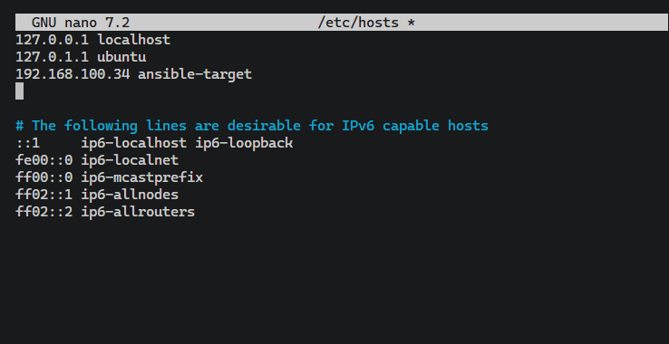

# Sprawozdanie - Laboratorium 8: Automatyzacja za pomocą Ansible
**Piotr Walczak** **419456**

## 1. Inwentaryzacja i weryfikacja łączności
Skonfigurowano rozwiązywanie nazw domenowych w sieci lokalnej, modyfikując plik `/etc/hosts` na maszynie głównej (dodano adres IP maszyny docelowej wraz z aliasem `ansible-target`). 
Następnie przygotowano statyczny plik inwentaryzacji `inventory.ini`, rozdzielając maszyny na dwie grupy: `[Orchestrators]` (połączenie lokalne `localhost`) oraz `[Endpoints]` (zewnętrzna maszyna docelowa ze zdefiniowanym użytkownikiem `ansible`). 

Łączność całego systemu oraz bezhasłowe uwierzytelnienie SSH pomyślnie zweryfikowano, wykorzystując wbudowany w Ansible moduł `ping` wywołany w trybie Ad-Hoc. Obie maszyny zwróciły status `SUCCESS`.

## 2. Zdalne wywoływanie procedur - System Playbook
Zbudowano playbook w formacie YAML (`system_playbook.yml`), który automatyzuje zadania konfiguracyjne i zarządzanie pakietami systemu. Skrypt pomyślnie wykonał następujące kroki:
* Sprawdzenie łączności (`Ping machine`).
* Skopiowanie pliku inwentaryzacji na maszyny końcowe (krok na maszynie lokalnej został prawidłowo pominięty dzięki warunkowi `when: inventory_hostname in groups['Endpoints']`).
* Instalację wymaganego pakietu `rng-tools`.
* Pełną aktualizację bazy pakietów `apt` (`upgrade: dist`) z wykorzystaniem bezinteraktywnego interfejsu instalatora (ustawienie zmiennej środowiskowej `DEBIAN_FRONTEND: noninteractive`).
* Skuteczny restart usług serwera SSH (`sshd`) oraz `rng-tools` z wykorzystaniem pętli `loop`.

Wszystkie powyższe zadania wykonały się poprawnie, co potwierdza podsumowanie `PLAY RECAP`.

## 3. Zarządzanie stworzonym artefaktem (Wdrożenie aplikacji Docker)
Utworzono playbook operacyjny (`deploy_playbook.yml`) służący do wdrożenia artefaktu wyprodukowanego i opublikowanego w ramach Laboratorium 7 (`libsodium-runtime:latest`). Zautomatyzowana procedura obejmowała:
1. *Sanity check* przestrzeni dyskowej (`df -h /`) wykorzystujący klauzulę `ignore_errors: yes`, co zapobiega zatrzymaniu procesu w razie błędów.
2. Automatyczną instalację pakietów silnika Docker (`docker.io`).
3. Pobranie najnowszego obrazu aplikacji z rejestru Docker Hub.
4. Uruchomienie kontenera w tle (jako proces `sleep infinity`).
5. Sprawdzenie poprawności wdrożenia poprzez weryfikację dostępności bibliotek ładujących we wnętrzu kontenera (`ldconfig -p`).
6. Wyświetlenie dedykowanego komunikatu o sukcesie wdrożenia, w przypadku znalezienia biblioteki `libsodium`.
7. Oczyszczenie środowiska docelowego z wykorzystanych do testu kontenerów.

## 4. Szablonowanie jako Rola Ansible (Ansible Galaxy)
Ostatnim etapem procesu było ustrukturyzowanie logiki wdrożeniowej zgodnie z dobrymi praktykami jako Rola Ansible. Przy pomocy narzędzia wiersza poleceń wygenerowano szkielet roli poleceniem `ansible-galaxy role init deploy_app_role`. 

Logika wdrażania artefaktu (lista instrukcji `tasks`) została przeniesiona do pliku konfiguracyjnego `tasks/main.yml`. Natomiast metadane konfiguracyjne zostały prawidłowo uzupełnione w pliku `meta/main.yml`. Gotowa rola została dołączona do głównego repozytorium projektu.

