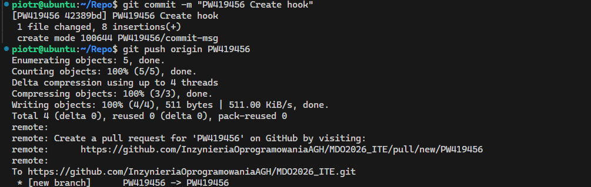
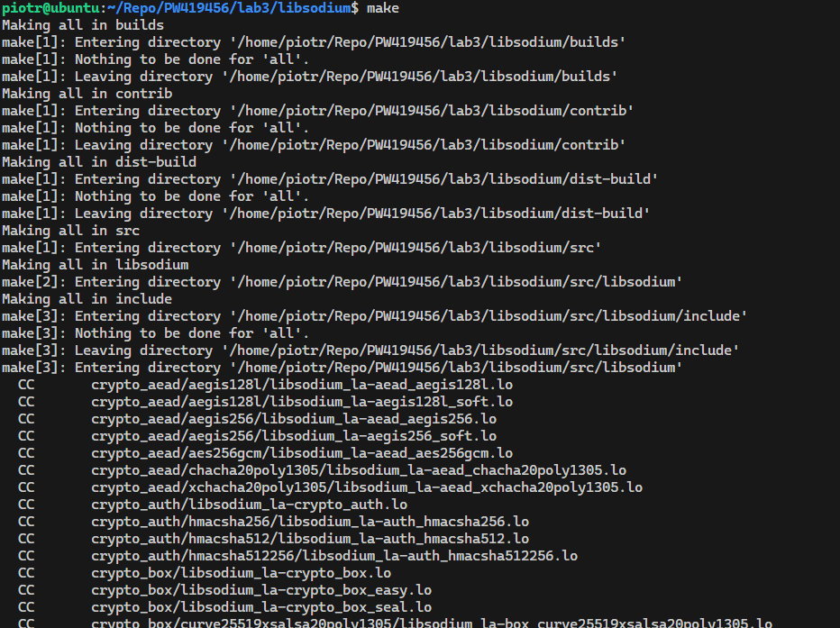
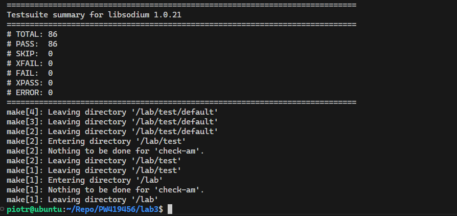
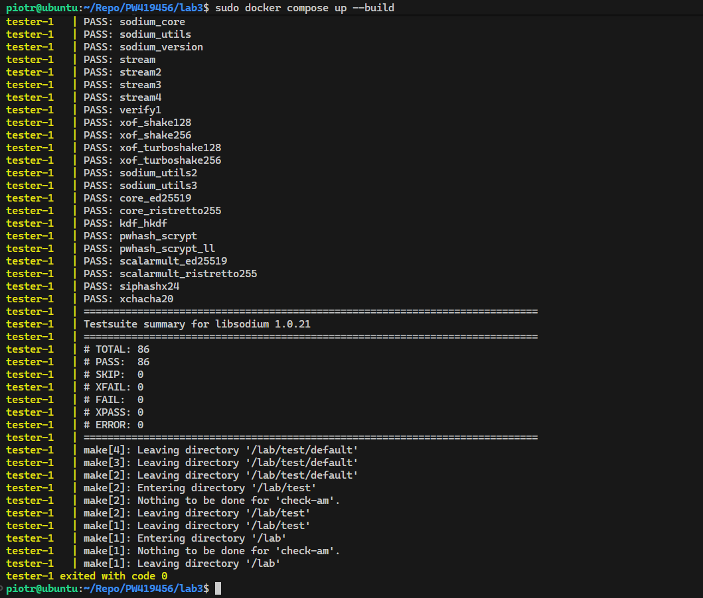

# Sprawozdanie zbiorcze - Git, SSH, Docker i konteneryzacja

**Piotr Walczak 419456**

---

## 1. Git, środowisko pracy i uwierzytelnianie SSH

W pierwszym etapie skonfigurowano środowisko pracy. Zainstalowano program `git` oraz pakiet `openssh-client`. Repozytorium zostało sklonowane z wykorzystaniem wygenerowanego tokenu Personal Access Token (PAT).
Narzędzia pracy, takie jak Visual Studio Code oraz FileZilla, zostały skonfigurowane do łączenia z wirtualną maszyną i przesyłu danych poprzez protokół SFTP z użyciem kluczy publicznych, co umożliwiło szybką pracę na systemie operacyjnym bez przymusu ciągłego podawania hasła.

Wygenerowano z powodzeniem dwa typy kluczy SSH w terminalu: `ed25519` (zabezpieczony hasłem) oraz szybszy `ecdsa` (bez hasła). Ponadto zweryfikowano w serwisie GitHub aktywność opcji logowania dwuetapowego (2FA).


---

## 2. Praca na gałęziach i kontrola commitów (Git Hooks)

Repozytorium zajęciowe zostało przygotowane do wyizolowanej pracy indywidualnej. Z gałęzi grupowej `grupa6` utworzono i przełączono się na gałąź przypisaną konkretnie pod nr indeksu: `PW419456`.
Zaimplementowano własny mechanizm weryfikujący poprawność wysyłanych zmian. Skrypt (tzw. hook) został napisany w powłoce bash, a następnie zaaplikowany do folderu `.git/hooks/commit-msg`. Skrypt zmuszał lokalnego gita do przerwania działania, jeżeli wiadomość nowo utworzonego commita nie zaczynała się od prefiksu identyfikatora (PW419456). Działanie przetestowano odrzuceniem błędnego wpisu i bezproblemową przepustowością dla poprawnego prefiksu.

```bash
#!/usr/bin/env bash

COMMIT_MSG_FILE=$1

if ! head -n 1 "$COMMIT_MSG_FILE" | grep -q "^PW419456"; then
  echo "Commit msg has to start with: PW419456"
  exit 1
fi
```




---

## 3. Instalacja Dockera i podstawy pracy z obrazami

Zainstalowano silnik Dockera według oficjalnych instrukcji środowiska Ubuntu oraz z powodzeniem stworzono dedykowane konto w Docker Hub do magazynowania obrazów. Do systemu operacyjnego dociągnięto wyjściowe, minimalne obrazy dla kontenerów takie jak znany obraz powitalny `hello-world`, `busybox` czy standardowy system operacyjny `ubuntu`. Zweryfikowano fizyczne rozmiary ściągniętych obrazów.
Dla środowiska kontenerowego wykonano interaktywne uruchomienia, uzyskując m.in. powłokę shell dla busybox i ubuntu. Wewnątrz podsystemu ubuntu przetestowano widoczność własnych procesów wykazując proces działającej powłoki bash dla PID 1. W celach demonstracyjnych zaktualizowano pakiety apt izolowanego systemu.


---

## 4. Własny Dockerfile i czyszczenie środowiska

Praktycznie zaaplikowano system budujący własne oprogramowanie kontenera po użyciu pliku z instrukcjami konfiguracyjnymi `Dockerfile`. Zbudowano obraz operacyjny, który w najniższej warstwie startował od `ubuntu:22.04`. Do jego warstwy wniesiono obsługę narzędzia wiersza poleceń `git` przy równoczesnym inteligentnym usunięciu śladów cache repozytorium apt. Sklonowano repozytorium GitHub przedmiotu we wskazanym folderze roboczym `workdir`.
Na zakończenie pierwszej sesji z narzędziami konteneryzacji usunięto porzucone, osierocone warstwy oraz uśpione kontenery (polecenia wywołujące funkcję `prune`).

```dockerfile
FROM ubuntu:22.04

RUN apt-get update && \
    apt-get install -y git && \
    rm -rf /var/lib/apt/lists/*

WORKDIR /workdir

RUN git clone https://github.com/InzynieriaOprogramowaniaAGH/MDO2026_ITE.git

CMD ["/bin/bash"]
```


---

## 5. Kompilacja oprogramowania i budowanie wieloetapowe (libsodium)

W kolejnym kroku badano proces budowania (build) aplikacji i jego powtarzalność. Wykorzystano darmową kryptograficzną bibliotekę narzędziową z języka C: `libsodium`. Z repozytorium, po przejściu na stabilny branch, proces budowy ręcznej wymagał środowisk takich jak make, gcc oraz autoconf, finalnie doprowadzając oprogramowanie do uruchomienia procedury `make check`. Wykazano powtarzalność kompilacji instalując narzędzia manualnie we włączonym w terminalu gołym obrazie Ubuntu 22.04.

Czynności te usprawniono formalizując proces na stałe poprzez pliki Dockera. Ustalono wieloetapową platformę - sporządzono obraz budujący w pliku `Dockerfile.build` zawierający gita, GCC oraz makra do kompilacji ze źródeł, a z niego, w kolejnym obrazie wynikowym z the pliku `Dockerfile.test` przeprowadzono wywołanie uruchomienia samych przygotowanych procesów weryfikacji. Automatyzację uruchamiania wielu plików Docker zbudowano przy pomocy `docker-compose.yml`.





---

## 6. Zachowywanie stanu i woluminy

Przeprowadzono ćwiczenia potwierdzające efemeryczny (ulotny) charakter danych we wnętrzu typowego, surowego kontenera. Wykorzystano więc system zarządzania danymi trwałymi, budując dwa woluminy: wolumin wprowadzający (służący zrzuceniu kodu) oraz wolumin wyprowadzający artefakty po procesie obróbki (output-vol).
Sprawdzono dwa sposoby wykorzystywania woluminów. Pierwszy zakładał wstawienie paczki repozytoriów programem w kontenerze Alpine, a następnie montaż przez budującego poleceniami powłoki basha. Drugi bazował na zamontowaniu zasobów bezpośrednio przy podłączaniu parametrów (w tym z parametrem bind `RUN --mount`), udowadniając znikome osadzanie obcego i zbędnego kodu deweloperskiego. Po odłączeniu maszyny dockera skompilowana biblioteka pozostała zabezpieczona na woluminie.


---

## 7. Komunikacja kontenerów (Sieci) i wbudowane usługi SSHD

Ustanowiono architekturę demonstracyjnej łączności międzykontenerowej z wykorzystaniem `iperf3`. Rozpoczęto zestawianie od uruchomienia instancji aplikacji testującej poprzez klasyczną, standardową sieć mostkową na losowym przypisanym adresie IP, z którym nawiązano styk i wymianę pakietów.
O wiele skuteczniejszym podejściem było wymuszenie stworzenia przez Dockera oddzielnej sieci dla projektów o tytule `lab-net`, wspierającej bezproblemową adresację domenową (wewnątrzsieciowy DNS dla kontenerów po etykietach instancji). Dokonano też pełnoprawnej ekspozycji wirtualnego portu na platformę systemu operacyjnego Gospodarza.

Sprawdzono ponadto nietypowe, kontrowersyjne zastosowanie Dockera (stanowiące w ogólnym pojęciu antywzorzec) – w systemie podinstalowano narzędzie demona SSH (`openssh-server`). Pozwoliło to na w pełni operacyjne, ręczne zalogowanie się pod konsolę po zaaplikowanym porcie lokalnym (2222) używając konta root.


---

## 8. Klaster Jenkinsa z architekturą Docker in Docker (DinD)

Finalnym etapem przygotowującym instalacje dla CI/CD była operacja kompilująca platformę automatyzacyjną Jenkins wraz z towarzyszącym gniazdem kontenerów (proces DinD - Docker in Docker). Przygotowano konfigurację klastra dla środowiska w pliku manifestu YAML spinając środowisko w spójnej i zabezpieczonej sieci podrzędnej. System otrzymał stosowne zmapowane woluminy pozwalające w przyszłości zatrzymać postępy budowania pipeline. 
Uruchomiono mechanizm bez interwencji z zewnątrz. Wykazano w terminalu, posługując się poleceniem wewnętrznym Dockera `exec`, bezpieczne wydobycie hasła dostępu do początkowego formularza GUI, logując się do oprogramowania Continuous Integration od strony okna przeglądarki.


---

## 9. Podsumowanie

Ćwiczenia wykonane w laboratoriach 1-4 z wprowadziły w cykl tematów z tematu inżynierii DevOps i budowania fundamentów CI/CD. Zaczęto od konfiguracji gita (branching, stosowanie bezpiecznych obwarowań i automatyzacji powłoki na styku git hooków) oraz komunikacji i przesyłu kluczami publicznymi. Znaczna objętość skupiła się na dogłębnym badaniu architektur budowy izolacji środowiska – od prozaicznych komend i pisania schematów instruktażowych w `Dockerfile` i badaniu ulotnego charakteru danych w instancjach procesów linuksa, poprzez powtarzające się scenariusze `docker compose`. Zaawansowane struktury oparły się o manipulacje sieciami na warstwie mostkowej, podpinaniem stacji współdzielących magazyny, a także integracji środowiska z architekturą hostującą narzędzia z rodziny DinD przeznaczoną stricte na potrzeby platform kontrolnych takich jak popularny Jenkins.