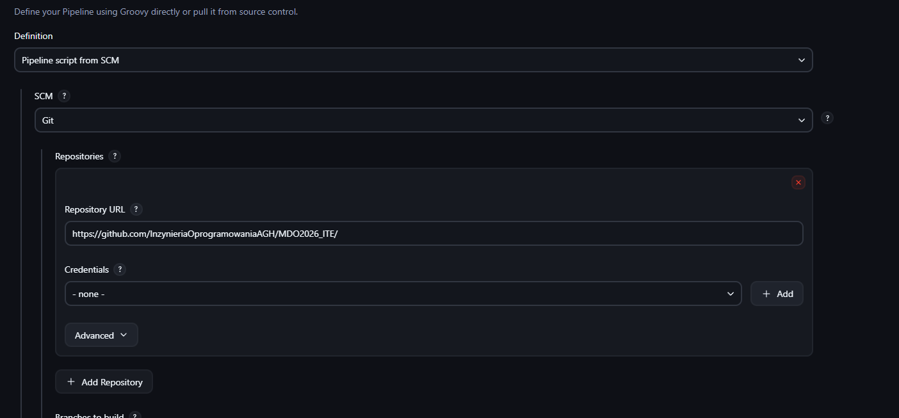
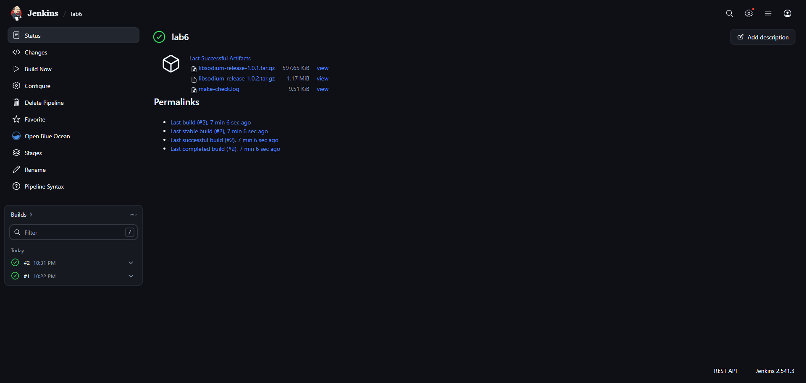
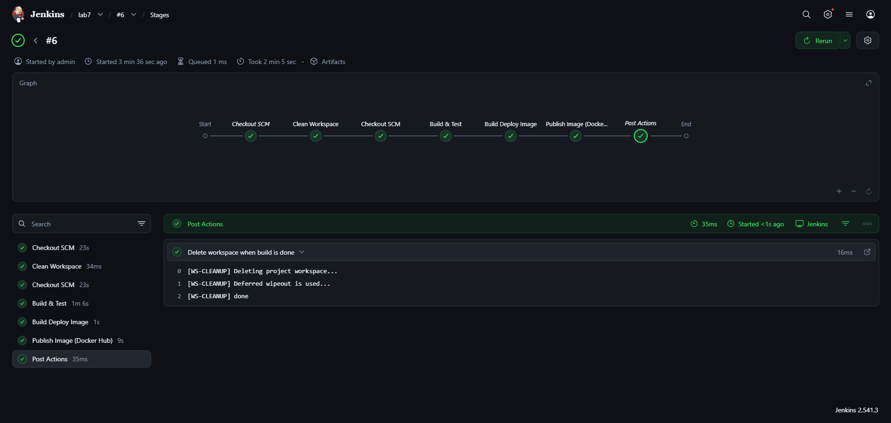
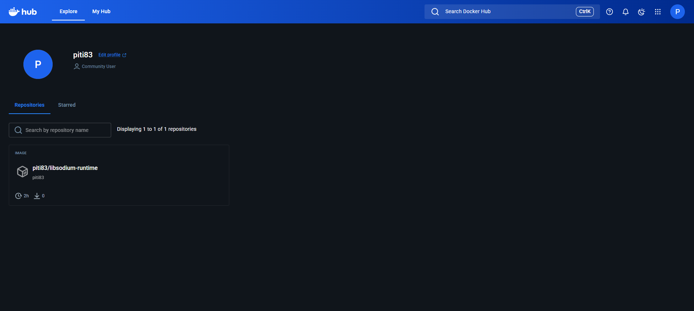
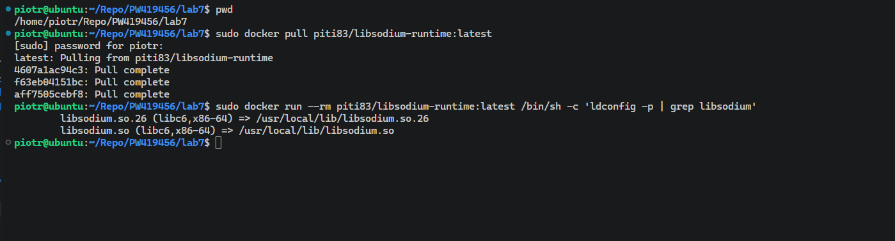
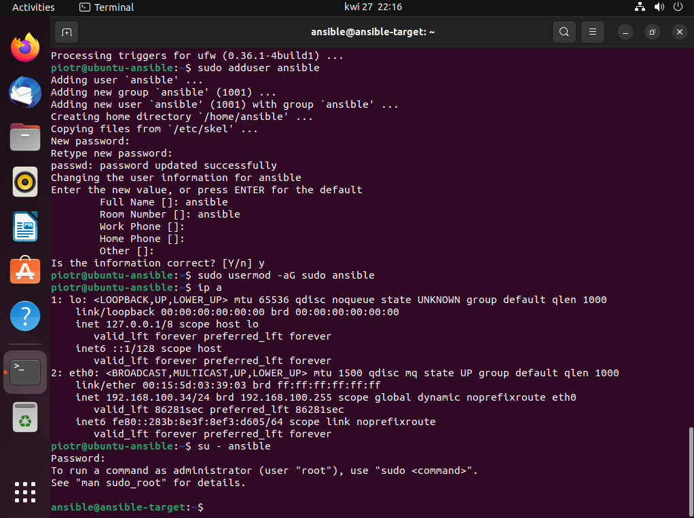
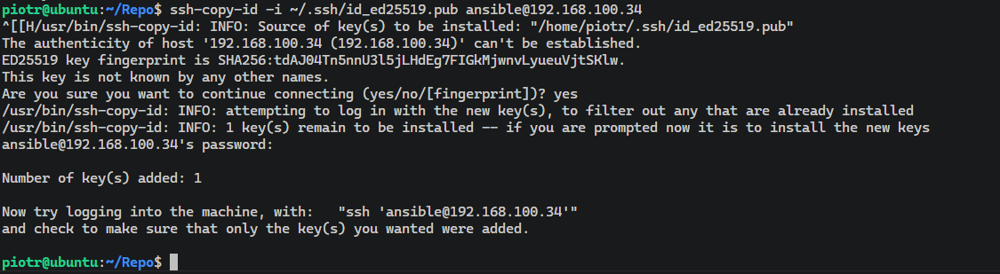

# Sprawozdanie zbiorcze 5-7 - Ciągła Integracja, Wdrażanie i Automatyzacja

**Piotr Walczak 419456**

---

## 1. Klaster Jenkinsa i środowisko Docker-in-Docker (DinD)

Pierwszym etapem prac było przygotowanie od podstaw klastra Jenkinsa, który potrafi natywnie zarządzać kontenerami. Zamiast korzystać z czystego obrazu, utworzono dedykowany `Dockerfile.jenkins` bazujący na oficjalnej wersji `lts-jdk17`. Obraz ten został wzbogacony o klienta `docker-ce-cli` oraz wtyczkę `blueocean`, co umożliwiło nowoczesną wizualizację potoków. Całość została spięta plikiem `docker-compose.yml`, w którym uruchomiono dwa powiązane kontenery: serwer Jenkinsa oraz zagnieżdżonego demona Dockera (proces DinD uruchomiony w trybie uprzywilejowanym). Zadbano o bezpieczeństwo i trwałość danych poprzez zmapowanie woluminów `jenkins-data` (przechowującego konfigurację i logi) oraz certyfikatów TLS, dzięki czemu środowisko jest odporne na awarie i restarty kontenerów.

W ramach testów operacyjnych utworzono proste zadania typu *Freestyle project*. Pierwsze zadanie weryfikowało komunikację z powłoką, wykonując polecenie `uname -a`, które poprawnie zwróciło informacje o jądrze systemu Linux. Kolejne zadanie realizowało skrypt sprawdzający parzystość aktualnej godziny, celowo generując błąd (`exit 1`) dla godzin nieparzystych, aby przetestować reakcję Jenkinsa na awarię potoku. Skonfigurowano również zadanie weryfikujące poprawność działania klienta Docker, które skutecznie pobrało obraz Ubuntu (`docker pull ubuntu`). Na zakończenie, wprowadzając się w automatyzację, stworzono pierwszy, deklaratywny potok *Pipeline*, który sklonował repozytorium z gałęzi `PW419456` i pomyślnie zbudował podstawowy obraz używając pliku `Dockerfile.build`.

---

## 2. Złożone potoki CI/CD i wieloetapowe budowanie (Multi-stage Build)

W laboratorium 6 skupiono się na profesjonalnym potoku budowania aplikacji, wybierając do tego celu kryptograficzną bibliotekę `libsodium` udostępnianą na otwartej licencji. Kluczowym elementem było zdefiniowanie pliku `Dockerfile.ci`, który implementuje architekturę wieloetapową (multi-stage build) w celu optymalizacji i zabezpieczenia ostatecznego obrazu. 

Proces podzielono na logiczne fazy:
1. **Baza i Budowanie:** Najpierw przygotowano ciężki obraz `builder` z wymaganymi kompilatorami (`build-essential`, `autoconf`), w którym sklonowano kod źródłowy biblioteki i przeprowadzono jej kompilację za pomocą narzędzia `make`.
2. **Testowanie:** Wyizolowano kontener `tester`, którego jedynym zadaniem było wykonanie instrukcji `make check` weryfikującej poprawność kompilacji kodów kryptograficznych.
3. **Wdrażanie:** Ostateczny obraz produkcyjny `deploy` został wyczyszczony ze wszystkich narzędzi deweloperskich; skopiowano do niego jedynie niezbędne pliki wynikowe `.so`, co drastycznie zmniejszyło jego wagę i zredukowało powierzchnię potencjalnego ataku.

Logika automatyzacji została w pełni zdefiniowana w pliku `Jenkinsfile`. Po fazie budowy i testów, Jenkins uruchamiał tak zwany *Smoke Test* – instancjonował tymczasowy kontener produkcyjny i sprawdzał linkerem (`ldconfig -p | grep libsodium`), czy biblioteka jest w ogóle widziana przez system. W celach archiwizacyjnych, potok automatycznie wydobywał logi z testów oraz generował paczkę `.tar.gz` z plikami binarnymi, która trafiała do zakładki "Artifacts" w Jenkinsie. Zapewniono również jasną identyfikowalność poprzez wersjonowanie dynamiczne, bazujące na zmiennej `BUILD_NUMBER` (np. 1.0.5).

---

## 3. Publikacja obrazów w Docker Hub i konfiguracja infrastruktury pod Ansible

W siódmym laboratorium potok CI/CD został udoskonalony o zdolność wdrażania artefaktów na zewnątrz infrastruktury wewnętrznej. Konfigurację zadania w Jenkinsie przestawiono na pełne odczytywanie skryptu `Jenkinsfile` bezpośrednio ze wskazanego repozytorium GitHub, wymuszając jednocześnie sprzątanie przestrzeni roboczej procedurą `cleanWs()` przed każdym nowym uruchomieniem, co zapobiega problemom ze starym cache'm.

W Jenkinsie utworzono bezpieczne poświadczenia dla konta w usłudze Docker Hub. Potok został rozbudowany o etap `Publish Image`, w którym Jenkins automatycznie logował się do rejestru zewnętrznego i tagował zbudowany wcześniej lekki obraz wdrożeniowy (wersją konkretną oraz tagiem `latest`). Następnie poleceniem `docker push` artefakt wysyłano w świat. Aby rzetelnie udowodnić realizację założeń "Definition of Done", na zupełnie niezależnej maszynie gospodarza wykonano pobranie tego obrazu (`docker pull`) i sprawdzono poprawne załadowanie biblioteki `libsodium` poprzez uruchomienie procesu interaktywnego.

Na koniec przygotowano grunt pod systemy zarządzania konfiguracją, stawiając nową maszynę wirtualną `ansible-target`. Zainstalowano na niej pakiet `openssh-server`, dodano dedykowanego użytkownika z prawami do `sudo` i pobrano jej adres IP. Na maszynie sterującej, po instalacji głównego oprogramowania Ansible, wyeksportowano publiczny klucz SSH do hosta docelowego za pomocą komendy `ssh-copy-id`. Przetestowano łączność, potwierdzając możliwość bezpośredniego połączenia się z maszyną bez monitu o hasło, co jest kluczowym wymogiem dla zautomatyzowanych playbooków Ansible.

