# Sprawozdanie zbiorcze 8-12

**Piotr Walczak 419456**

---

## 1. Automatyzacja konfiguracji maszyn za pomocą Ansible

W laboratorium 8 głównym celem było przejście od ręcznej konfiguracji środowiska do automatycznego zarządzania maszynami przy pomocy Ansible. Przygotowano komunikację SSH z maszyną docelową `ansible-target`, a następnie zdefiniowano statyczny plik `inventory.ini`, w którym rozdzielono hosty na grupy `[Orchestrators]` oraz `[Endpoints]`. Poprawność konfiguracji sprawdzono modułem `ping`, potwierdzając zarówno dostępność hostów, jak i działanie bezhasłowego uwierzytelniania SSH.

Pierwszy playbook, `system_playbook.yml`, wykonywał operacje administracyjne na systemach: testował połączenie, kopiował plik inwentaryzacji na hosty końcowe, instalował pakiet `rng-tools`, wykonywał aktualizację pakietów `apt` w trybie bezinteraktywnym oraz restartował usługi `sshd` i `rng-tools`. Wykorzystano przy tym warunki `when`, pętle `loop` oraz uprawnienia podwyższone przez `become`, dzięki czemu ten sam playbook mógł działać poprawnie zarówno lokalnie, jak i na maszynie końcowej.

Drugim elementem było wdrożenie artefaktu utworzonego w poprzednich laboratoriach. Playbook `deploy_playbook.yml` instalował silnik Dockera, pobierał obraz `piti84/libsodium-runtime:latest` z Docker Hub, uruchamiał kontener w tle i wykonywał test poprawności przez sprawdzenie obecności biblioteki `libsodium` poleceniem `ldconfig -p`. Na końcu logika wdrożenia została wydzielona do roli `deploy_app_role`, wygenerowanej narzędziem `ansible-galaxy`, co uporządkowało strukturę projektu i zwiększyło możliwość ponownego użycia kodu.

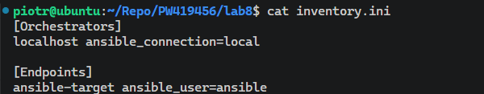
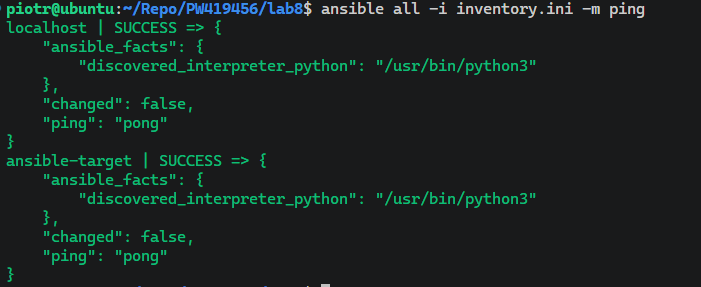
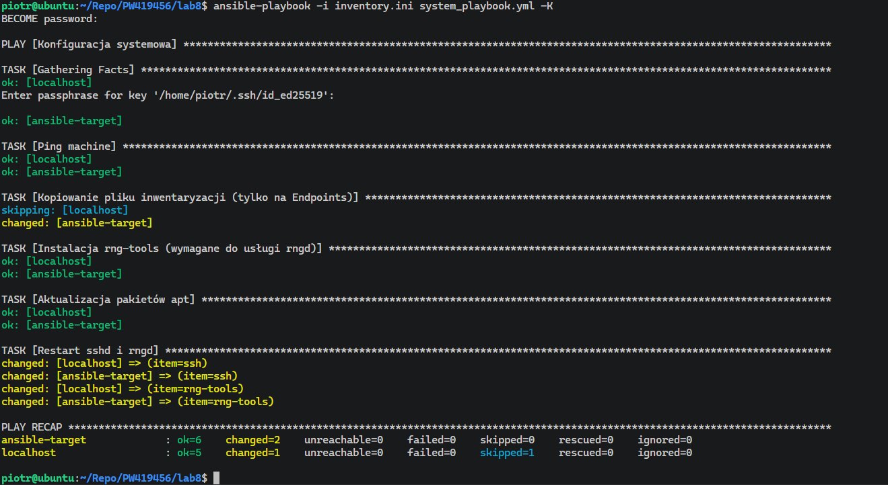
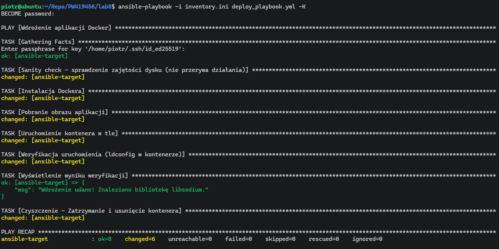
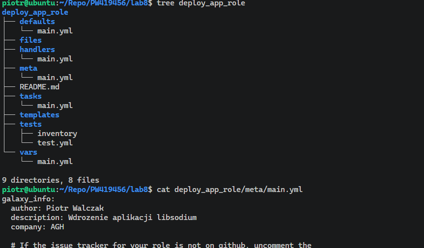

---

## 2. Instalacja nienadzorowana systemu i automatyczny start kontenera

Laboratorium 9 dotyczyło przygotowania instalacji nienadzorowanej systemu Fedora z wykorzystaniem pliku *Kickstart*. Przygotowano plik `fedora-ks.cfg`, który definiował źródła instalacji, repozytoria, konfigurację języka i strefy czasowej, sieć, nazwę hosta `fedora-pw419456-auto`, użytkownika administracyjnego `ansible`, czyszczenie dysku oraz automatyczne partycjonowanie z użyciem LVM. W sekcji `%packages` uwzględniono pakiety potrzebne do późniejszej pracy z kontenerami, w tym `moby-engine`.

Plik odpowiedzi został udostępniony z hosta przy pomocy prostego serwera HTTP uruchomionego komendą `python3 -m http.server 8000`. W środowisku Hyper-V przygotowano nową maszynę wirtualną, wyłączono Secure Boot i podczas startu instalatora zmodyfikowano wpis GRUB, dopisując parametr `inst.ks=` wskazujący adres pliku Kickstart. Dzięki temu instalator samodzielnie pobrał konfigurację i przeprowadził cały proces bez dalszej interwencji użytkownika.

Kluczową częścią rozwiązania była sekcja `%post`, uruchamiana po zainstalowaniu systemu. W jej ramach włączono usługę Dockera oraz wygenerowano jednostkę systemd `libsodium-app.service`. Usługa ta po starcie systemu pobiera obraz `piti83/libsodium-runtime:latest` i uruchamia kontener `libsodium-app`. Po restarcie maszyny zweryfikowano poprawną nazwę hosta, stan demona Dockera oraz działający kontener widoczny w wyniku `docker ps`.

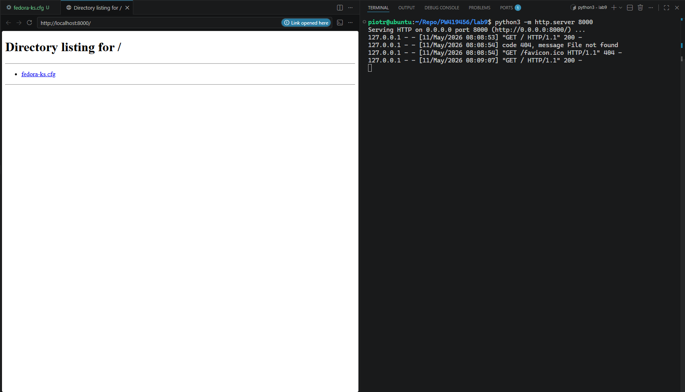
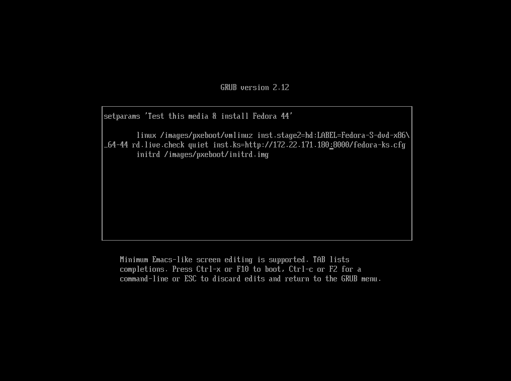
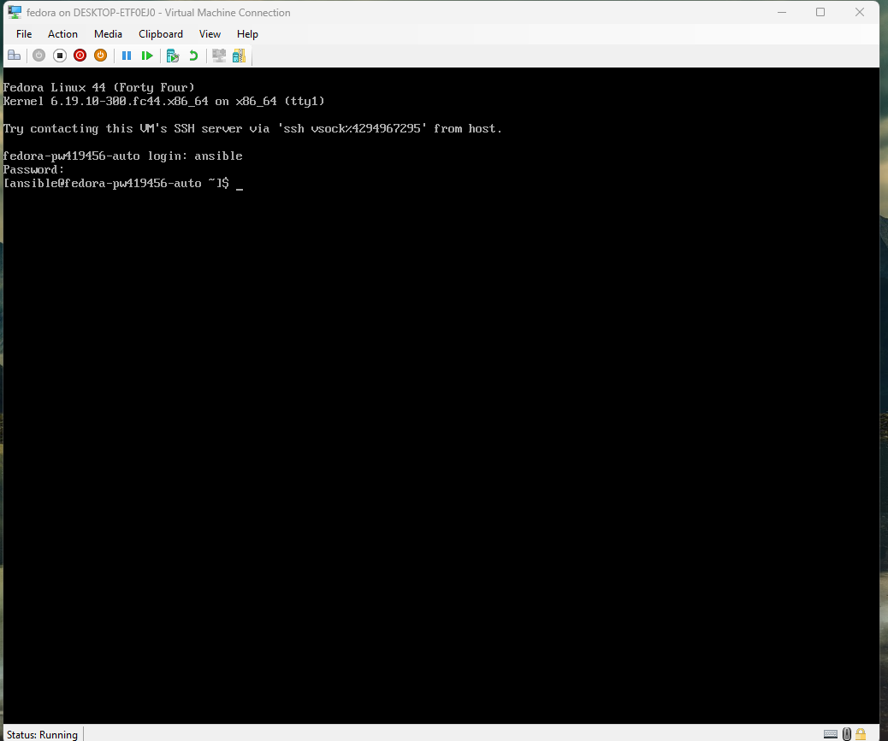
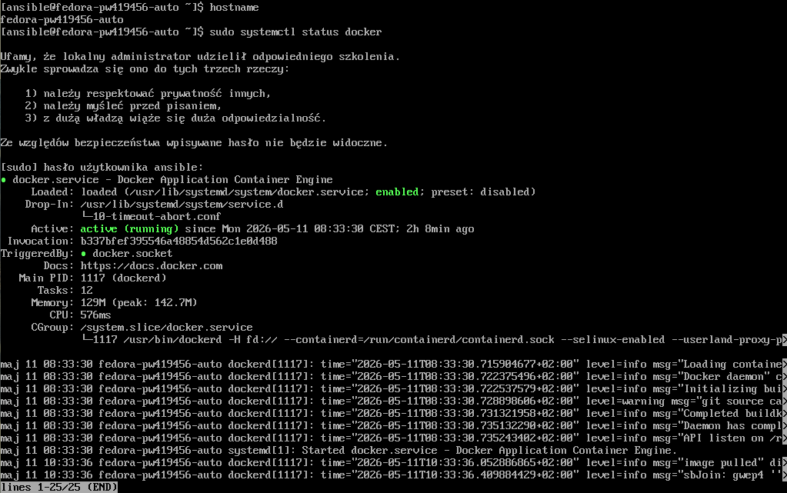
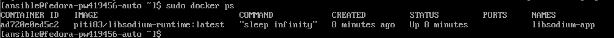

---

## 3. Pierwsze wdrożenie aplikacji w Kubernetes z użyciem Minikube

W laboratorium 10 rozpoczęto pracę z Kubernetesem. Zainstalowano `minikube`, skonfigurowano obsługę `kubectl` oraz uruchomiono lokalny klaster z wykorzystaniem sterownika `docker`, przydzielając mu 2048 MB RAM i 2 rdzenie CPU. Poprawność działania klastra potwierdzono poleceniem `kubectl get nodes`, a dodatkowo uruchomiono panel `minikube dashboard`, pozwalający obserwować zasoby klastra z poziomu interfejsu graficznego.

Jako aplikację testową przygotowano prostą stronę HTML serwowaną przez Nginx. Plik `Dockerfile` bazował na obrazie `nginx:alpine` i kopiował własny plik `index.html` do katalogu `/usr/share/nginx/html`. Obraz zbudowano jako `piti83/k8s-nginx-app:latest`, wypchnięto do Docker Hub i lokalnie sprawdzono jego działanie przez uruchomienie kontenera oraz zapytanie `curl`.

Wdrożenie w Kubernetes wykonano najpierw ręcznie, tworząc pojedynczy Pod poleceniem `kubectl run lab10-pod`. Po potwierdzeniu statusu `Running` zestawiono tunel `kubectl port-forward`, co umożliwiło sprawdzenie odpowiedzi aplikacji z poziomu hosta. Następnie przygotowano podejście deklaratywne w pliku `deployment.yaml`, definiując obiekt typu *Deployment* z czterema replikami. Aplikację udostępniono przez *Service* typu `ClusterIP`, a końcowy test wykonano przez `port-forward` do serwisu.

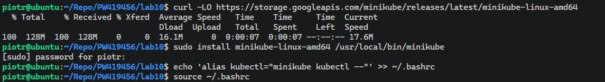
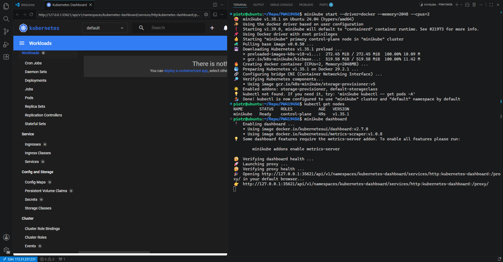
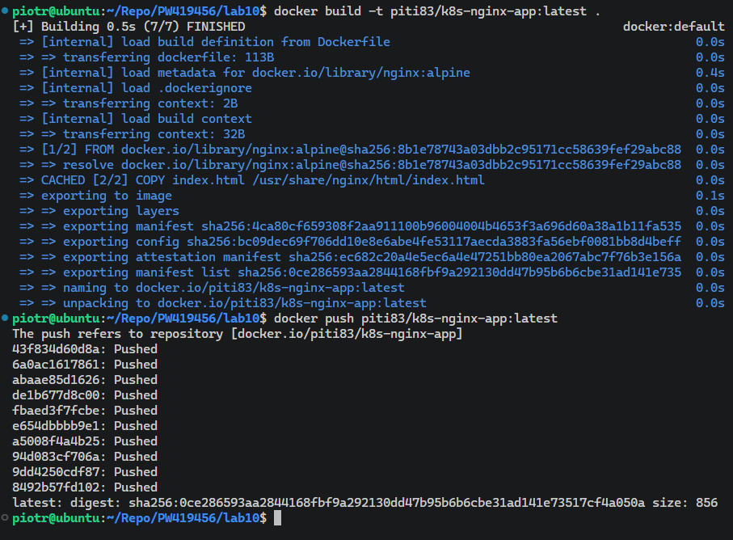
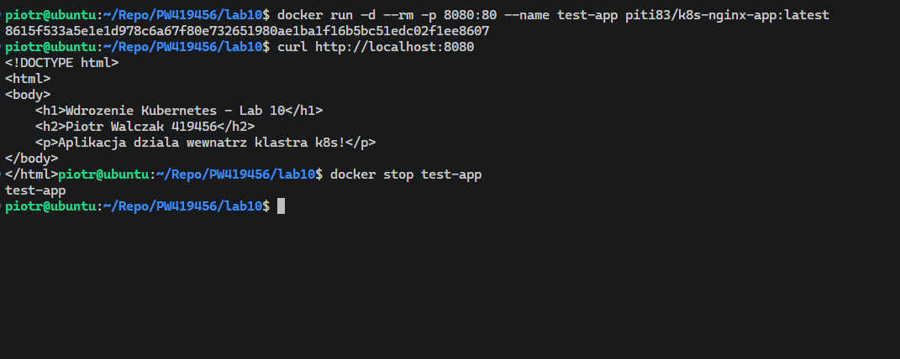
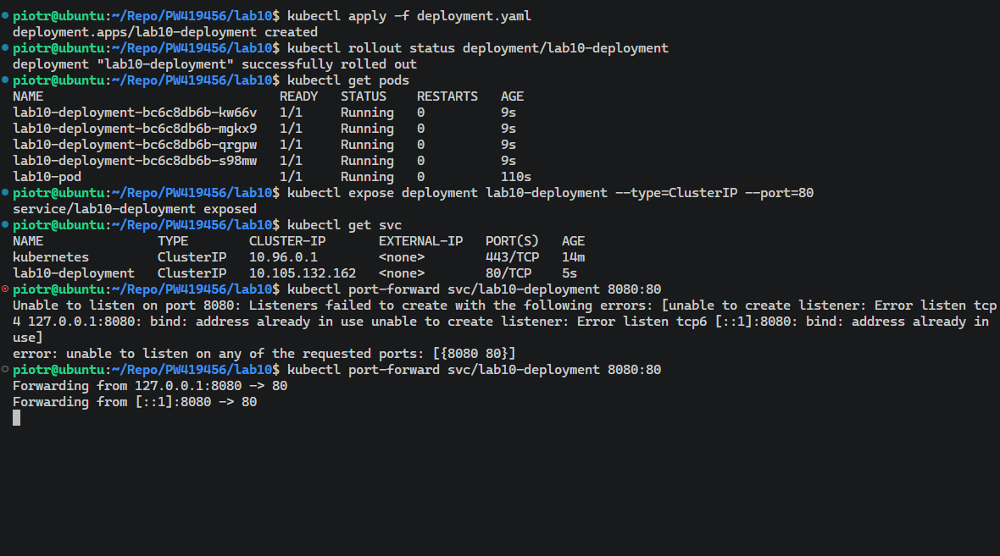
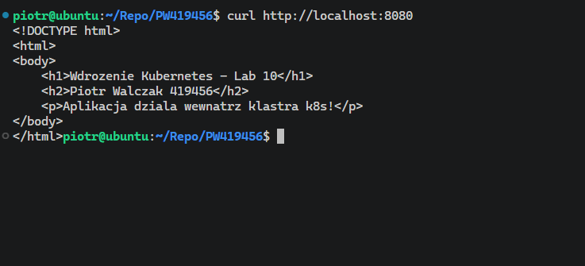

---

## 4. Skalowanie, aktualizacje i strategie wdrażania w Kubernetes

Laboratorium 11 rozwijało poprzednie wdrożenie o zarządzanie cyklem życia aplikacji w Kubernetes. Przygotowano kilka wersji obrazu Nginx: stabilną `v1`, zaktualizowaną `v2` oraz celowo uszkodzoną `faulty`, której kontener kończył pracę błędem już przy starcie. Obrazy zostały zbudowane lokalnie i opublikowane w Docker Hub, aby klaster mógł je pobierać podczas aktualizacji deploymentu.

Pierwszym testowanym mechanizmem było skalowanie. Deployment uruchomiono z czterema replikami, a następnie dynamicznie zmieniano ich liczbę poleceniem `kubectl scale`: najpierw do 8, później do 1, następnie do 0 i ponownie do 4. Kubernetes automatycznie doprowadzał stan rzeczywisty do stanu oczekiwanego, tworząc nowe Pody lub usuwając nadmiarowe instancje bez konieczności ręcznej ingerencji w pojedyncze kontenery.

Następnie sprawdzono aktualizacje obrazu przez `kubectl set image`. Aktualizacja do wersji `v2` zakończyła się poprawnie, natomiast wdrożenie obrazu `faulty` spowodowało błędy uruchamiania nowych Podów. Kubernetes zatrzymał rollout, pozostawiając możliwość przywrócenia stabilnej wersji. Do wycofania zmian użyto `kubectl rollout undo`, po czym błędne Pody zostały usunięte, a aplikacja wróciła do poprawnego działania. Dodatkowo przygotowano skrypt `check_rollout.sh`, który automatycznie sprawdza status wdrożenia z limitem 60 sekund.

Na końcu porównano strategie wdrożeń. W strategii `Recreate` wszystkie stare Pody były najpierw wyłączane, a dopiero później uruchamiane w nowej wersji, co powoduje chwilową niedostępność aplikacji. Przetestowano również wariant *Canary Deployment*, w którym wersja `v1` działała w trzech replikach, a wersja `v2` w jednej replice pod wspólnym serwisem. Seria zapytań `curl` wykonana z wnętrza klastra potwierdziła rozdzielanie ruchu między starą i nową wersję aplikacji.

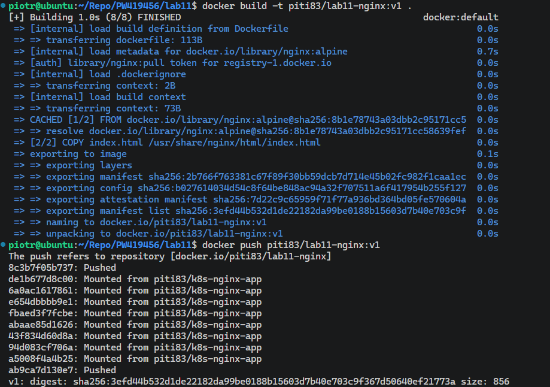
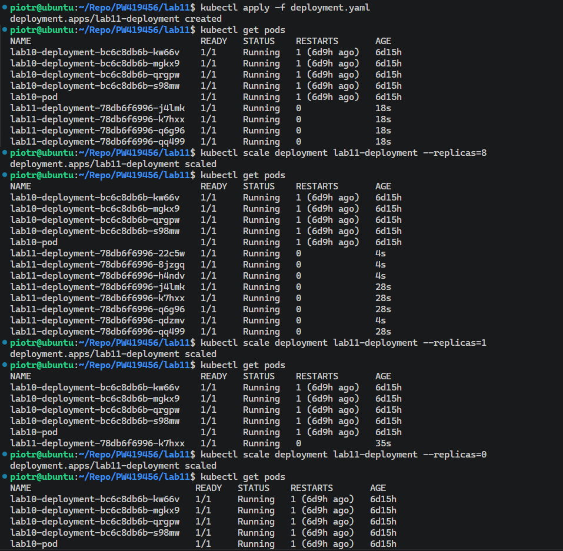
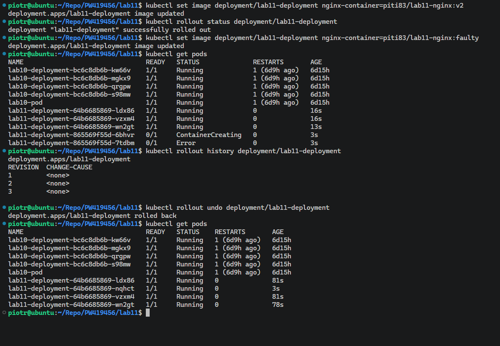
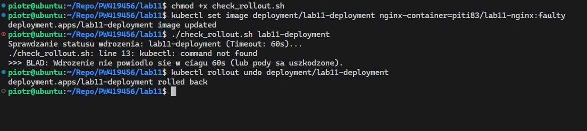
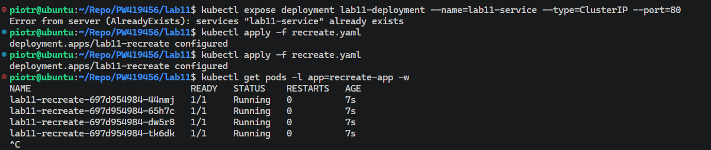
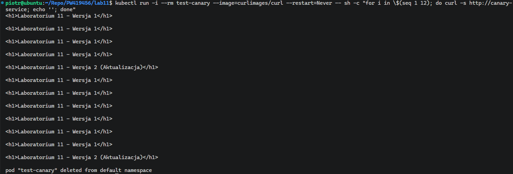

---

## 5. Wdrożenie kontenera w chmurze Microsoft Azure

Ostatnie laboratorium przeniosło wcześniej przygotowane umiejętności konteneryzacji do środowiska chmurowego. Zamiast pełnego klastra Kubernetes użyto usługi Azure Container Instances, która pozwala uruchomić pojedynczy kontener bez samodzielnego zarządzania maszyną wirtualną lub klastrem. Przygotowano prostą aplikację HTTP opartą o obraz `python:3.9-alpine`, uruchamiającą wbudowany serwer `python -m http.server` na porcie `8080`. Gotowy obraz opublikowano w Docker Hub jako `piti83/azure-lab12:latest`.

Prace wykonano w Azure Cloud Shell z użyciem narzędzia `az`. Ze względu na ograniczenia konta studenckiego i problemy z dostępnością zasobów w popularnych regionach, wybrano region `norwayeast`. Utworzono grupę zasobów `Lab12_PW419456`, a następnie wdrożono kontener poleceniem `az container create`, wskazując obraz z Docker Hub, port publiczny `8080` oraz etykietę DNS `pw419456-lab12-app`.

Po zakończonym provisioningu pobrano dane instancji, w tym publiczny adres FQDN. Działanie usługi sprawdzono poleceniem `curl`, które zwróciło treść strony HTTP. Dodatkowo pobrano logi kontenera komendą `az container logs`, co potwierdziło obsłużenie zapytania GET przez aplikację. Na zakończenie usunięto całą grupę zasobów poleceniem `az group delete`, aby nie generować dalszych kosztów w subskrypcji Azure.

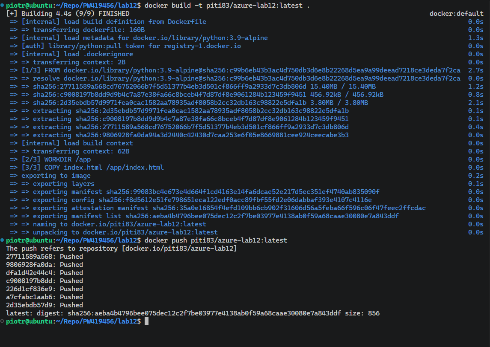
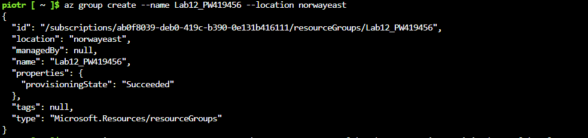
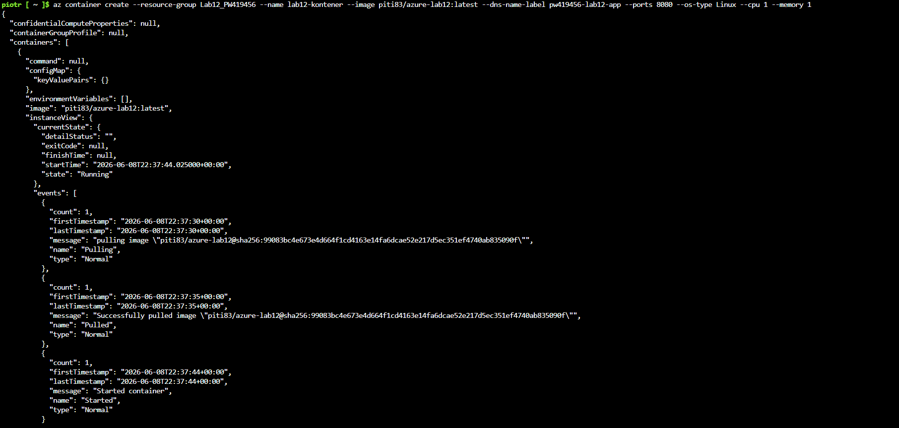
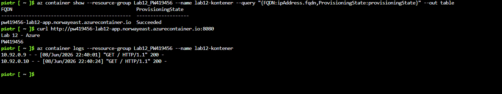
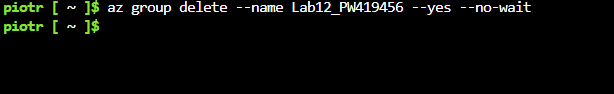

---

## 6. Podsumowanie

Laboratoria 8-12 stanowiły rozszerzenie wcześniejszych ćwiczeń z konteneryzacji i CI/CD o automatyzację infrastruktury, instalację systemów, orkiestrację oraz wdrożenia chmurowe. Ansible pozwolił sformalizować konfigurację hostów i wdrażanie obrazów Dockera bez ręcznego wykonywania powtarzalnych poleceń. Kickstart pokazał, że automatyzacji może podlegać nawet sam proces instalacji systemu operacyjnego, łącznie z poinstalacyjnym uruchomieniem usługi kontenerowej.

W części Kubernetes przećwiczono przejście od pojedynczego Poda do deklaratywnych deploymentów, serwisów, skalowania replik, aktualizacji obrazów, rollbacków oraz strategii ograniczających ryzyko wdrożenia nowej wersji. Ostatnie laboratorium potwierdziło, że ten sam artefakt kontenerowy może zostać przeniesiony do chmury i uruchomiony jako zarządzalna instancja ACI. Cały cykl pokazuje pełną ścieżkę DevOps: od konfiguracji maszyn i budowy artefaktu, przez automatyczne wdrożenia, aż do pracy w klastrze i chmurze publicznej.
