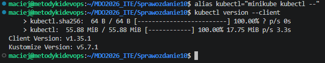
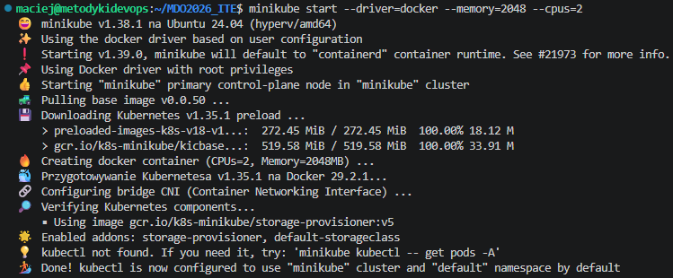
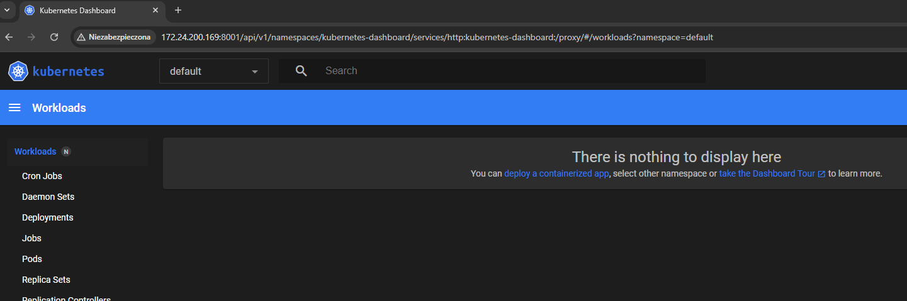
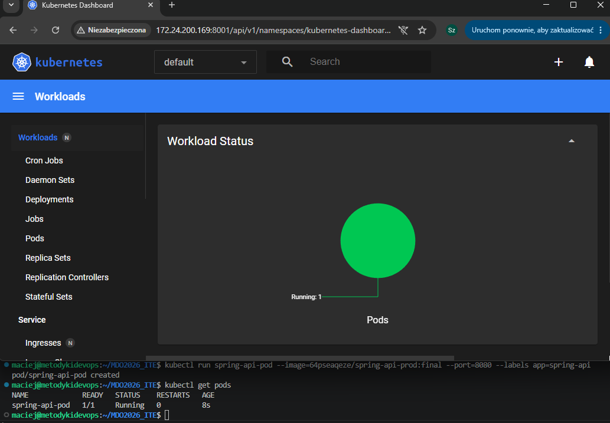
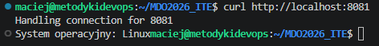
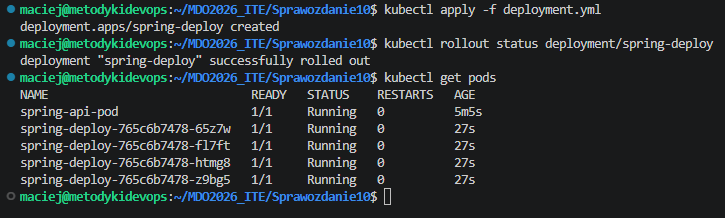
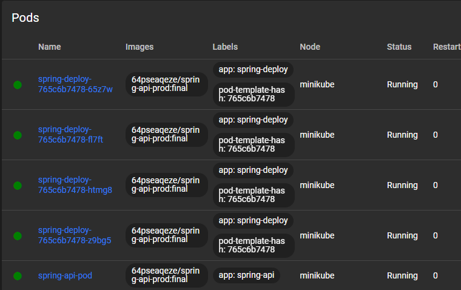
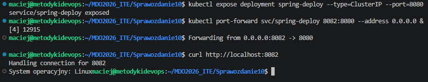

# Sprawozdanie z Zajęć 10 - Wdrażanie na zarządzalne kontenery: Kubernetes (1)
**Autor:** Maciej Szewczyk (MS422035)  
**Kierunek:** ITE | **Grupa:** G6

## 1. Instalacja klastra i mitygacja problemów sprzętowych
Pracę z orkiestratorem Kubernetes rozpoczęto od przygotowania implementacji stosu przy użyciu narzędzia `minikube`. W pliku profilu użytkownika `.bashrc` wprowadzono stały alias dla polecenia `kubectl`, aby ułatwić zarządzanie środowiskiem.

Podczas inicjalizacji klastra napotkano błąd alokacji zasobów (zbyt mała ilość dostępnej pamięci RAM w systemie). Problem zmitygowano na poziomie hypervisora (Hyper-V), zwiększając pamięć startową maszyny wirtualnej z 2048 MB do 4096 MB. Po ponownym uruchomieniu, klaster został pomyślnie zainicjowany.

## 2. Uruchomienie i weryfikacja Kubernetes Dashboard
W celu umożliwienia graficznego zarządzania klastrem z poziomu hosta (bez środowiska graficznego na maszynie wirtualnej), uruchomiono narzędzie Kubernetes Dashboard. Następnie powołano serwer proxy nasłuchujący na wszystkich interfejsach (`0.0.0.0`), co pozwoliło na zestawienie połączenia. Poprawną łączność zweryfikowano w przeglądarce, uzyskując dostęp do czystego środowiska.

## 3. Uruchomienie oprogramowania w klastrze (Pod)
Kolejnym krokiem było zdefiniowanie operacji wdrożenia. Wykorzystano własny obraz wygenerowany wskutek wcześniejszych prac w pipeline CI (`64pseaqeze/spring-api-prod:final`). Za pomocą polecenia `kubectl run` uruchomiono kontener, który został automatycznie zamknięty wewnątrz struktury poda. Działanie zasobu zweryfikowano komendą sprawdzającą listę aktywnych instancji.

W celu dotarcia do eksponowanej funkcjonalności, wykonano przekierowanie ruchu sieciowego (port-forward) z portu lokalnego 8081 na port kontenera 8080. Komunikację przetestowano za pomocą komendy `curl`, która zwróciła poprawną odpowiedź z serwera, dowodząc pełnej sprawności oprogramowania.

## 4. Przekształcenie wdrożenia w plik deklaratywny (Deployment)
Manualne wdrożenie zostało zamienione na plik konfiguracyjny YAML (`deployment.yml`). Wygenerowany szkielet wzbogacono o deklarację skalowania aplikacji do 4 replik.  Konfigurację zaaplikowano w klastrze poleceniem `kubectl apply`. Stan uruchamiania nowych podów zbadano za pomocą komendy `kubectl rollout status`, otrzymując potwierdzenie udanego wdrożenia wszystkich instancji.

## 5. Wyeksponowanie wdrożenia jako usługa (Service)
W finalnym etapie zajęć nowo utworzony deployment został wyeksponowany jako usługa typu `ClusterIP`, zapewniająca rozkładanie ruchu sieciowego (load balancing) pomiędzy działające repliki. 

Ostatnim testem było przekierowanie portu (8082) bezpośrednio do uruchomionego serwisu. Wykonanie zapytania `curl` ponownie zakończyło się sukcesem, potwierdzając prawidłową architekturę i dostępność skalowalnej aplikacji w klastrze Kubernetes.

