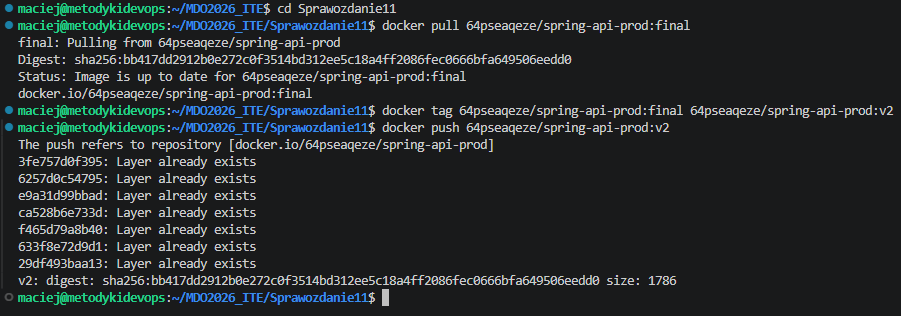
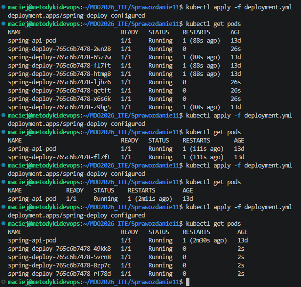
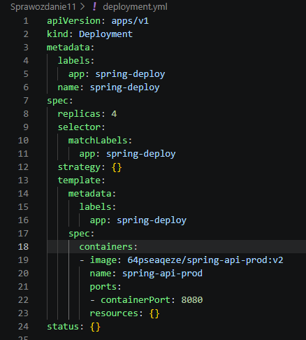
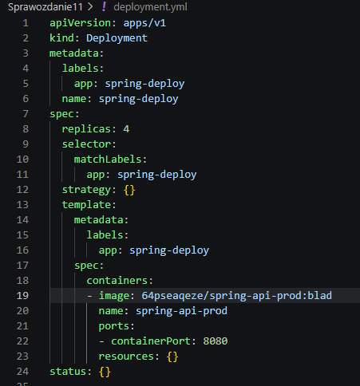
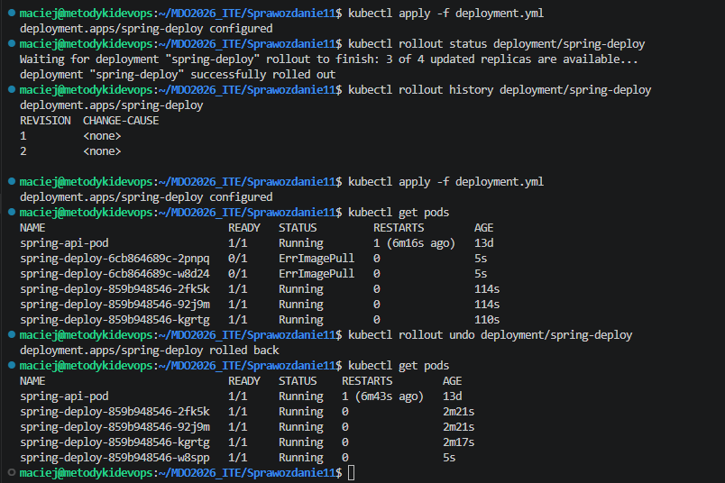
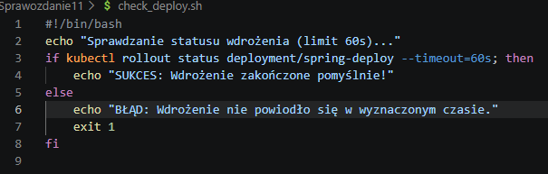
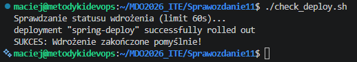
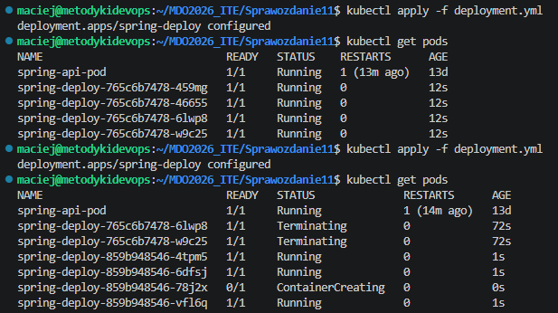
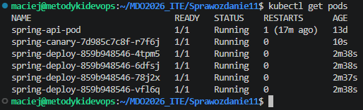

# Sprawozdanie z Zajęć 11 - Wdrażanie na zarządzalne kontenery: Kubernetes (2)
**Autor:** Maciej Szewczyk (MS422035)  
**Kierunek:** ITE | **Grupa:** G6

## 1. Przygotowanie nowej wersji obrazu
Pracę rozpoczęto od przygotowania nowej rewizji aplikacji. Wykorzystano w pełni działający obraz z poprzednich laboratoriów (`spring-api-prod:final`), któremu nadano nowy tag `v2` za pomocą polecenia `docker tag`. Następnie zaktualizowany artefakt wypchnięto do publicznego rejestru Docker Hub (`docker push`).

## 2. Skalowanie wdrożenia (Zmiany w pliku YAML)
Przetestowano mechanizm deklaratywnego skalowania aplikacji. W pliku `deployment.yml` modyfikowano parametr `replicas`, a zmiany aplikowano poleceniem `kubectl apply`. Wdrożenie zostało kolejno przeskalowane do 8 replik, zredukowane do 1, wyzerowane (0 replik), a ostatecznie przywrócone do stabilnego stanu 4 replik. Kubernetes dynamicznie i poprawnie dostosowywał liczbę działających podów do żądanego stanu.

## 3. Historia wdrożeń i wycofywanie zmian (Rollout & Undo)
Kolejnym etapem była aktualizacja wersji aplikacji bezpośrednio w klastrze. W pliku konfiguracyjnym podmieniono obraz na nową wersję `v2`.

Następnie zasymulowano błąd wdrożeniowy, deklarując nieistniejący obraz z celowo błędnym tagiem `:blad`.

Po zaaplikowaniu błędnej konfiguracji sprawdzono historię wdrożeń (`kubectl rollout history`). Kubernetes podjął próbę pobrania nowego obrazu (status `ErrImagePull`), jednak wbudowany mechanizm zapobiegł całkowitej awarii systemu, utrzymując przy życiu starsze, działające pody. Sytuację naprawiono poleceniem `kubectl rollout undo`, które natychmiastowo wycofało uszkodzone wdrożenie i przywróciło system do poprzedniej, w pełni operacyjnej rewizji.

## 4. Skrypt weryfikujący status wdrożenia
W celu automatyzacji kontroli środowiska, przygotowano dedykowany skrypt powłoki Bash (`check_deploy.sh`). Wykorzystuje on komendę `rollout status` z parametrem `--timeout=60s` do weryfikacji, czy proces wdrażania nowych replik zakończył się sukcesem w zadanym oknie czasowym.

Po nadaniu uprawnień do wykonywania (`chmod +x`), skrypt został uruchomiony. Narzędzie poprawnie zinterpretowało stan klastra i zwróciło zdefiniowany komunikat o sukcesie, potwierdzając gotowość wdrożenia.

## 5. Strategie wdrożenia i architektura Canary
Przetestowano zaawansowane strategie zarządzania aktualizacjami. Zmiana parametrów strategii w pliku deklaratywnym skutkowała odmiennym zachowaniem klastra podczas podnoszenia nowych wersji podów (na co wskazuje m.in. jednoczesne terminowanie starszych replik widoczne w logach klastra).

Ostatnim punktem zadań było wdrożenie strategii *Canary Deployment*. Przygotowano dodatkowy plik `canary.yml` definiujący pojedynczy pod testowy, który następnie został zaaplikowany w środowisku i podpięty pod tę samą usługę docelową. Weryfikacja poleceniem `kubectl get pods` ukazała współdzielenie infrastruktury przez 4 pody główne oraz 1 pod testowy (`spring-canary`), na który bezpiecznie kierowana jest mniejsza część ruchu sieciowego.

