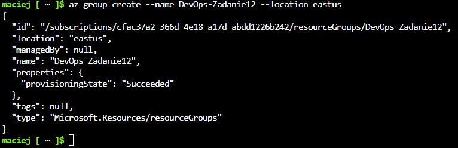
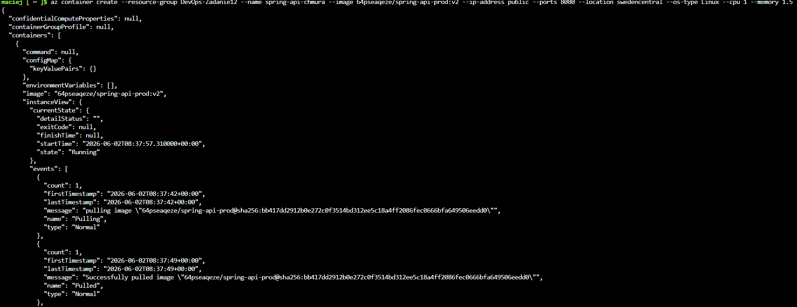
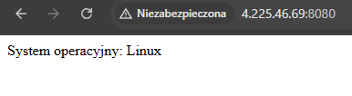
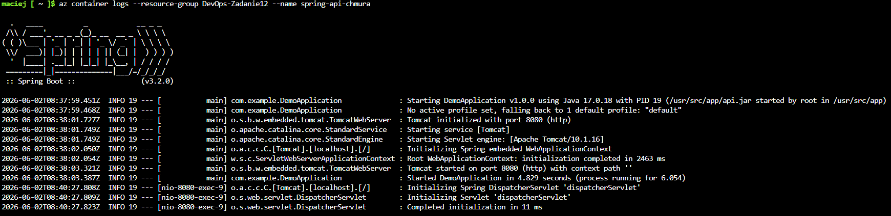
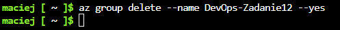

# Sprawozdanie z Zajęć 12 - Wdrażanie na zarządzalne kontenery w chmurze (Azure)
**Autor:** Maciej Szewczyk (MS422035)  
**Kierunek:** ITE | **Grupa:** G6

## 1. Uruchomienie Azure Cloud Shell i utworzenie Grupy Zasobów
Pracę z chmurą Microsoft Azure rozpoczęto od poprawnego uwierzytelnienia za pomocą studenckiego konta AGH (z wykorzystaniem mechanizmu logowania dwuetapowego MFA). Zamiast instalować lokalne narzędzia, wykorzystano przeglądarkowy interfejs **Azure Cloud Shell** w trybie powłoki Bash (sesja ulotna, bez trwałego magazynu). Pierwszym krokiem było utworzenie logicznego kontenera na zasoby, czyli *Resource Group*, poleceniem `az group create`.

## 2. Wdrożenie aplikacji do usługi Azure Container Instances (ACI)
Następnie wdrożono zaktualizowany obraz aplikacji Spring Boot (`v2`), który znajdował się już w publicznym rejestrze Docker Hub. Ze względu na surowe ograniczenia regionalne nałożone na darmowe subskrypcje *Azure for Students* (błędy `RequestDisallowedByAzure`), konieczne było zoptymalizowanie polecenia wdrożeniowego. Wymuszono użycie odblokowanego regionu (`swedencentral`), zadeklarowano typ systemu operacyjnego (`--os-type Linux`) oraz narzucono rygorystyczne limity zasobów sprzętowych (`--cpu 1 --memory 1.5`), co pozwoliło na pomyślne przydzielenie publicznego adresu IP i uruchomienie usługi poleceniem `az container create`.

## 3. Weryfikacja działania aplikacji (Dostęp publiczny)
Po pomyślnym przydzieleniu zasobów obliczeniowych, skopiowano publiczny adres IP wygenerowany w poprzednim kroku i użyto go do odpytania wystawionego API przez przeglądarkę internetową na zadeklarowanym porcie `8080`. Aplikacja poprawnie obsłużyła zapytanie HTTP z zewnętrznej sieci, udowadniając sukces wdrożenia chmurowego.

## 4. Inspekcja logów kontenera
W ramach monitoringu sprawdzono stan aplikacji na poziomie systemu. Używając polecenia `az container logs`, pobrano standardowe wyjście konsoli (stdout) działającego podmiotu w chmurze. Zrzut ukazuje prawidłowy proces inicjalizacji środowiska Spring Boot oraz brak błędów krytycznych podczas uruchamiania kontekstu aplikacji.

## 5. Sprzątanie środowiska (Usunięcie zasobów)
Ostatnim, ale równie kluczowym krokiem operacji chmurowych, było bezwzględne usunięcie całej przydzielonej infrastruktury w celu uniknięcia niepotrzebnego zużycia darmowych kredytów studenckich. Proces ten wykonano za pomocą jednego polecenia `az group delete`, które bezpiecznie wyrejestrowało publiczny adres IP, zniszczyło kontener oraz usunęło Grupę Zasobów. 

