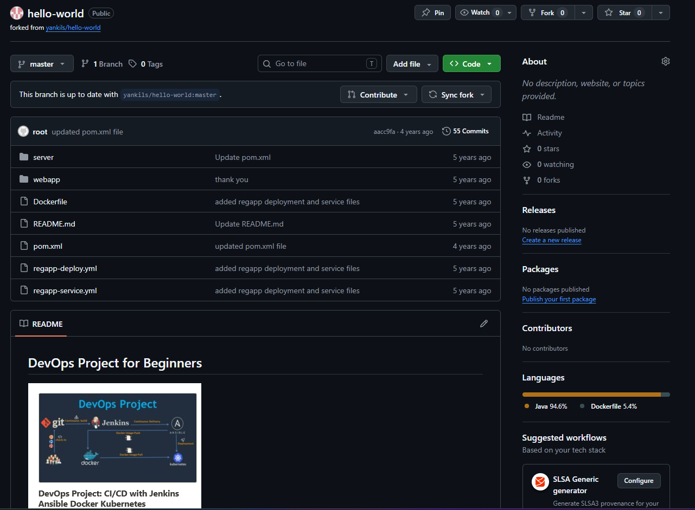
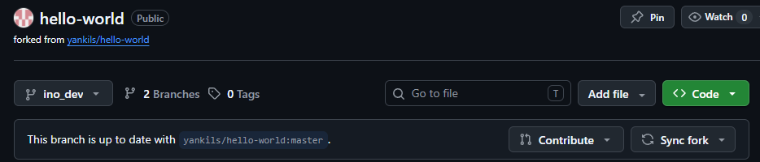
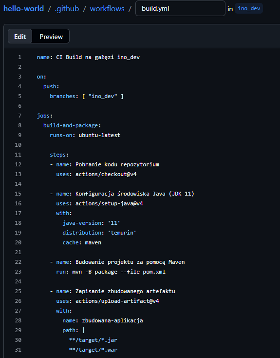
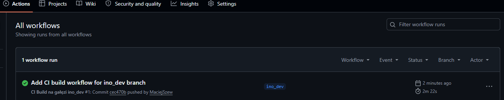
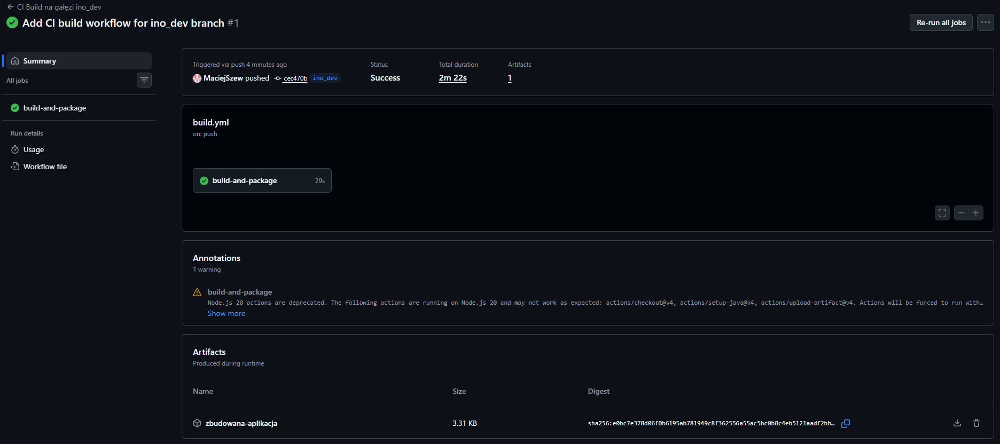

# Sprawozdanie z Zajęć 13 - Automatyzacja CI/CD z GitHub Actions (Shift-left)
**Autor:** Maciej Szewczyk (MS422035)  
**Kierunek:** ITE | **Grupa:** G6

## 1. Wybór projektu i przygotowanie środowiska (Fork)
Zgodnie z poleceniem, zrezygnowano z commitowania pipeline'ów do głównego repozytorium projektu. Zamiast tego wybrano przykładowy, publiczny projekt open-source napisany w języku Java (wykorzystujący system budowania Maven). Wykonano kopię (*Fork*) wybranego repozytorium (`yankils/hello-world`) na prywatne konto studenckie, upewniając się, że skopiowano wyłącznie główną gałąź kodu źródłowego.

## 2. Utworzenie docelowej gałęzi developerskiej
Aby spełnić wymagania zadania dotyczące konkretnego wyzwalacza (*triggera*), na bazie skopiowanego kodu utworzono nową gałąź o nazwie `ino_dev`. To na niej prowadzone będą prace związane z automatyzacją procesu ciągłej integracji (CI).

## 3. Utworzenie akcji (Workflow) i definicja Triggera
W ukrytym katalogu `.github/workflows/` na gałęzi `ino_dev` utworzono plik konfiguracyjny `build.yml`. Zdefiniowano w nim proces, który uruchamia się automatycznie **wyłącznie** w momencie wypchnięcia nowych zmian (zdarzenie `push`) na gałąź `ino_dev`. 
Kroki zdefiniowane w pliku obejmują:
1. Skopiowanie kodu źródłowego.
2. Konfigurację środowiska Java (JDK 11).
3. Zbudowanie projektu komendą `mvn -B package`.
4. Wyłapanie skompilowanych plików i przekazanie ich jako zbuowany artefakt.

## 4. Weryfikacja działania Pipeline'u
Samo zatwierdzenie i wypchnięcie pliku `.yml` na gałąź wyzwoliło zaprojektowaną akcję. W zakładce *Actions* zweryfikowano status uruchomionego zadania. Cały proces wykonał się w odizolowanym kontenerze na serwerach GitHub i zakończył się pełnym sukcesem (zielony status).

## 5. Wygenerowanie i pobranie Artefaktu
Zgodnie z ostatnim punktem instrukcji, zmodyfikowana akcja poprawnie zabezpieczyła pliki wynikowe z procesu budowania. W podsumowaniu wykonanej akcji (na samym dole) pojawił się wygenerowany artefakt o nazwie `zbudowana-aplikacja`, gotowy do pobrania w formie archiwum `.zip`. Dowodzi to pełnej i prawidłowej konfiguracji procesu CI/CD.

