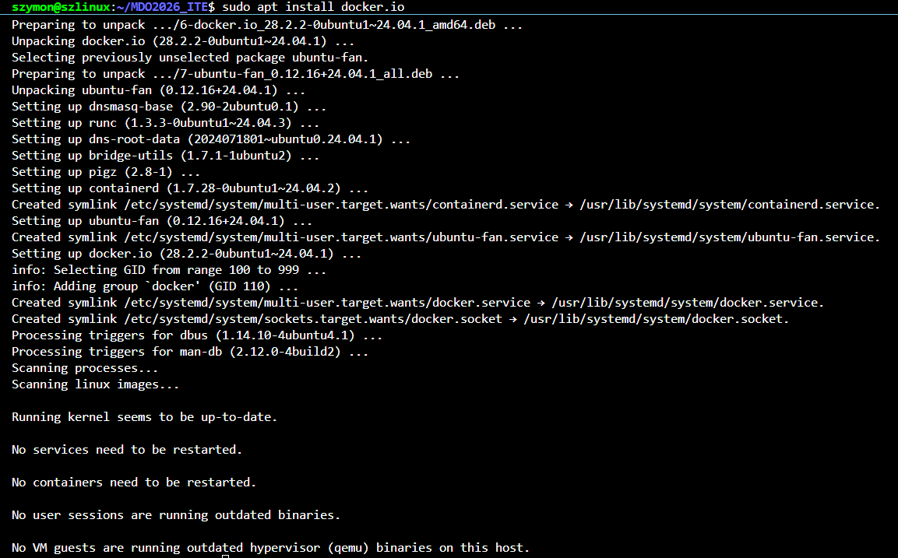
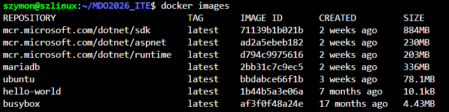
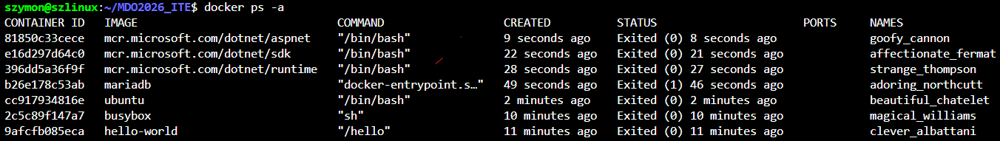
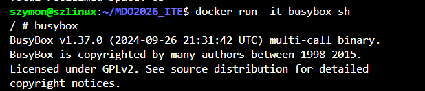
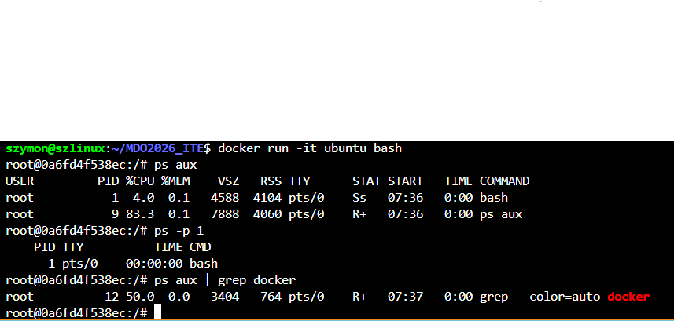
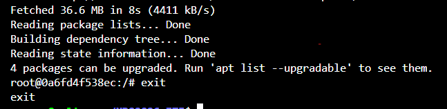
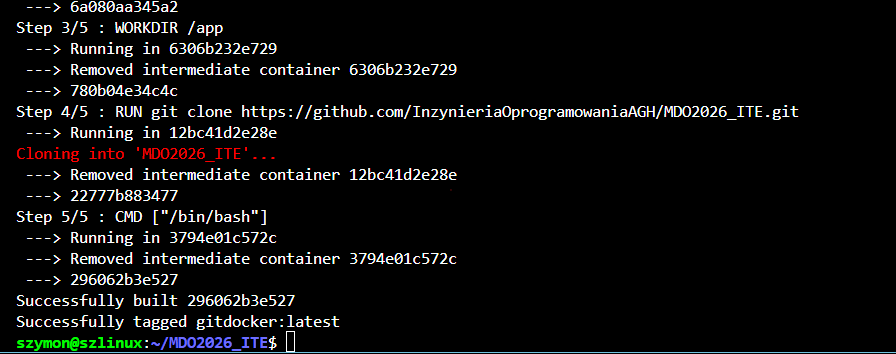
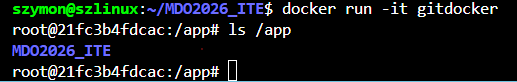
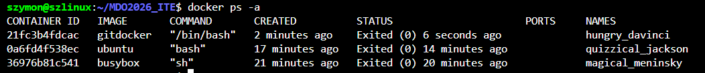
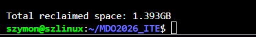

# Sprawozdanie nr.2 - Docker

## Instalacja dockera 

## Testowanie poszczególnych obrazów

## Zwracane statusy 

## Interaktywne wejście do kontenera busybox

## PID i procesy 

## Updatowanie i wyjście 

## Działający własy kontener 

## Kontenery 

## Oczyszczenie 

