# Sprawozdanie 3 - Dockerfiles i konteneryzacja etapu CI
**Autor:** Maciej Szewczyk (MS422035)  
**Kierunek:** ITE  
**Grupa:** G6  

## 1. Praca w środowisku lokalnym (Host)
Celem zadania było zbudowanie oprogramowania w powtarzalnym środowisku CI. Wybranym projektem jest **Calculator** (Java/Maven). Pracę rozpocząłem od przygotowania repozytorium i kompilacji bezpośrednio na moim serwerze Ubuntu.

### Kompilacja
Po sklonowaniu kodu i inicjalizacji projektu, uruchomiłem proces kompilacji, który zakończył się pomyślnie.

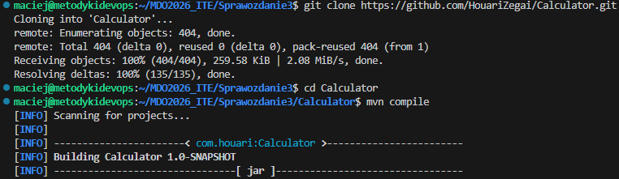
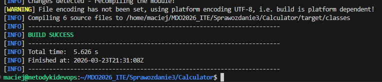

Problem pojawił się przy próbie uruchomienia testów jednostkowych. Mimo że Maven raportował sukces (BUILD SUCCESS), w raporcie końcowym widniała informacja o wykonaniu dokładnie zera testów.

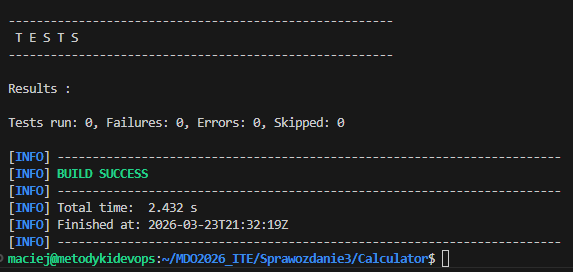

Analiza logów pozwoliła mi odkryć przyczynę tego stanu rzeczy. Projekt korzystał z przestarzałej wersji wtyczki testującej, która nie potrafiła rozpoznać nowoczesnych testów JUnit 5 obecnych w kodzie źródłowym.

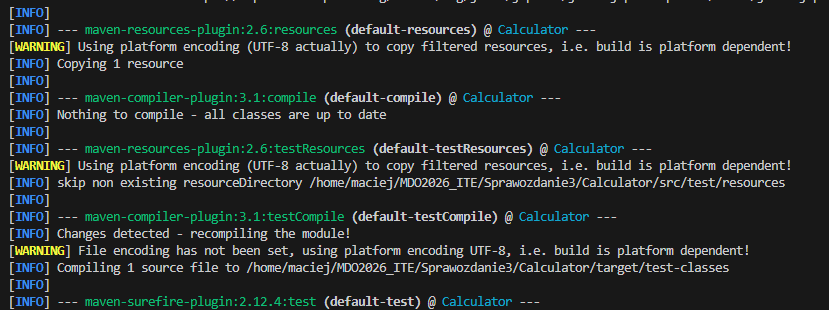

## 2. Izolacja i powtarzalność: Praca w kontenerze
Przeniosłem proces do kontenera Docker, aby zapewnić czyste i w pełni odizolowane środowisko pracy.

### Praca interaktywna
Zacząłem od uruchomienia oficjalnego obrazu Maven w trybie interaktywnym z podłączonym terminalem (TTY).

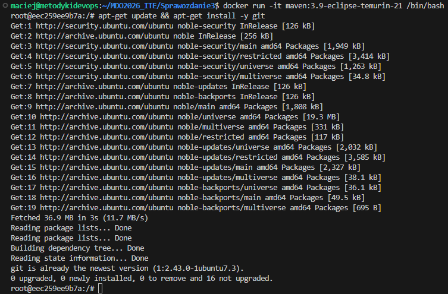

Wewnątrz kontenera zainstalowałem niezbędne narzędzia, sklonowałem kod repozytorium i przeprowadziłem proces budowania.

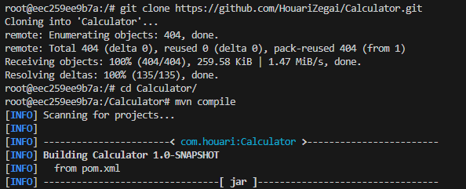
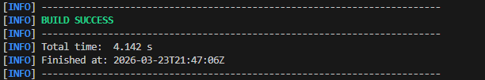

### Walka z interfejsem graficznym i bibliotekami
W środowisku kontenera Maven automatycznie pobrał nowszą wersję wtyczki, dzięki czemu testy zostały poprawnie wykryte. Jednak ich uruchomienie zakończyło się błędem `HeadlessException`. Wynikało to z faktu, że kalkulator posiada interfejs graficzny, a kontener nie posiada fizycznego monitora. Dodatkowo w systemie brakowało bibliotek niezbędnych do obsługi grafiki w Javie.

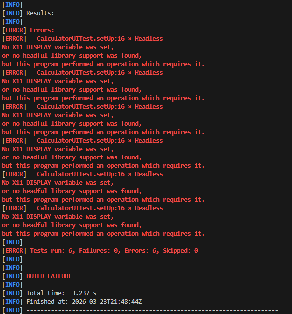
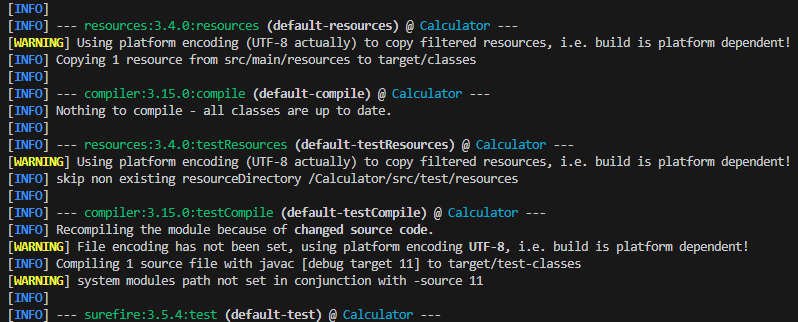

Rozwiązaniem okazało się doinstalowanie bibliotek systemowych oraz konfiguracja serwera **Xvfb** (wirtualnego bufora ekranu). Po stworzeniu "oszukanego" monitora w pamięci RAM, testy interfejsu zakończyły się pełnym sukcesem.

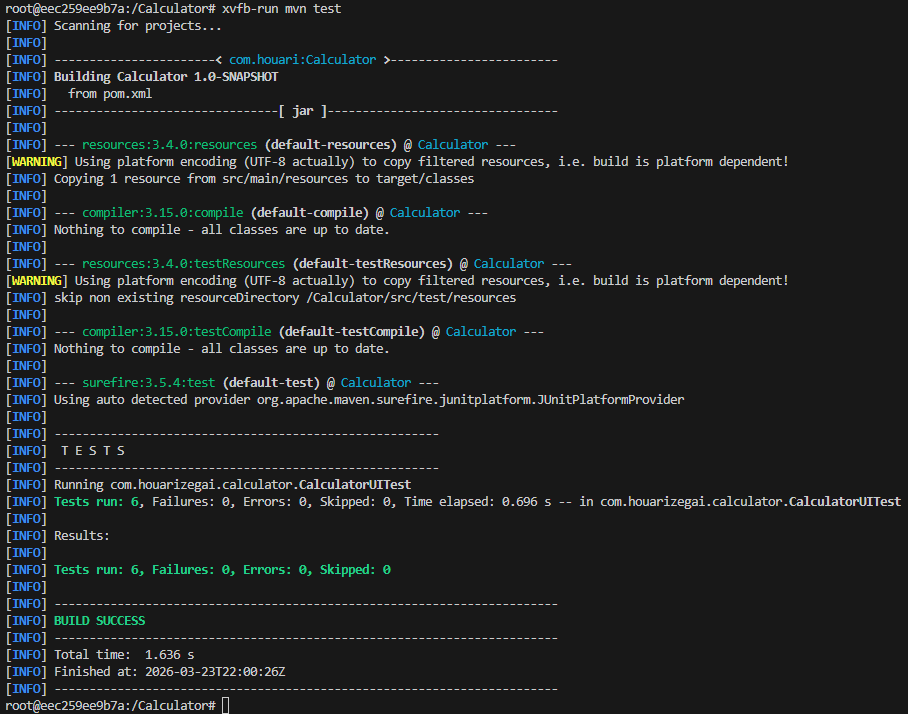

## 3. Automatyzacja: Dockerfiles
Aby uniknąć ręcznej konfiguracji przy każdym uruchomieniu, stworzyłem dwa pliki Dockerfile, które automatyzują proces i dzielą go na logiczne etapy.

### Etap 1: Budowanie (Dockerfile.build)
Ten plik odpowiada za przygotowanie całego środowiska, pobranie kodu i przeprowadzenie kompilacji.

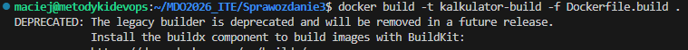
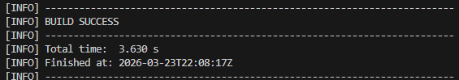
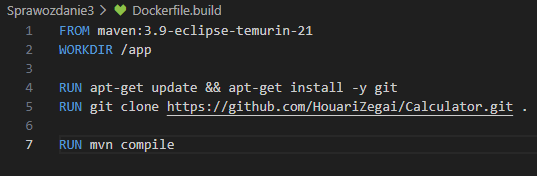

### Etap 2: Testowanie (Dockerfile.test)
Drugi kontener bazuje bezpośrednio na pierwszym. Jego jedynym zadaniem jest doinstalowanie pakietów graficznych i bezpieczne przeprowadzenie testów.

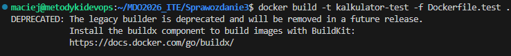
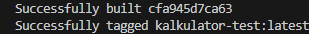
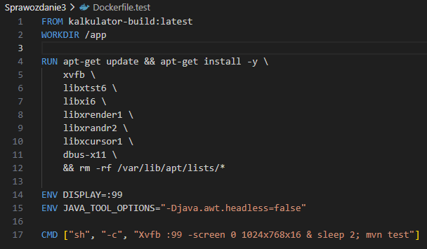

Poprawność całego automatu sprawdziłem komendą `docker run`. System samodzielnie postawił środowisko i przeprowadził testy, zwracając raport końcowy bez potrzeby interwencji użytkownika.

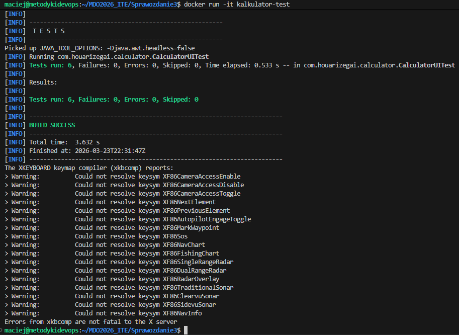

## 4. Docker Compose
Ostatnim krokiem było połączenie obu etapów w jedną kompozycję. Dzięki plikowi `docker-compose.yml`, cały proces można uruchomić jedną krótką komendą. To rozwiązanie gwarantuje, że proces będzie działał identycznie na każdym serwerze.

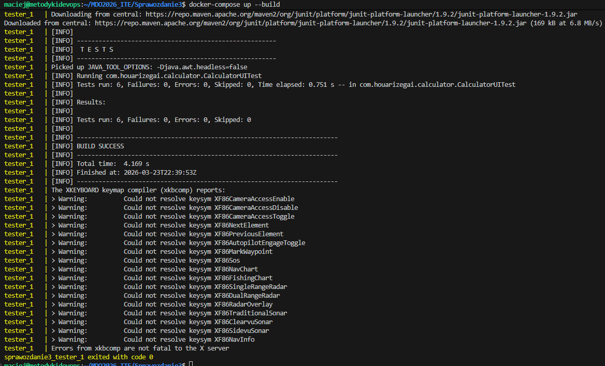
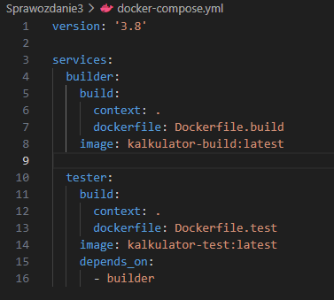
