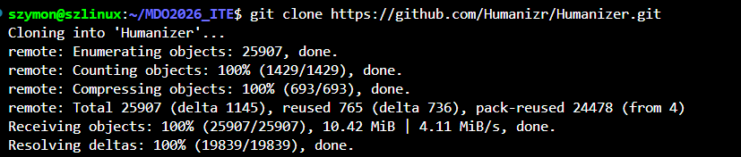
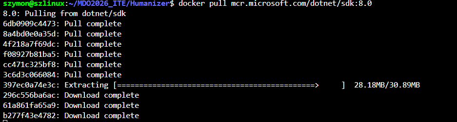
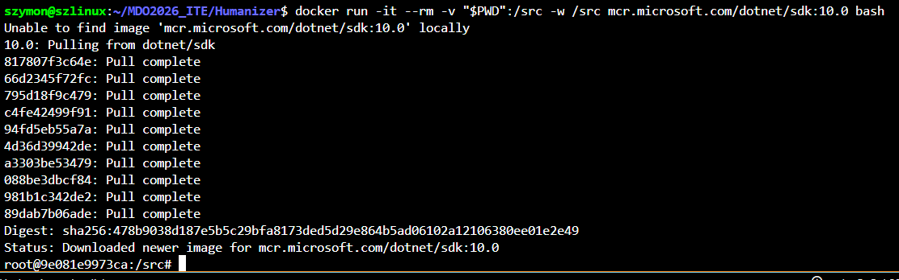
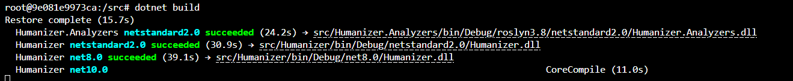
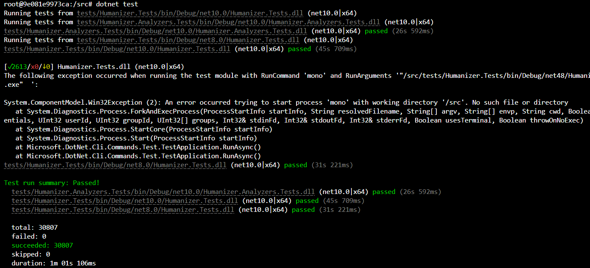
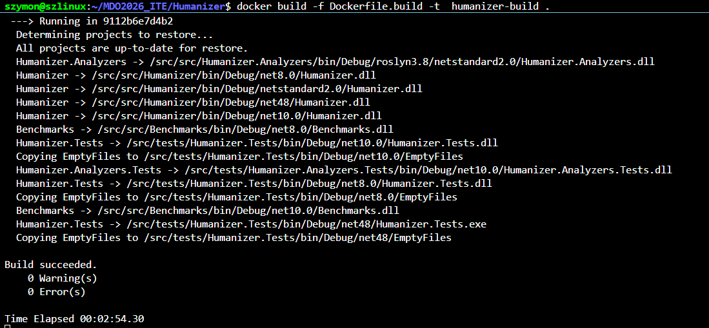
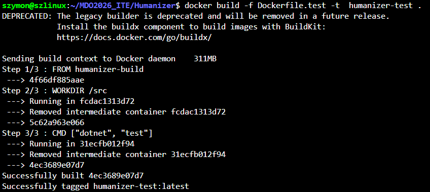
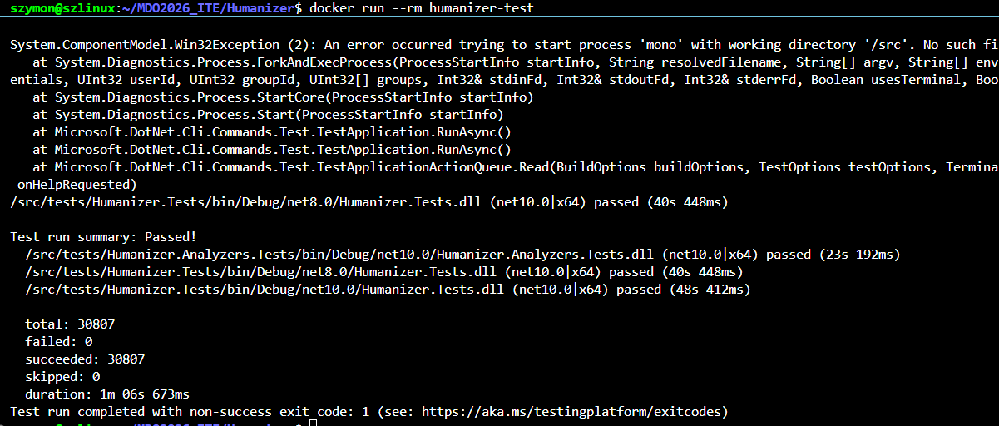

# Sprawozdanie3 - Dockerfile, kontener jakko definicja etapu  

## Sklonowanie repo

## Pobieranie odpowiedniego kontenera 

## Odpalenie kontenera 

## Zbudowanie środowiska w kontenerze 
Dzięki przejściu podczas uruchomienia do folderu src nie jest potrzebne ponowne klonowanie repo.

## Przeprowadzenie testów 

## Zautomatyzowanie procesu przy pomocy plików Dockerfile

Można ten proces jeszcze bardziej zautomatyzować przy użyciu docker-compose wtedy w jednym pliku znajdują się wszystkie informacje.

