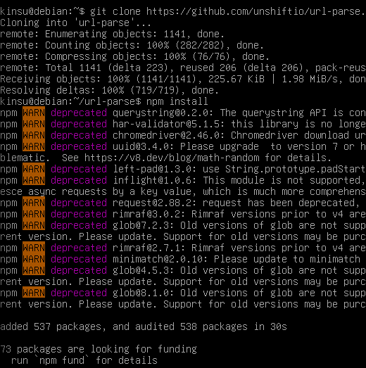
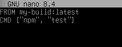
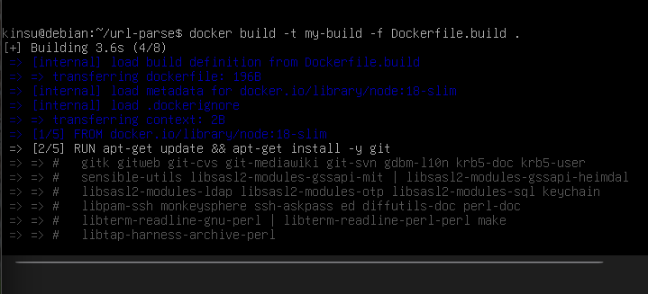

# Metodyki Devops – lab3

Wybrane oprogramowanie – biblioteka do parsowania URL https://github.com/unshiftio/url-parse

1. Klon repo i instalacja zależności

2. Wykonanie testów (poprzez npm test)

3. Uruchomienie kontenera, wewnątrz klonowanie repo (uruchomienie nastąpiło komendą `docker run -it --name devops-build node:18-slim /bin/bash`)

4. Plik Dockerfile.build

5. Plik Dockerfile.test

6. Budowanie pierwszego obrazu

7. Budowanie drugiego obrazu

8. Sprawdzenie poprawności działania

Po wykonaniu `docker run --name testowy-k my-test`
Testy przebiegły poprawnie.

Dodatkowo po wykonaniu `docker ps -a` kontener ma status exited, co oznacza że proces wewnątrz kontenera zakończył się bez żadnych błędów. 

Odpowiadając na pytanie co pracuje w takim kontenerze – pracuje w nim tylko npm test (silnik node.js).
