# Sprawozdanie3 - Dodatkowa terminologia w konteneryzacji, instancja Jenkins

### Stworzenie woluminów

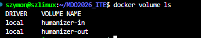

### Klonowanie przez kontener pomocniczy 

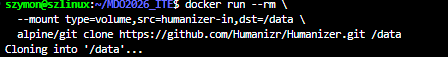

### Budowanie  

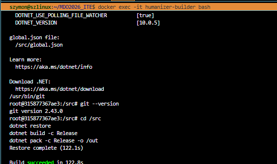

### Zachowane dane po usunięciu kontenera 

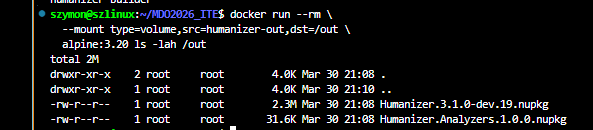

### Install gita 

Różnicą tych dwóch opcji jest w pierwszej opcji kod dostarczony przez kontener pomocniczy do named volume, gdzie w drugiej wersji klonowanie wykonane z jego wnętrza do mounted volume. 

### Zbudowanie i znalezenie adresów IP 

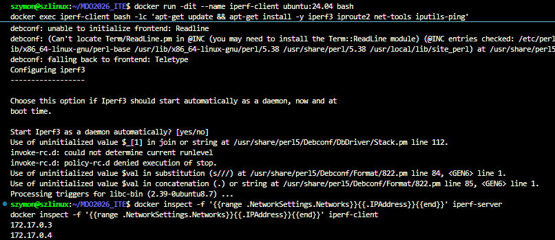

### Połączenie

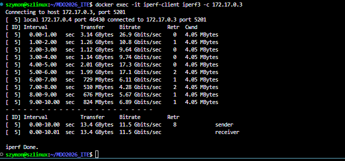

### Nowa sieć

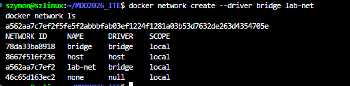

### Testowanie 2 

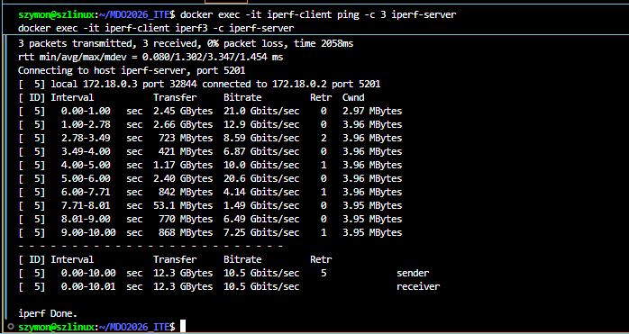

### Stworzenie SSHD 

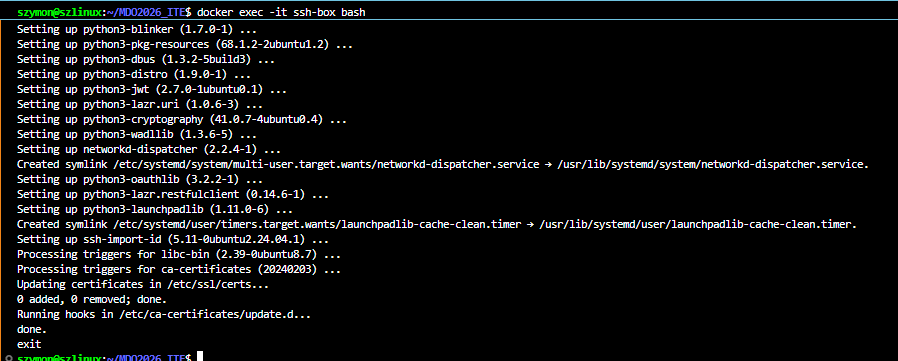

### Logowanie SSHD 

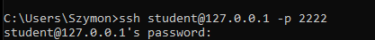

Zaletą tego rozwiązania jest wygodny dostęp, ale jest to dodatkowa usługa i powierzchnia do ataku. 

### Wykaz kontenerów  

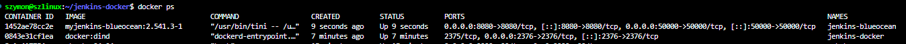

