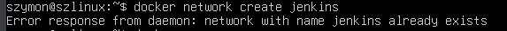
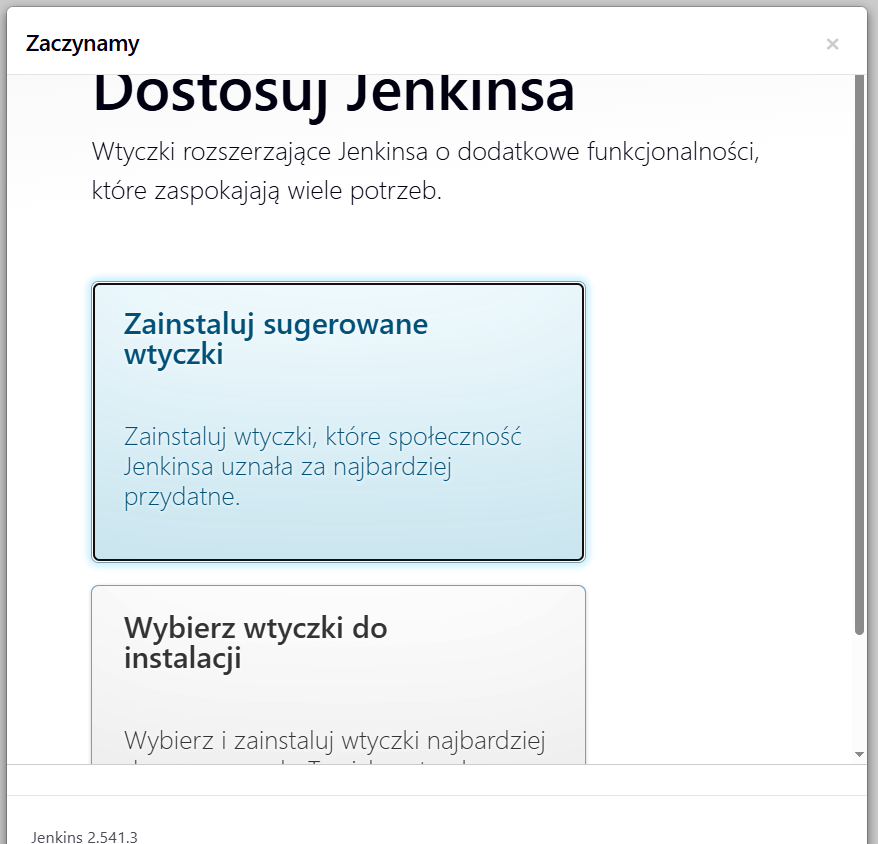
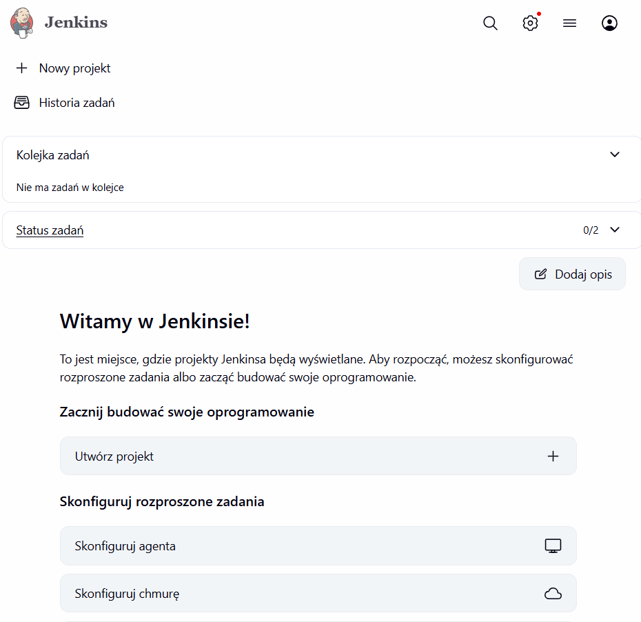
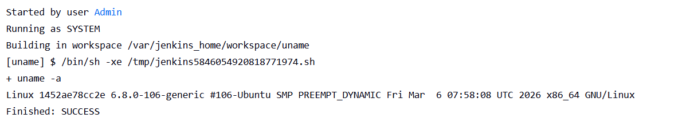
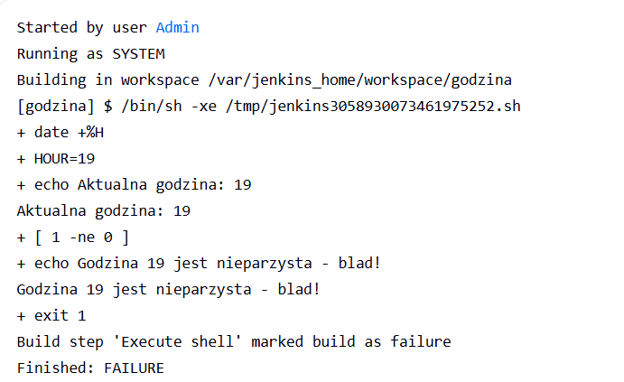
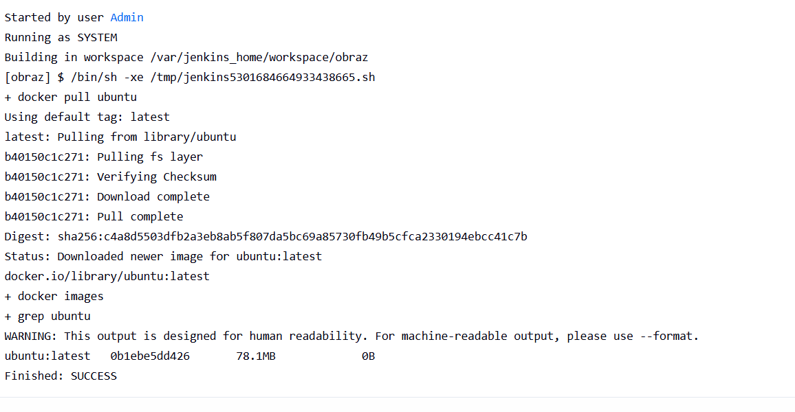
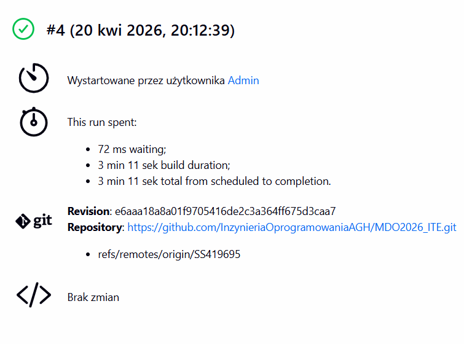
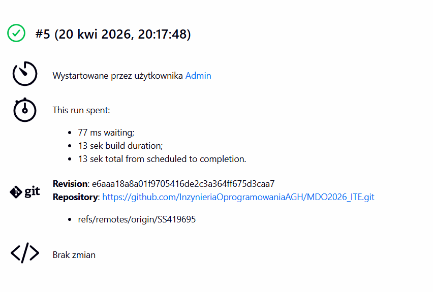

# Sprawozdanie5 - Pipeline Jenkins, izolacja etapów

## Przygotowanie instancji Jenkins

### Uruchomienie DIND i budowanie obrazu Blueocean

Różnica między obrazem Jenkins a Blueocean: Jenkins to podstawowy serwer CI/CD. 
Blueocean to nakładka z nowoczesnym UI i lepszą wizualizacją pipeline'u jako grafu. 
Obraz budujemy dodając plugin blueocean na bazie jenkins/jenkins:jdk17.



### Pierwsze logowanie i konfiguracja





## Zadania wstępne

### Projekt wyświetlający uname



### Projekt zwracający błąd przy nieparzystej godzinie



### Pobieranie obrazu ubuntu przez docker pull



## Obiekt typu Pipeline

### Pierwsze uruchomienie pipeline

Pipeline sklonował repozytorium MDO2026_ITE, wykonał checkout do gałęzi SS419695 
i zbudował Dockerfile z katalogu Sprawozdanie2.



### Drugie uruchomienie pipeline



### Treść Jenkinsfile

```groovy
pipeline {
    agent any
    stages {
        stage('Clone') {
            steps {
                git branch: 'SS419695',
                    url: 'https://github.com/InzynieriaOprogramowaniaAGH/MDO2026_ITE.git'
            }
        }
        stage('Checkout Dockerfile') {
            steps {
                sh 'cat Sprawozdanie2/Dockerfile'
            }
        }
        stage('Build') {
            steps {
                sh 'docker build -t moj-builder -f Sprawozdanie2/Dockerfile Sprawozdanie2/'
            }
        }
    }
}
\```

## Archiwizacja logów

Logi Jenkinsa zapisywane poleceniem:

\```bash
docker logs jenkins-blueocean --timestamps > jenkins-$(date +%Y%m%d).log 2>&1
\```
