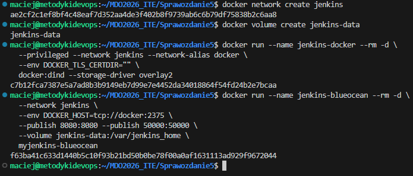
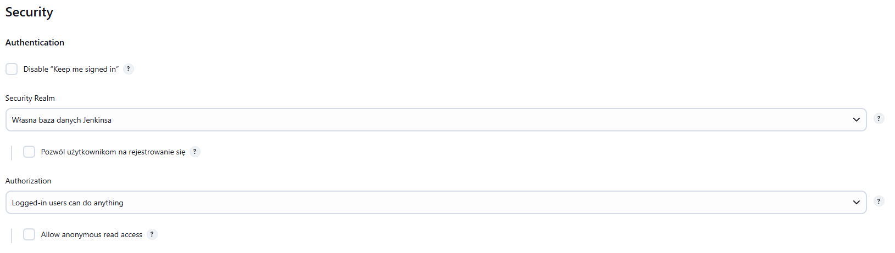
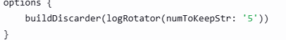
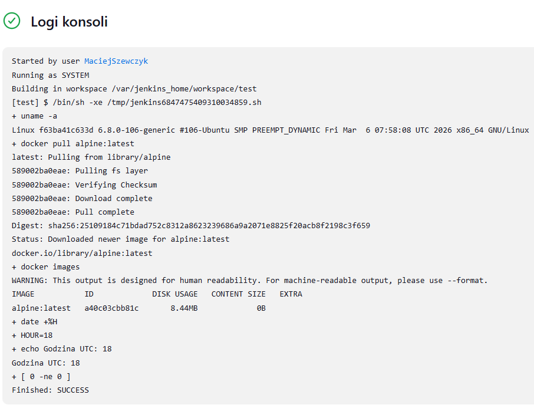
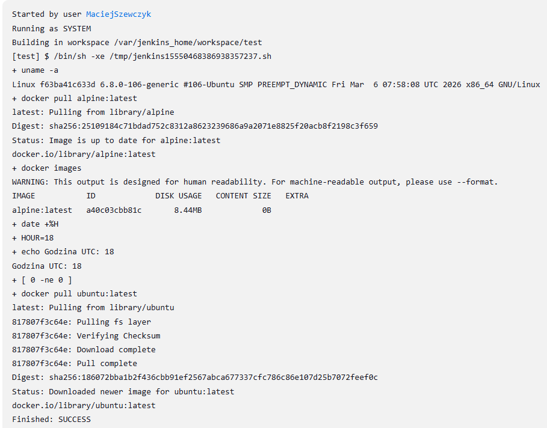
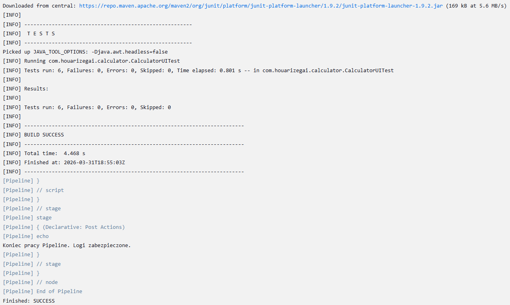
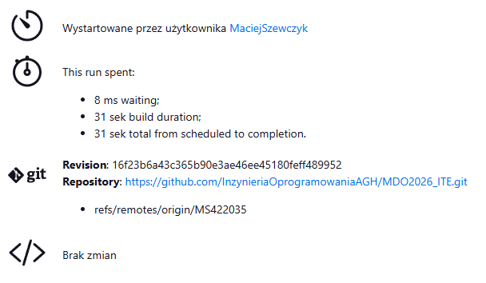
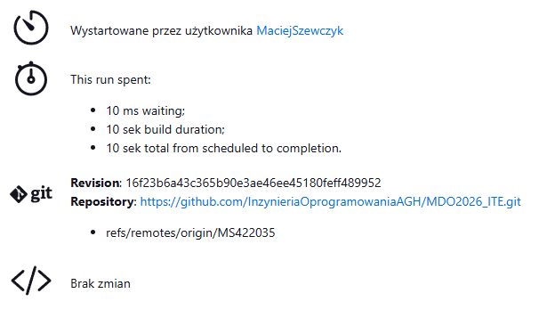

# Sprawozdanie 5 - Automatyzacja CI/CD: Jenkins Pipeline i Docker-in-Docker

**Autor:** Maciej Szewczyk (MS422035)  
**Kierunek:** ITE  
**Grupa:** G6

## 1. Architektura Jenkins Docker-in-Docker (DinD)

Celem zadania było skonfigurowanie zaawansowanego środowiska Continuous Integration, w którym serwer Jenkins zarządza cyklem życia kontenerów Docker. Zastosowano architekturę Sidecar, izolując procesy Jenkinsa od silnika budującego obrazy (Docker-in-Docker).

### Konfiguracja infrastruktury
Przygotowałem dedykowaną sieć wirtualną `jenkins` oraz wolumin trwały `jenkins-data`. Uruchomiłem dwa kontenery: `jenkins-docker` (serwer pomocniczy DinD) oraz `jenkins-blueocean` (serwer Jenkins). Komunikacja odbywa się bez szyfrowania TLS na porcie 2375 wewnątrz odizolowanej sieci.

## 2. Bezpieczeństwo i Administracja Logów

Kluczowym aspektem zarządzania serwerem CI jest ochrona logów oraz zasobów systemowych przed nadmiarowym zużyciem miejsca na dysku.

### Zabezpieczenie dostępu
W sekcji *Security* skonfigurowałem model autoryzacji "Logged-in users can do anything" oraz wyłączyłem dostęp dla użytkowników anonimowych. Gwarantuje to poufność przebiegu buildów.

### Archiwizacja i rotacja logów
Zaimplementowałem mechanizm *Build Discarder*. System został skonfigurowany tak, aby przechowywać historię jedynie 5 ostatnich budowań, co zapewnia optymalizację miejsca na woluminie `jenkins-data`.

## 3. Zadania wstępne (Freestyle Project)

Przed wdrożeniem pełnego potoku CI, zweryfikowałem łączność Jenkinsa z silnikiem Docker oraz poprawność działania skryptów warunkowych.

### Test środowiska i pobieranie obrazów
Stworzyłem zadanie testowe pobierające obrazy. Dodatkowo zaimplementowałem skrypt sprawdzający parzystość godziny w strefie UTC – build kończy się sukcesem tylko przy parzystej godzinie.

## 4. Zaawansowany Pipeline CI/CD

Finałowym etapem było stworzenie potoku (Pipeline) zdefiniowanego jako kod, integrującego się z systemem kontroli wersji GitHub.

### Integracja z GitHub i Multistage Build
Pipeline został skonfigurowany do pracy z gałęzią personalną `MS422035`. Wykorzystałem flagę `-f` do wskazania dedykowanych plików:
*   **Dockerfile.build**: Kompilacja aplikacji Calculator (Maven).
*   **Dockerfile.test**: Uruchomienie testów jednostkowych JUnit na bazie zbudowanego obrazu.

### Optymalizacja czasu budowania (Docker Cache)
Przeprowadziłem analizę wydajności poprzez powtórne uruchomienie zadania. 
*   **Pierwszy build:** 31 sekund (pełne pobieranie zależności).
*   **Drugi build:** 10 sekund (użycie warstw CACHED).

Zysk czasowy na poziomie ok. 67% potwierdza skuteczność mechanizmu *Docker Layer Caching*.

| Build # | Czas trwania | Status |
| :--- | :--- | :--- |
| Pierwszy | 31 sek | SUCCESS |
| Drugi | 10 sek | SUCCESS |

## 5. Wnioski
Zastosowanie Jenkins Pipeline pozwala na pełną automatyzację cyklu życia aplikacji. Wykorzystanie architektury Docker-in-Docker umożliwia budowanie obrazów w odizolowanym środowisku, a mechanizmy cachowania warstw znacząco przyspieszają procesy CI/CD, co jest kluczowe w profesjonalnym wytwarzaniu oprogramowania.