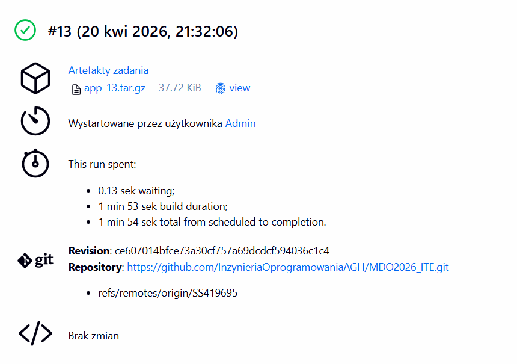
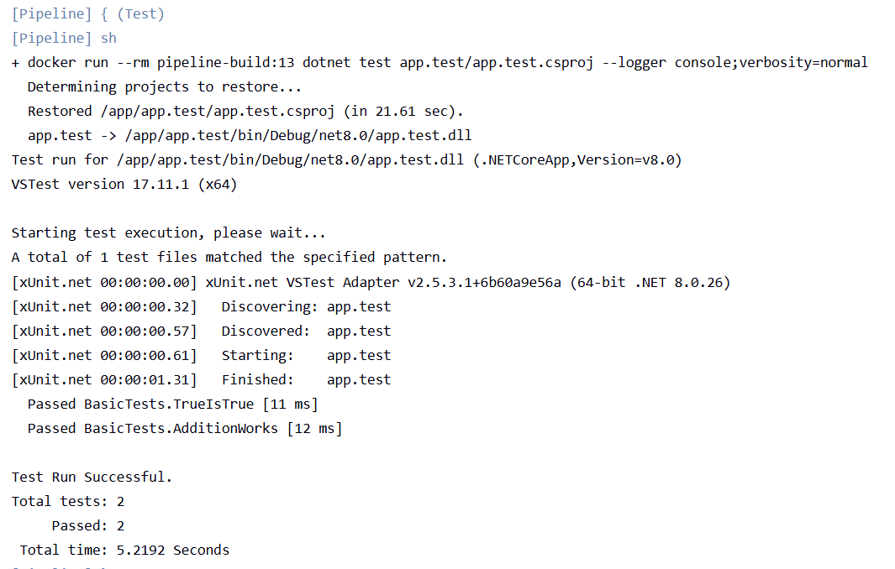

# Sprawozdanie 6 - Kompletny pipeline Jenkins CI/CD

## 1. Opis aplikacji i wybór technologii

Aplikacja wybrana do zadania to prosta aplikacja konsolowa napisana w **.NET 8.0** (C#), stworzona na potrzeby demonstracji procesu CI/CD. Aplikacja wyświetla komunikat oraz aktualny czas uruchomienia.

- **Język:** C# / .NET 8.0
- **Repozytorium:** `https://github.com/InzynieriaOprogramowaniaAGH/MDO2026_ITE.git`
- **Gałąź:** `SS419695`
- **Licencja:** kod własny, brak ograniczeń dystrybucji

Zdecydowano, że fork repozytorium nie jest wymagany — praca odbywa się na osobistej gałęzi `SS419695` w repozytorium przedmiotowym.

---

## 2. Struktura plików

```
MDO2026_ITE/
├── app/
│   ├── app.csproj
│   └── Program.cs
├── app.test/
│   ├── app.test.csproj
│   └── BasicTest.cs
├── Dockerfile.build
├── Dockerfile.test
└── Jenkinsfile
```

---

## 3. Pliki źródłowe aplikacji

### `app/Program.cs`
```csharp
using System;

Console.WriteLine("Pipeline - Hello World!");
Console.WriteLine($"Build time: {DateTime.Now}");
```

### `app/app.csproj`
```xml
<Project Sdk="Microsoft.NET.Sdk">
  <PropertyGroup>
    <OutputType>Exe</OutputType>
    <TargetFramework>net8.0</TargetFramework>
  </PropertyGroup>
</Project>
```

### `app.test/BasicTest.cs`
```csharp
public class BasicTests {
    [Xunit.Fact]
    public void TrueIsTrue() {
        Xunit.Assert.True(true);
    }
    [Xunit.Fact]
    public void AdditionWorks() {
        Xunit.Assert.Equal(4, 2 + 2);
    }
}
```

---

## 4. Kontenery Docker

### Kontener Build (`Dockerfile.build`)

```dockerfile
FROM mcr.microsoft.com/dotnet/sdk:8.0
WORKDIR /app
COPY app/ ./app/
COPY app.test/ ./app.test/
RUN dotnet build app/app.csproj --configuration Release
```

Kontener bazowy to `mcr.microsoft.com/dotnet/sdk:8.0` — świadomie wybrany tag `8.0` zamiast `latest`, co zapewnia powtarzalność buildów. Obraz SDK zawiera wszystkie narzędzia potrzebne do kompilacji (.NET compiler, NuGet, MSBuild).

### Kontener Test (`Dockerfile.test`)

Etap testowy nie wymaga osobnego Dockerfile — testy uruchamiane są bezpośrednio wewnątrz kontenera buildowego poleceniem `docker run --rm`. Takie podejście jest poprawne, ponieważ obraz SDK zawiera już wszystkie zależności testowe (xUnit, VSTest).

---

## 5. Definicja Pipeline (`Jenkinsfile`)

```groovy
pipeline {
    agent any

    environment {
        BUILD_IMG = "pipeline-build:${BUILD_NUMBER}"
    }

    stages {

        stage('Clone') {
            steps {
                git branch: 'SS419695',
                    url: 'https://github.com/InzynieriaOprogramowaniaAGH/MDO2026_ITE.git'
            }
        }

        stage('Build') {
            steps {
                sh "docker build -t ${BUILD_IMG} -f Dockerfile.build ."
            }
        }

        stage('Test') {
            steps {
                sh "docker run --rm ${BUILD_IMG} dotnet test app.test/app.test.csproj --logger 'console;verbosity=normal'"
            }
        }

        stage('Deploy') {
            steps {
                sh "docker stop pipeline-app || true"
                sh "docker rm pipeline-app || true"
                sh "docker run -d --name pipeline-app ${BUILD_IMG} tail -f /dev/null"
                sh "docker ps | grep pipeline-app"
            }
        }

        stage('Publish') {
            steps {
                sh "mkdir -p publish"
                sh "docker cp pipeline-app:/app/app/bin/Release/net8.0 publish/"
                sh "tar -czf app-${BUILD_NUMBER}.tar.gz publish/"
                archiveArtifacts artifacts: "app-${BUILD_NUMBER}.tar.gz", fingerprint: true
            }
        }
    }

    post {
        always {
            sh "docker rmi ${BUILD_IMG} || true"
            sh "docker stop pipeline-app || true"
            sh "docker rm pipeline-app || true"
        }
        success {
            echo "Artefakt: app-${BUILD_NUMBER}.tar.gz"
        }
        failure {
            echo "Pipeline FAILED - sprawdz logi"
        }
    }
}
```

---

## 6. Opis etapów pipeline

| Etap | Opis | Wynik |
| :--- | :--- | :--- |
| **Clone** | Pobranie kodu z gałęzi `SS419695` repozytorium przedmiotowego | Kod źródłowy w workspace Jenkinsa |
| **Build** | Budowanie obrazu Docker z aplikacją .NET, kompilacja Release | Obraz `pipeline-build:N` |
| **Test** | Uruchomienie testów xUnit wewnątrz kontenera buildowego | 2/2 testy przeszły |
| **Deploy** | Uruchomienie kontenera aplikacji w trybie nieblokującym (`-d`) | Działający kontener `pipeline-app` |
| **Publish** | Skopiowanie binarek z kontenera, spakowanie do `.tar.gz`, archiwizacja w Jenkins | Artefakt `app-N.tar.gz` |

---

## 7. Uzasadnienie wyborów

### Kontener buildowy vs. deploy
Kontener buildowy (`mcr.microsoft.com/dotnet/sdk:8.0`) zawiera pełne SDK .NET potrzebne do kompilacji. Nie nadaje się bezpośrednio do produkcji ze względu na duży rozmiar (~800MB). W docelowym środowisku produkcyjnym należałoby użyć `mcr.microsoft.com/dotnet/runtime:8.0` (~200MB) — obraz bez narzędzi deweloperskich. Na potrzeby laboratorium kontener buildowy pełni również rolę kontenera deploy.

### Forma artefaktu
Wybrano archiwum **`.tar.gz`** ze skompilowanymi binarkami .NET jako formę redystrybucyjną. Uzasadnienie:
- Nie wymaga instalacji dodatkowych narzędzi (brak potrzeby NuGet/npm registry)
- Zawiera gotowe do uruchomienia pliki `.dll` i `.exe`
- Łatwe wersjonowanie przez numer builda (`app-13.tar.gz`)
- Artefakt dostępny bezpośrednio w Jenkins UI jako pobieralny plik

### Wersjonowanie
Artefakt wersjonowany przez `BUILD_NUMBER` Jenkinsa (np. `app-13.tar.gz`). Pozwala to jednoznacznie zidentyfikować pochodzenie artefaktu — numer builda odpowiada konkretnemu commitowi widocznemu w historii Jenkins.

---

## 8. Weryfikacja działania

### Wyniki testów (build #13)
```
Passed BasicTests.TrueIsTrue [11 ms]
Passed BasicTests.AdditionWorks [12 ms]

Test Run Successful.
Total tests: 2
     Passed: 2
```

### Deploy — weryfikacja działającego kontenera
```
682f913ec058   pipeline-build:13   "tail -f /dev/null"   2 seconds ago   Up 1 second   pipeline-app
```

### Artefakt
- Plik: `app-13.tar.gz` (37.72 KiB)
- Dostępny w Jenkins UI → Build #13 → Artefakty zadania

---

## 9. Różnica między podejściem DIND a bezpośrednim dostępem do Dockera

| Cecha | DIND (Docker-in-Docker) | Bezpośredni dostęp do demona |
| :--- | :--- | :--- |
| Izolacja | Pełna — osobny demon Docker | Współdzielony demon hosta |
| Bezpieczeństwo | Wyższe (izolowany środowisko) | Niższe (dostęp do hosta) |
| Wydajność | Niższa (dodatkowa warstwa) | Wyższa |
| Konfiguracja | Bardziej złożona (TLS, certyfikaty) | Prostsza |
| Zastosowanie | Środowiska produkcyjne CI/CD | Laboratoria, dev |

W niniejszym laboratorium użyto DIND zgodnie z instrukcją dostawcy Jenkinsa.

---

## 10. Screenshoty

### Build #13 — sukces z artefaktem


### Wyjście konsoli — przebieg pipeline

