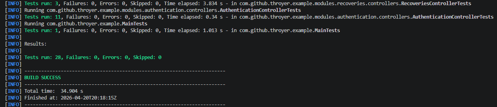
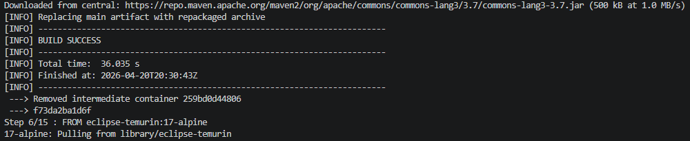
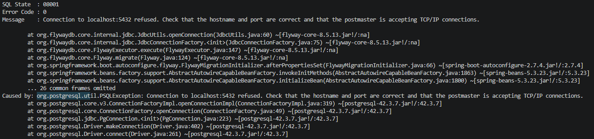
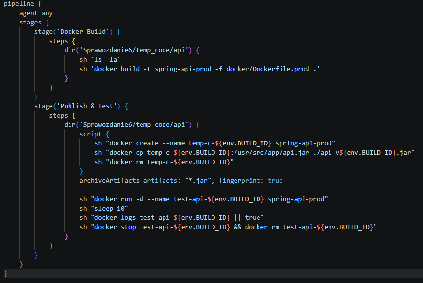
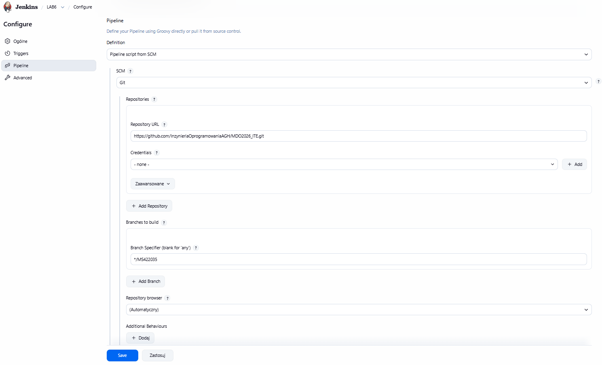
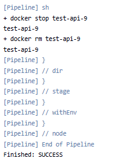

# Sprawozdanie 6 - Jenkins Pipeline
**Autor:** Maciej Szewczyk (MS422035)  
**Kierunek:** ITE  
**Grupa:** G6  

## 1. Weryfikacja kodu i testy jednostkowe
Pracę nad potokiem CI/CD rozpocząłem od weryfikacji samej aplikacji opartej na środowisku Java/Spring Boot. Przed przystąpieniem do automatyzacji należało upewnić się, że kod buduje się poprawnie i przechodzi testy. Wykorzystano narzędzie Maven, które podczas kompilacji uruchamia zestaw zdefiniowanych testów. Weryfikacja zakończyła się pełnym sukcesem (`BUILD SUCCESS`), a wszystkie 28 testów jednostkowych przeszło bez błędów.

## 2. Konteneryzacja środowiska (Multi-stage Build)
Aby zapewnić pełną izolację i powtarzalność procesu, aplikacja została skonteneryzowana przy użyciu technologii Docker. Zastosowano podejście wieloetapowe (Multi-stage build). W pierwszym etapie kod jest kompilowany wewnątrz obszernego środowiska bazowego (Maven + JDK). 

Następnie skompilowany plik przenoszony jest do docelowego, odchudzonego kontenera uruchomieniowego opartego na `eclipse-temurin:21-jre-alpine`.
W ramach sprawdzenia poprawności obrazu `spring-api-prod`, uruchomiono go lokalnie. Analiza logów (Smoke Test) potwierdziła poprawne uruchomienie maszyny wirtualnej Java oraz inicjalizację narzędzi. Zarejestrowany komunikat o braku połączenia z bazą danych (Connection refused) jest zachowaniem oczekiwanym dla izolowanego środowiska bez usług zewnętrznych.

## 3. Automatyzacja: Definicja potoku (Pipeline-as-a-Code)
Gdy proces budowania i uruchamiania Dockera został sprawdzony, przeniosłem jego logikę do pliku `Jenkinsfile`. Zastosowano model deklaratywny, dzieląc potok na etapy: pobranie środowiska, budowanie obrazu Docker, wyciągnięcie artefaktu końcowego (`.jar`) oraz zautomatyzowany Smoke Test.

## 4. Konfiguracja serwera Jenkins
Zamiast ręcznie definiować kroki w interfejsie CI, Jenkins został połączony z repozytorium GitHub. Skonfigurowałem projekt w trybie **Pipeline script from SCM**, wskazując bezpośrednio na gałąź `MS422035`. Dzięki temu Jenkins automatycznie pobiera kod źródłowy oraz instrukcje zdefiniowane w `Jenkinsfile`, co pozwala na wersjonowanie infrastruktury wraz z aplikacją.

## 5. Wykonanie potoku i publikacja Artefaktu
Po wyzwoleniu potoku, Jenkins automatycznie przeszedł przez wszystkie zdefiniowane etapy. Zbudował obraz, stworzył tymczasowy kontener, z którego wyodrębnił plik `api.jar` i zarchiwizował go jako zidentyfikowany, wersjonowany artefakt. 
Proces kończy się bezpiecznym zatrzymaniem i usunięciem kontenerów testowych (`docker stop` oraz `docker rm`), pozostawiając środowisko czystym. Cała ścieżka krytyczna wykonała się pomyślnie (`Finished: SUCCESS`).

