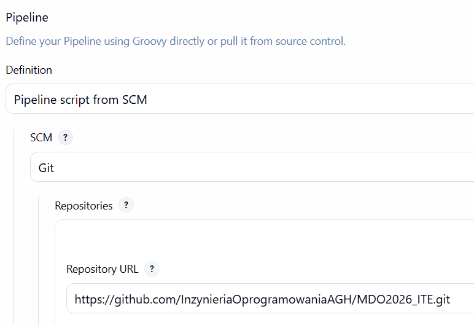
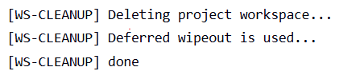
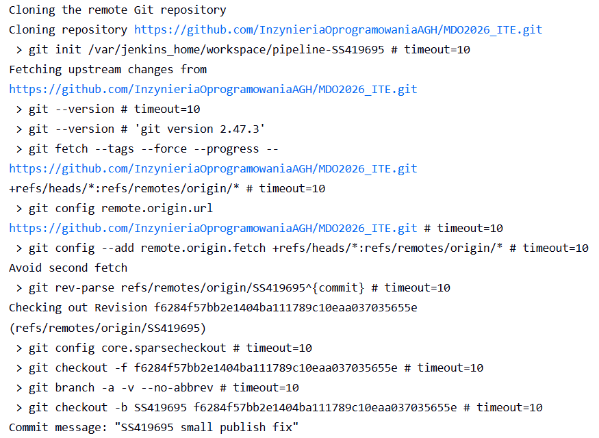
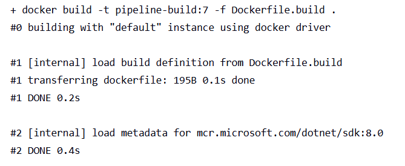
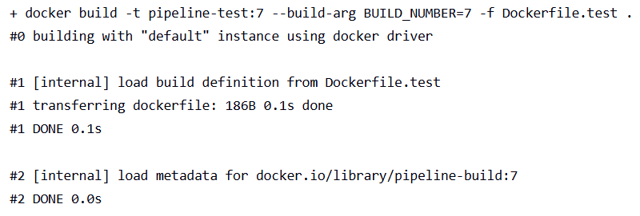
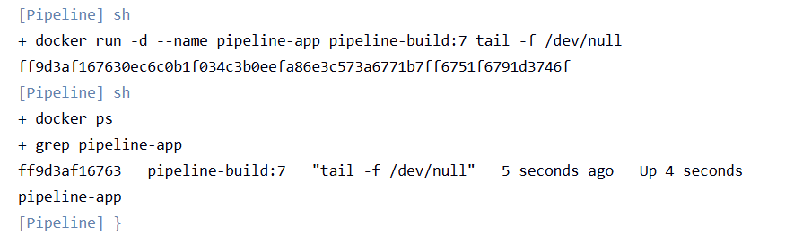
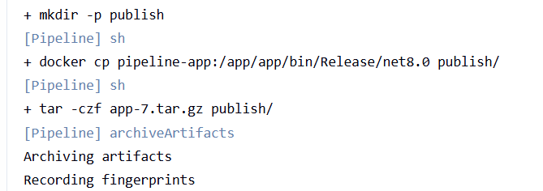
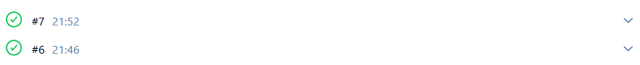

# Sprawozdanie 6 — Kompletny pipeline Jenkins CI/CD


## 1. Opis aplikacji i wybór technologii

Aplikacja wybrana do zadania to prosta aplikacja konsolowa napisana w **.NET 8.0** (C#), stworzona na potrzeby demonstracji procesu CI/CD. Aplikacja wyświetla komunikat oraz aktualny czas uruchomienia.

- **Język:** C# / .NET 8.0
- **Licencja:** kod własny, brak ograniczeń dystrybucji

Praca odbywa się na osobistej gałęzi `SS419695` w repozytorium przedmiotowym — fork nie był wymagany.

---

## 2. Struktura repozytorium

```
MDO2026_ITE/          ← korzeń gałęzi SS419695
├── app/
│   ├── app.csproj
│   └── Program.cs
├── app.test/
│   ├── app.test.csproj
│   └── BasicTest.cs
├── Dockerfile.build
├── Dockerfile.test
└── Jenkinsfile
```

---

## 3. Pliki źródłowe aplikacji

### `app/Program.cs`

```csharp
using System;

Console.WriteLine("Pipeline - Hello World!");
Console.WriteLine($"Build time: {DateTime.Now}");
```

### `app/app.csproj`

```xml
<Project Sdk="Microsoft.NET.Sdk">
  <PropertyGroup>
    <OutputType>Exe</OutputType>
    <TargetFramework>net8.0</TargetFramework>
  </PropertyGroup>
</Project>
```

### `app.test/BasicTest.cs`

```csharp
public class BasicTests {
    [Xunit.Fact]
    public void TrueIsTrue() {
        Xunit.Assert.True(true);
    }
    [Xunit.Fact]
    public void AdditionWorks() {
        Xunit.Assert.Equal(4, 2 + 2);
    }
}
```

---

## 4. Kontenery Docker

### Kontener budujący (`Dockerfile.build`)

```dockerfile
FROM mcr.microsoft.com/dotnet/sdk:8.0
WORKDIR /app
COPY app/ ./app/
COPY app.test/ ./app.test/
RUN dotnet build app/app.csproj --configuration Release
```

Jako obraz bazowy wybrano `mcr.microsoft.com/dotnet/sdk:8.0` — świadomie użyto konkretnego tagu `8.0` zamiast `latest`, co zapewnia powtarzalność buildów. Obraz SDK zawiera wszystkie narzędzia potrzebne do kompilacji (.NET compiler, NuGet, MSBuild).

### Kontener testowy (`Dockerfile.test`)

```dockerfile
ARG BUILD_NUMBER
FROM pipeline-build:${BUILD_NUMBER}
WORKDIR /app
RUN dotnet test app.test/app.test.csproj --logger "console;verbosity=normal"
```

Kontener testowy bazuje bezpośrednio na obrazie buildowym z tego samego przebiegu pipeline'u. Dzięki temu testy uruchamiane są na dokładnie tym samym kodzie, który został skompilowany w etapie `Build`.

---

## 5. Definicja pipeline (`Jenkinsfile`)

Jenkinsfile znajduje się w korzeniu gałęzi `SS419695` i jest pobierany przez Jenkinsa z SCM — nie jest wklejany ręcznie w konfigurację joba.

```groovy
pipeline {
    agent any

    environment {
        BUILD_IMG  = "pipeline-build:${BUILD_NUMBER}"
        TEST_IMG   = "pipeline-test:${BUILD_NUMBER}"
    }

    stages {

        stage('Prepare') {
            steps {
                cleanWs()
                git branch: 'SS419695',
                    url: 'https://github.com/InzynieriaOprogramowaniaAGH/MDO2026_ITE.git'
            }
        }

        stage('Build') {
            steps {
                sh "docker build -t ${BUILD_IMG} -f Dockerfile.build ."
            }
        }

        stage('Test') {
            steps {
                sh "docker build -t ${TEST_IMG} --build-arg BUILD_NUMBER=${BUILD_NUMBER} -f Dockerfile.test ."
            }
            post {
                always {
                    sh "docker rmi ${TEST_IMG} || true"
                }
            }
        }

        stage('Deploy') {
            steps {
                sh "docker stop pipeline-app || true"
                sh "docker rm pipeline-app || true"
                sh "docker run -d --name pipeline-app ${BUILD_IMG} tail -f /dev/null"
                sh "docker ps | grep pipeline-app"
            }
        }

        stage('Publish') {
            steps {
                sh "mkdir -p publish"
                sh "docker cp pipeline-app:/app/app/bin/Release/net8.0 publish/"
                sh "tar -czf app-${BUILD_NUMBER}.tar.gz publish/"
                archiveArtifacts artifacts: "app-${BUILD_NUMBER}.tar.gz", fingerprint: true
            }
        }
    }

    post {
        always {
            sh "docker rmi ${BUILD_IMG} || true"
            sh "docker stop pipeline-app || true"
            sh "docker rm pipeline-app || true"
        }
        success {
            echo "Artefakt: app-${BUILD_NUMBER}.tar.gz"
        }
        failure {
            echo "Pipeline FAILED - sprawdz logi"
        }
    }
}
```

---

## 6. Opis etapów pipeline

| Etap | Opis | Wynik |
|:-----|:-----|:------|
| **Prepare** | `cleanWs()` czyści workspace, następnie `git` pobiera świeży kod z gałęzi `SS419695` | Czysty workspace z aktualnym kodem |
| **Build** | Budowanie obrazu Docker z aplikacją .NET, kompilacja w trybie Release | Obraz `pipeline-build:N` |
| **Test** | Budowanie obrazu testowego na bazie obrazu buildowego, uruchomienie testów xUnit | 2/2 testy przeszły, obraz testowy usuwany po zakończeniu |
| **Deploy** | Zatrzymanie i usunięcie poprzedniego kontenera, uruchomienie nowego w trybie nieblokującym | Działający kontener `pipeline-app` |
| **Publish** | Skopiowanie binarek z kontenera, spakowanie do `.tar.gz`, archiwizacja w Jenkinsie | Artefakt `app-N.tar.gz` dostępny w historii builda |

---

## 7. Uzasadnienie wyborów

### Czyszczenie workspace (`cleanWs`)

Na początku każdego przebiegu pipeline wywołuje `cleanWs()`, który usuwa wszystkie pliki z poprzedniego builda. Dzięki temu mamy pewność, że pracujemy zawsze na świeżo pobranym kodzie, a nie na cache'owanych plikach. Jest to warunek konieczny do tego, żeby pipeline działał poprawnie przy każdym kolejnym uruchomieniu.

### Kontener buildowy vs. produkcyjny

Kontener buildowy (`mcr.microsoft.com/dotnet/sdk:8.0`) zawiera pełne SDK .NET potrzebne do kompilacji (~800MB). Na potrzeby laboratorium pełni on również rolę kontenera deploy. W środowisku produkcyjnym należałoby zastosować `mcr.microsoft.com/dotnet/runtime:8.0` (~200MB) — obraz bez narzędzi deweloperskich, zawierający tylko runtime.

### Forma artefaktu

Wybrano archiwum `.tar.gz` ze skompilowanymi binarkami .NET jako formę redystrybucyjną, ponieważ zawiera gotowe do uruchomienia pliki `.dll`, nie wymaga dodatkowych narzędzi do rozpakowania, oraz umożliwia łatwe wersjonowanie przez numer builda (`app-13.tar.gz`). Artefakt jest dostępny bezpośrednio w Jenkins UI jako pobieralny plik.

### Wersjonowanie

Artefakt wersjonowany jest przez `BUILD_NUMBER` Jenkinsa. Pozwala to jednoznacznie zidentyfikować pochodzenie artefaktu — numer builda odpowiada konkretnemu commitowi widocznemu w historii Jenkins.

### DIND (Docker-in-Docker)

| Cecha | DIND | Bezpośredni dostęp do demona |
|:------|:-----|:-----------------------------|
| Izolacja | Pełna — osobny demon Docker | Współdzielony demon hosta |
| Bezpieczeństwo | Wyższe | Niższe (dostęp do hosta) |
| Wydajność | Niższa (dodatkowa warstwa) | Wyższa |
| Konfiguracja | Bardziej złożona (TLS, certyfikaty) | Prostsza |

W niniejszym laboratorium użyto DIND zgodnie z oficjalną dokumentacją dostawcy obrazu Jenkins Blue Ocean.

---

## 8. Weryfikacja wymagań (checklist)

| Wymaganie | Realizacja | Screenshot |
|:----------|:-----------|:-----------|
| Przepis z SCM, nie wklejony ręcznie | Jenkinsfile w repo, job skonfigurowany jako "Pipeline script from SCM" | `SCM.png` |
| Posprzątaliśmy workspace | `cleanWs()` na początku stage Prepare | `WS_cleanup.png` |
| Build ma repozytorium i Dockerfile | `git clone` + Dockerfile.build w repo | `Git.png` |
| Build tworzy obraz buildowy (BLDR) | `docker build -t pipeline-build:N` | `build.png` |
| Test przeprowadza testy | 2/2 testy xUnit przeszły | `test.png` |
| Deploy uruchamia kontener | `docker run -d --name pipeline-app` | `deploy.png` |
| Publish archiwizuje artefakt | `archiveArtifacts` — plik `app-N.tar.gz` w historii builda | `publish.png` |
| Pipeline działa więcej niż raz | Dwa kolejne zielone buildy | `Kolejne_buildy.png` |

---

## 9. Screenshoty

### Konfiguracja joba — Pipeline script from SCM



### Czyszczenie workspace (cleanWs)



### Etap Build — pobranie kodu i budowanie obrazu




### Etap Test — wyniki testów



### Etap Deploy — uruchomiony kontener



### Etap Publish — artefakt w historii builda



### Dwa kolejne zielone buildy


