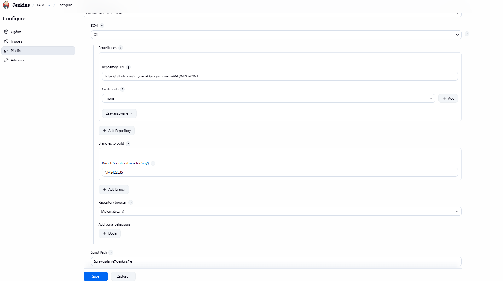
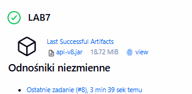
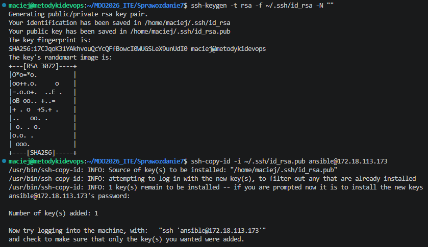
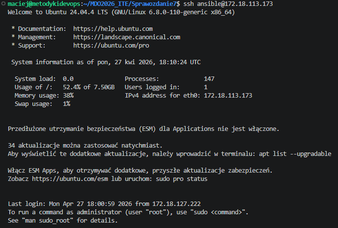
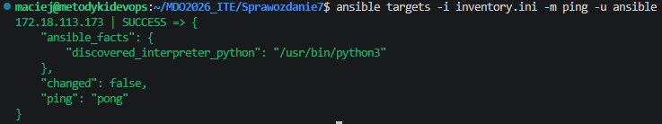

# Sprawozdanie z Zajęć 07 - Jenkins CI/CD oraz Przygotowanie do Ansible

## 1. Konfiguracja procesu CI/CD (Jenkinsfile w SCM)

W pierwszej części laboratorium utworzono deklaratywny rurociąg w Jenkinsie, którego definicja została przeniesiona do repozytorium GitHub jako plik `Jenkinsfile`, realizując tym samym podejście **Infrastructure as Code (IaC)**.

Zaimplementowano następujące etapy (ścieżka krytyczna):
* **Cleanup & Setup:** Gwarantuje pracę na świeżym środowisku. Wyczyszczono workspace (`deleteDir()`) i wygenerowano poprawne pliki źródłowe, w tym `pom.xml` ze wsparciem wtyczki `spring-boot-maven-plugin` (rozwiązanie problemu braku manifestu w wygenerowanym pliku `.jar`).
* **Build:** Zbudowanie obrazu Dockera przygotowującego artefakt (z użyciem Multi-stage Dockerfile). Aby uniknąć problemów ze starymi warstwami po poprzednich nieudanych próbach, użyto flagi `--no-cache`.
* **Test:** Weryfikacja obrazu poprzez sprawdzenie wersji Javy nadpisując domyślny punkt wejścia (`--entrypoint java`).
* **Deploy (Sandbox):** Uruchomienie zbudowanego kontenera na docelowym porcie (8081) oraz przeprowadzenie tzw. *Smoke Testu* (zapytanie `curl` sprawdzające odpowiedź od kontenera HTTP), co dowodzi, że wdrożony obraz potrafi samodzielnie wystartować.
* **Publish:** Wyciągnięcie gotowego, wykonywalnego artefaktu (`api-v8.jar`) z kontenera budującego i udostępnienie go w Jenkinsie jako zarchiwizowane pliki (Artifacts).

Poniższe zrzuty ekranu potwierdzają prawidłową konfigurację SCM w Jenkinsie oraz pomyślne wykonanie całego rurociągu zakończone wygenerowaniem artefaktu.

## 2. Przygotowanie infrastruktury pod Ansible

W drugiej części zajęć przygotowano środowisko do automatyzacji za pomocą systemu Ansible, wykorzystując dwa węzły:
1.  **Control Node (Główna maszyna z Jenkinsem):** Zainstalowano pakiet `ansible` oraz wygenerowano czystą parę kluczy RSA (bez hasła) do komunikacji wewnętrznej.
2.  **Target Node (Docelowa maszyna wirtualna):** Utworzono nową, zminimalizowaną maszynę wirtualną z systemem Ubuntu Server. Skonfigurowano nazwę hosta `ansible-target`, utworzono użytkownika `ansible` i zainstalowano serwer OpenSSH.

### Wymiana kluczy SSH
Aby spełnić wymóg logowania bezhasłowego, klucz publiczny RSA z maszyny sterującej został pomyślnie przesłany na maszynę docelową z użyciem narzędzia `ssh-copy-id`, co potwierdza poniższy zrzut ekranu.

Udana próba logowania bez konieczności wpisywania hasła użytkownika:

### Weryfikacja połączenia Ansible
Na zakończenie przygotowano plik inwentarza (`inventory.ini`) zawierający adres IP maszyny docelowej i przetestowano komunikację. Ansible poprawnie połączyło się z drugim węzłem, wykonując moduł `ping`.

