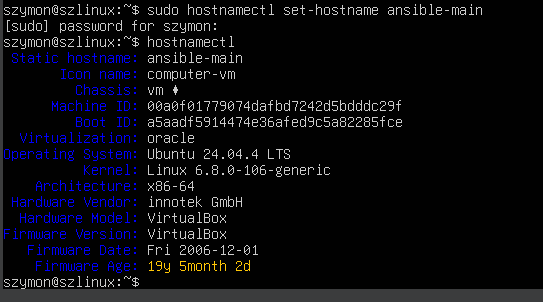
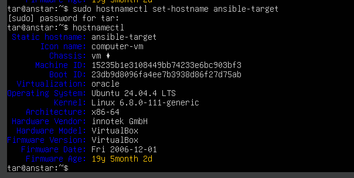
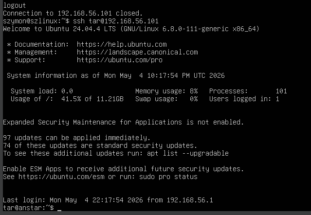
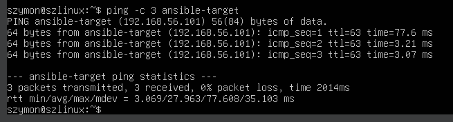
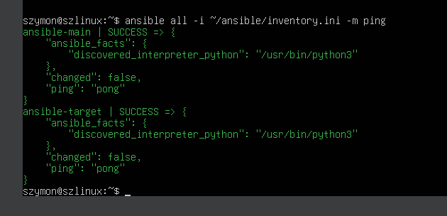
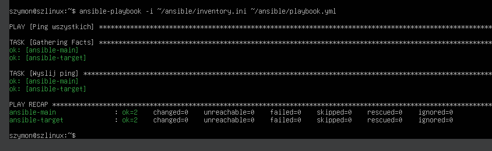
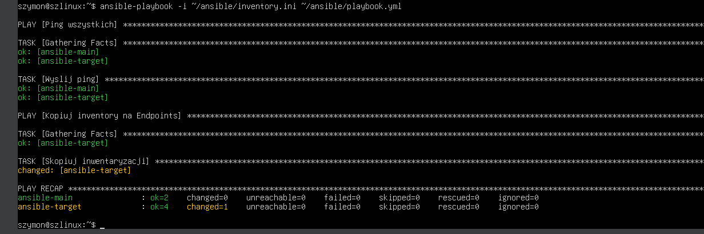
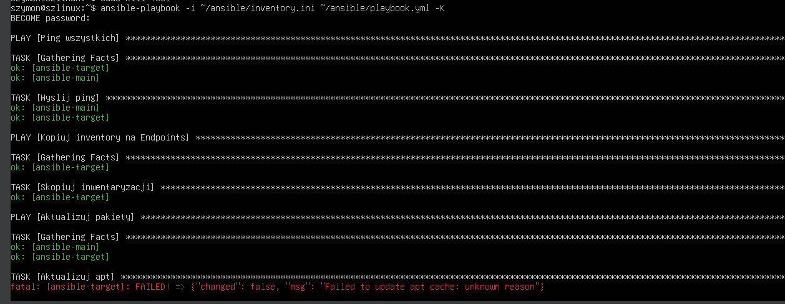

# Sprawozdanie – Automatyzacja i zdalne wykonywanie poleceń za pomocą Ansible

## 1. Wprowadzenie

Ansible to narzędzie do automatyzacji zarządzania konfiguracją, wdrażania aplikacji i orkiestracji zadań na zdalnych maszynach. W odróżnieniu od innych narzędzi tego typu (np. Puppet, Chef), Ansible jest **bezagentowy** — nie wymaga instalacji żadnego oprogramowania na maszynach docelowych. Komunikacja odbywa się przez SSH, a zadania definiowane są w plikach YAML zwanych **playbookami**.

Główne zalety Ansible:
- prostota konfiguracji (pliki YAML),
- brak agentów na maszynach docelowych,
- idempotentność — wielokrotne wykonanie tego samego playbooka daje ten sam efekt,
- duża społeczność i bogata biblioteka modułów.

---

## 2. Środowisko laboratoryjne

W ramach laboratorium wykorzystano dwie maszyny wirtualne działające w środowisku VirtualBox:

| Rola | Hostname | Użytkownik | Adres IP |
|------|----------|------------|----------|
| Orchestrator (dyrygent) | `ansible-main` | `szymon` | `192.168.56.100` |
| Endpoint (cel) | `ansible-target` | `tar` | `192.168.56.101` |

Obie maszyny działają na tym samym systemie operacyjnym (Ubuntu), co zapewnia spójność środowiska.

### Maszyna docelowa (ansible-target)

Nowa maszyna wirtualna została skonfigurowana z minimalnym zestawem oprogramowania. Zapewniono obecność:
- programu `tar` (weryfikacja: `tar --version`),
- serwera OpenSSH (`sshd`) — niezbędnego do komunikacji z Ansible.

Hostname ustawiono poleceniem:
```bash
sudo hostnamectl set-hostname ansible-target
```





---

## 3. Instalacja Ansible

Ansible zainstalowano na maszynie głównej (`ansible-main`) z repozytorium dystrybucji:

```bash
sudo apt update
sudo apt install ansible
```

Weryfikacja instalacji:
```bash
ansible --version
```

---

## 4. Wymiana kluczy SSH

Aby umożliwić Ansible łączenie się z maszyną docelową bez podawania hasła, wykonano wymianę kluczy SSH.

### Generowanie klucza (na ansible-main)

```bash
ssh-keygen -t ed25519
```

Klucz zapisano w domyślnej lokalizacji (`~/.ssh/id_ed25519`), bez hasła ochronnego.

### Kopiowanie klucza publicznego na ansible-target

```bash
ssh-copy-id tar@192.168.56.101
```

Polecenie to dodaje klucz publiczny do pliku `~/.ssh/authorized_keys` na maszynie docelowej. Przy pierwszym połączeniu wymagane jest jednorazowe podanie hasła użytkownika `tar`.

### Weryfikacja połączenia bez hasła

```bash
ssh tar@ansible-target
```

Połączenie nawiązano bez pytania o hasło — wymiana kluczy zakończyła się sukcesem.



> **Napotkany problem:** Podczas konfiguracji uprawnień katalogu `.ssh` na maszynie docelowej konieczne było ręczne ustawienie poprawnych uprawnień:
> ```bash
> chmod 700 ~/.ssh
> chmod 600 ~/.ssh/authorized_keys
> ```
> SSH wymaga dokładnie tych uprawnień — zbyt liberalne uprawnienia powodują odrzucenie klucza.

---

## 5. Inwentaryzacja systemów

### Ustawienie nazw hostów

Na obu maszynach ustawiono przewidywalne nazwy za pomocą `hostnamectl`, unikając domyślnej nazwy `localhost`.

### Konfiguracja DNS w /etc/hosts

Na maszynie głównej dodano wpisy do pliku `/etc/hosts`, umożliwiające odwoływanie się do maszyn po nazwach zamiast adresów IP:

```
192.168.56.100   ansible-main
192.168.56.101   ansible-target
```

Weryfikacja łączności:
```bash
ping -c 3 ansible-target
```

### Plik inwentaryzacji

Plik inwentaryzacji (`inventory.ini`) został utworzony w katalogu `~/ansible/`:

```ini
[Orchestrators]
ansible-main ansible_user=szymon ansible_connection=local

[Endpoints]
ansible-target ansible_user=tar
```

Plik definiuje dwie sekcje:
- `Orchestrators` — maszyna zarządzająca (połączenie lokalne),
- `Endpoints` — maszyny docelowe.

### Weryfikacja łączności przez Ansible

```bash
ansible all -i ~/ansible/inventory.ini -m ping
```

**Wynik:**
```
ansible-main  | SUCCESS => { "ping": "pong" }
ansible-target | SUCCESS => { "ping": "pong" }
```

Obie maszyny odpowiedziały poprawnie.





---

## 6. Zdalne wywoływanie procedur — Playbook

Wszystkie zadania zdefiniowano w jednym pliku playbooka `~/ansible/playbook.yml`.

### 6.1 Ping wszystkich maszyn

```yaml
---
- name: Ping wszystkich
  hosts: all
  tasks:
    - name: Wyślij ping
      ansible.builtin.ping:
```

Uruchomienie:
```bash
ansible-playbook -i ~/ansible/inventory.ini ~/ansible/playbook.yml
```

**Wynik:** Obie maszyny zwróciły `ok=2`, `failed=0`.



---

### 6.2 Kopiowanie pliku inwentaryzacji na Endpoints

```yaml
- name: Kopiuj inventory na Endpoints
  hosts: Endpoints
  tasks:
    - name: Skopiuj plik inwentaryzacji
      ansible.builtin.copy:
        src: ~/ansible/inventory.ini
        dest: ~/inventory.ini
```

**Pierwsze uruchomienie:** `changed=1` — plik został skopiowany.

**Drugie uruchomienie:** `changed=0` — plik już istniał i był identyczny.



> **Obserwacja (idempotentność):** Ansible sprawdza stan docelowy przed wykonaniem zadania. Jeśli plik już istnieje i jego zawartość jest identyczna, zadanie jest pomijane (`ok` zamiast `changed`). Jest to kluczowa cecha Ansible — wielokrotne wykonanie playbooka jest bezpieczne i przewidywalne.

---

### 6.3 Aktualizacja pakietów w systemie

```yaml
- name: Aktualizuj pakiety
  hosts: all
  become: true
  tasks:
    - name: Aktualizuj apt
      ansible.builtin.apt:
        upgrade: dist
        update_cache: true
        lock_timeout: 60
```

Parametr `become: true` powoduje wykonanie zadania z uprawnieniami `sudo`. Uruchomienie wymagało flagi `-K` (podanie hasła sudo):

```bash
ansible-playbook -i ~/ansible/inventory.ini ~/ansible/playbook.yml -K
```

> **Napotkany problem:** Podczas pierwszej próby aktualizacji wystąpił błąd `Failed to lock apt for exclusive use`. Przyczyną był proces automatycznej aktualizacji systemu trzymający blokadę menedżera pakietów. Rozwiązaniem było dodanie parametru `lock_timeout: 60`, który nakazuje Ansible oczekiwać do 60 sekund na zwolnienie blokady, oraz ręczne zakończenie blokującego procesu.
>
> Na maszynie `ansible-target` wystąpił błąd `Failed to update apt cache: unknown reason` — zadanie zakończyło się niepowodzeniem mimo poprawnej konfiguracji. Problem wynikał prawdopodobnie z uszkodzonej pamięci podręcznej apt na maszynie docelowej.



---


## 7. Napotkane problemy i rozwiązania

Podczas laboratorium napotkano kilka problemów. Pierwszym był błąd `Permission denied` przy `ssh-copy-id` — wynikał z podania złej nazwy użytkownika (`szymon` zamiast `tar`). Po poprawieniu polecenia problem zniknął.

Kolejnym problemem było pytanie o hasło mimo wcześniejszej wymiany kluczy SSH. Przyczyną były nieprawidłowe uprawnienia katalogu `.ssh` na maszynie docelowej — naprawiono je poleceniami `chmod 700 ~/.ssh` oraz `chmod 600 ~/.ssh/authorized_keys`.

Przy uruchamianiu playbooka z `become: true` wystąpił błąd `Missing sudo password` — rozwiązaniem było dodanie flagi `-K` do polecenia `ansible-playbook`, która pozwala na podanie hasła sudo przed wykonaniem.

Podczas aktualizacji pakietów pojawił się błąd `Failed to lock apt` spowodowany przez działający w tle proces automatycznej aktualizacji systemu. Dodanie parametru `lock_timeout: 60` do modułu apt rozwiązało problem.

Ostatnim problemem była niedostępność maszyny `ansible-target` pod nazwą — brakowało wpisu w `/etc/hosts`. Po dodaniu linii `192.168.56.101 ansible-target` łączność po nazwie zaczęła działać poprawnie.

---

## 8. Podsumowanie

Laboratorium pozwoliło na praktyczne zapoznanie się z podstawami automatyzacji za pomocą Ansible. Skonfigurowano środowisko złożone z dwóch maszyn wirtualnych, przeprowadzono wymianę kluczy SSH oraz wykonano szereg zadań zdalnych za pomocą playbooka.

### Wnioski

- Ansible umożliwia zdalne zarządzanie wieloma maszynami jednocześnie bez instalowania agentów.
- Idempotentność playbooków zapewnia bezpieczeństwo wielokrotnego wykonania — system zawsze dąży do zdefiniowanego stanu.
- Prawidłowa konfiguracja SSH (uprawnienia, klucze) jest warunkiem koniecznym działania Ansible.
- Parametr `become: true` pozwala na wykonywanie zadań wymagających uprawnień administratora.
- Plik inwentaryzacji jest centralnym punktem konfiguracji — definiuje grupy maszyn i sposób połączenia z nimi.
