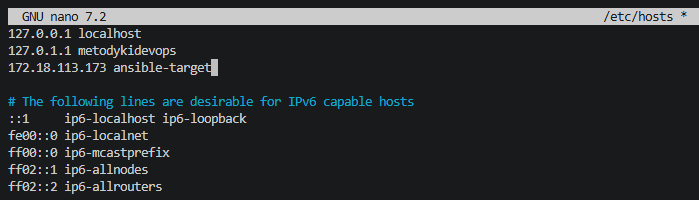
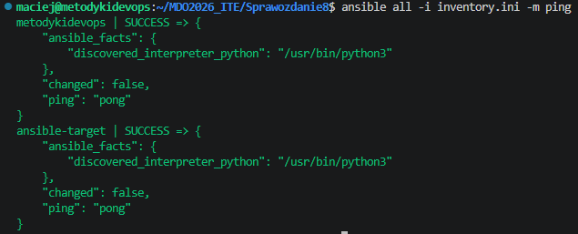
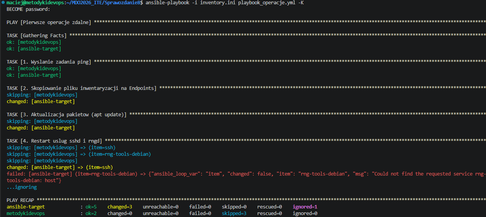
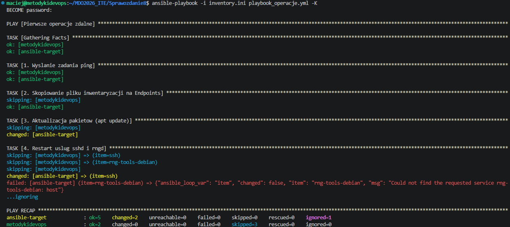
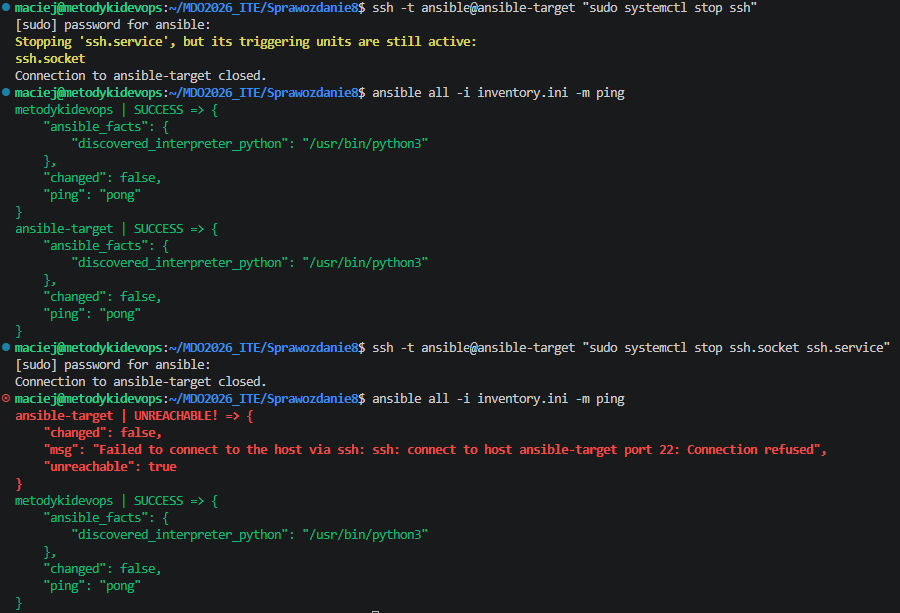
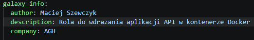
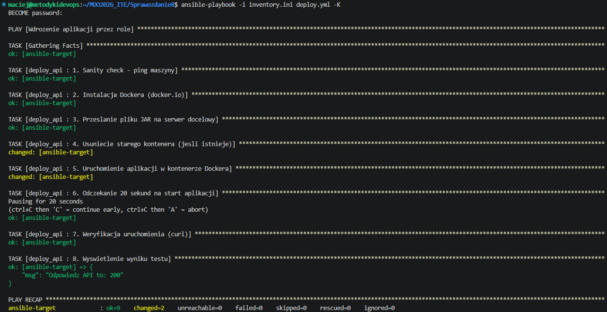
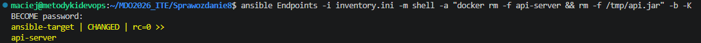

# Sprawozdanie z Zajęć 08 - Automatyzacja z Ansible
**Autor:** Maciej Szewczyk (MS422035)  
**Kierunek:** ITE | **Grupa:** G6

## 1. Inwentaryzacja i konfiguracja DNS
Pracę z Ansible rozpoczęto od przygotowania środowiska i konfiguracji nazewnictwa maszyn, aby uniknąć posługiwania się wyłącznie adresami IP oraz domyślnym `localhost`. 

W pliku `/etc/hosts` wprowadzono odpowiednie wpisy DNS dla głównej maszyny (`metodykidevops`) oraz docelowej maszyny wirtualnej (`ansible-target`). Następnie przygotowano plik inwentaryzacji `inventory.ini`, wprowadzając podział na logiczne grupy `[Orchestrators]` oraz `[Endpoints]`. Poprawność konfiguracji oraz bezhasłowego logowania SSH zweryfikowano za pomocą modułu `ping` (polecenie ad-hoc).

## 2. Podstawowe operacje zdalne i idempotentność
Przygotowano skrypt `playbook_operacje.yml`, który realizował zestaw zadań administracyjnych na maszynach w grupie Endpoints: kopiowanie pliku inwentarza, aktualizację cache'u pakietów systemowych (`apt update`) oraz restart usług. Zaimplementowano obsługę błędu za pomocą klauzuli `ignore_errors` dla usługi `rngd`, która nie jest domyślnie instalowana w systemie Ubuntu Server Minimal.

Kluczowym elementem zadania było udowodnienie **idempotentności** Ansible. Porównano dwa kolejne wykonania tego samego Playbooka. Podczas ponownego uruchomienia, zadanie przesyłania pliku nie wykonało żadnej modyfikacji (zmiana statusu z żółtego `changed` na zielone `ok`), ponieważ Ansible zweryfikował, że stan docelowy został już wcześniej osiągnięty.

## 3. Odporność na awarie
Przetestowano zachowanie narzędzia Ansible w przypadku utraty łączności z węzłem docelowym. W tym celu zdalnie zatrzymano demona SSH na maszynie `ansible-target`. Ze względu na mechanizm *socket activation* w systemd, konieczne było jednoczesne zatrzymanie usług `ssh.service` oraz `ssh.socket`. Wysłanie żądania `ping` w sytuacji niedostępności serwera poprawnie zakończyło się błędem `UNREACHABLE`.

## 4. Wdrożenie artefaktu (Ansible Galaxy Roles)
Głównym zadaniem wdrożeniowym było zautomatyzowane uruchomienie aplikacji (artefaktu `api-v8.jar` z poprzedniego potoku CI) na czystej maszynie docelowej. W tym celu przygotowano **rolę Ansible** przy wykorzystaniu narzędzia do szkieletowania `ansible-galaxy role init deploy_api`. 

Uzupełniono metadane roli w pliku `meta/main.yml`, przypisując poprawnego autora oraz opis paczki.

Główny Playbook `deploy.yml` uruchamiał rolę realizującą następującą ścieżkę:
1. Weryfikacja łączności (Sanity Check).
2. Automatyczna instalacja pakietu `docker.io` z wykorzystaniem podniesionych uprawnień (`become`).
3. Przesłanie pliku wykonywalnego `api-v8.jar` do katalogu `/tmp`.
4. Uruchomienie kontenera opartego na obrazie `eclipse-temurin:21-jre-alpine` i zmapowanie portów (8081:8080) oraz woluminów.
5. Wykonanie po 20 sekundach testu uruchomieniowego za pomocą modułu `uri`, badającego punkt końcowy API. Otrzymano oczekiwany kod odpowiedzi HTTP: 200.

## 5. Oczyszczanie środowiska
Zgodnie z dobrymi praktykami oraz wymaganiami polecenia, po pomyślnym teście uruchomieniowym, maszyna docelowa została oczyszczona ze śladów wdrożenia. Wykorzystano polecenie ad-hoc z modułem `shell`, aby wywołać bezpośrednio w konsoli komendy zatrzymujące kontener, zwalniające port i usuwające plik JAR ze zdalnego systemu.

