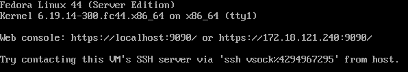
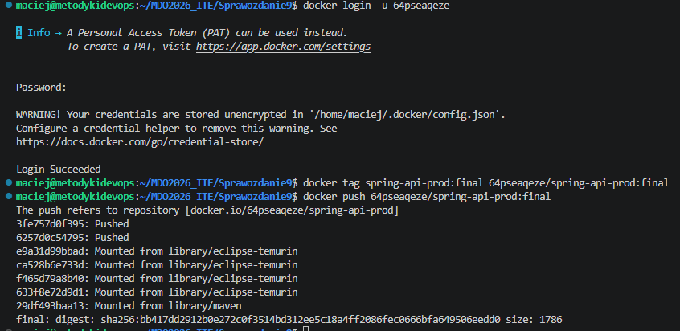
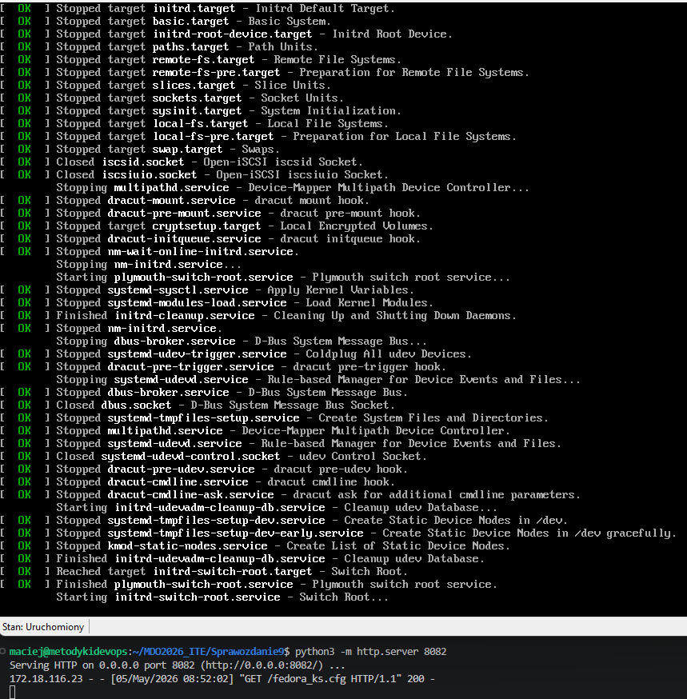
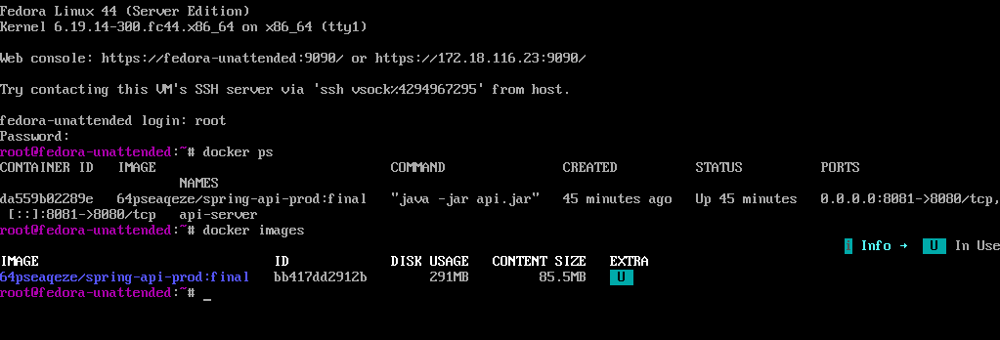
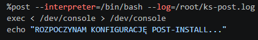
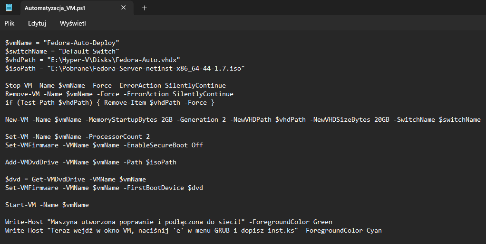
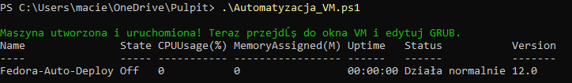
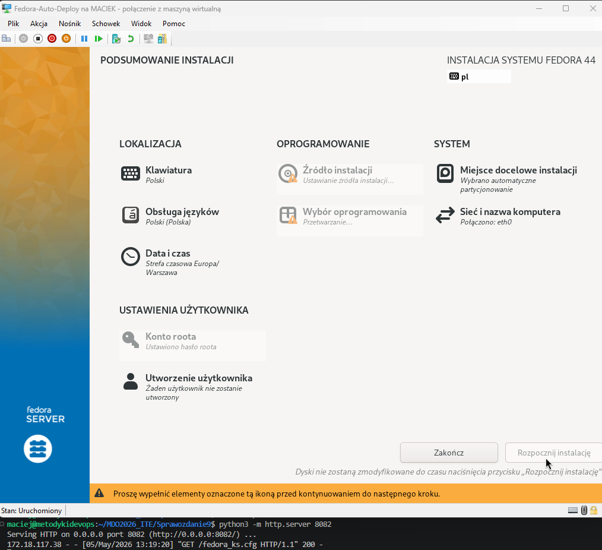

# Sprawozdanie: Pliki odpowiedzi dla wdrożeń nienadzorowanych (Lab 9)

**Autor:** Maciej Szewczyk (MS422035)  
**Kierunek:** ITE | **Grupa:** G6

## 1. Zakończenie instalacji i gotowy system Fedora
Wynikiem pomyślnie przeprowadzonej instalacji jest w pełni działający system Fedora Server. Po restarcie maszyny wirtualnej system uruchomił się poprawnie, udostępniając konsolę logowania oraz interfejs webowy Cockpit na odpowiednich adresach IP.

## 2. Przygotowanie obrazu aplikacji
Zgodnie z wymaganiami zadania, oprogramowanie zostało przygotowane w formie kontenera. Wykonano logowanie do publicznego rejestru (`docker login`), nadano tag obrazowi API i wypchnięto go do Docker Hub (`docker push`). Dzięki temu instalator będzie mógł go pobrać z sieci.

## 3. Ustawienie nasłuchiwania i bootowanie
Plik odpowiedzi (Kickstart) został wystawiony w sieci przy użyciu serwera HTTP w języku Python na porcie 8082. Poniższy log potwierdza, że podczas bootowania systemu żądanie pobrania pliku `fedora_ks.cfg` zakończyło się statusem 200 OK, a proces uruchamiania (systemd) przeszedł do kolejnych faz.

## 4. Weryfikacja pobrania obrazu i działania kontenera
Po zainstalowaniu i uruchomieniu systemu Fedora, procesy zdefiniowane w pliku Kickstart automatycznie zainstalowały środowisko Docker i uruchomiły aplikację. Wykonanie polecenia `docker ps` na nowej maszynie potwierdza, że kontener `spring-api-prod:final` działa bez zarzutu i nasłuchuje na porcie 8081.

## 5. Test komunikacji z uruchomioną usługą (curl)
Aby ostatecznie potwierdzić sukces wdrożenia, z poziomu maszyny hosta (`metodykidevops`) wykonano zapytanie `curl` na adres IP utworzonej maszyny wirtualnej. Aplikacja odpowiedziała poprawnym komunikatem: "System operacyjny: Linux".

## 6. ZAKRES ROZSZERZONY: Modyfikacja pliku fedora_ks.cfg
W ramach automatyzacji wdrożenia zmodyfikowano plik Kickstart. W sekcji `%post` dodano mechanizm bashowy, który wykonuje konfigurację poinstalacyjną. Zastosowano także przekierowanie wyjścia na konsolę (`exec < /dev/console > /dev/console`), co pozwala na bieżąco śledzić komunikaty skryptu na ekranie.

## 7. Skrypt automatyzujący powoływanie maszyny (VM)
Zamiast ręcznej konfiguracji hipernadzorcy, przygotowano skrypt PowerShell (`Automatyzacja_VM.ps1`), który definiuje parametry maszyny jako kod (IaC). Skrypt czyści stare środowisko, tworzy nową maszynę 2. generacji z 2GB RAM, podpina sieć (Default Switch) oraz nośnik ISO.

## 8. Pomyślne działanie skryptu powołującego infrastrukturę
Skrypt został wykonany w konsoli PowerShell jako Administrator. W konsoli zwrócono zielony komunikat o poprawnym utworzeniu i uruchomieniu maszyny. Status maszyny `Fedora-Auto-Deploy` zmienił się na działający ("Działa normalnie"), przekazując kontrolę do instalatora.

## 9. Efekt nasłuchiwania maszyny ze skryptu
Ostatnim elementem spajającym cały proces nienadzorowanej instalacji jest instalator GUI (Anaconda). Dzięki parametrom przekazanym do GRUB-a z wykorzystaniem działającego w tle serwera HTTP (kod 200), instalator pobrał konfigurację sieci i rozpoczął przetwarzanie nienadzorowanej instalacji na nowo powołanej maszynie.

