# Sprawozdanie - Laboratorium 1
## Wojciech Pieńkowski
---
### Git
Na maszynie wirtualnej Oracle Virtual box pobrałem obraz Ubuntu,
najpierw zainstalowałem gita oraz obsługę kluczy ssh.
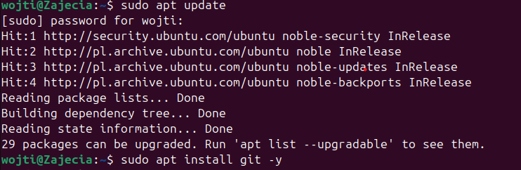


Następnie w ustawieniach deweloperskich profilu github utworzyłem personal access token,    a potem skolowałem nasze repozytorium z pomocą HTTPS
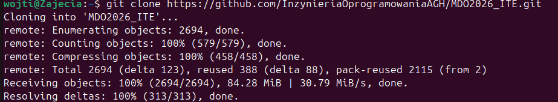

### SSH
W kolejnej części utworzyłem dwa klucze ssh, jeden z hasłem a drugi bez, przy uwadze że nie mogą znajdywać się w tym samym folderze
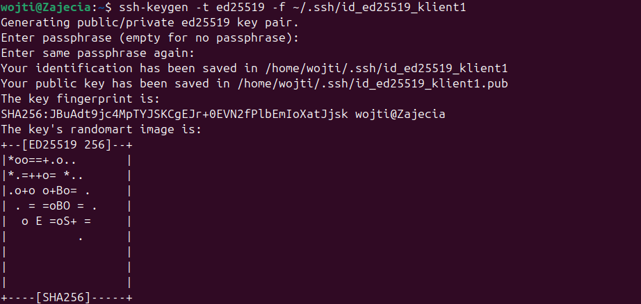
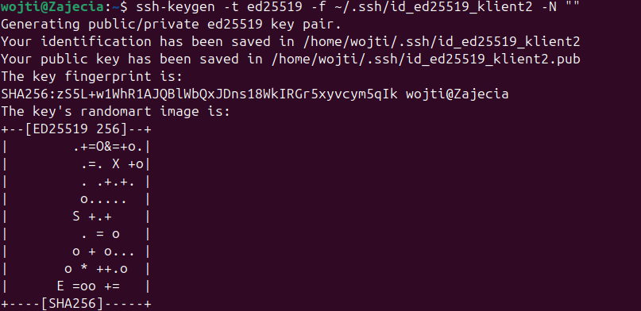
oraz skopiowałem publiczny klucz w celu dodania go w ustawieniach jako metody dostępu do github

```bash
 cat ~/.ssh/id_ed25519_klient1.pub
```

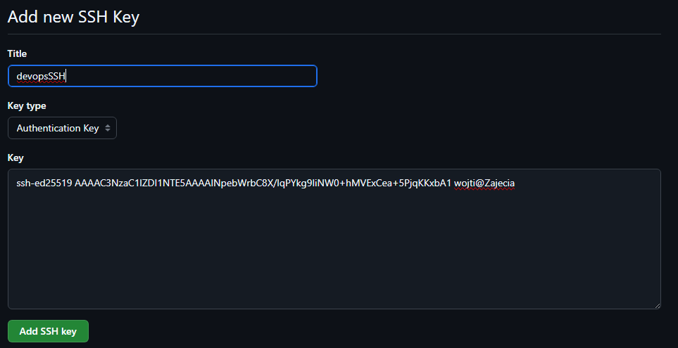

po utworzeniu kluczy pozostało sklonować repozytorium za pomocą protokołu ssh
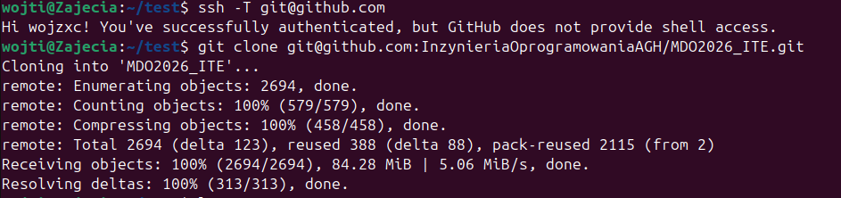

### Narzędzia
Kolejną częścią było skonfigurowanie dostępu do repozytorium w edytorze IDE, w tym celu pobrałem rozszerzenie Remote-SSH w Visual Studio Code, a następnie za pomocą ip serwera linux połączyłem się z wirtualną maszyną

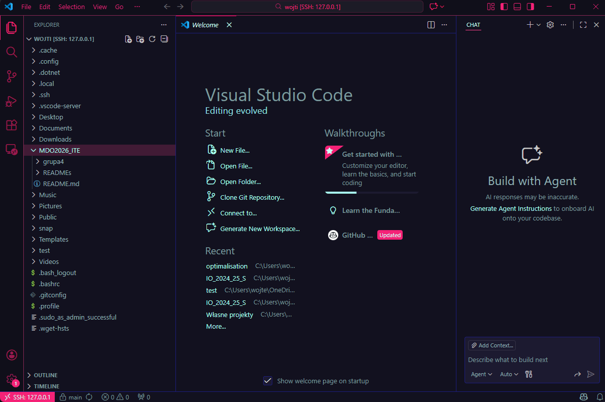

Dzięki temu, że wybrałem VSC nie musiałem pobierać dodatkowego menadżera plików, ponieważ wystarczy przeciągniecie plików z komputera do folderu wyświetlonego w edytorze.

### Gałąź

Ostatnią częścią było utworzenie własnej gałęzi oraz wykonanie na niej pracy, zadanie rozpocząłem od przełączenie się na gałąź main, a następnie swojej grupy. 
Następnie utworzyłem gałąź o nazwie WP423391

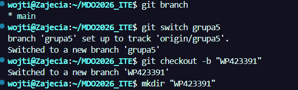

Na nowej gałęzi mialem utworzyć git hooka, który miał za zadanie weryfikować czy każdy mój commit zaczyna się od moich inicjałów i numeru indeksu

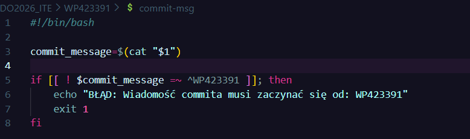

Test skryptu: 
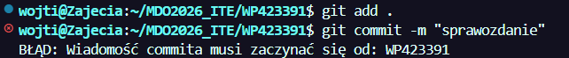
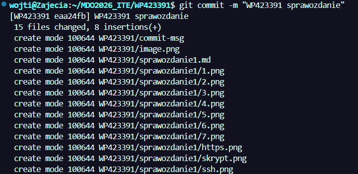

Dodanie pull requesta:
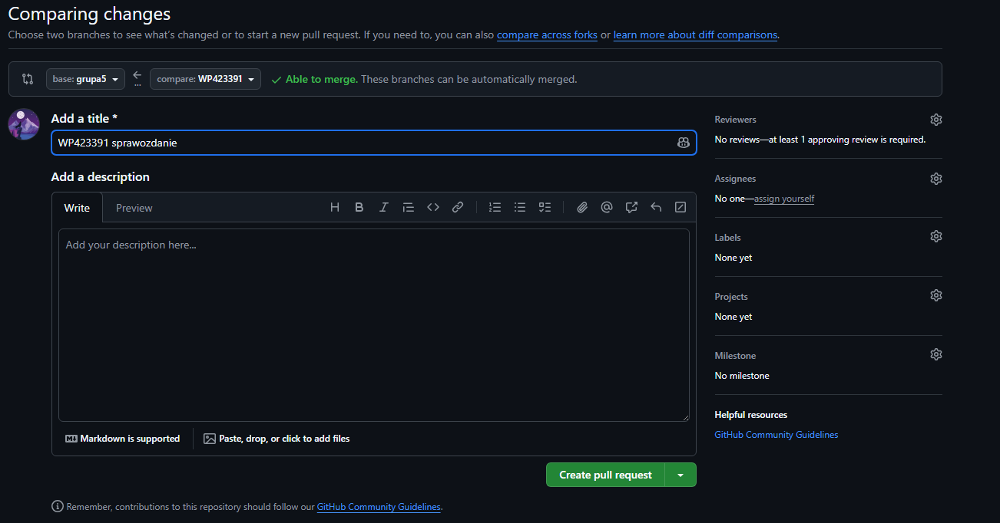
