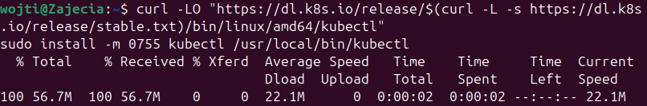
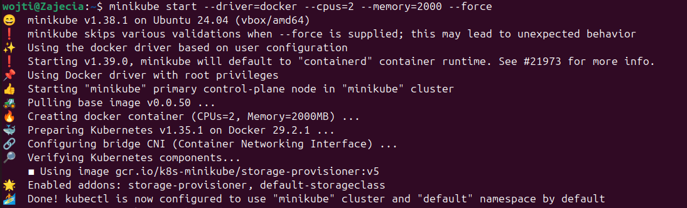
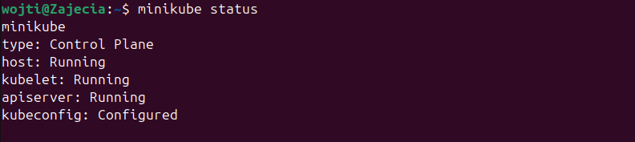
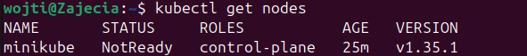
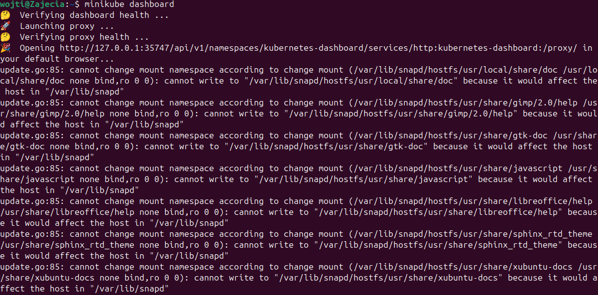
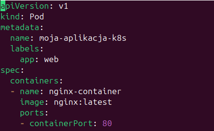
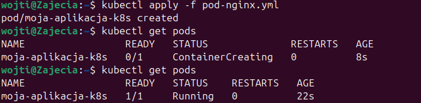
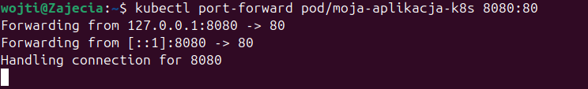
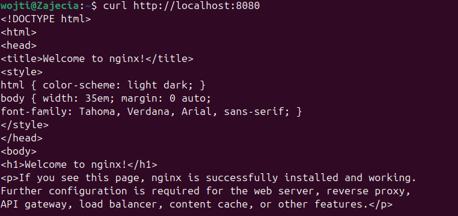

# Zajęcia 10 - Wdrażanie na zarządzalne kontenery: Kubernetes (1)
## Wojciech Pieńkowski

---

### Pobranie oraz instalavja binarówn narzzedzia kubectl w systemie operacyjnym ubuntu w celu umożliwienia zarządzania klastrem Kubernetes z poziomu terminala.

### Inicjalizacja lokalnego klastra komendą minikube start, w celu zapobiegnięcia problemów, musiłem start oraz ustawiłem ilość cpu i memory

### Weryfikacja stanu klastra poleceniem minikube status, pokazująca pełny sukces konfiguracyjny, w którym wszystkie kluczowe komponenty uzyskały status Running.

### Sprawdzenie dostępnych węzłów komendą kubectl get nodes, wskazujące, że węzeł minikube jest jeszcze w stanie NotReady.

### Wywołanie usługi minikube dashboard, uruchamiające proces proxy w celu otwarcia graficznego panelu zarządzania klastrem w przeglądarce internetowej.

### Przygotowanie pliku YAML dla zasobu typu Pod o nazwie moja-aplikacja-k8s.

### Pomyślne wdrożenie aplikacji w klastrze za pomocą polecenia kubectl apply -f pod-nginx.yml oraz weryfikacja statusu Running dla utworzonego Poda.

### Uruchomienie procesu ciągłego przekierowania portów poleceniem kubectl port-forward, które umożliwiło mapowanie ruchu sieciowego z portu kontenera na lokalny port 8080 maszyny wirtualnej.

### Weryfikacja poprawnego działania serwera WWW za pomocą programu curl, która potwierdziła zwrócenie kodu źródłowego strony startowej Nginx.

