# Zajęcia 11 - Wdrażanie na zarządzalne kontenery: Kubernetes (2)
## Wojciech Pieńkowski

---

# 1. Przygotowanie i publikacja obrazów w rejestrze Docker Hub

Celem tego zadania było utworzenie pliku definicji kontenera (Dockerfile) bazującego na oficjalnym serwerze Apache (httpd:latest) oraz osadzenie w nim spersonalizowanego pliku indeksu index.html zawierającego numer albumu studenta. Następnie uruchomiono proces budowania lokalnego obrazu i nadano mu znacznik v1.
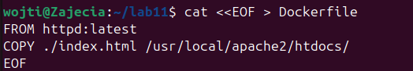
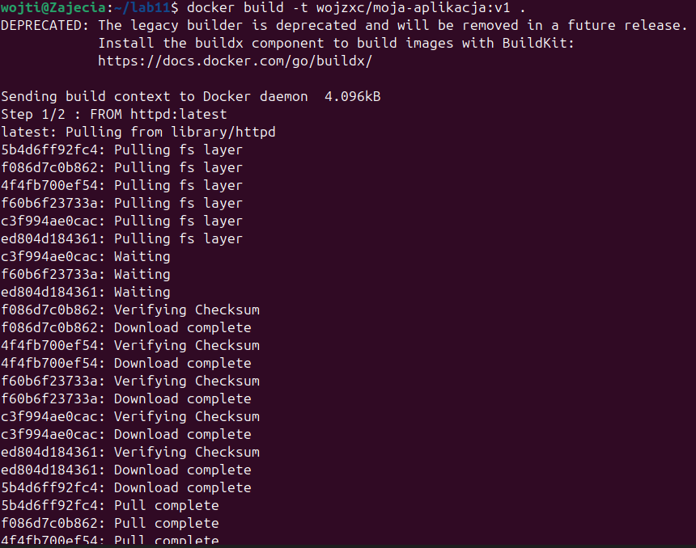

Po poprawnym zbudowaniu i otagowaniu lokalnego obrazu, konieczne było przesłanie go do zewnętrznego, publicznego rejestru Docker Hub, co umożliwi późniejsze pobieranie go przez węzły działające w klastrze Kubernetes.
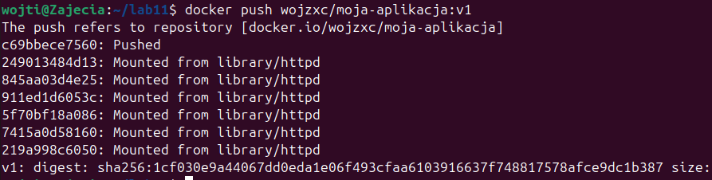

W celu przygotowania środowiska do późniejszego procesu aktualizacji oprogramowania (Rolling Update), zmodyfikowano kod źródłowy strony index.html. Nowy kod skompilowano do postaci obrazu z osobnym tagiem referencyjnym v2 i wypchnięto do rejestru.
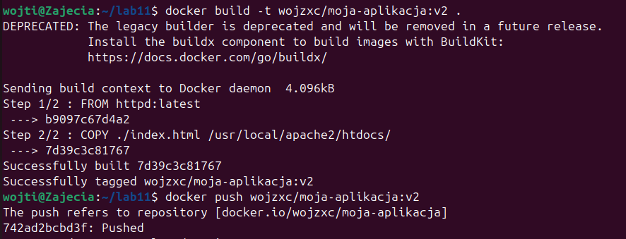

Ważnym elementem testów odporności systemów orkiestracji jest symulacja awarii. Zmodyfikowano instrukcję startową w Dockerfile, dopisując błędną komendę CMD wskazującą na nieistniejące polecenie binarne. Taki obraz po uruchomieniu natychmiast ulega awarii, co pozwoli sprawdzić zachowanie mechanizmów samonaprawiania klastra.
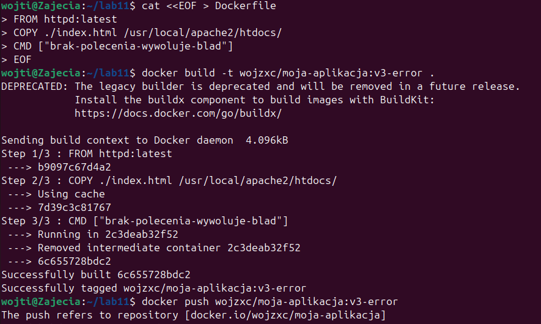

Po zakończeniu procesów budowania obrazów lokalnych, zalogowano się do panelu webowego repozytorium Docker Hub w celu sprawdzenia poprawności publikacji.
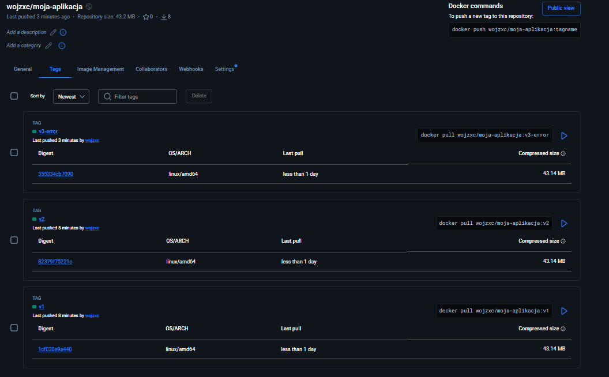

# 2. Zmiany w deploymencie

W celu wdrożenia oprogramowania w środowisku orkiestracji utworzono plik konfiguracyjny deployment.yml za pomocą edytora nano. Manifest deklaruje uruchomienie obiektu typu Deployment o nazwie moj-deployment, zarządzającego trzema instancjami kontenera Apache serwującego spersonalizowaną stronę z obrazu v1.
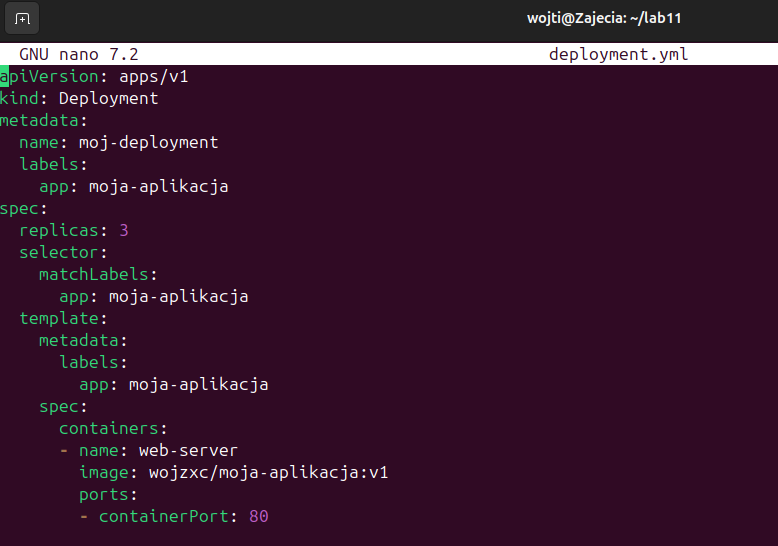

Zastosowano przygotowany manifest wewnątrz uruchomionego klastra. Następnie wykonano polecenia sprawdzające status wdrożenia oraz listę podów. System pomyślnie uruchomił 3 odizolowane instancje, przypisując im unikalne identyfikatory i status Running.
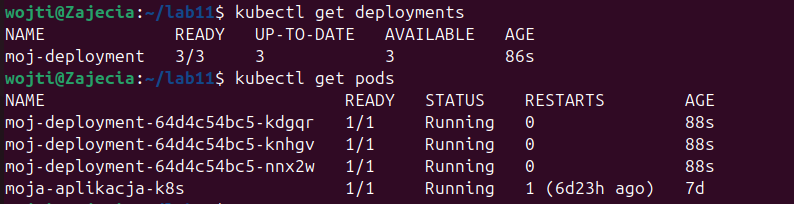

Przetestowano mechanizm dynamicznego dopasowywania wydajności infrastruktury bez przerywania pracy systemu. Za pomocą polecenia imperatywnego zwiększono liczbę pożądanych replik aplikacji z 3 do 8. Klastrowy kontroler natychmiast powołał do życia 5 nowych podów, które w ciągu kilku sekund osiągnęły pełną gotowość.
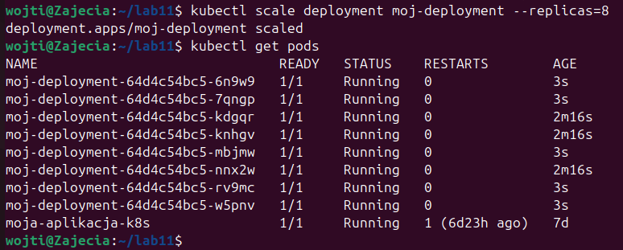

Następnie zmniejszono liczbę żądanych replik do 1 instancji. Kubernetes automatycznie wytypował nadmiarowe pody, wysłał do nich sygnał SIGTERM i bezpiecznie usunął je z klastra, pozostawiając w stanie Running tylko jeden, pojedynczy pod dbający o ciągłość działania usługi.
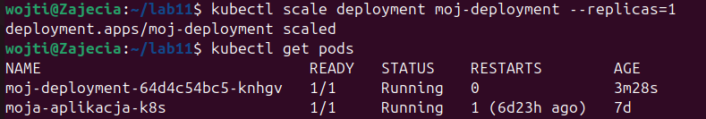

Za pomocą polecenia imperatywnego zmniejszono liczbę pożądanych replik wdrożenia moj-deployment do zera. System pomyślnie usunął wszystkie pody powiązane z tym wdrożeniem, pozostawiając w klastrze jedynie nienależący do deploymentu kontener autonomiczny.
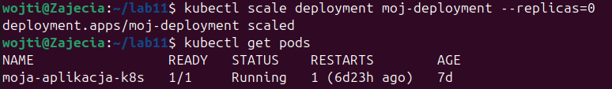

Skalowanie z poziomu zerowego do stabilnego, kontroler Kubernetes natychmiast rozpoczął proces ContainerCreating dla 4 nowych podów, które w ciągu kilku sekund osiągnęły status Running i pełną gotowość do obsługi ruchu sieciowego.
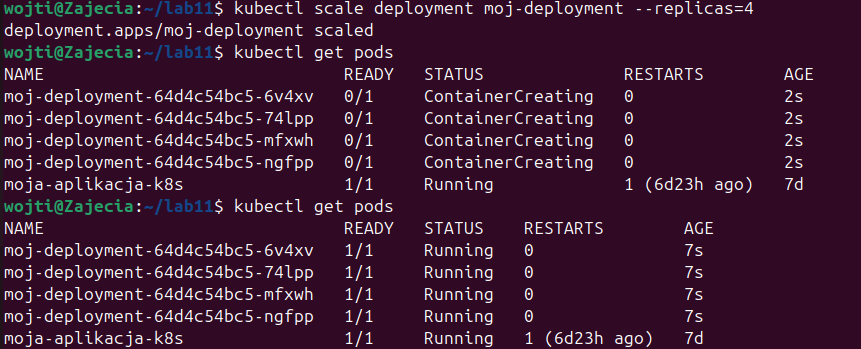

Zastosowanie nowej wersji obrazu. Wykonano polecenie sprawdzające historię zmian powiązanych z głównym wdrożeniem po dokonaniu zmiany obrazu na wersję v2. System zarejestrował i wyświetlił w terminalu dwie odrębne rewizje.
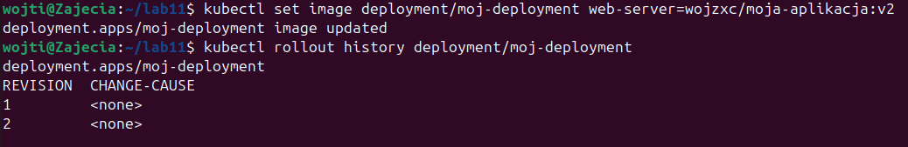

Wykorzystując polecenie rollout undo z jawnym wskazaniem na rewizję pierwszą, wymuszono na klastrze powrót do pierwotnego stanu aplikacji. System wygenerował ostrzeżenie dotyczące zarządzania obiektem, po czym pomyślnie przeprowadził procedurę rollback, co potwierdzono kontrolą statusu nowo powołanych podów.
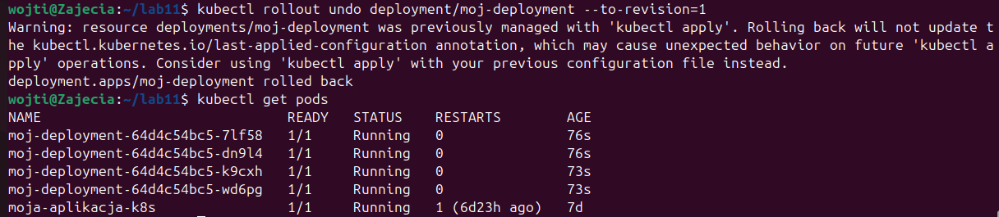

Przeprowadzono test odporności klastra na błędy konfiguracyjne poprzez próbę wdrożenia uszkodzonego obrazu v3-error. Po wymuszeniu aktualizacji obrazu, odpytano system o stan infrastruktury. Zgodnie z oczekiwaniami, pody nowej generacji nie były w stanie poprawnie wystartować, a Kubernetes przechwycił awarię procesu startowego wewnątrz kontenera, oznaczając pody krytycznym statusem RunContainerError.
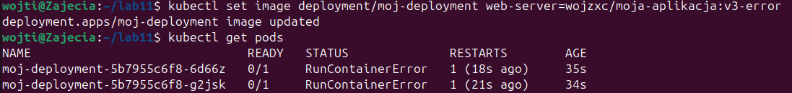

# 3. Strategie wdrożenia

Przetestowano działanie strategii bezwzględnego zastępowania kontenerów (Recreate). W pierwszej kolejności zmodyfikowano strukturę manifestu deployment.yml w edytorze tekstowym nano, wprowadzając do sekcji spec jawną deklarację typu strategii. Następnie zastosowano plik w klastrze i zaktualizowano obraz. 
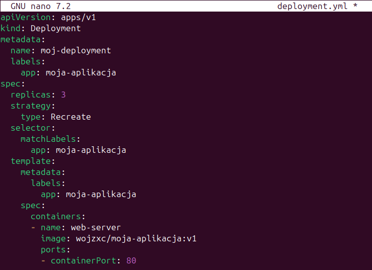
Zgodnie z założeniami tej strategii, kontroler Kubernetes przed powołaniem do życia nowych podów automatycznie wysłał sygnał zamknięcia do całej puli aktualnie działających instancji, co zaobserwowano w konsoli jako jednoczesny status Terminating dla wszystkich czterech dotychczasowych podów.
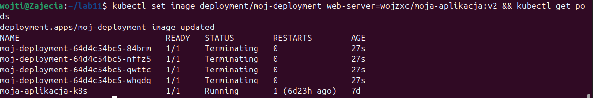

Przeprowadzono konfigurację i test zaawansowanej migracji oprogramowania w locie (RollingUpdate) przy użyciu zdefiniowanych limitów bezpieczeństwa. Po uruchomieniu aktualizacji obrazu wstecz do wersji v1, odpytano klastrowy kontroler o stan infrastruktury. 
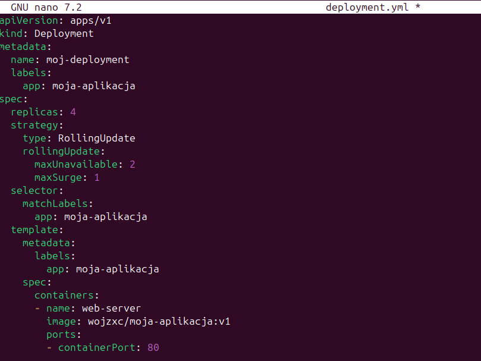
Na liście podów zaobserwowano precyzyjne działanie wprowadzonych reguł: system zaczął usuwać dokładnie dwie instancje jednocześnie (status Terminating), utrzymując stabilność i dostępność pozostałych zasobów.
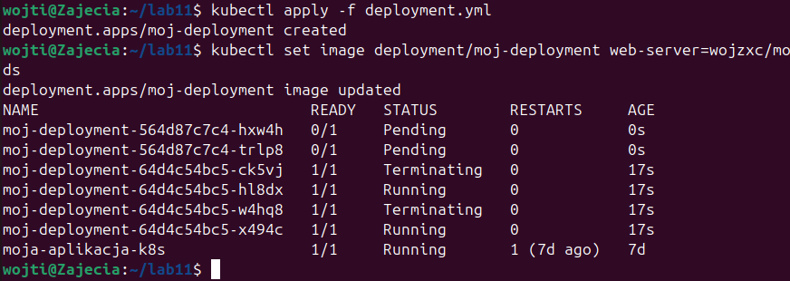

Ostatnim etapem prac laboratoryjnych było przygotowanie oraz wdrożenie typu kanarkowego (Canary Deployment). W osobnym pliku manifestu o nazwie canary-deployment.yml zdefiniowano niezależny obiekt typu Deployment o nazwie moj-deployment-canary, posiadający tylko jedną replikę kontenera z nową wersją obrazu v2.
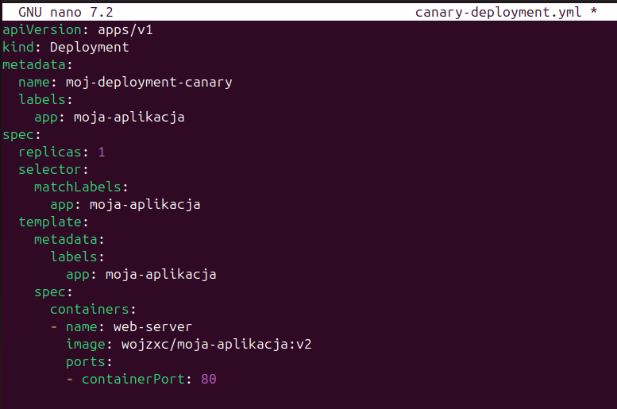

Po zaaplikowaniu pliku wyświetlono listę wszystkich zasobów – w klastrze zaczęły współistnieć obok siebie cztery produkcyjne pody pierwotnego wdrożenia oraz jeden odizolowany pod nowej generacji, co pozwala na bezpieczne testowanie stabilności kodu na ułamku ruchu sieciowego.
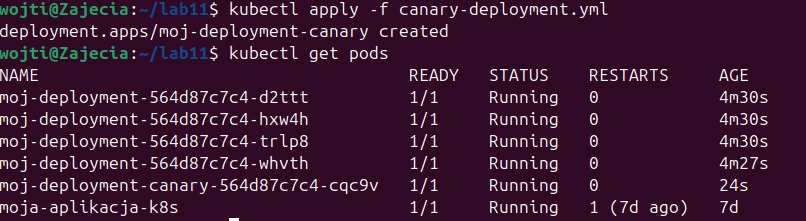

### Obserwacje i analiza zrealizowanych strategii wdrożeń

* **Strategia Recreate (Bezwzględna):** podczas testu zaobserwowano, że kontroler Kubernetes działa bezkompromisowo. W momencie aktualizacji najpierw wysłał sygnał zamknięcia (Terminating) do wszystkich dotychczasowych podów jednocześnie. Dopiero gdy licznik aktywnych kontenerów spadł do zera, system zaczął pobierać nowy obraz i tworzyć świeże instancje. Zaletą tej strategii jest brak ryzyka, że dwie różne wersje aplikacji będą działać w tym samym momencie (co jest ważne np. przy migracjach baz danych), jednak minusem jest nieunikniony brak dostępności usługi (downtime) na czas restartu.

* **Strategia RollingUpdate (Płynna/Stopniowa):** w przeciwieństwie do Recreate, ta strategia dba o ciągłość działania systemu. Zamiast niszczyć całe środowisko, Kubernetes podmienia pody partiami. Przy domyślnych ustawieniach wymienia je pojedynczo, a przy zastosowaniu własnych parametrów (`maxUnavailable: 2` oraz `maxSurge: 1`), zaobserwowano w konsoli, że system usunął dokładnie dwa pody w jednej fali, jednocześnie tworząc nowe. Dzięki temu aplikacja cały czas odpowiadała na zapytania sieciowe, a użytkownicy końcowi nie odczuli procesu aktualizacji.

* **Strategia Canary Deployment (Kanarkowa):** ta metoda okazała się najbardziej zaawansowana i bezpieczna z punktu widzenia środowisk produkcyjnych. Zamiast modyfikować istniejące wdrożenie, utworzono zupełnie nowy, miniaturowy deployment (1 pod z wersją v2) działający obok głównego systemu (4 pody z wersją v1). Poprzez mechanizm wspólnych etykiet (Labels), oba wdrożenia zaczęły współistnieć w klastrze. Pozwala to na skierowanie małej części ruchu sieciowego (w tym przypadku około 20%) na nową wersję, umożliwiając jej przetestowanie na żywych użytkownikach bez ryzyka globalnej awarii systemu w razie wykrycia błędów.