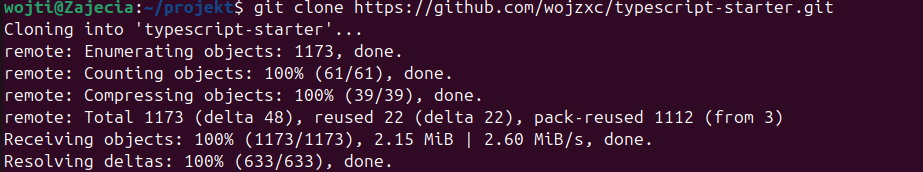
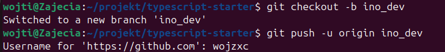
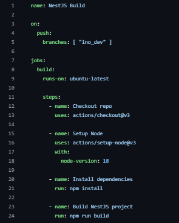
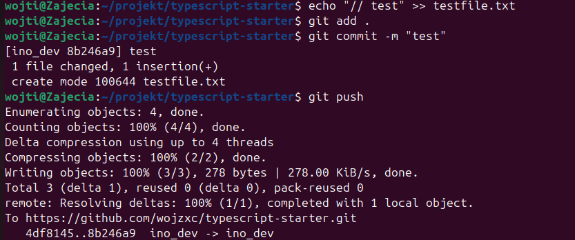
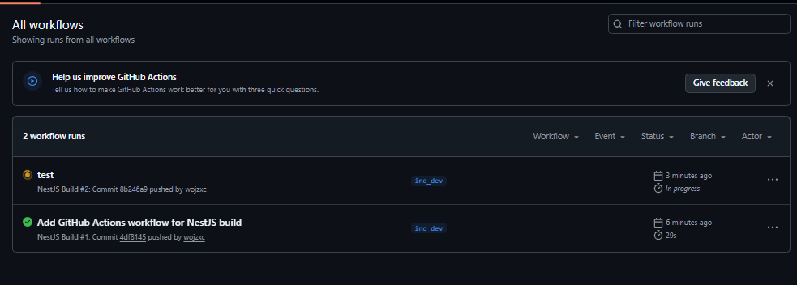

# Sprawozdanie - Laboratorium 13: Shift-left: GitHub Actions

## Wojciech Pieńkowski

### Cel zajęć
Celem laboratorium było praktyczne zapoznanie się z ideą automatyzacji procesów CI w środowisku GitHub poprzez wykorzystanie GitHub Actions. Zadanie polegało na samodzielnym przygotowaniu kompletnego workflow, który reaguje na zmiany w dedykowanej gałęzi ino_dev i automatycznie wykonuje zdefiniowane zadania, takie jak budowanie projektu, analiza jakości kodu czy inne operacje związane z procesem integracji. W ramach ćwiczenia należało sforkować wybrane repozytorium, usunąć istniejące workflowy, utworzyć własny plik konfiguracyjny w katalogu .github/workflows oraz zweryfikować, że akcja uruchamia się poprawnie po każdym pushu. Laboratorium miało pokazać, jak dzięki podejściu shift‑left można wykrywać błędy wcześniej, automatyzować powtarzalne czynności i usprawniać proces wytwarzania oprogramowania, przenosząc część odpowiedzialności na system CI działający bezpośrednio w repozytorium.

### Rozwiązanie

Sklonowanie własnego forka, fork repozytorium: nestjs/typescript-starter

Repozytorium zostało pobrane lokalnie, aby można było utworzyć gałąź i dodać workflow.

Utworzenie gałęzi ino_dev i pierwszy push.
Zgodnie z wymaganiami, workflow miał reagować na zmiany w gałęzi ino_dev.
Dlatego utworzono ją i wypchnięto na GitHuba:

Utworzenie workflowa build.yml
W katalogu .github/workflows/ utworzono plik build.yml

Dodanie testowego pliku, aby wywołać drugi run
Aby potwierdzić, że workflow reaguje na zmiany, dodano testowy plik:

Widok w zakładce Actions z dwoma wykonaniami workflowa.
W zakładce Actions pojawiły się:
pierwszy run - po dodaniu workflowa,
drugi run - po dodaniu testowego pliku.

