# Sprawozdanie - Laboratorium 2
## Wojciech Pieńkowski
---

### Zainstalowanie dockera na serwerze
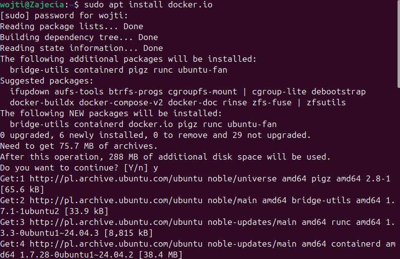

### Uruchomienie obrazu hello-world
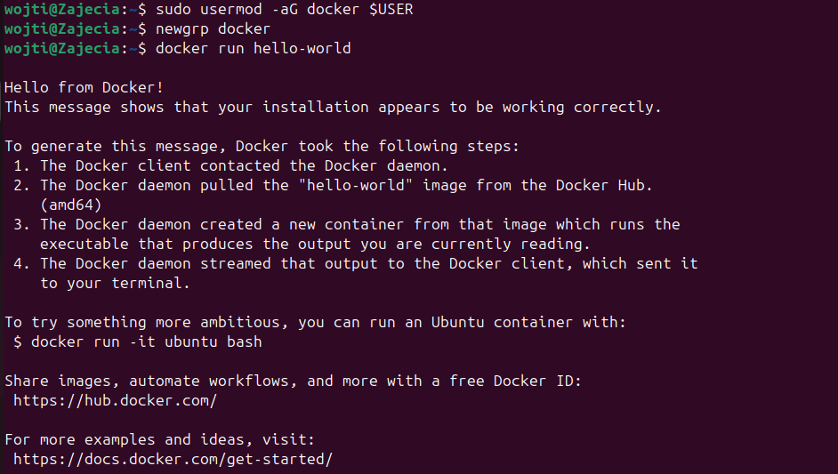

### Sprawdzenie rozmiarów 
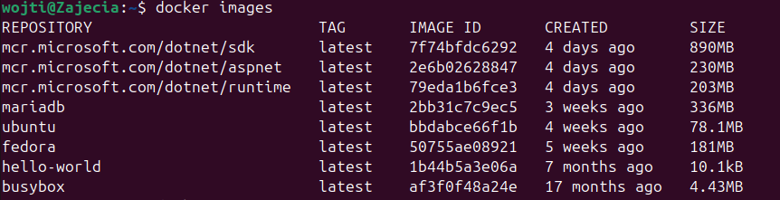

### Sprawdzenie kodu wyjścia
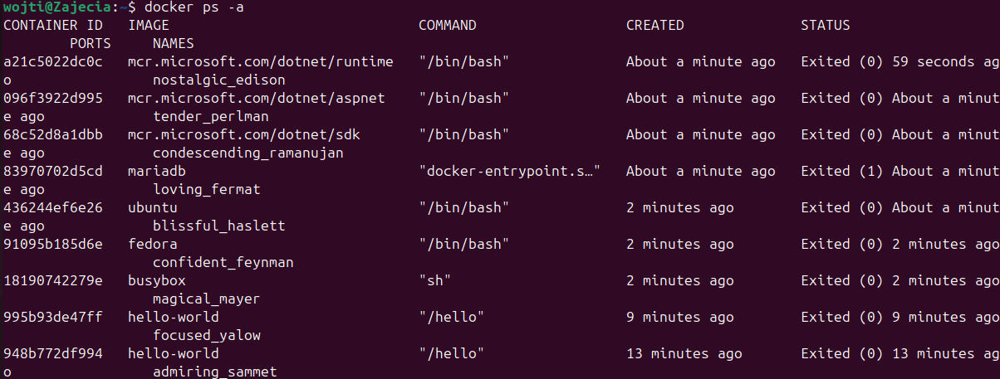

### Uruchomienie kontenera z obrazu busybox
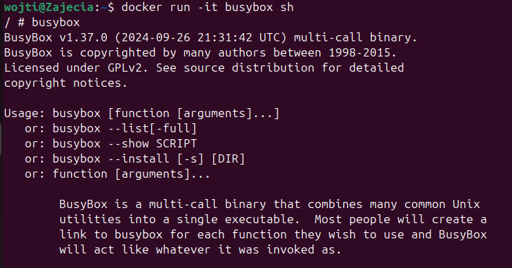

### Uruchomienie kontenera z obrazu ubuntu i zaprezentowanie PID1
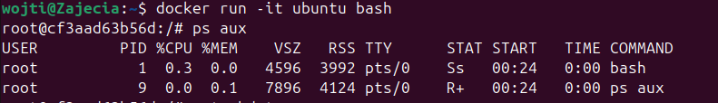

### Zaprezentowanie procesów dockera na hoście
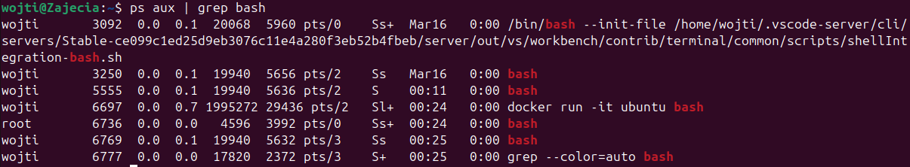

### Zaktualizowanie pakietów
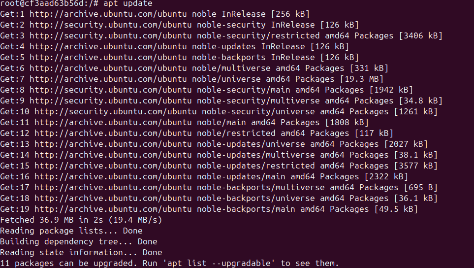
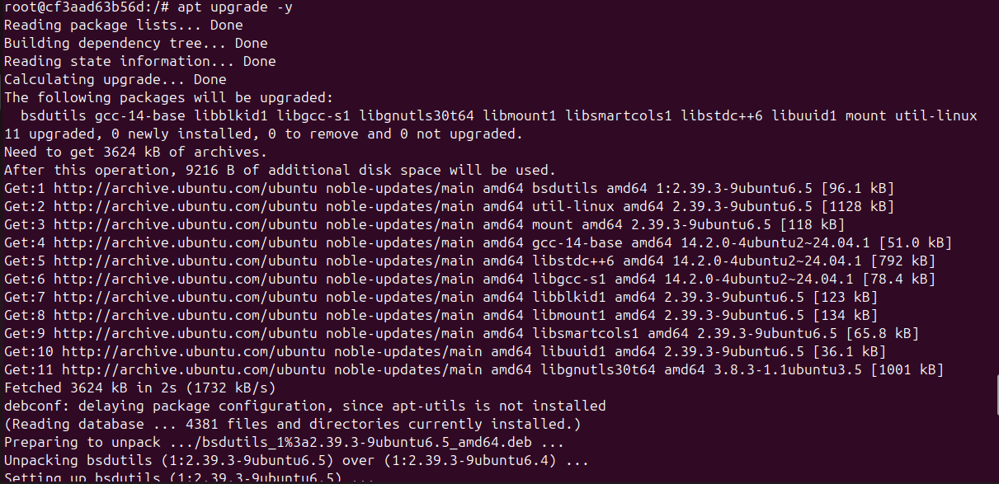

### Stworzenie pliku Dockerfile
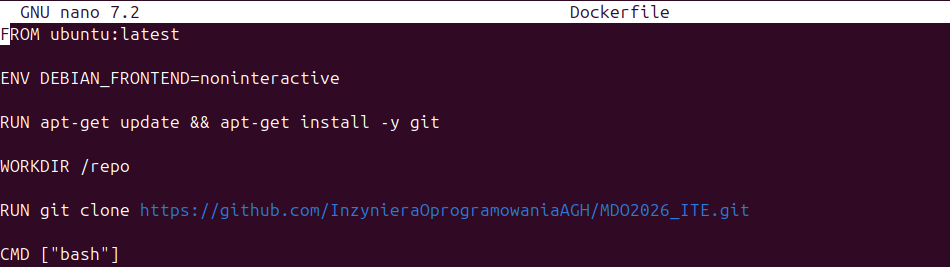
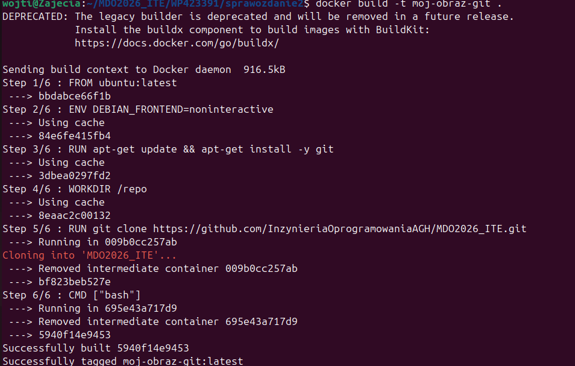

### Uruchomienie w trybie interaktywnym
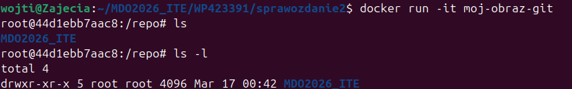

### Uruchomione kontenery

### Czyszczenie
